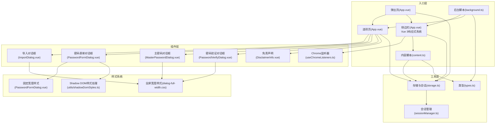
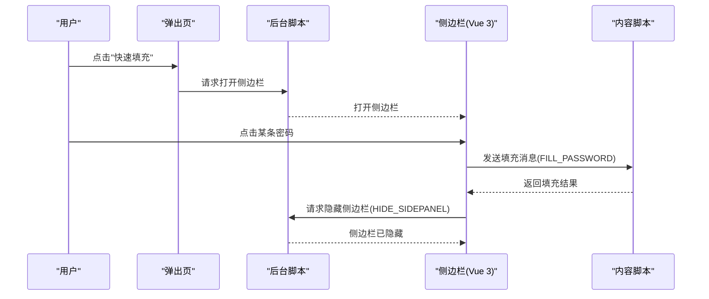
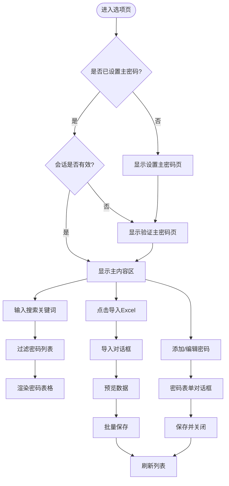
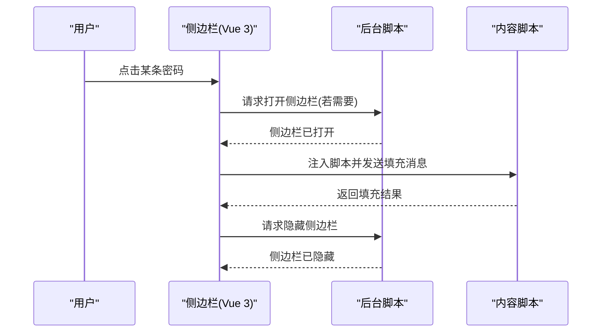
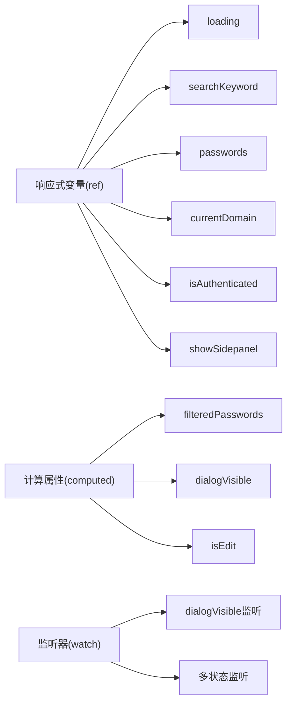
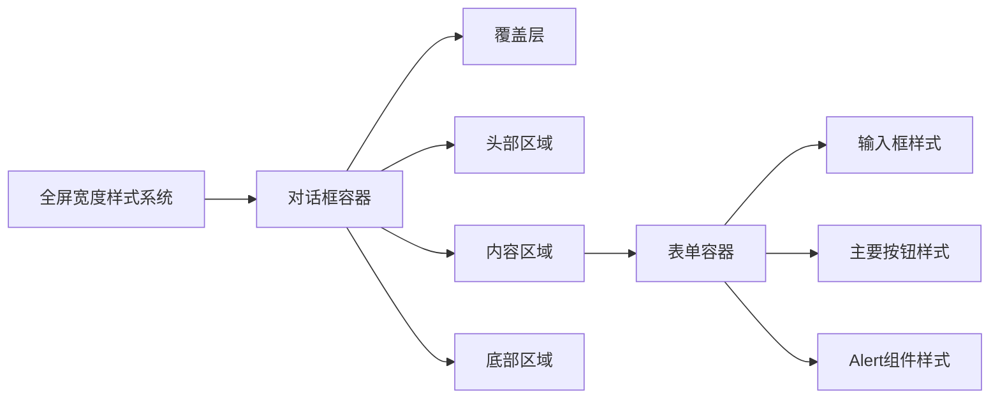
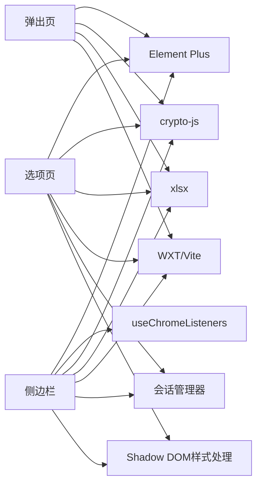

# 用户界面组件

<cite>
**本文引用的文件**
- [README.md](file://README.md)
- [package.json](file://package.json)
- [entrypoints/options/App.vue](file://entrypoints/options/App.vue)
- [entrypoints/popup/App.vue](file://entrypoints/popup/App.vue)
- [entrypoints/sidepanel/App.vue](file://entrypoints/sidepanel/App.vue)
- [entrypoints/background.ts](file://entrypoints/background.ts)
- [entrypoints/content.ts](file://entrypoints/content.ts)
- [components/DisclaimerInfo.vue](file://components/DisclaimerInfo.vue)
- [components/ImportDialog.vue](file://components/ImportDialog.vue)
- [components/MasterPasswordDialog.vue](file://components/MasterPasswordDialog.vue)
- [components/PasswordFormDialog.vue](file://components/PasswordFormDialog.vue)
- [components/PasswordVerifyDialog.vue](file://components/PasswordVerifyDialog.vue)
- [composables/useChromeListeners.ts](file://composables/useChromeListeners.ts)
- [utils/storage.ts](file://utils/storage.ts)
- [utils/sessionManager.ts](file://utils/sessionManager.ts)
- [utils/types.ts](file://utils/types.ts)
- [utils/shadowDomStyles.ts](file://utils/shadowDomStyles.ts)
- [styles/dialog-full-width.css](file://styles/dialog-full-width.css)
</cite>

## 更新摘要
**变更内容**
- 新增Vue 3响应式系统在侧边栏组件中的应用，实现实时状态管理
- 重构Chrome API事件监听机制，使用composable模式管理监听器生命周期
- 优化侧边栏的实时更新功能，包括搜索过滤、认证状态变化、存储变化监听
- 新增统一的全屏宽度对话框样式系统，支持MasterPasswordDialog、PasswordVerifyDialog、ImportDialog等组件
- 重构对话框组件的布局和视觉设计，提升用户体验
- 新增固定宽度对话框样式系统，用于PasswordFormDialog
- 新增Shadow DOM样式处理工具，解决浏览器原生组件样式限制
- 优化对话框的响应式设计和动画效果

## 目录
1. [简介](#简介)
2. [项目结构](#项目结构)
3. [核心组件](#核心组件)
4. [架构总览](#架构总览)
5. [组件详细分析](#组件详细分析)
6. [Vue 3响应式系统](#vue-3响应式系统)
7. [对话框样式系统](#对话框样式系统)
8. [依赖关系分析](#依赖关系分析)
9. [性能考量](#性能考量)
10. [故障排查指南](#故障排查指南)
11. [结论](#结论)
12. [附录](#附录)

## 简介
本项目是一个基于 WXT + Vue3 + TypeScript 的 Chrome 扩展，提供账号密码管理与自动填充能力。UI 组件系统围绕"选项页"、"弹出页"、"侧边栏"三大入口展开，并通过一组可复用的对话框组件（主密码设置/验证、密码表单、导入 Excel 等）支撑核心业务流程。组件间通过 Chrome Extension API、消息通道与本地存储协同工作，形成清晰的职责边界与可维护的架构。

**更新** 新增了完善的Vue 3响应式系统，包括响应式变量管理、计算属性、监听器等，显著提升了组件的实时更新能力和用户体验。同时新增了统一的对话框样式系统，包括全屏宽度对话框和固定宽度对话框的设计规范，以及Shadow DOM样式处理工具。

## 项目结构
- 入口层
  - options：选项页，承载主密码设置/验证、密码列表管理、导入导出等功能
  - popup：弹出页，提供快速入口与基础操作
  - sidepanel：侧边栏，面向页面内自动填充场景，使用Vue 3响应式系统
  - background：后台脚本，负责快捷键、侧边栏开关、消息路由
  - content：内容脚本，负责表单检测与自动填充触发
- 组件层
  - 可复用对话框：主密码设置/验证、密码表单、导入 Excel、免责声明
  - Vue 3响应式系统：useChromeListeners composable，管理Chrome API事件监听
  - 样式系统：全屏宽度对话框样式、固定宽度对话框样式、Shadow DOM样式处理
- 工具层
  - 存储与会话：本地存储封装、会话管理、类型定义
  - 样式工具：Shadow DOM样式注入工具
- 类型与样式
  - types：统一的数据模型与消息类型
  - styles：各入口的样式组织（对话框样式系统）



**图表来源**
- [entrypoints/options/App.vue:1-800](file://entrypoints/options/App.vue#L1-L800)
- [entrypoints/popup/App.vue:1-234](file://entrypoints/popup/App.vue#L1-L234)
- [entrypoints/sidepanel/App.vue:1-1087](file://entrypoints/sidepanel/App.vue#L1-L1087)
- [entrypoints/background.ts:1-232](file://entrypoints/background.ts#L1-L232)
- [entrypoints/content.ts:1-800](file://entrypoints/content.ts#L1-L800)
- [components/ImportDialog.vue:1-343](file://components/ImportDialog.vue#L1-L343)
- [components/MasterPasswordDialog.vue:1-447](file://components/MasterPasswordDialog.vue#L1-L447)
- [components/PasswordVerifyDialog.vue:1-474](file://components/PasswordVerifyDialog.vue#L1-L474)
- [components/PasswordFormDialog.vue:1-336](file://components/PasswordFormDialog.vue#L1-L336)
- [components/DisclaimerInfo.vue:1-20](file://components/DisclaimerInfo.vue#L1-L20)
- [composables/useChromeListeners.ts:1-112](file://composables/useChromeListeners.ts#L1-L112)
- [utils/storage.ts:1-981](file://utils/storage.ts#L1-L981)
- [utils/sessionManager.ts:1-87](file://utils/sessionManager.ts#L1-L87)
- [utils/types.ts:1-96](file://utils/types.ts#L1-L96)
- [utils/shadowDomStyles.ts:1-158](file://utils/shadowDomStyles.ts#L1-L158)
- [styles/dialog-full-width.css:1-207](file://styles/dialog-full-width.css#L1-L207)

**章节来源**
- [README.md:1-201](file://README.md#L1-L201)
- [package.json:1-49](file://package.json#L1-L49)

## 核心组件
- 选项页（App.vue）
  - 负责主密码设置/验证、密码列表展示与管理、Excel 导入导出、有效期设置等
  - 通过 v-if/v-else 控制不同视图（设置主密码、验证主密码、主内容）
  - 使用 Element Plus 表单、表格、对话框等组件
- 弹出页（App.vue）
  - 快速入口：打开选项页、打开侧边栏
  - 会话有效时显示密码数量
- 侧边栏（App.vue）
  - **更新** 使用Vue 3响应式系统：响应式变量管理联系人信息，实时更新密码列表
  - 搜索过滤、认证状态控制、密码列表渲染、一键填充
  - 与 content 脚本通过消息通道交互，填充完成后隐藏侧边栏
  - **新增** 空状态处理：会话无效时显示认证提示而非空白界面
  - **新增** 实时状态管理：使用useChromeListeners composable管理Chrome API事件监听
- 对话框组件
  - 主密码设置/验证：全屏对话框，表单校验与错误提示
  - 密码表单：固定宽度弹窗，添加/编辑密码
  - 导入 Excel：全屏弹窗，支持文件上传、预览、批量导入
  - 免责声明：提示性信息展示

**章节来源**
- [entrypoints/options/App.vue:1-800](file://entrypoints/options/App.vue#L1-L800)
- [entrypoints/popup/App.vue:1-234](file://entrypoints/popup/App.vue#L1-L234)
- [entrypoints/sidepanel/App.vue:1-1087](file://entrypoints/sidepanel/App.vue#L1-L1087)
- [components/MasterPasswordDialog.vue:1-447](file://components/MasterPasswordDialog.vue#L1-L447)
- [components/PasswordVerifyDialog.vue:1-474](file://components/PasswordVerifyDialog.vue#L1-L474)
- [components/PasswordFormDialog.vue:1-336](file://components/PasswordFormDialog.vue#L1-L336)
- [components/ImportDialog.vue:1-343](file://components/ImportDialog.vue#L1-L343)
- [components/DisclaimerInfo.vue:1-20](file://components/DisclaimerInfo.vue#L1-L20)

## 架构总览
- 数据流
  - 本地存储：主密码配置、密码条目、排序配置、会话有效期
  - 会话管理：定时检查、过期事件、清理
  - 消息通道：后台脚本路由、内容脚本与侧边栏交互
- 组件通信
  - 父子组件：选项页与导入/表单/主密码对话框
  - 入口间：弹出页 -> 选项页/侧边栏；侧边栏 -> 内容脚本
  - 事件：会话过期自定义事件，页面可见性变化监听
  - **新增** Vue 3响应式通信：使用ref、computed、watch实现组件间状态同步



**图表来源**
- [entrypoints/popup/App.vue:127-151](file://entrypoints/popup/App.vue#L127-L151)
- [entrypoints/background.ts:34-138](file://entrypoints/background.ts#L34-L138)
- [entrypoints/sidepanel/App.vue:412-493](file://entrypoints/sidepanel/App.vue#L412-L493)
- [entrypoints/content.ts:87-90](file://entrypoints/content.ts#L87-L90)
- [utils/types.ts:54-87](file://utils/types.ts#L54-L87)

## 组件详细分析

### 选项页组件体系
- 视图切换
  - 主密码设置页：表单校验、有效期选择、提交
  - 密码验证页：主密码输入、有效期选择、错误提示
  - 主内容区：搜索、筛选、批量删除、密码列表、操作按钮
- 对话框集成
  - 导入 Excel：全屏弹窗，支持文件上传、预览、批量导入
  - 密码表单：固定宽度弹窗，添加/编辑密码
  - 主密码设置/验证：全屏弹窗，首次设置与后续验证
- 状态与事件
  - 计算属性：搜索关键词、过滤后的密码列表
  - 事件：导入完成、保存完成、批量删除、排序变更



**图表来源**
- [entrypoints/options/App.vue:1-800](file://entrypoints/options/App.vue#L1-L800)
- [components/ImportDialog.vue:1-343](file://components/ImportDialog.vue#L1-L343)
- [components/PasswordFormDialog.vue:1-336](file://components/PasswordFormDialog.vue#L1-L336)
- [components/MasterPasswordDialog.vue:1-447](file://components/MasterPasswordDialog.vue#L1-L447)
- [components/PasswordVerifyDialog.vue:1-474](file://components/PasswordVerifyDialog.vue#L1-L474)

**章节来源**
- [entrypoints/options/App.vue:1-800](file://entrypoints/options/App.vue#L1-L800)
- [components/ImportDialog.vue:1-343](file://components/ImportDialog.vue#L1-L343)
- [components/PasswordFormDialog.vue:1-336](file://components/PasswordFormDialog.vue#L1-L336)
- [components/MasterPasswordDialog.vue:1-447](file://components/MasterPasswordDialog.vue#L1-L447)
- [components/PasswordVerifyDialog.vue:1-474](file://components/PasswordVerifyDialog.vue#L1-L474)

### 弹出页组件
- 功能
  - 打开选项页：查询是否存在同 URL 标签页，存在则激活，否则新建
  - 打开侧边栏：若会话有效则直接打开，否则引导至选项页进行验证
  - 显示密码数量：仅在会话有效时获取并展示
- 交互
  - 快速按钮、联系信息展示

**章节来源**
- [entrypoints/popup/App.vue:1-234](file://entrypoints/popup/App.vue#L1-L234)

### 侧边栏组件
- **更新** Vue 3响应式系统
  - 使用 ref 管理响应式状态：loading、searchKeyword、passwords、currentDomain、isAuthenticated、showSidepanel
  - 使用 computed 创建计算属性：filteredPasswords 实现搜索过滤和排序
  - 使用 watch 监听状态变化：dialogVisible、props.passwordData
  - 使用 useChromeListeners composable 管理Chrome API事件监听
- 认证与数据
  - 会话状态检查：有效则加载当前域名匹配的密码，无效则显示验证入口
  - 搜索过滤：支持用户名/标签/备注/URL 搜索，实时更新
  - 排序：应用保存的排序配置
  - **新增** 空状态处理：会话无效时显示认证提示，有效时显示密码列表
- 填充流程
  - 点击密码项 -> 注入 content 脚本 -> 发送填充消息 -> 返回结果 -> 成功则隐藏侧边栏
- 事件监听
  - 存储变化、消息、页面可见性、标签页更新/激活
  - **新增** 使用useChromeListeners composable自动管理监听器生命周期



**图表来源**
- [entrypoints/sidepanel/App.vue:412-493](file://entrypoints/sidepanel/App.vue#L412-L493)
- [entrypoints/background.ts:34-138](file://entrypoints/background.ts#L34-L138)
- [entrypoints/content.ts:87-90](file://entrypoints/content.ts#L87-L90)

**章节来源**
- [entrypoints/sidepanel/App.vue:1-1087](file://entrypoints/sidepanel/App.vue#L1-L1087)

### 对话框组件族
- 主密码设置对话框
  - 首次设置：输入密码与确认密码，提交后关闭并触发事件
  - 验证：输入密码，验证通过后关闭并触发事件
- 密码验证对话框
  - 输入主密码，验证通过后关闭并触发事件；支持调试信息与重置数据
- 密码表单对话框
  - 添加/编辑密码，表单校验，保存后关闭并触发事件
- 导入 Excel 对话框
  - 上传文件 -> 解析 -> 预览 -> 批量保存 -> 关闭
- 免责声明
  - 提示性信息展示

**章节来源**
- [components/MasterPasswordDialog.vue:1-447](file://components/MasterPasswordDialog.vue#L1-L447)
- [components/PasswordVerifyDialog.vue:1-474](file://components/PasswordVerifyDialog.vue#L1-L474)
- [components/PasswordFormDialog.vue:1-336](file://components/PasswordFormDialog.vue#L1-L336)
- [components/ImportDialog.vue:1-343](file://components/ImportDialog.vue#L1-L343)
- [components/DisclaimerInfo.vue:1-20](file://components/DisclaimerInfo.vue#L1-L20)

### 数据模型与类型
- PasswordEntry：账号密码条目字段（id、用户名、密码、URL、标签、备注、时间戳、排序）
- MasterPasswordConfig：主密码配置（哈希、盐值）
- MessageType：消息类型枚举（PING、DETECT_FORM、FILL_PASSWORD、SHOW_SIDEPANEL、HIDE_SIDEPANEL、URL_CHANGED、GET_PASSWORDS）

**章节来源**
- [utils/types.ts:1-96](file://utils/types.ts#L1-L96)

## Vue 3响应式系统

### 响应式变量管理
**新增** 侧边栏组件全面采用Vue 3响应式系统，实现实时状态管理。

- 核心响应式变量
  - `loading`：加载状态，控制加载指示器显示
  - `searchKeyword`：搜索关键词，支持实时搜索过滤
  - `passwords`：密码列表，存储当前域名匹配的密码数据
  - `currentDomain`：当前域名，用于URL匹配和缓存管理
  - `isAuthenticated`：认证状态，控制界面显示模式
  - `showSidepanel`：侧边栏显示状态

- 计算属性实现
  - `filteredPasswords`：结合搜索关键词和排序配置，实时过滤密码列表
  - `dialogVisible`：双向绑定对话框显示状态
  - `isEdit`：判断当前是编辑还是新增模式

- 监听器机制
  - `watch(dialogVisible, visible => {...})`：监听对话框显示状态变化
  - `watch([dialogVisible, () => props.passwordData], ([visible, passwordData]) => {...})`：监听多状态变化



**图表来源**
- [entrypoints/sidepanel/App.vue:177-208](file://entrypoints/sidepanel/App.vue#L177-L208)
- [components/MasterPasswordDialog.vue:111-175](file://components/MasterPasswordDialog.vue#L111-L175)
- [components/PasswordFormDialog.vue:106-151](file://components/PasswordFormDialog.vue#L106-L151)

**章节来源**
- [entrypoints/sidepanel/App.vue:177-208](file://entrypoints/sidepanel/App.vue#L177-L208)
- [components/MasterPasswordDialog.vue:111-175](file://components/MasterPasswordDialog.vue#L111-L175)
- [components/PasswordFormDialog.vue:106-151](file://components/PasswordFormDialog.vue#L106-L151)

### Chrome API事件监听管理
**新增** 使用useChromeListeners composable统一管理Chrome API事件监听，自动处理监听器生命周期。

- 核心功能
  - 自动清理：组件卸载时自动清理所有监听器，防止内存泄漏
  - 统一接口：提供onStorageChange、onMessage、onTabUpdated、onTabActivated、onDocumentEvent、onWindowEvent方法
  - 生命周期管理：使用onUnmounted钩子自动清理监听器

- 监听器类型
  - `onStorageChange`：监听Chrome存储变化
  - `onMessage`：监听Chrome运行时消息
  - `onTabUpdated`：监听标签页更新事件
  - `onTabActivated`：监听标签页激活事件
  - `onDocumentEvent`：监听DOM事件（如visibilitychange）
  - `onWindowEvent`：监听窗口事件（如自定义事件sessionExpired）

- 使用方式
  ```typescript
  const { onStorageChange, onMessage, onTabUpdated, onTabActivated, onDocumentEvent, onWindowEvent } =
    useChromeListeners();
  
  onStorageChange(handleStorageChange);
  onMessage(handleMessage);
  onDocumentEvent('visibilitychange', handleVisibilityChange);
  onWindowEvent('sessionExpired', handleSessionChange);
  onTabUpdated(handleTabUpdated);
  onTabActivated(handleTabActivated);
  ```

**章节来源**
- [composables/useChromeListeners.ts:1-112](file://composables/useChromeListeners.ts#L1-L112)
- [entrypoints/sidepanel/App.vue:184-804](file://entrypoints/sidepanel/App.vue#L184-L804)

## 对话框样式系统

### 全屏宽度对话框样式系统
**新增** 项目引入了统一的全屏宽度对话框样式系统，专门用于MasterPasswordDialog、PasswordVerifyDialog、ImportDialog等组件。

- 核心特性
  - 全屏覆盖：100vw × 100vh尺寸，无边距和圆角
  - 浅蓝色主题：使用#f8fbff背景色和#409eff主色调
  - 粘性定位：头部和底部固定在视口顶部和底部
  - 居中布局：内容区域垂直水平居中显示
  - 响应式设计：针对移动设备的适配

- 样式结构
  - 基础样式：`:deep(.full-width-dialog)` 选择器
  - 弹窗容器：`.el-dialog` 全屏样式
  - 覆盖层：`.el-overlay` 浅蓝色背景
  - 内容区域：`.el-dialog__body` 居中布局
  - 头部区域：`.el-dialog__header` 粘性定位
  - 底部区域：`.el-dialog__footer` 粘性定位
  - 表单容器：`.form-container` 最大宽度500px

- 动画效果
  - 无过渡动画：禁用所有过渡和动画效果
  - 瞬间显示：移除所有transform和transition
  - 阴影优化：使用RGB颜色空间的阴影效果



**图表来源**
- [styles/dialog-full-width.css:1-207](file://styles/dialog-full-width.css#L1-L207)

**章节来源**
- [styles/dialog-full-width.css:1-207](file://styles/dialog-full-width.css#L1-L207)
- [components/MasterPasswordDialog.vue:1-247](file://components/MasterPasswordDialog.vue#L1-L247)
- [components/PasswordVerifyDialog.vue:1-281](file://components/PasswordVerifyDialog.vue#L1-L281)
- [components/ImportDialog.vue:1-278](file://components/ImportDialog.vue#L1-L278)

### 固定宽度对话框样式系统
**新增** PasswordFormDialog采用固定宽度设计，使用1000px宽度的对话框样式。

- 核心特性
  - 固定宽度：1000px宽度，最大宽度calc(100vw - 40px)
  - 边框阴影：1px边框和20px阴影的立体效果
  - 圆角设计：12px圆角边框，提升现代感
  - 响应式适配：在小屏幕设备上自动调整宽度

- 样式结构
  - 容器样式：`:deep(.fixed-width-dialog .el-dialog)` 固定宽度
  - 覆盖层：`:deep(.fixed-width-dialog .el-overlay)` 半透明黑色背景
  - 头部区域：`:deep(.fixed-width-dialog .el-dialog__header)` 蓝色背景
  - 内容区域：`:deep(.fixed-width-dialog .el-dialog__body)` 滚动区域
  - 底部区域：`:deep(.fixed-width-dialog .el-dialog__footer)` 分割线
  - 表单容器：`.form-container` 透明背景

- 交互效果
  - 悬停动画：按钮悬停时的阴影和位移效果
  - 焦点状态：输入框获得焦点时的蓝色边框和阴影
  - 响应式断点：1040px和768px两个关键断点

**章节来源**
- [components/PasswordFormDialog.vue:202-336](file://components/PasswordFormDialog.vue#L202-L336)

### Shadow DOM样式处理系统
**新增** 新增Shadow DOM样式处理工具，专门用于修改浏览器原生组件中的shadow DOM元素样式。

- 核心功能
  - 自动检测：扫描DOM树中的所有shadow DOM宿主元素
  - 样式注入：向shadow DOM根节点注入自定义CSS样式
  - 动态监听：使用MutationObserver监听DOM变化
  - 响应式适配：支持不同屏幕尺寸的样式调整

- 技术实现
  - 选择器匹配：查找`cr-dialog#dialog`元素
  - 样式注入：创建style元素并注入CSS规则
  - 观察器模式：监听DOM树变化，自动处理新元素
  - 延迟执行：页面加载完成后延迟处理，确保元素可用

- 应用场景
  - 浏览器原生对话框样式修改
  - 第三方组件样式定制
  - 跨域组件样式隔离

**章节来源**
- [utils/shadowDomStyles.ts:1-158](file://utils/shadowDomStyles.ts#L1-L158)

## 依赖关系分析
- 组件依赖
  - 选项页依赖导入/表单/主密码/验证对话框与免责声明
  - 侧边栏依赖存储工具类、内容脚本与useChromeListeners composable
  - 弹出页依赖存储工具类
- 外部依赖
  - Element Plus：UI 组件库
  - crypto-js：MD5、PBKDF2、AES 加密
  - xlsx：Excel 导入导出
- 构建与工具
  - WXT：扩展开发框架
  - Vite：构建工具
  - ESLint/Stylelint/Prettier：代码质量与风格



**图表来源**
- [package.json:22-46](file://package.json#L22-L46)
- [entrypoints/options/App.vue:793-799](file://entrypoints/options/App.vue#L793-L799)
- [entrypoints/sidepanel/App.vue:164-169](file://entrypoints/sidepanel/App.vue#L164-L169)
- [entrypoints/popup/App.vue:52-54](file://entrypoints/popup/App.vue#L52-L54)

**章节来源**
- [package.json:1-49](file://package.json#L1-L49)

## 性能考量
- 选项页
  - 表格分页/虚拟滚动：当前使用 Element Plus 表单，建议在大量数据时考虑虚拟滚动或分页
  - 搜索去抖：可对搜索输入增加防抖，降低过滤频率
  - 批量操作：批量删除/导入采用循环逐条保存，建议合并为事务式保存以减少存储写入次数
- 侧边栏
  - **更新** Vue 3响应式优化：使用计算属性实现高效过滤，避免重复渲染
  - **更新** 实时状态管理：使用useChromeListeners composable自动清理监听器，防止内存泄漏
  - 注入脚本：注入后等待短暂时间再发送消息，避免脚本未就绪
  - **新增** 响应式变量优化：使用ref管理状态，computed实现懒计算，watch实现精确监听
- 弹出页
  - 仅在会话有效时获取密码数量，避免不必要的存储读取
- 存储与加密
  - AES 加密/解密在会话有效时进行，避免频繁 IO
  - PBKDF2 迭代次数较高，注意在移动端设备上的性能表现

**章节来源**
- [entrypoints/options/App.vue:337-340](file://entrypoints/options/App.vue#L337-L340)
- [entrypoints/sidepanel/App.vue:188-208](file://entrypoints/sidepanel/App.vue#L188-L208)
- [utils/storage.ts:174-186](file://utils/storage.ts#L174-L186)
- [composables/useChromeListeners.ts:78-108](file://composables/useChromeListeners.ts#L78-L108)

## 故障排查指南
- 侧边栏不显示
  - 检查 Chrome 版本是否支持 sidePanel API（需较新版本）
  - 确认后台脚本已正确打开侧边栏
  - **新增** 检查Vue 3响应式系统：确认ref、computed、watch正确初始化
- 填充失败
  - 确认内容脚本已注入，页面已完全加载
  - 检查目标表单字段是否被正确识别
- 主密码相关
  - 验证失败：检查输入是否正确，确认会话是否有效
  - 重置数据：谨慎使用，会清空所有数据
- Excel 导入
  - 确认列名符合规范，文件格式正确
- **新增** 对话框样式问题
  - 检查全屏宽度样式是否正确应用
  - 确认Shadow DOM样式处理是否正常工作
  - 验证固定宽度对话框的响应式断点
- **新增** Vue 3响应式系统问题
  - 检查响应式变量是否正确初始化
  - 确认计算属性是否正确依赖响应式数据
  - 验证监听器是否正确清理
- **新增** Chrome API事件监听问题
  - 检查useChromeListeners composable是否正确使用
  - 确认监听器是否在组件卸载时自动清理
  - 验证事件回调函数是否正确处理

**章节来源**
- [entrypoints/background.ts:76-109](file://entrypoints/background.ts#L76-L109)
- [entrypoints/content.ts:87-90](file://entrypoints/content.ts#L87-L90)
- [components/PasswordVerifyDialog.vue:204-225](file://components/PasswordVerifyDialog.vue#L204-L225)
- [components/ImportDialog.vue:146-166](file://components/ImportDialog.vue#L146-L166)
- [composables/useChromeListeners.ts:78-108](file://composables/useChromeListeners.ts#L78-L108)

## 结论
该组件系统以清晰的入口划分与对话框复用实现了高内聚低耦合的架构。通过本地存储与会话管理保障数据安全与用户体验，借助消息通道与内容脚本实现页面内自动填充。**新增的Vue 3响应式系统**显著提升了组件的实时更新能力和用户体验，包括响应式变量管理、计算属性优化、监听器机制等。**新增的对话框样式系统**提供了统一的视觉设计和交互体验，包括全屏宽度对话框和固定宽度对话框两种设计模式，以及Shadow DOM样式处理工具，显著提升了系统的可维护性和用户体验。建议在大规模数据场景下引入虚拟滚动、批量事务保存与更细粒度的缓存策略，持续优化性能与稳定性。

## 附录
- 使用示例与集成模式
  - 在选项页中集成导入/导出与密码管理
  - 在弹出页中快速打开选项页或侧边栏
  - 在侧边栏中进行密码搜索与一键填充
  - **新增** Vue 3响应式系统集成：在组件中使用ref、computed、watch管理状态
  - **新增** 对话框样式集成：在组件中引入相应的样式文件
- 扩展与定制
  - 新增对话框：遵循 props + emits + v-model 设计，保持一致的全屏/固定宽度样式
  - 新增样式系统：参考dialog-full-width.css的设计模式
  - 新增Shadow DOM处理：参考ShadowDomStyler的实现模式
  - 新增入口：参考现有入口的生命周期与事件监听模式
  - 新增消息类型：在类型定义中扩展 MessageType 并在后台/内容脚本中处理
  - **新增** 新增Vue 3响应式组件：参考useChromeListeners的实现模式
- 响应式设计与无障碍
  - 对话框采用全屏/固定宽度适配移动端
  - 表单输入框提供占位符与标签，提升可访问性
  - **新增** Vue 3响应式系统：使用语义化HTML和适当的ARIA属性
  - **新增** Shadow DOM样式处理：确保样式在各种环境下都能正确应用
- 跨浏览器兼容性
  - 依赖 Chrome sidePanel API，需关注版本差异与回退方案
  - **新增** Vue 3响应式系统：确保在不同浏览器版本下的兼容性
  - **新增** Shadow DOM样式处理：使用标准Web API确保兼容性

**章节来源**
- [entrypoints/options/App.vue:551-774](file://entrypoints/options/App.vue#L551-L774)
- [entrypoints/popup/App.vue:92-151](file://entrypoints/popup/App.vue#L92-L151)
- [entrypoints/sidepanel/App.vue:342-466](file://entrypoints/sidepanel/App.vue#L342-L466)
- [utils/types.ts:54-87](file://utils/types.ts#L54-L87)
- [composables/useChromeListeners.ts:132-158](file://composables/useChromeListeners.ts#L132-L158)
- [utils/shadowDomStyles.ts:132-158](file://utils/shadowDomStyles.ts#L132-L158)
- [styles/dialog-full-width.css:189-207](file://styles/dialog-full-width.css#L189-L207)