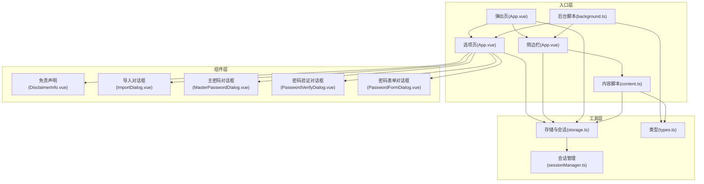
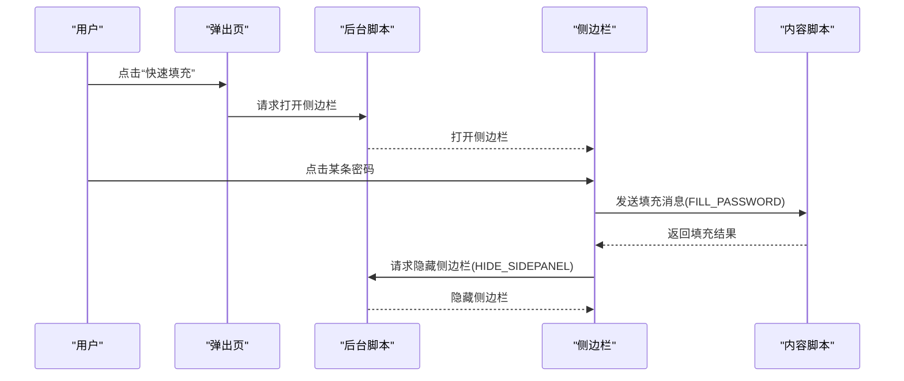
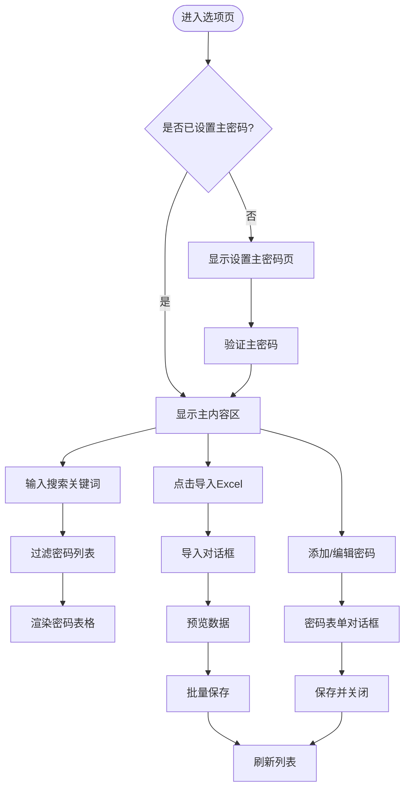
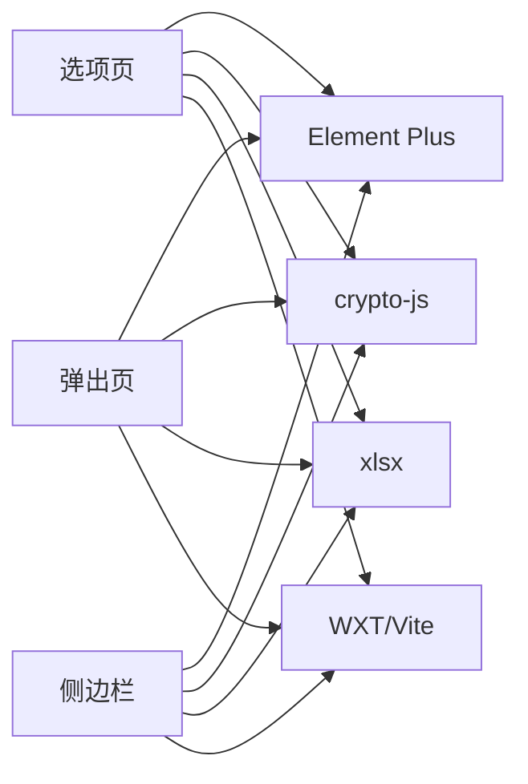

# 用户界面组件

<cite>
**本文引用的文件**
- [README.md](file://README.md)
- [package.json](file://package.json)
- [entrypoints/options/App.vue](file://entrypoints/options/App.vue)
- [entrypoints/popup/App.vue](file://entrypoints/popup/App.vue)
- [entrypoints/sidepanel/App.vue](file://entrypoints/sidepanel/App.vue)
- [entrypoints/background.ts](file://entrypoints/background.ts)
- [entrypoints/content.ts](file://entrypoints/content.ts)
- [components/DisclaimerInfo.vue](file://components/DisclaimerInfo.vue)
- [components/ImportDialog.vue](file://components/ImportDialog.vue)
- [components/MasterPasswordDialog.vue](file://components/MasterPasswordDialog.vue)
- [components/PasswordFormDialog.vue](file://components/PasswordFormDialog.vue)
- [components/PasswordVerifyDialog.vue](file://components/PasswordVerifyDialog.vue)
- [utils/storage.ts](file://utils/storage.ts)
- [utils/sessionManager.ts](file://utils/sessionManager.ts)
- [utils/types.ts](file://utils/types.ts)
</cite>

## 目录
1. [简介](#简介)
2. [项目结构](#项目结构)
3. [核心组件](#核心组件)
4. [架构总览](#架构总览)
5. [组件详细分析](#组件详细分析)
6. [依赖关系分析](#依赖关系分析)
7. [性能考量](#性能考量)
8. [故障排查指南](#故障排查指南)
9. [结论](#结论)
10. [附录](#附录)

## 简介
本项目是一个基于 WXT + Vue3 + TypeScript 的 Chrome 扩展，提供账号密码管理与自动填充能力。UI 组件系统围绕“选项页”、“弹出页”、“侧边栏”三大入口展开，并通过一组可复用的对话框组件（主密码设置/验证、密码表单、导入 Excel 等）支撑核心业务流程。组件间通过 Chrome Extension API、消息通道与本地存储协同工作，形成清晰的职责边界与可维护的架构。

## 项目结构
- 入口层
  - options：选项页，承载主密码设置/验证、密码列表管理、导入导出等功能
  - popup：弹出页，提供快速入口与基础操作
  - sidepanel：侧边栏，面向页面内自动填充场景
  - background：后台脚本，负责快捷键、侧边栏开关、消息路由
  - content：内容脚本，负责表单检测与自动填充触发
- 组件层
  - 可复用对话框：主密码设置/验证、密码表单、导入 Excel、免责声明
- 工具层
  - 存储与会话：本地存储封装、会话管理、类型定义
- 类型与样式
  - types：统一的数据模型与消息类型
  - styles：各入口的样式组织（此处以 scoped 样式为主）

图表来源
- [entrypoints/options/App.vue](file://entrypoints/options/App.vue#L1-L800)
- [entrypoints/popup/App.vue](file://entrypoints/popup/App.vue#L1-L234)
- [entrypoints/sidepanel/App.vue](file://entrypoints/sidepanel/App.vue#L1-L911)
- [entrypoints/background.ts](file://entrypoints/background.ts#L1-L232)
- [entrypoints/content.ts](file://entrypoints/content.ts#L1-L800)
- [components/ImportDialog.vue](file://components/ImportDialog.vue#L1-L343)
- [components/MasterPasswordDialog.vue](file://components/MasterPasswordDialog.vue#L1-L447)
- [components/PasswordVerifyDialog.vue](file://components/PasswordVerifyDialog.vue#L1-L474)
- [components/PasswordFormDialog.vue](file://components/PasswordFormDialog.vue#L1-L336)
- [components/DisclaimerInfo.vue](file://components/DisclaimerInfo.vue#L1-L20)
- [utils/storage.ts](file://utils/storage.ts#L1-L981)
- [utils/sessionManager.ts](file://utils/sessionManager.ts#L1-L87)
- [utils/types.ts](file://utils/types.ts#L1-L96)

章节来源
- [README.md](file://README.md#L1-L201)
- [package.json](file://package.json#L1-L49)

## 核心组件
- 选项页（App.vue）
  - 负责主密码设置/验证、密码列表展示与管理、Excel 导入导出、有效期设置等
  - 通过 v-if/v-else 控制不同视图（设置主密码、验证主密码、主内容）
  - 使用 Element Plus 表单、表格、对话框等组件
- 弹出页（App.vue）
  - 快速入口：打开选项页、打开侧边栏
  - 会话有效时显示密码数量
- 侧边栏（App.vue）
  - 搜索过滤、认证状态控制、密码列表渲染、一键填充
  - 与 content 脚本通过消息通道交互，填充完成后隐藏侧边栏
- 对话框组件
  - 主密码设置/验证：全屏对话框，表单校验与错误提示
  - 密码表单：添加/编辑密码，保存后触发父组件刷新
  - 导入 Excel：文件上传、预览、批量导入
  - 免责声明：提示性信息展示

章节来源
- [entrypoints/options/App.vue](file://entrypoints/options/App.vue#L1-L800)
- [entrypoints/popup/App.vue](file://entrypoints/popup/App.vue#L1-L234)
- [entrypoints/sidepanel/App.vue](file://entrypoints/sidepanel/App.vue#L1-L911)
- [components/MasterPasswordDialog.vue](file://components/MasterPasswordDialog.vue#L1-L447)
- [components/PasswordVerifyDialog.vue](file://components/PasswordVerifyDialog.vue#L1-L474)
- [components/PasswordFormDialog.vue](file://components/PasswordFormDialog.vue#L1-L336)
- [components/ImportDialog.vue](file://components/ImportDialog.vue#L1-L343)
- [components/DisclaimerInfo.vue](file://components/DisclaimerInfo.vue#L1-L20)

## 架构总览
- 数据流
  - 本地存储：主密码配置、密码条目、排序配置、会话有效期
  - 会话管理：定时检查、过期事件、清理
  - 消息通道：后台脚本路由、内容脚本与侧边栏交互
- 组件通信
  - 父子组件：选项页与导入/表单/主密码对话框
  - 入口间：弹出页 -> 选项页/侧边栏；侧边栏 -> 内容脚本
  - 事件：会话过期自定义事件，页面可见性变化监听

图表来源
- [entrypoints/popup/App.vue](file://entrypoints/popup/App.vue#L127-L151)
- [entrypoints/background.ts](file://entrypoints/background.ts#L34-L138)
- [entrypoints/sidepanel/App.vue](file://entrypoints/sidepanel/App.vue#L343-L422)
- [entrypoints/content.ts](file://entrypoints/content.ts#L87-L90)
- [utils/types.ts](file://utils/types.ts#L54-L87)

## 组件详细分析

### 选项页组件体系
- 视图切换
  - 主密码设置页：表单校验、有效期选择、提交
  - 密码验证页：主密码输入、有效期选择、错误提示
  - 主内容区：搜索、筛选、批量删除、密码列表、操作按钮
- 对话框集成
  - 导入 Excel：全屏弹窗，支持文件上传、预览、批量导入
  - 密码表单：固定宽度弹窗，添加/编辑密码
  - 主密码设置/验证：全屏弹窗，首次设置与后续验证
- 状态与事件
  - 计算属性：搜索关键词、过滤后的密码列表
  - 事件：导入完成、保存完成、批量删除、排序变更
- 数据持久化
  - 通过存储工具类进行保存/更新/删除/查询

图表来源
- [entrypoints/options/App.vue](file://entrypoints/options/App.vue#L1-L800)
- [components/ImportDialog.vue](file://components/ImportDialog.vue#L1-L343)
- [components/PasswordFormDialog.vue](file://components/PasswordFormDialog.vue#L1-L336)
- [components/MasterPasswordDialog.vue](file://components/MasterPasswordDialog.vue#L1-L447)
- [components/PasswordVerifyDialog.vue](file://components/PasswordVerifyDialog.vue#L1-L474)

章节来源
- [entrypoints/options/App.vue](file://entrypoints/options/App.vue#L1-L800)
- [components/ImportDialog.vue](file://components/ImportDialog.vue#L1-L343)
- [components/PasswordFormDialog.vue](file://components/PasswordFormDialog.vue#L1-L336)
- [components/MasterPasswordDialog.vue](file://components/MasterPasswordDialog.vue#L1-L447)
- [components/PasswordVerifyDialog.vue](file://components/PasswordVerifyDialog.vue#L1-L474)

### 弹出页组件
- 功能
  - 打开选项页：查询是否存在同 URL 标签页，存在则激活，否则新建
  - 打开侧边栏：若会话有效则直接打开，否则引导至选项页进行验证
  - 显示密码数量：仅在会话有效时获取并展示
- 交互
  - 快速按钮、联系信息展示

章节来源
- [entrypoints/popup/App.vue](file://entrypoints/popup/App.vue#L1-L234)

### 侧边栏组件
- 认证与数据
  - 会话状态检查：有效则加载当前域名匹配的密码，无效则显示验证入口
  - 搜索过滤：支持用户名/标签/备注/URL 搜索
  - 排序：应用保存的排序配置
- 填充流程
  - 点击密码项 -> 注入 content 脚本 -> 发送填充消息 -> 返回结果 -> 成功则隐藏侧边栏
- 事件监听
  - 存储变化、消息、页面可见性、标签页更新/激活

图表来源
- [entrypoints/sidepanel/App.vue](file://entrypoints/sidepanel/App.vue#L343-L422)
- [entrypoints/background.ts](file://entrypoints/background.ts#L34-L138)
- [entrypoints/content.ts](file://entrypoints/content.ts#L87-L90)

章节来源
- [entrypoints/sidepanel/App.vue](file://entrypoints/sidepanel/App.vue#L1-L911)

### 对话框组件族
- 主密码设置对话框
  - 首次设置：输入密码与确认密码，提交后关闭并触发事件
  - 验证：输入密码，验证通过后关闭并触发事件
- 密码验证对话框
  - 输入主密码，验证通过后关闭并触发事件；支持调试信息与重置数据
- 密码表单对话框
  - 添加/编辑密码，表单校验，保存后关闭并触发事件
- 导入 Excel 对话框
  - 上传文件 -> 解析 -> 预览 -> 批量保存 -> 关闭
- 免责声明
  - 提示性信息展示

章节来源
- [components/MasterPasswordDialog.vue](file://components/MasterPasswordDialog.vue#L1-L447)
- [components/PasswordVerifyDialog.vue](file://components/PasswordVerifyDialog.vue#L1-L474)
- [components/PasswordFormDialog.vue](file://components/PasswordFormDialog.vue#L1-L336)
- [components/ImportDialog.vue](file://components/ImportDialog.vue#L1-L343)
- [components/DisclaimerInfo.vue](file://components/DisclaimerInfo.vue#L1-L20)

### 数据模型与类型
- PasswordEntry：账号密码条目字段（id、用户名、密码、URL、标签、备注、时间戳、排序）
- MasterPasswordConfig：主密码配置（哈希、盐值）
- MessageType：消息类型枚举（PING、DETECT_FORM、FILL_PASSWORD、SHOW_SIDEPANEL、HIDE_SIDEPANEL、URL_CHANGED、GET_PASSWORDS）

章节来源
- [utils/types.ts](file://utils/types.ts#L1-L96)

## 依赖关系分析
- 组件依赖
  - 选项页依赖导入/表单/主密码/验证对话框与免责声明
  - 侧边栏依赖存储工具类与内容脚本
  - 弹出页依赖存储工具类
- 外部依赖
  - Element Plus：UI 组件库
  - crypto-js：MD5、PBKDF2、AES 加密
  - xlsx：Excel 导入导出
- 构建与工具
  - WXT：扩展开发框架
  - Vite：构建工具
  - ESLint/Stylelint/Prettier：代码质量与风格

图表来源
- [package.json](file://package.json#L22-L46)
- [entrypoints/options/App.vue](file://entrypoints/options/App.vue#L793-L799)
- [entrypoints/sidepanel/App.vue](file://entrypoints/sidepanel/App.vue#L164-L169)
- [entrypoints/popup/App.vue](file://entrypoints/popup/App.vue#L52-L54)

章节来源
- [package.json](file://package.json#L1-L49)

## 性能考量
- 选项页
  - 表格分页/虚拟滚动：当前使用 Element Plus 表格，建议在大量数据时考虑虚拟滚动或分页
  - 搜索去抖：可对搜索输入增加防抖，降低过滤频率
  - 批量操作：批量删除/导入采用循环逐条保存，建议合并为事务式保存以减少存储写入次数
- 侧边栏
  - 计算属性过滤：已通过计算属性实现，避免重复渲染
  - 注入脚本：注入后等待短暂时间再发送消息，避免脚本未就绪
  - 会话检查：每分钟检查一次，避免过于频繁导致性能损耗
- 弹出页
  - 仅在会话有效时获取密码数量，避免不必要的存储读取
- 存储与加密
  - AES 加密/解密在会话有效时进行，避免频繁 IO
  - PBKDF2 迭代次数较高，注意在移动端设备上的性能表现

章节来源
- [entrypoints/options/App.vue](file://entrypoints/options/App.vue#L337-L340)
- [entrypoints/sidepanel/App.vue](file://entrypoints/sidepanel/App.vue#L354-L368)
- [utils/storage.ts](file://utils/storage.ts#L174-L186)
- [utils/sessionManager.ts](file://utils/sessionManager.ts#L27-L44)

## 故障排查指南
- 侧边栏不显示
  - 检查 Chrome 版本是否支持 sidePanel API（需较新版本）
  - 确认后台脚本已正确打开侧边栏
- 填充失败
  - 确认内容脚本已注入，页面已完全加载
  - 检查目标表单字段是否被正确识别
- 主密码相关
  - 验证失败：检查输入是否正确，确认会话是否有效
  - 重置数据：谨慎使用，会清空所有数据
- Excel 导入
  - 确认列名符合规范，文件格式正确

章节来源
- [entrypoints/background.ts](file://entrypoints/background.ts#L76-L109)
- [entrypoints/content.ts](file://entrypoints/content.ts#L87-L90)
- [components/PasswordVerifyDialog.vue](file://components/PasswordVerifyDialog.vue#L204-L225)
- [components/ImportDialog.vue](file://components/ImportDialog.vue#L146-L166)

## 结论
该组件系统以清晰的入口划分与对话框复用实现了高内聚低耦合的架构。通过本地存储与会话管理保障数据安全与用户体验，借助消息通道与内容脚本实现页面内自动填充。建议在大规模数据场景下引入虚拟滚动、批量事务保存与更细粒度的缓存策略，持续优化性能与稳定性。

## 附录
- 使用示例与集成模式
  - 在选项页中集成导入/导出与密码管理
  - 在弹出页中快速打开选项页或侧边栏
  - 在侧边栏中进行密码搜索与一键填充
- 扩展与定制
  - 新增对话框：遵循 props + emits + v-model 设计，保持一致的全屏/固定宽度样式
  - 新增入口：参考现有入口的生命周期与事件监听模式
  - 新增消息类型：在类型定义中扩展 MessageType 并在后台/内容脚本中处理
- 响应式设计与无障碍
  - 对话框采用全屏/固定宽度适配移动端
  - 表单输入框提供占位符与标签，提升可访问性
- 跨浏览器兼容性
  - 依赖 Chrome sidePanel API，需关注版本差异与回退方案

章节来源
- [entrypoints/options/App.vue](file://entrypoints/options/App.vue#L551-L774)
- [entrypoints/popup/App.vue](file://entrypoints/popup/App.vue#L92-L151)
- [entrypoints/sidepanel/App.vue](file://entrypoints/sidepanel/App.vue#L342-L466)
- [utils/types.ts](file://utils/types.ts#L54-L87)