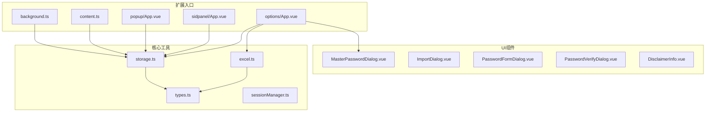
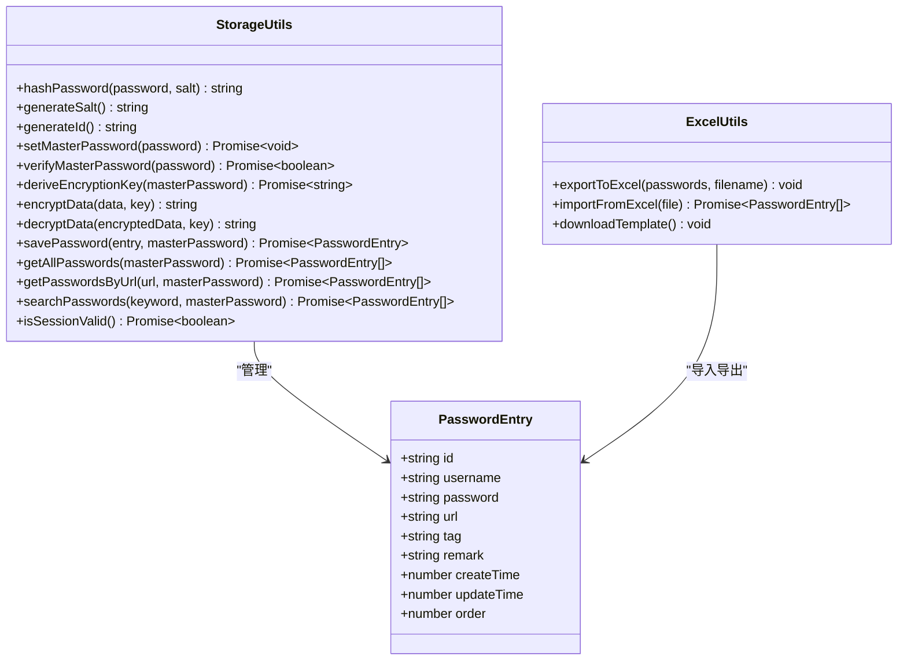
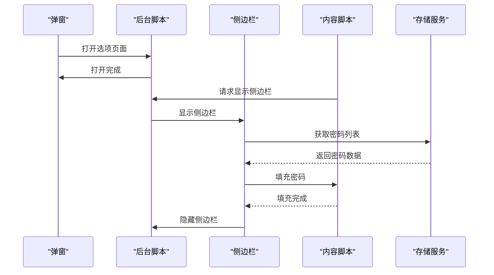
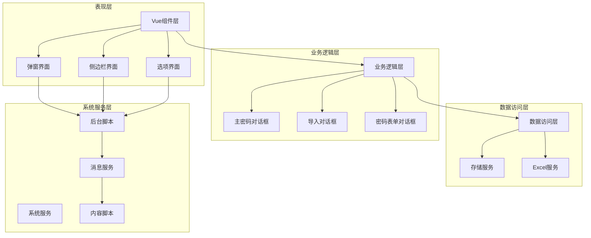
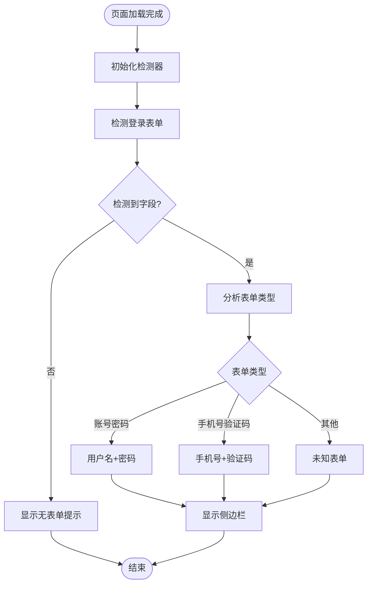
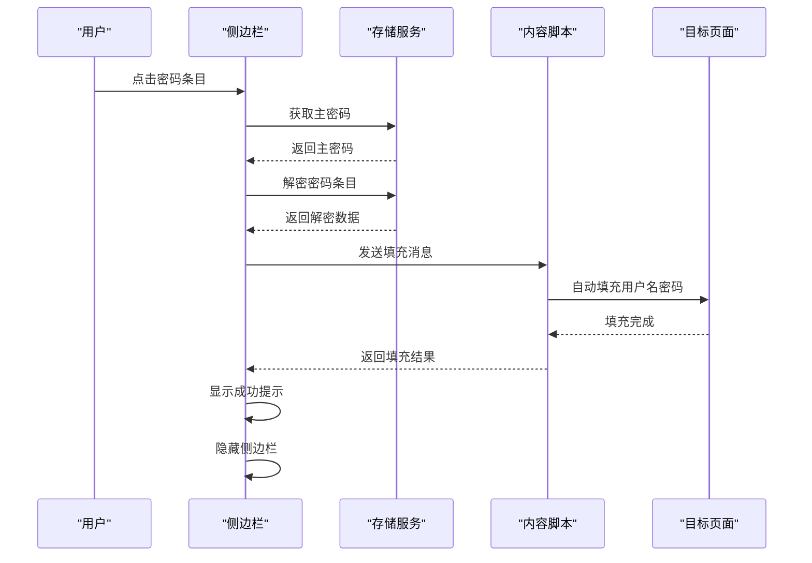
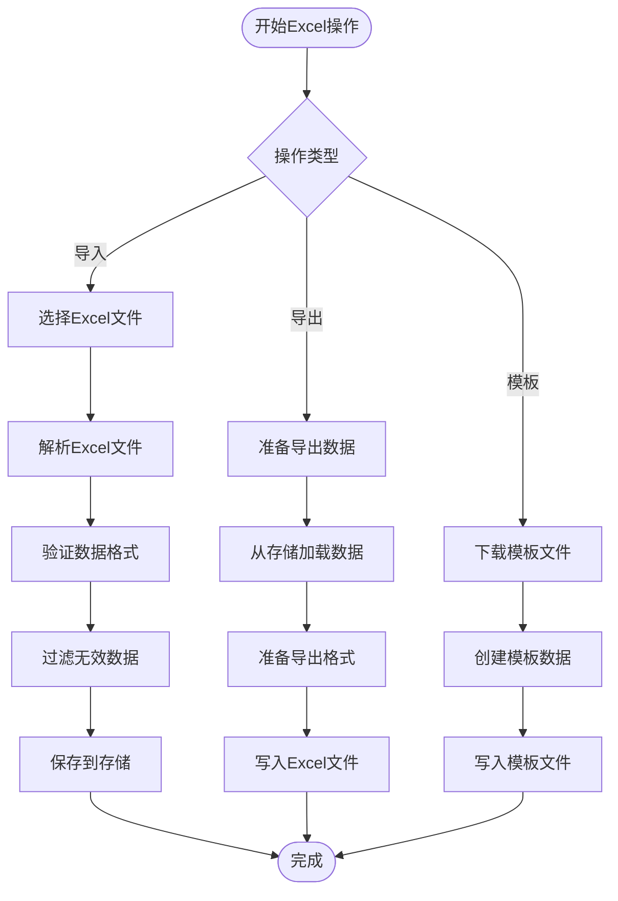
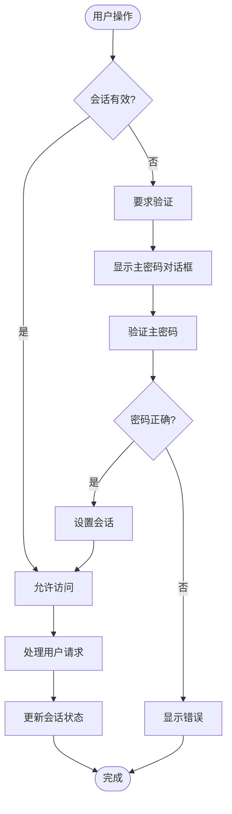
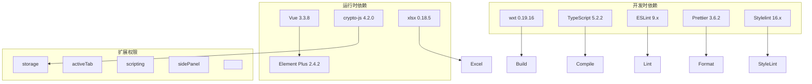

# 项目概述

<cite>
**本文档引用的文件**
- [README.md](file://README.md)
- [package.json](file://package.json)
- [wxt.config.ts](file://wxt.config.ts)
- [task.md](file://task.md)
- [entrypoints/background.ts](file://entrypoints/background.ts)
- [entrypoints/content.ts](file://entrypoints/content.ts)
- [entrypoints/popup/App.vue](file://entrypoints/popup/App.vue)
- [entrypoints/sidepanel/App.vue](file://entrypoints/sidepanel/App.vue)
- [entrypoints/options/App.vue](file://entrypoints/options/App.vue)
- [utils/storage.ts](file://utils/storage.ts)
- [utils/excel.ts](file://utils/excel.ts)
- [utils/types.ts](file://utils/types.ts)
- [components/MasterPasswordDialog.vue](file://components/MasterPasswordDialog.vue)
</cite>

## 目录
1. [引言](#引言)
2. [项目结构](#项目结构)
3. [核心组件](#核心组件)
4. [架构总览](#架构总览)
5. [详细组件分析](#详细组件分析)
6. [依赖关系分析](#依赖关系分析)
7. [性能考量](#性能考量)
8. [故障排查指南](#故障排查指南)
9. [结论](#结论)
10. [附录](#附录)

## 引言

Account Password Helper 是一款专为 Chrome 浏览器设计的账号密码管理助手扩展，旨在提供智能、安全、便捷的密码管理体验。项目通过 WXT + Vue3 + TypeScript 的现代化技术栈，结合 Chrome Extension 的强大能力，实现了自动表单检测、一键密码填充、Excel 导入导出、主密码保护等核心功能。

### 核心价值与目标

- **智能密码管理**：自动检测网页登录表单，智能匹配账号密码，提供一键填充体验
- **安全存储**：采用 MD5 加密保护主密码，支持 AES 加密存储敏感数据，确保用户信息安全
- **Excel 集成**：提供完整的 Excel 导入导出功能，支持批量数据管理
- **用户体验优化**：支持快捷键操作、侧边栏快速填充、拖拽排序、批量操作等功能

### 技术架构选择

项目采用 WXT（WebExtension Toolkit）作为底层框架，结合 Vue3 和 TypeScript，具有以下优势：
- **模块化开发**：基于 MV3 架构，支持多入口点（popup、sidepanel、options、background、content）
- **类型安全**：TypeScript 提供完整的类型系统，提升开发效率和代码质量
- **现代化构建**：Vite 提供快速热重载和优化的构建流程
- **生态丰富**：Element Plus 提供完善的 UI 组件库

## 项目结构

项目采用典型的 Chrome Extension 结构，围绕 MV3 架构组织代码：

**图表来源**
- [wxt.config.ts](file://wxt.config.ts#L1-L48)
- [entrypoints/background.ts](file://entrypoints/background.ts#L1-L232)
- [entrypoints/content.ts](file://entrypoints/content.ts#L1-L800)

### 文件组织策略

- **entrypoints/**：扩展的各个入口点，每个入口点独立运行
- **components/**：可复用的 Vue 组件
- **utils/**：核心业务逻辑和工具类
- **types/**：TypeScript 类型定义

**章节来源**
- [wxt.config.ts](file://wxt.config.ts#L1-L48)
- [package.json](file://package.json#L1-L49)

## 核心组件

### 数据存储与安全

项目实现了完整的数据安全体系，包括主密码保护、数据加密存储和会话管理：

**图表来源**
- [utils/storage.ts](file://utils/storage.ts#L37-L981)
- [utils/excel.ts](file://utils/excel.ts#L4-L155)
- [utils/types.ts](file://utils/types.ts#L4-L41)

### 消息通信机制

项目采用统一的消息类型系统，实现各模块间的解耦通信：

**图表来源**
- [entrypoints/background.ts](file://entrypoints/background.ts#L34-L73)
- [entrypoints/content.ts](file://entrypoints/content.ts#L87-L90)
- [utils/types.ts](file://utils/types.ts#L54-L87)

**章节来源**
- [utils/storage.ts](file://utils/storage.ts#L37-L981)
- [utils/excel.ts](file://utils/excel.ts#L4-L155)
- [utils/types.ts](file://utils/types.ts#L1-L96)

## 架构总览

项目采用分层架构设计，各层职责明确，耦合度低：

**图表来源**
- [entrypoints/popup/App.vue](file://entrypoints/popup/App.vue#L1-L234)
- [entrypoints/sidepanel/App.vue](file://entrypoints/sidepanel/App.vue#L1-L911)
- [entrypoints/options/App.vue](file://entrypoints/options/App.vue#L1-L2414)

### 技术决策背景

1. **WXT 框架选择**：提供现代化的 WebExtension 开发体验，支持 Vue3 生态
2. **Vue3 + TypeScript**：提升开发效率和代码质量，提供更好的类型安全
3. **Element Plus**：成熟的 UI 组件库，丰富的交互组件
4. **Chrome MV3**：最新的扩展架构，更好的性能和安全性

## 详细组件分析

### 表单检测引擎

内容脚本实现了智能表单检测功能，能够自动识别各种登录表单类型：

**图表来源**
- [entrypoints/content.ts](file://entrypoints/content.ts#L172-L476)
- [entrypoints/content.ts](file://entrypoints/content.ts#L679-L770)

### 侧边栏填充流程

侧边栏实现了完整的密码填充流程，包括数据加载、搜索过滤和自动填充：

**图表来源**
- [entrypoints/sidepanel/App.vue](file://entrypoints/sidepanel/App.vue#L343-L422)
- [entrypoints/content.ts](file://entrypoints/content.ts#L370-L400)

### Excel 导入导出流程

Excel 服务提供了完整的数据导入导出功能：

**图表来源**
- [utils/excel.ts](file://utils/excel.ts#L50-L114)
- [utils/excel.ts](file://utils/excel.ts#L8-L45)

**章节来源**
- [entrypoints/content.ts](file://entrypoints/content.ts#L1-L800)
- [entrypoints/sidepanel/App.vue](file://entrypoints/sidepanel/App.vue#L1-L911)
- [utils/excel.ts](file://utils/excel.ts#L1-L155)

### 主密码安全机制

项目实现了多层次的安全保护机制：

**图表来源**
- [utils/storage.ts](file://utils/storage.ts#L793-L800)
- [components/MasterPasswordDialog.vue](file://components/MasterPasswordDialog.vue#L178-L237)

**章节来源**
- [utils/storage.ts](file://utils/storage.ts#L79-L143)
- [components/MasterPasswordDialog.vue](file://components/MasterPasswordDialog.vue#L1-L447)

## 依赖关系分析

项目依赖关系清晰，层次分明：

**图表来源**
- [package.json](file://package.json#L22-L46)
- [wxt.config.ts](file://wxt.config.ts#L22-L24)

### 核心依赖说明

- **Vue3 + Element Plus**：提供现代化的前端开发体验
- **crypto-js**：实现密码学算法，包括 MD5 和 AES 加密
- **xlsx**：处理 Excel 文件的导入导出
- **WXT**：提供 WebExtension 开发工具链

**章节来源**
- [package.json](file://package.json#L1-L49)
- [wxt.config.ts](file://wxt.config.ts#L1-L48)

## 性能考量

项目在性能方面采用了多项优化措施：

### 内存管理优化
- 使用 WeakMap 和 WeakSet 避免内存泄漏
- 字段类型缓存机制提升检测性能
- 防抖机制减少频繁操作

### 网络和存储优化
- 本地存储优先，减少网络请求
- 批量操作支持，提升用户体验
- 数据懒加载机制

### 用户体验优化
- 快速响应的侧边栏显示
- 智能表单检测减少误判
- 并行处理多个任务

## 故障排查指南

### 常见问题及解决方案

1. **侧边栏不显示**
   - 检查 Chrome 版本是否支持 sidePanel API
   - 确认扩展权限配置正确
   - 查看控制台是否有错误信息

2. **密码填充失败**
   - 确认页面表单结构
   - 检查扩展注入是否成功
   - 验证主密码是否正确

3. **Excel 导入失败**
   - 检查 Excel 文件格式
   - 确认必需列是否存在
   - 查看控制台错误信息

4. **主密码验证失败**
   - 确认输入的密码正确
   - 检查会话状态
   - 重置主密码配置

**章节来源**
- [README.md](file://README.md#L174-L195)

## 结论

Account Password Helper 是一个功能完善、架构清晰的 Chrome 扩展项目。通过采用现代化的技术栈和合理的架构设计，项目在保证安全性的同时，提供了优秀的用户体验。

### 项目优势

- **安全性**：多重加密保护，主密码验证机制
- **易用性**：直观的界面设计，丰富的功能特性
- **扩展性**：模块化架构，易于功能扩展
- **维护性**：TypeScript 类型系统，良好的代码组织

### 技术亮点

- 智能表单检测引擎
- 完整的 Excel 集成
- 会话状态管理
- 多层次安全保护

该项目为 Chrome 扩展开发提供了良好的参考范例，无论是初学者还是有经验的开发者都能从中获得启发。

## 附录

### 功能特性清单

- ✅ 安全密码管理（MD5 加密）
- ✅ 智能表单检测
- ✅ 一键密码填充
- ✅ Excel 导入导出
- ✅ 主密码保护
- ✅ 本地存储
- ✅ 快捷键支持
- ✅ 批量操作
- ✅ 拖拽排序

### 开发环境要求

- Node.js 16+
- Chrome 浏览器
- 基础的 Web 开发知识

### 社区贡献

项目采用 MIT 许可证，欢迎社区贡献。贡献方式包括：
- 提交 Issue 报告问题
- 提交 Pull Request 改进代码
- 提供功能建议和反馈