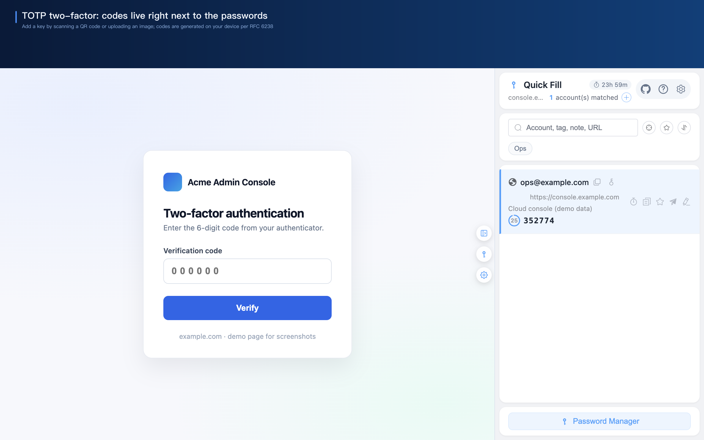
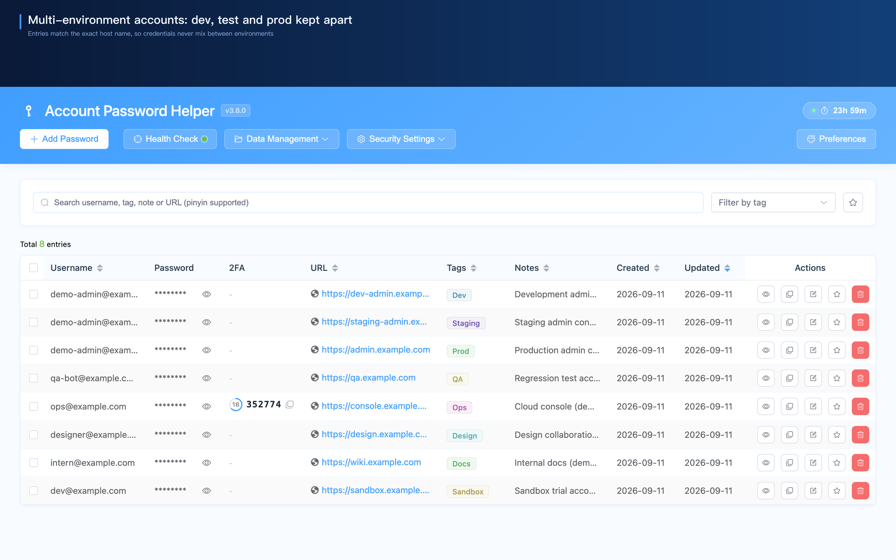
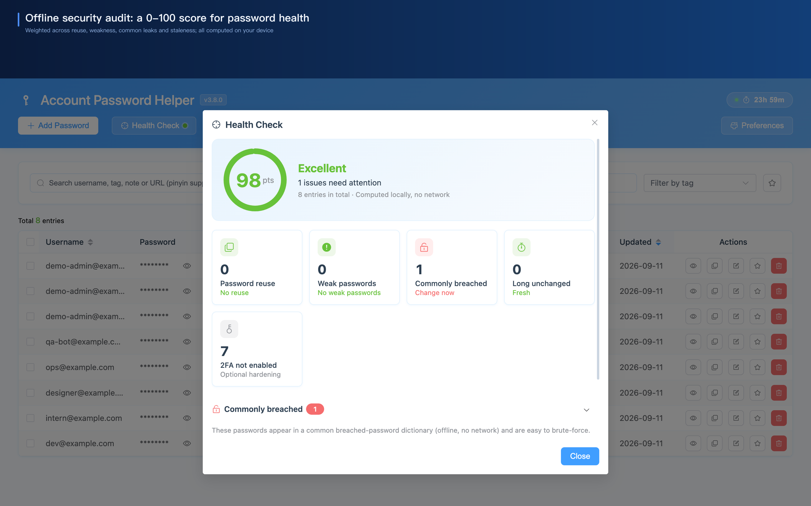
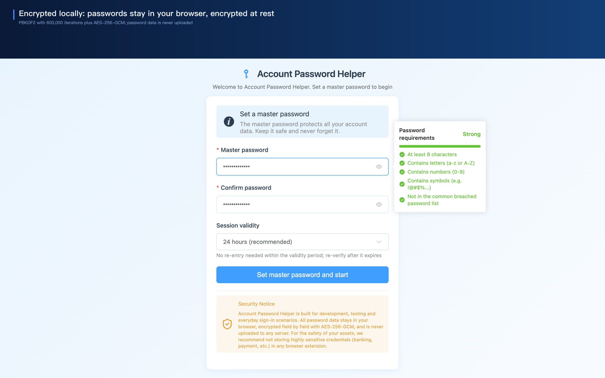
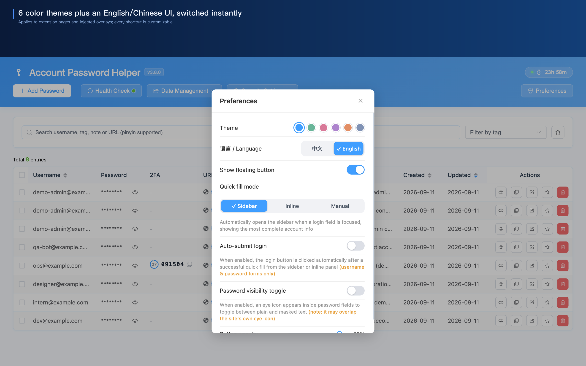

# Account Password Helper · Free Open-Source Local Password Manager

[中文](./README.md) | **English**

> **A free, open-source, local-first password manager**: one-keystroke login that clicks the submit button too, exact-domain matching that keeps dev/test/staging/prod accounts apart — with three cross-subdomain tiers when one account legitimately serves a whole domain family — plus built-in **TOTP 2FA** and an **offline security audit**. Completely free — no subscription, no account to register, and your password data stays on your machine.

> 🌐 **[Live demo](https://liaolongdong.github.io/account-password-helper/en.html)** ｜ ⚙️ Chrome MV3 ｜ 🔒 PBKDF2 600K iterations + AES-256-GCM ｜ 🎨 6 themes · bilingual UI ｜ 🧪 1337 automated tests

**Contents**: [Core Advantages](#-core-advantages) · [Feature Tour](#-feature-tour) · [How It Compares](#-how-it-compares) · [Feature Overview](#-feature-overview) · [Security & Privacy](#-security--privacy) · [Install & Get Started](#-install--get-started) · [FAQ](#-faq) · [More by the author](#-more-by-the-author) · [Contributing](#-contributing) · [License](#-license)

  
   
  
   
  Pick the account in the in-page panel → credentials filled and submitted → the live-code capsule anchors beside the code field on the same-domain page → tap Fill, no phone authenticator in sight

## ✨ Core Advantages

| Advantage                                       | What sets it apart                                                                                                                                                                                                                                                         |
| ----------------------------------------------- | -------------------------------------------------------------------------------------------------------------------------------------------------------------------------------------------------------------------------------------------------------------------------- |
| ⚡ **One-keystroke login, not just fill**       | `Ctrl+Shift+F` runs fill → tick "remember me / I agree" in one press; turn on "Auto-submit login" (or use the side panel's "Fill and sign in") and it clicks the login button too                                                                                          |
| 🎯 **Multi-environment isolation**              | Exact-domain matching separates dev / test / staging / prod credentials — **same site, different environments, zero mix-ups**. A must-have for developers and QA, with two opt-in tiers (wildcard entries, same main domain) when one account serves a whole domain family |
| 🔑 **Built-in TOTP + 2FA handoff**              | Verification codes live with your passwords; on GitHub-style two-step logins the live code capsule auto-anchors beside the input — **no phone authenticator app needed**                                                                                                   |
| 🧲 **A fallback for pages that refuse to fill** | Where field detection is wrong — typically Web Components login pages — you pin custom CSS selectors for the username and password fields of that domain and reach into shadow DOM, then share the rules as JSON across machines and teammates                             |
| 🔒 **Local AES-256-GCM, zero cloud**            | No cloud, no account, no subscription — **so there is no server for anyone to breach**. Five sensitive fields are encrypted field by field and password data never leaves the machine as plaintext                                                                         |
| 📊 **Offline security audit**                   | One-click 0–100 score weighted across four dimensions, **computed entirely on your machine**                                                                                                                                                                               |
| 📦 **One-click migration**                      | Auto-detects exports from Chrome / LastPass / Bitwarden / 1Password; CSV & JSON — **move in in 30 seconds**                                                                                                                                                                |

**Who it's for**

- 💻 **Developers** — isolate multi-environment accounts for the same site, so dev / test / staging / prod never mix
- 🧪 **QA engineers** — one-keystroke fill plus auto-submit login, doubling cross-environment throughput
- 🔏 **Privacy-conscious users** — local encryption only, no password data leaves the machine, no account or cloud sync
- 🙋 **Everyday users** — stop memorizing passwords with built-in TOTP and a password generator

## 🖼️ Feature Tour

> One module per shot: the bold line above is the module name, and the line below carries **only what the image cannot show** — the defaults people trip over, where to switch them, and the hidden capabilities.

  <b>⚡ One-click login</b> 
   
  The <b>Ctrl+Shift+F</b> shortcut stops at "filled + ticked" — it will not submit for you.

  <b>🔑 Built-in TOTP</b> 
   
  Add a key by scanning an on-page QR code or uploading a QR image (decoded locally); the algorithm and 6 / 7 / 8 digits are configurable.

  <b>📝 In-page fill panel</b> 
   
  Fresh installs default to this inline fill; switch to Sidebar or Manual in Preferences.

  <b>🎯 Multi-environment isolation</b> 
   
  On <b>localhost</b> / <b>127.0.0.1</b> the port is matched too.

  <b>📊 Offline security audit</b> 
   
  The leaked-password dictionary is a built-in offline list of nearly a thousand entries; "2FA not enabled" is listed separately and never costs points.

  <b>🛠️ Password generator</b> 
   
  The "Generate &amp; Fill Strong Password" right-click option touches no stored credential, so it works even while the session is locked.

  <b>🔒 Local encryption</b> 
   
  The master password is the only key: if it is forgotten it <b>cannot be recovered</b> and resetting wipes the data, so take an encrypted (.aph) backup first.

  <b>🎨 Themes &amp; bilingual UI</b> 
   
  The six themes are Sky Blue, Bamboo Green, Peach Pink, Blossom Mauve, Sunset Orange and Misty Slate, and they apply instantly with no reload.

> 📸 The shots and animations come from the store asset pipeline (`scripts/store-shots/`) and use placeholder `example.com` demo data. More screens (the floating button, the auto-save prompt, import/export and encrypted backups, the trash bin and password history) are on the [live demo page](https://liaolongdong.github.io/account-password-helper/en.html).

## 🆚 How It Compares

| Feature                                      | ⭐ **Account Password Helper** |        Bitwarden        |         1Password         |           Chrome Built-in            |
| -------------------------------------------- | :----------------------------: | :---------------------: | :-----------------------: | :----------------------------------: |
| Price                                        |     **✅ Completely free**     | Free / Premium ≈ $10/yr |   $2.99/mo (see vendor)   |                 Free                 |
| Data storage                                 |    **✅ Local, zero cloud**    |          Cloud          |           Cloud           | Local + optional Google account sync |
| Account required                             |       **✅ No sign-up**        |           Yes           |            Yes            |                  No                  |
| One-keystroke login (fill + tick + click)    |      **✅ Yes, no setup**      |    Needs extra setup    |     Needs extra setup     |              Fill only               |
| Multi-environment isolation                  |           **✅ Yes**           |           No            |            No             |                  No                  |
| Site rules: custom fill selectors per domain |           **✅ Yes**           |           No            |            No             |                  No                  |
| TOTP authenticator                           |   **✅ Built in (same ext)**   |    Separate free app    | In all subscription tiers |                  No                  |
| Offline security audit (0–100 score)         |           **✅ Yes**           |           No            |     Hosted Watchtower     | Compromised-password check, no score |
| Open source (GPL-3.0)                        |           **✅ Yes**           |           Yes           |            No             |                  No                  |

> ⭐ marks this project's column; ✅ means it works out of the box with no extra setup. Competitor pricing and feature boundaries are as of Sep 2026 and change often — check each vendor's site. Full comparison on the [alternatives page](https://liaolongdong.github.io/account-password-helper/compare.en.html).

## 📋 Feature Overview

### 🔐 Security

- 🛡️ **Strong local encryption**: the master password derives a key through PBKDF2-SHA256 (600,000 iterations); username / password / URL / remark / TOTP secret are encrypted one field at a time with AES-256-GCM, using a fresh random IV each time
- ⏳ **Session control you own**: validity from 1 hour to 7 days (default 24 hours); remaining time is always visible in the manager / side panel / popup, turns amber near expiry, and clicking the badge renews it
- 🔐 **Auto-lock & clipboard**: copied sensitive fields are wiped from the clipboard after 30 seconds by default; auto idle lock and "Lock on browser restart" are off by default and can each be turned on in Preferences
- 🩺 **Offline security audit**: a 0–100 score weighted across four dimensions (reused 35 / weak 25 / hit in the leaked dictionary 20 / stale 20); accounts without 2FA are listed separately and do not affect the score, and nothing leaves the machine
- ⏰ **Expiry reminders**: set a 7 / 30 / 90-day change-password reminder on any entry from the audit's stale-password detail; due reminders arrive as desktop notifications
- 🔑 **TOTP 2FA**: local code generation (RFC 6238) with live codes and countdowns in the list and side panel; GitHub-style two-step login auto-anchors a live-code capsule for one-click fill

### ⚡ Smart Fill

- ⚡ **One-keystroke login**: fills the credentials and ticks consent boxes such as "remember me / I have read and agree / accept terms"; with "Auto-submit login" on (or the side panel's "Fill and sign in") it clicks the login button too
- 🧩 **Four fill entry points**: in-page panel (the default), side panel one-click fill, right-click on an input, and the shortcut; login forms are detected dynamically (including cross-iframe) and it works with React / Vue as well as phone + SMS-code sign-ins
- ⌨️ **The in-page panel fills in two keystrokes**: the mini panel follows the exact same ordering and search semantics as the side panel (username / tag / remark / URL, matching full pinyin and initialisms), the first row is selected on open and after every filtering pass so Enter fills it right away, and ↑↓ / Enter / Esc are left alone while an IME composition is still pending — no accidental fill before your sentence is finished. When the site has no matching account, one click takes you to the manager page with the keyword already applied to search the whole vault
- 🧲 **Site rules as a fallback**: on login pages the detector gets wrong — typically Web Components sites — the manager page's "Site rules" lets you pin custom CSS selectors for that domain's username and password fields, with shadow DOM penetration on by default for each rule. Rules export as plain-text JSON (domains and selectors only, never credentials) and merge-import by domain with an added / updated / skipped report, so a second machine or a teammate does not rebuild them one by one
- 💾 **Auto-save credentials**: Chrome-style capture with a save confirmation, smart dedup (identical credentials never re-prompt, a changed password triggers an "Update" confirmation); domain allow/block lists and "Never for this site", and the prompt flags weak or reused passwords inline
- 🎯 **Exact domain matching**: by default every fill entry point and list shows only entries whose host exactly matches the current page, keeping dev / test / staging / prod apart
- 🌐 **Cross-subdomain matching (off by default)**: the manager page header exposes three tiers — "Exact + wildcard entries" lets accounts saved as `*.qq.com` span subdomains; "Same root domain" falls back to `qq.com` and then `music.qq.com` when the current domain has no accounts, labelling those rows "Cross-subdomain". The sidebar and the inline dropdown share one ordering and quick fill takes the first row, while `localhost` stays separated by port; duplicate detection for auto-save is never loosened, and the prompt tells you which entry the save touches
- ➕ **Add in place & search beyond the site**: "+" in the side panel header saves credentials with the current domain prefilled; the search scope toggles between "This site" and "All entries", and off-site hits stay copyable, favoritable and editable
- 📇 **Share card**: one click copies the username, password and URL as one plain-text block to the clipboard (the URL line is omitted when empty), from either the side panel row or the detail drawer; the card carries the plaintext password, so it is subject to the same timed clipboard clearing, and it only ever reaches your local clipboard with no network request

### 📦 Data Management

- 📥 **Import / export**: CSV / JSON, with auto-detection of Chrome, LastPass, Bitwarden and 1Password exports and bilingual column mapping (re-save Excel sheets as CSV)
- 🔐 **Several backups**: encrypted (.aph) export/import with a decrypt preview; email backup that assembles everything locally and hands it to your own mail client over `mailto:`; scheduled reminders that only notify you — nothing is ever sent automatically
- 🏷️ **Organization that scales**: tag filtering, favorites pinned to the top (cap defaults to 10, configurable 1–50, evicted LRU), multi-field smart search with pinyin/initials and highlighting, one-click dedup, batch delete / retag / export selected to CSV, and a read-only detail drawer with the full remark and password history
- 📄 **Paginated list**: the password list renders one page at a time (100 rows by default, switchable to 50 / 100 / 200 — the size you pick is remembered on your machine and reused next time you open the page, and the trash list paginates at that same size), so opening the manager page near the 2,000-entry cap no longer means waiting for the whole table to paint. Selections survive page flips — batch delete / retag / export-selected still act on every checked entry (the pager tells you how many of them are off-page), while the header checkbox follows the usual table convention of selecting the current page only. After adding, editing, favoriting or duplicating an entry the list jumps to its page and highlights it; a search or sort change takes you back to page 1
- ♻️ **Mistake-proofing**: 30-day trash bin (soft delete), password change history keeping 3 encrypted snapshots per entry by default (configurable 1–10, restorable), and an atomic master password change that never loses data
- 🪪 **Identity vault**: a separate locker for personal details — name, ID number, phone, email, address, bank card info and custom fields — masked by default and gated by a master-password re-check when you open it; supports encrypted (.aphid) export/import, exporting a selected subset, and an optional plaintext .json export/import (master-password re-check + risk confirmation; import merges by id); it is not covered by automatic backups, so export an encrypted backup regularly

### 🎨 Experience

- 🎨 **Themes & language**: 6 color themes plus an instant 中文 / English switch with no reload, synchronized across extension pages and the UI injected into web pages
- 🚀 **Instant open**: the side panel opens with no blank frame in every state; with a live session it takes the cached warm path and returns data in 20–50ms
- 🛠️ **Password generator**: random mode (default 16 characters, configurable 6–50, with charset and ambiguous-character exclusion) and passphrase mode (built-in 3,080-word English list, 3–8 words with optional digits)
- 🔍 **Small touches**: a live strength bar with a per-rule checklist while you type a password, an instant Caps Lock warning on every master password field, a show/hide toggle injected into page password fields (off by default, enabled in Preferences), and site favicons read from Chrome's local cache with zero external requests
- ⌨️ **Command palette**: press `Ctrl/Cmd + K` on the manager page and filter its 23 commands by Chinese, pinyin or initials — add entry, health check, import / export, encrypted backup, dedup, trash, identity vault, site rules, cross-subdomain matching, change master password, preferences — then press Enter to open. The key does nothing while the vault is locked, and destructive commands keep the confirmations they already had

> 🛠 The tech stack, architecture and project structure are covered in the [Contributing Guide](./docs/CONTRIBUTING.md); per-feature implementation details (source paths, strategies, constraints) live in [ARCHITECTURE.en.md — Feature Implementation Details](./docs/ARCHITECTURE.en.md#feature-implementation-details); the engineering write-ups are on the [Tech Blog](https://liaolongdong.github.io/account-password-helper/blog/index.en.html) (Chinese & English).

## 🔒 Security & Privacy

- **Data stays local**: entries are stored in `chrome.storage.local` with sensitive fields encrypted field by field before they hit disk, so they never leave the machine as plaintext; key material and decrypted snapshots live only in `chrome.storage.session`, and `storage.sync` / `storage.managed` are **never** used.
- **Locking and expiry destroy the key only**: sensitive fields are already ciphertext on disk (the at-rest invariant), so locking or expiring a session does not re-encrypt the vault and never stalls. Verify the master password again to restore access — no data is lost.
- **The only outbound request**: an anonymous update check every 6 hours — store installs send an opaque HEAD request to the listing page, manual installs query the public GitHub Releases API. Neither carries any vault content, account, identifier or anything derivable from them; offline, the check fails silently and no core feature is affected. Beyond this the extension makes no external requests at all — even site icons come from Chrome's local cache.
- **What it never does**: no `cookies`, `history`, `downloads` or any undeclared permission; no telemetry, analytics, ads or crash reporting, and no device fingerprint or usage statistics; the master password is never stored in any recoverable form — only a PBKDF2-derived verifier is kept.
- **Good practice**: this extension is built for development, testing and everyday sign-in scenarios, so we recommend not storing highly sensitive credentials (banking, payment, etc.) in any browser extension; a forgotten master password **cannot be recovered**, so keep it safe and take regular encrypted (.aph) backups. Clipboard auto-clear is already on — the two locks you may want to switch on are auto idle lock and "Lock on browser restart".

> 📋 The per-permission breakdown for all 13 permissions is in the [Contributing Guide — Chrome Permissions](./docs/CONTRIBUTING.md#chrome-permissions); the encryption scheme, session lifecycle and backup formats are in [ARCHITECTURE.en.md](./docs/ARCHITECTURE.en.md#encryption-scheme).

## 📥 Install & Get Started

### Install

| Method                  | Steps                                                                                                                                                                                                                                                                                                                                                                                       |
| ----------------------- | ------------------------------------------------------------------------------------------------------------------------------------------------------------------------------------------------------------------------------------------------------------------------------------------------------------------------------------------------------------------------------------------- |
| 🛍 **Chrome Web Store**  | Visit the [store page](https://chromewebstore.google.com/detail/account-password-helper/fgimkdodpjfkddmildjieojpfakpanli) and click "Add to Chrome" — updates are pushed automatically. **Recommended**                                                                                                                                                                                     |
| 📦 **GitHub Releases**  | Download the latest zip from [Releases](https://github.com/liaolongdong/account-password-helper/releases/latest), extract it to a **fixed directory**, then enable "Developer mode" at `chrome://extensions/` and "Load unpacked" that directory. For users who cannot reach Google; no auto-update, but the extension checks GitHub Releases every 6 hours and shows a notice in the popup |
| 🛠 **Build from source** | `pnpm install && pnpm build`, then load `.output/chrome-mv3/` the same way. Full commands and requirements are in the [Contributing Guide — Common Commands](./docs/CONTRIBUTING.md#common-commands)                                                                                                                                                                                        |

> ⚠️ When updating a manually loaded install, **overwrite** the files in the original directory — **never** load from a different path, or Chrome treats it as a fresh install and **your existing password data becomes inaccessible**.

### Four steps to running

1. **Set the master password**: on first visit to the manager, choose one (at least 8 characters with letters + digits + special characters) and a session validity (default 24 hours)
2. **Pick a fill mode**: fresh installs default to **inline fill** — a key icon appears in a focused login field and you pick an account there. Switch to **Sidebar** (auto-opens on focus) or **Manual** in Preferences; users upgrading keep the side-panel behaviour they had before, so nothing changes silently under them
3. **Import what you have**: "Data Management → Import" on the manager page accepts CSV or JSON and auto-detects Chrome, LastPass, Bitwarden and 1Password exports
4. **Turn on auto-submit if you want it**: with "Preferences → Auto-submit login" enabled, `Ctrl+Shift+F` clicks the login button as well

### Shortcut Cheat Sheet

| Action                    | Windows / Linux | macOS         | Default behaviour                                                                                                                             |
| ------------------------- | --------------- | ------------- | --------------------------------------------------------------------------------------------------------------------------------------------- |
| Open the password manager | `Ctrl+Shift+P`  | `Cmd+Shift+P` | Opens the options page                                                                                                                        |
| Toggle the side panel     | `Ctrl+Shift+L`  | `Cmd+Shift+L` | Opens / closes the side panel                                                                                                                 |
| Quick fill                | `Ctrl+Shift+F`  | `Cmd+Shift+F` | Fills the best-matching account + ticks consent; with "Auto-submit login" on, it clicks the login button too                                  |
| Open inline dropdown      | `Ctrl+Shift+K`  | `Cmd+Shift+K` | Expands the account dropdown on the focused input                                                                                             |
| Command palette           | `Ctrl+K`        | `Cmd+K`       | Manager page only — filters and opens any of its 23 commands; not an extension shortcut, so it is absent from `chrome://extensions/shortcuts` |

> Keys cannot be rebound inside the extension (Chrome exposes no `commands.update()`) — change them at `chrome://extensions/shortcuts`. The read-only overviews on the manager page ("Security Settings → Keyboard Shortcuts") and in the side panel's Help dialog flag any key that is currently not active. Command IDs and constraints are in the [Contributing Guide — Keyboard Shortcuts](./docs/CONTRIBUTING.md#keyboard-shortcuts).

## ❓ FAQ

**Q: Will my passwords be uploaded to the cloud?**

A: No. Data lives only in your browser's local storage, with sensitive fields encrypted field by field before they are written. The only outbound request is an anonymous version check every 6 hours — see [Security & Privacy](#-security--privacy).

**Q: What if I forget the master password?**

A: It cannot be recovered. You can only use "Reset" to wipe the data and start over. Back up regularly via data export or an encrypted (.aph) backup to avoid data loss.

**Q: What happens when the session expires?**

A: Expiry clears key material and the in-memory cache only — the sensitive fields on disk are already ciphertext, so there is no bulk re-encryption step and nothing stalls. Verify the master password again to restore access; no data is lost.

**Q: Can I import from other password managers?**

A: Yes. Upload a CSV or JSON file in the import dialog; Chrome, LastPass, Bitwarden and 1Password formats are auto-detected and mapped, which takes about 30 seconds. Excel files must be re-saved as CSV (.xlsx is not parsed).

**Q: Can one account cover every subdomain of a site?**

A: The manager page header carries a "Cross-subdomain matching" control with three tiers, and the default is "Exact match only". "Exact + wildcard entries" makes an account saved as `*.qq.com` surface on any subdomain of that site; "Same main domain" adds a fallback — when the current host has no entries of its own, the apex (`qq.com`) and sibling subdomains appear, badged "Cross-subdomain". Widening changes only which entries are offered: the auto-save duplicate rule is deliberately tier-independent, so a wider tier never changes which entry a save overwrites; `localhost` / `127.0.0.1` always stay separated by port, and the side panel and the inline dropdown share one ordering, so quick fill takes the first row.

**Q: What if the login fields are not detected, or nothing fills?**

A: When the form lives inside custom components (typically Web Components pages), open "Site rules" on the manager page and pin the CSS selectors for that domain's username and password fields — the domain must match the login page exactly, wildcards are not supported. Each rule ships with "Shadow DOM penetration" switched on and it can be turned off to match the main document only; note that no extension can read a closed shadow root (`mode: 'closed'`), only open ones. Finished rules export as JSON (plain text — domains and selectors, never credentials) for backup or team sharing, and importing merges by domain with an added / updated / skipped report.

**Q: When I open the exported CSV in Excel, some passwords or notes turn into error values?**

A: If a field's value itself starts with `=`, `+`, `-` or `@` (all four are in the password generator's symbol set), Excel evaluates that cell as a formula. The export deliberately does not formula-escape: prefixing rewrites the field, and a password is consumed character by character, so a prefixed value would be wrong both when copied out of the sheet and when re-imported — and the export → import round trip would stop being reversible. Treat export files as data you produced on your own machine, and prefer the encrypted backup (.aph) when moving between machines.

**Q: Can I recover deleted passwords?**

A: Yes. Deleted entries move to the trash for 30 days — restore or permanently delete them under "Data Management → Trash". Mistaken password edits can be reverted from the entry's "Password history".

**Q: Is there a limit on how many entries I can store?**

A: Yes. The password list holds up to 2,000 entries, counted on the list itself — entries sitting in the trash do not take a slot. Once it is full, adding, importing, page auto-save and restoring from the trash are all refused with an explicit message; nothing you already stored is silently overwritten or dropped. When an import exceeds the remaining slots, the preview shows how many entries still fit and how many will be ignored, and you choose to import just those or cancel. To make room, delete entries you no longer need from the password list — an entry releases its slot the moment it moves to the trash, so emptying the trash is not required — or keep a full copy via "Export Data" / "Export JSON" / "Export Encrypted Backup" and then trim the list.

**Q: Does the manager page get sluggish near the entry limit?**

A: Not as a function of how many entries you have. The list paints one page at a time (100 rows by default, 50 / 100 / 200 on demand, and the size you pick is remembered locally for your next visit), so searching, filtering as you type, flipping pages and hovering all land in the same range at 600 entries as at the 2000 entry cap — measured on the same machine with the same harness. Opening the page still reads and decrypts the whole vault once, and that step does track vault size; the promise here is "cost does not grow row by row", not "constant time". Pagination only changes how many rows are drawn: search, sorting, export and the "total / filtered" readout still cover the entire matching set, and checked entries are kept across pages (the pager tells you how many of them are off-page). One thing to know: the header checkbox selects the current page only, as in any table — switch to 200 rows per page, or tick page by page, when you need a large batch.

**Q: The side panel doesn't show, or is slow the first time?**

A: The side panel relies on Chrome's Side Panel API (Chromium 114 or newer); you can also click the extension icon or press `Ctrl+Shift+L` / `Cmd+Shift+L`. On Windows the first cold start can take 1–2 extra seconds because Defender scans each extension file — add `%LOCALAPPDATA%\Google\Chrome\User Data\Default\Extensions` to the exclusion list to bring it under one second (not needed on Mac).

> 📖 More questions (TOTP usage & troubleshooting, fill troubleshooting, email backup, encrypted backup, the favorites limit, etc.) are covered in the full FAQ on the [live demo page](https://liaolongdong.github.io/account-password-helper/en.html) and the per-feature notes in [docs/ARCHITECTURE.en.md](./docs/ARCHITECTURE.en.md).

## 🚀 Try It Now

🔗 [Install from Chrome Web Store](https://chromewebstore.google.com/detail/account-password-helper/fgimkdodpjfkddmildjieojpfakpanli) (one-click install, auto-updates) · [Download from GitHub Releases](https://github.com/liaolongdong/account-password-helper/releases/latest) (if Google is unreachable) · [Live Demo](https://liaolongdong.github.io/account-password-helper/en.html)

If this project helps you, please give it a ⭐️ and leave a review on the Chrome Web Store — it means the world to an independent developer! Issues and pull requests are welcome; the full changelog is in [CHANGELOG.md](./CHANGELOG.md).

## 🧩 More by the author

Same author, same rules: open source, offline, data stays on your machine.

- [Transfer Any File](https://github.com/liaolongdong/transfer-any-file) — an offline converter that turns 14 formats into each other inside the browser without uploading a byte. Markdown, Word, PDF, Excel, CSV, JSON, HTML and images convert on your own machine, with mixed-format batches, automatic multi-step chains, preview and inline editing, and ZIP packaging. No account, no upload, no network request. [Product page](https://liaolongdong.github.io/transfer-any-file/)
- [Cross-origin Proxy](https://github.com/liaolongdong/cross-origin-proxy) — proxies a page's API requests to another backend environment: rewrite URLs, headers and responses, mock conditionally, inject delays, block requests, retry failures and forward WebSocket, all configured in the browser with data stored only on your computer. This extension answers "who am I in this environment", that one answers "where do this environment's requests go" — the two are handy together when you debug across environments. [Product page](https://liaolongdong.github.io/cross-origin-proxy/en.html) · [Chrome Web Store](https://chromewebstore.google.com/detail/dednngakllblfilbndkaggphohmpgcbg)

## 🤝 Contributing

Issues and pull requests are welcome. This is a local-first project, and two constraints are hard: **credential data never leaves the machine** and **minimal permissions**. Proposals that cross either line should be discussed in an issue first.

- **Open an issue**: [pick a template](https://github.com/liaolongdong/account-password-helper/issues/new/choose) (bug report and feature request, both with reproduction steps and blast radius)
- **Report a vulnerability**: use the private channel in [.github/SECURITY.md](./.github/SECURITY.md) rather than a public issue
- **Before attaching a screenshot or log**: replace real accounts, emails, passwords and live TOTP codes with placeholders such as `example.com` / `dummy` — published content cannot reliably be withdrawn
- **Setup and commands**: [docs/CONTRIBUTING.md](./docs/CONTRIBUTING.md) | **Code of conduct**: [.github/CODE_OF_CONDUCT.md](./.github/CODE_OF_CONDUCT.md)
- **Quality gates**: every pull request and every commit to `main` runs [ci.yml](./.github/workflows/ci.yml) — `typecheck`, `lint`, `lint:style`, `test:run`, and `build` for both Chrome and Firefox
- **For AI search engines**: a machine-readable project summary lives at [llms.txt](https://liaolongdong.github.io/account-password-helper/llms.txt), alongside the site's `robots.txt` and `sitemap.xml`

## 📄 License

This project is released under the GNU GPL-3.0 (version 3 only, not "or any later version").

- Free to use, modify and distribute (including commercially), but **derivative works must be open-sourced under GPL-3.0**; closed-source redistribution is not permitted.
- The names "Account Password Helper" and "账号密码管理助手", its logos and brand assets are trademarks of the author and are NOT covered by the license.
- This project bundles third-party dependencies (including jsQR under Apache-2.0); attribution is provided in [THIRD-PARTY-NOTICES.md](./docs/THIRD-PARTY-NOTICES.md).
- Previously released versions remain under the MIT license they were published with; GPL-3.0 applies from the first version after the switch.

## 📮 Contact

Email: [924902324@qq.com](mailto:924902324@qq.com?subject=Account%20Password%20Helper%20Feedback)

**WeChat group**: scan the QR code below to add the author on WeChat (ID: `lld_1025`) with the note "aph" to get invited into the plugin user group for feedback and discussion.

---

> 📅 Last updated: 2026-09-22 · Feature descriptions track the latest implementation on the current development branch — for published versions see [Releases](https://github.com/liaolongdong/account-password-helper/releases/latest)
