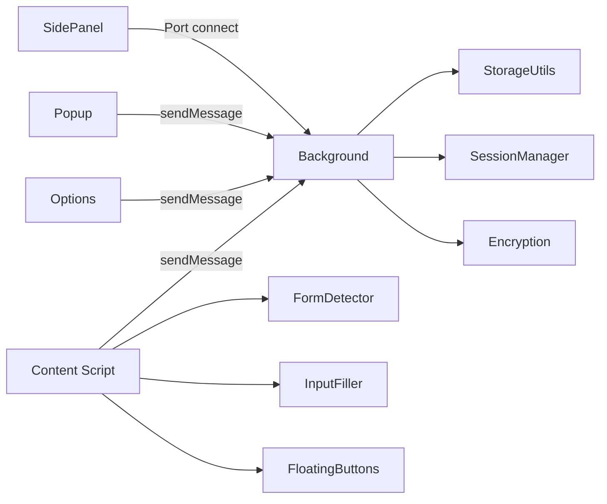
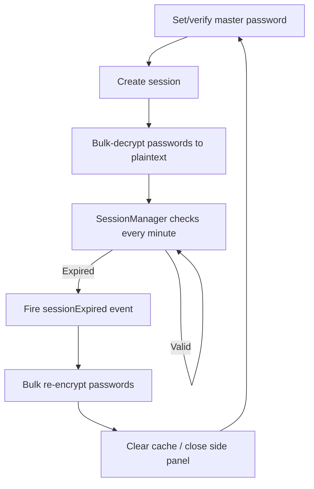

# Account Password Helper · 账号密码管理助手

[中文](./README.md) | **English**

[](https://wxt.dev/)
[](https://vuejs.org/)
[](https://www.typescriptlang.org/)
[](https://element-plus.org/)
[](https://developer.chrome.com/docs/extensions/mv3/intro/)
[](#license)
[](https://chromewebstore.google.com/detail/account-password-helper/fgimkdodpjfkddmildjieojpfakpanli)
[](https://github.com/liaolongdong/account-password-helper/releases/latest)

A powerful Chrome extension for secure, convenient password management and auto-fill. Built on a **PBKDF2 + AES-256-GCM** encryption scheme with zero network transfer — passwords never leave your browser. Features include smart login form detection, multi-strategy auto-fill, one-click auto login, auto-save of credentials, bulk import/export, encrypted backup, password visibility toggle, idle lock, TOTP two-factor codes, password strength checks, a password generator, and more.

> **Disclaimer**: All data is stored locally (sensitive fields encrypted). This extension is intended for development, testing, and ordinary production logins only. **Never store work or personal sensitive passwords (banking, payment, or core social accounts).** You bear full responsibility for any password leakage!
>
> 🌐 **Live demo**: https://liaolongdong.github.io/account-password-helper/

<p align="center">
  
</p>

## Screenshots

<p align="center">
  
  
  
</p>

<p align="center">
  <sub>Password list management · Side panel quick fill · Floating button shortcut</sub>
</p>

## Core Features

- **Encryption & security**: PBKDF2 (600,000 iterations) derives a 256-bit key + AES-256-GCM with random IV; master password stored as SHA-256 + salt; sensitive fields (username/password/url/remark/totp) encrypted. Built on the native Web Crypto API.
- **Smart detection**: MutationObserver detects login forms dynamically, covering username + password, phone + verification-code, and more; cross-iframe form detection and filling; LoginFormAnalyzer applies multi-dimensional heuristics across form/container/dialog/button signals.
- **One-click fill**: click an entry in the side panel to fill; triple fill strategy (Native Setter / execCommand / simulated typing) is compatible with React/Vue and other mainstream frameworks; optional auto login trigger.
- **Auto-save**: Chrome-style credential capture on form submit, button click, or Enter key; domain allowlist/blocklist matching; vault-comparison dedup (identical credentials never re-prompt, changed passwords trigger an "Update" confirmation); one-click "Never for this site"; credentials survive cross-page navigation; editable tag and remark in the save prompt.
- **Data management**: CSV import/export (.csv) with multi-format auto-detection, export filename `passwords_YYYYMMDD_HHmmss.csv`; JSON import/export (.json), export filename `passwords_YYYYMMDD_HHmmss.json`; Chinese/English column mapping; multi-select tags (up to 3 per entry, max 30 chars each) with custom tags and stable colors; favorites with a favorites-only filter; one-click dedup; multi-field search and sorting; copy entries; batch delete.
- **Email backup**: export data and launch the mail client; choose "Plain backup" or "Encrypted backup" (.aph format, importable only after master password verification); scheduled backup reminders via chrome.alarms — daily / every 3 days / weekly / biweekly / monthly.
- **Password visibility toggle**: injects a show/hide button into page password fields; visible when the field has a value (off by default; enable in settings).
- **Encrypted backup**: .aph AES-GCM encrypted export/import (PBKDF2 600,000-iteration key derivation); decrypt-preview before confirming import.
- **Password strength visualization**: real-time strength bar (weak/medium/strong) and rule checklist (length, letters, digits, special characters) shown in a popover while typing.
- **Security health dashboard**: one-click scan of all passwords producing an overall score (0–100) and grade (excellent/good/fair/poor); detects weak passwords, reused passwords (shared across accounts), commonly leaked passwords (offline top-1000 dictionary), long-unchanged passwords (90/180/365-day tiers), and entries without 2FA; supports expiry reminders (desktop notification after N days); fully local computation with zero network transfer; "Fix" buttons jump straight to editing.
- **Session control**: validity of 1/2/4/8/12/24 hours or 3/5/7 days; sensitive fields re-encrypt automatically when the session expires; auto idle lock (5/10/30/60 minutes); lock on browser restart; one-click lock in the popup; cross-context expiry broadcast.
- **Update detection**: checks the latest version via the GitHub Releases API every 6 hours; update notice with version and changelog shown in the popup, linking to the download page.
- **Shadow DOM isolation**: the floating button uses a closed Shadow DOM, fully isolated from page styles.
- **Random password generator**: one-click generation from the magic-wand button in the add/edit form, backed by the Web Crypto API; customizable length (6–50) and character sets (upper/lower/digits/specials); optional exclusion of ambiguous characters (1/l/I/0/O); live strength bar.
- **Clipboard auto-clear**: automatically clears the clipboard after copying a password, with a configurable delay of 10/15/30/60/120 seconds; copying a username cancels the timer; best-effort clearing when unfocused; configured under "Clipboard Settings" on the management page.
- **Favorites limit with LRU eviction**: configurable limit (1–50, default 10); when exceeded, the least recently used favorite is evicted so frequent accounts stay pinned; filling from the side panel refreshes the favorite's usage timestamp.
- **Themes**: 6 curated color themes — Sky Blue (default), Bamboo Green, Peach Pink, Sakura Purple, Sunset Orange, Mist Gray; implemented via CSS design tokens for consistent theming across extension pages and content-script Shadow DOM components; instant switching without refresh.
- **Bilingual interface (中文 / English)**: runtime language switching without restarting the extension; the language option lives in the "Preferences" panel (grouped with themes, reachable from the management page, floating button, and side panel); changes apply instantly and sync to all open pages; coverage includes extension pages, injected in-page UI (save prompt, inline fill panel, page notifications, floating button), and desktop notifications.
- **Inline fill**: an alternative quick-fill mode — a key icon appears inside the focused login field, opening a mini panel (search + account list + manager entry) with keyboard navigation (↑↓ browse, Enter fill, Esc close); closed Shadow DOM for full style isolation.
- **Two-factor authentication (TOTP)**: store TOTP secrets (`otpauth://` links or Base32 keys) per account; rolling codes generated locally per RFC 6238 with Web Crypto HMAC; live display in the list/side panel with one-click fill and copy; fully local, zero network.
- **Zero network transfer**: all data lives in Chrome local storage; nothing ever goes over the network.

## Feature Overview

### 1. Security

- Master password requires at least 8 characters including letters, digits, and special characters.
- After a session is created, passwords are decrypted into an in-memory cache; they re-encrypt automatically when the session expires.
- Inconsistent encryption states are detected and repaired automatically after session recovery.
- SessionManager checks session validity every minute and on page visibility changes.

### 2. Form Detection & Filling

- Detects username, password, phone, and verification-code fields; auto-checks "Remember me" and "Agree to terms" checkboxes.
- WeakMap / WeakSet caches field classification results to avoid memory leaks.
- Fill strategy degrades automatically: **Native Setter → execCommand → simulated keyboard events**.
- The floating button offers an "Auto login trigger" switch: after filling, the login button inside the form is clicked automatically (see [SettingsPanel.ts](./entrypoints/content/floatingButtons/SettingsPanel.ts) / [FormDetector.ts](./entrypoints/content/FormDetector.ts)).

### 3. Data Management

- CSV import/export (.csv) with a standard template download.
- JSON import/export: export password data as JSON (master password required), filename `passwords_YYYYMMDD_HHmmss.json`; JSON import is also supported.
- Tag multi-select with custom tags (up to 3 per entry, max 30 chars each); identical tags keep stable, consistent colors (see [utils/tagUtils.ts](./utils/tagUtils.ts)).
- Password list sorts by update time (desc) by default; the side panel sorts by recent usage. Sortable by username, URL, tag, remark, and create/update time.
- Multi-field fuzzy search across username, tag, remark, and URL.
- Batch selection and batch deletion of entries.
- Favorites: star frequent entries and filter with "favorites only"; configurable limit (1–50) with LRU eviction when exceeded; filling from the side panel refreshes the usage timestamp for accurate LRU.
- One-click dedup: detects duplicates (same username + same URL) and cleans them up after confirmation.
- Multi-format CSV import: auto-detects Chrome, LastPass, Bitwarden, and 1Password export formats (see [utils/excel.ts](./utils/excel.ts)).

### 4. Auto-Save Login Credentials

- When enabled, credentials are captured on site login with a confirmation prompt (see [LoginAutoSave.ts](./entrypoints/content/LoginAutoSave.ts)).
- Three capture scenarios: form submit (capture phase), login button click, and Enter key in the password field.
- Domain rules support exact domains and regular expressions; empty rules match all domains (see [AutoSaveSettingDialog.vue](./components/options/AutoSaveSettingDialog.vue)).
- sessionStorage staging preserves credentials across page navigation caused by traditional form submits.
- After saving, a desktop notification is sent and the password cache is invalidated so the next load gets fresh data.
- **Three-option interaction**: the prompt offers "Save", "Not now", and "Never".
- **Editable fields**: besides showing the account and password, the prompt provides editable **tag** (defaults to the page title) and **remark** (defaults to "Auto-saved") inputs.
- **Smart update strategy**: same account + same domain with a changed password triggers an "Update" confirmation that keeps existing tags and remarks (unless edited in the prompt); identical credentials are skipped; new accounts create new entries.
- **Blocklist**: clicking "Never" adds the current domain to the block list (see [SavePasswordPrompt.ts](./entrypoints/content/SavePasswordPrompt.ts)); no prompts appear for that domain until it is removed under "Blocked domains" in settings.
- **Anti-duplicate**: before prompting, the background is queried for the domain + account status in the vault (see `checkCredentialStatus` in [autoSaveManager.ts](./utils/storage/autoSaveManager.ts)): identical credentials stay fully silent (persistently across logins); changed passwords open an "Update" prompt; new accounts open a "Save" prompt. A same-page fingerprint debounce (username + password length, see [LoginAutoSave.ts](./entrypoints/content/LoginAutoSave.ts)) absorbs the triple trigger of submit/click/Enter.

### 5. Email Backup

- Exports the password list as a data file and launches the mail client (see [utils/emailBackup.ts](./utils/emailBackup.ts)).
- Backup modes: "Plain backup" exports a standard data file; "Encrypted backup" exports an .aph file (viewable only via this extension's "Encrypted Backup Import" with the original master password).
- Scheduled backup reminders via chrome.alarms desktop notifications (no decryption, no automatic downloads).
- Intervals: daily / every 3 days / weekly / biweekly / monthly.

### 6. Encrypted Backup Import/Export

- Export: all password data is AES-GCM encrypted with the master password and downloaded as an `.aph` file (see [utils/backupExport.ts](./utils/backupExport.ts)), filename `backup_YYYYMMDD_HHmmss.aph`.
- Import: upload an `.aph` file, enter the master password used at export time, preview the first 5 entries, then confirm (see [BackupImportDialog.vue](./components/options/BackupImportDialog.vue)).
- Scheme: PBKDF2 (600,000 iterations) + AES-256-GCM + random salt + random IV — stronger than regular storage.

### 7. Password Visibility Toggle

- Injects a show/hide toggle into page password fields (see [PasswordVisibilityToggle.ts](./entrypoints/content/PasswordVisibilityToggle.ts)); off by default, enable it in the floating button settings panel.
- Toggles are injected uniformly into all password fields, styled in Element Plus theme blue, visible when the field has a value.
- MutationObserver watches for dynamically added password fields and injects automatically.
- Can be switched on/off in the floating button settings panel.

### 8. Auto Idle Lock & Lock on Browser Restart

- Configure the idle period (5/10/30/60 minutes or off) under "Auto lock settings"; exceeding it clears the master password session and locks the manager (see [IdleLockSetting.vue](./components/options/IdleLockSetting.vue)).
- Unlocking requires the master password again — consistent with manual lock and session expiry.
- **Lock on browser restart**: when enabled, fully closing and reopening the browser requires the master password again (more secure); when off, you stay signed in within the validity period.
- The popup also provides a one-click "Lock" button to clear the current session.

### 9. Password Strength Visualization

- While setting the master password or editing entries, a popover shows the strength level (weak/medium/strong) and a progress bar in real time (see [PasswordStrengthPopover.vue](./components/options/PasswordStrengthPopover.vue)).
- Rule-by-rule validation: at least 8 characters, letters, digits, special characters — pass/fail at a glance.
- Built on the reusable [usePasswordStrength](./composables/usePasswordStrength.ts) composable.

### 10. Security Health Dashboard

- Click "Health Check" in the top toolbar (with a health signal dot) to open the dashboard dialog (see [PasswordHealthDialog.vue](./components/options/PasswordHealthDialog.vue)).
- Overall score (0–100) + grade (excellent/good/fair/poor) with an animated ring (see [utils/passwordHealth.ts](./utils/passwordHealth.ts)).
- Five checks: weak passwords, reused passwords (grouped display), commonly leaked passwords (offline top-1000 dictionary, see [utils/weakPasswordDict.ts](./utils/weakPasswordDict.ts)), long-unchanged passwords (90/180/365-day tiers), and entries without 2FA (informational only, not scored).
- Score weights: reuse 35% + weak 25% + leaked 20% + stale 20%, deducted linearly by affected ratio.
- Set expiry reminders for stale entries (7/30/90 days etc.); background alarms send desktop notifications that link back to the manager (see [utils/storage/reminderManager.ts](./utils/storage/reminderManager.ts)).
- Detail sections expand/collapse; each issue has a "Fix" button jumping straight into editing that entry.
- Fully local computation (offline dictionary lazily loaded); online breach checks (e.g. HIBP) are deliberately excluded; no plaintext passwords returned; zero network transfer.
- The signal dot next to the entry button changes color with the health grade (green/blue/orange/red).

### 11. Quick Fill

- The side panel puts passwords matching the current domain first.
- **Exact domain matching**: only entries whose host exactly matches the current page are shown (no subdomain/parent-domain fuzzy matching), keeping multi-environment accounts apart (e.g. `fat.example.com` vs `uat.example.com`); entries without a URL always show.
- **Local dev friendly**: on `localhost` or `127.0.0.1`, all passwords match by default (see [sidepanel/App.vue](./entrypoints/sidepanel/App.vue)).
- Click an entry to fill and auto-close the side panel; if no login form is present, a "no login form detected" notice appears.
- Side panel entries can jump to the manager to edit that entry or add a new one.
- Shortcuts:
  - `Ctrl+Shift+P` / `Cmd+Shift+P`: open the password manager
  - `Ctrl+Shift+L` / `Cmd+Shift+L`: toggle the side panel
  - Shortcuts are customizable — see [FAQ — How do I customize shortcuts](#faq)
- Background maintains a password cache; the side panel reads the cache first and validates asynchronously.

### 12. Update Detection

- Periodically checks the latest version via the GitHub Releases API (see [utils/updateChecker.ts](./utils/updateChecker.ts)).
- Checks every 6 hours; when a new version is found, the popup shows an update notice with version and changelog.
- Clicking the notice opens the GitHub Releases page.
- Results are cached for 24 hours to avoid excessive requests; the cache refreshes automatically after expiry.

### 13. Random Password Generator

- In the add/edit form, a magic-wand button (`MagicStick` icon) next to the password field opens the generator.
- Custom length (6–50) and character set switches (upper / lower / digits / specials).
- Optionally exclude ambiguous characters (1, l, I, 0, O).
- Live strength bar after generation; click "Use this password" to fill the form.
- Backed by the Web Crypto API (`crypto.getRandomValues`) for cryptographic randomness (see [utils/passwordGenerator.ts](./utils/passwordGenerator.ts)).

### 14. Clipboard Auto-Clear

- After copying a password from the side panel, a timer clears the clipboard after the configured delay.
- Delay options: 10/15/30/60/120 seconds, default 30 (see [ClipboardSettingDialog.vue](./components/options/ClipboardSettingDialog.vue)).
- Before clearing, the clipboard content is verified as unchanged (Async Clipboard API preferred; best-effort clearing when unfocused).
- Copying a username cancels the password-clear timer to avoid wiping the username.
- Configured under "Data Management" → "Clipboard Settings" on the management page.

### 15. Two-Factor Authentication (TOTP)

- Paste an `otpauth://` link or Base32 secret into the "2FA" field of the add/edit form (see [PasswordFormDialog.vue](./components/options/PasswordFormDialog.vue)).
- Codes are computed locally per RFC 6238 using [Web Crypto API](https://developer.mozilla.org/en-US/docs/Web/API/Web_Crypto_API) HMAC — **no network requests**, consistent with the extension's zero-network stance (see [utils/totp.ts](./utils/totp.ts)).
- The list and side panel show live codes with a ring countdown (color shift in the last 5 seconds, see [TotpCode.vue](./components/TotpCode.vue)).
- Side panel entries offer "Fill code" and "Copy code": filling writes into detected verification-code inputs (reusing selectors like `autocomplete="one-time-code"`), triggered only on explicit click.
- TOTP secrets are sensitive fields encrypted under the master password scheme (AES-256-GCM) and travel with CSV / JSON / encrypted (.aph) import/export; `totp` columns from LastPass exports migrate directly.
- Supports custom algorithms (SHA1/256/512), digits (6–8), and period (default 30s), parsed from the `otpauth://` URI; bare secrets fall back to defaults.

#### Troubleshooting verification failures

- **One secret per service**: e.g. GitHub binds exactly one TOTP secret per account. Whichever authenticator completes "verify" owns the binding; older secrets elsewhere become invalid.
- **Multiple authenticators**: within a single setup session, enter the same displayed secret into all authenticators (this extension, Google Authenticator, etc.) before clicking verify; do not refresh the setup page — refreshing regenerates the secret and desynchronizes them.
- **Accurate clock required**: codes are computed from absolute UTC time; a clock drift beyond ~30 seconds fails verification. Enable automatic time sync.
- **Matching parameters**: defaults are SHA-1 / 6 digits / 30 seconds (mainstream); if your `otpauth://` link carries non-default parameters (e.g. SHA-256, 8 digits), they are honored and must match the server (check the parsed parameters in the form preview).

### 16. Themes

- 6 color themes: Sky Blue (default), Bamboo Green, Peach Pink, Sakura Purple, Sunset Orange, Mist Gray (see [utils/theme.ts](./utils/theme.ts)).
- Theme preference is stored with the floating button preferences; three entries into settings: ① "Preferences" button on the management page; ② floating button gear icon; ③ side panel gear icon.
- Extension pages (manager, side panel, popup) theme consistently via the `data-theme` attribute + CSS design tokens ([tokens.css](./assets/theme/tokens.css)).
- Content-script Shadow DOM components (floating button, inline fill panel, visibility toggle) receive inline theme tokens, synchronized with extension pages.
- Theme changes apply instantly, no refresh needed.

### 17. Inline Fill

- An alternative to the side panel (see [InlineFillDropdown.ts](./entrypoints/content/inlineDropdown/InlineFillDropdown.ts)) — fill directly in the page without opening the side panel.
- In "Inline" mode, a key icon appears at the inner-right edge of a focused login field (auto-avoiding any existing visibility eye icon).
- Clicking the key icon blurs the field (closing Chrome's native password dropdown) and opens a mini panel: search bar on top + scrollable account list + "Password Manager" entry at the bottom.
- Keyboard navigation: `↑` / `↓` browse, `Enter` fills the highlighted item, `Esc` closes the panel.
- The panel shows only account metadata (username, tag, remark, URL); the password is delivered transiently by the background only upon explicit selection — same security model as the side panel.
- When the session is locked, the panel shows an "unlock to fill" guide linking to the manager for master password verification.
- Closed Shadow DOM (`all: initial`) fully isolates page styles; theme tokens are written inline on the host element and follow the global theme.

## Tech Stack

| Category      | Technology                                                                        | Version / Notes                             |
| ------------- | --------------------------------------------------------------------------------- | ------------------------------------------- |
| Framework     | [WXT](https://wxt.dev/)                                                           | v0.20.25, Manifest V3                       |
| Frontend      | [Vue 3](https://vuejs.org/) + TypeScript                                          | v3.5.33, Composition API + `<script setup>` |
| UI library    | [Element Plus](https://element-plus.org/)                                         | v2.13.7, on-demand (unplugin-auto-import)   |
| Encryption    | [Web Crypto API](https://developer.mozilla.org/en-US/docs/Web/API/Web_Crypto_API) | PBKDF2 + AES-256-GCM + SHA-256, native      |
| Build         | Vite                                                                              | Bundled with WXT, HMR                       |
| Icons         | [sharp](https://github.com/lovell/sharp)                                          | v0.33.5, SVG → multi-size PNG               |
| Logging / env | [utils/logger.ts](./utils/logger.ts) + [utils/env.ts](./utils/env.ts)             | Debug logs tree-shaken in production        |
| Code quality  | ESLint + Prettier + Stylelint                                                     | TS v6, full quality toolchain               |

## Quick Start

### Requirements

- Node.js >= 22 (rolldown depends on `node:util.styleText`)
- Chrome >= 114 (SidePanel API; >= 129 for `sidePanel.close`)

### Install from the Chrome Web Store (recommended)

Visit the [Chrome Web Store page](https://chromewebstore.google.com/detail/account-password-helper/fgimkdodpjfkddmildjieojpfakpanli) and click "Add to Chrome". Updates are pushed automatically by the store.

### Download from GitHub Releases (if Google is unreachable)

If you cannot access the Chrome Web Store, download the latest zip from [GitHub Releases](https://github.com/liaolongdong/account-password-helper/releases/latest) and install manually:

1. Download and extract the zip to any directory (keep this directory — future updates overwrite it)
2. Open `chrome://extensions/` and enable "Developer mode"
3. Click "Load unpacked" and select the extracted directory
4. On first use, set a master password (at least 8 characters with letters + digits + special characters)

> 💡 Manually loaded extensions do not auto-update, but the extension checks GitHub Releases every 6 hours and shows an update notice in the popup. When notified, download the new package and overwrite the original installation directory (see "Updating" below).

### Build from Source (developers)

```bash
# Install dependencies
pnpm install

# Dev mode (HMR)
pnpm dev

# Production build (runs prebuild → generates PNG icons)
pnpm build

# Build and package as zip
pnpm postbuild

# Firefox support
pnpm dev:firefox
pnpm build:firefox
```

### Load into Chrome

1. `pnpm build` outputs `.output/chrome-mv3/`
2. Open `chrome://extensions/` and enable "Developer mode"
3. Click "Load unpacked" and select `.output/chrome-mv3`
4. On first use, set a master password (at least 8 characters with letters + digits + special characters)

### Updating

- **Chrome Web Store users**: updates are pushed automatically.
- **Manual installs (GitHub Releases / developers)**: simply **overwrite** the files in the original installation directory with the new package. **Never** load the extension from a different directory. Chrome extension local data (passwords, settings) lives in browser-internal storage keyed by the extension ID; overwriting files preserves it. Loading from a different path makes Chrome treat it as a fresh install and **your existing password data becomes inaccessible**.

> 💡 **Finding the current installation directory**: open `chrome://extensions/`, find the extension card, click "Details", and look for "Source: /path/to/your/directory" near the bottom. Overwrite the files in that path when updating.

## User Guide

### Live Demo

Visit the [live demo page](https://liaolongdong.github.io/account-password-helper/) to see the features in action.

> Note: the demo only showcases the interface; it does not perform real password management. Install the extension for full functionality.

### Initial Setup

1. After installation, click the extension icon to open the manager
2. Set a master password and choose a session validity (1/2/4/8/12/24 hours or 3/5/7 days; default 24 hours)
3. Click "Preferences" on the options page to configure themes (6 colors), interface language (中文 / English), floating button visibility, quick fill mode, auto login trigger, password visibility toggle, opacity, and more

### Password Management

- **Add / edit / copy / delete**: full CRUD on the options page; field limits: username ≤ 50 chars, password ≤ 50 chars, URL ≤ 100 chars, remark ≤ 1000 chars
- **Copy entries**: click "Copy" to duplicate an entry; under the default sort (update time desc), new or edited entries move to the top with a highlight and auto-scroll
- **Bulk import/export**: "Download Template" provides the standard template; exports require master password verification
- **Search / sort**: multi-field fuzzy search; click column headers to toggle sort order
- **Tags**: dropdown multi-select with custom additions and stable colors

### Quick Fill

1. The side panel opens automatically when a login field gains focus (when enabled)
2. The list prioritizes entries matching the current domain
3. Click an entry to fill and auto-close the panel; optional auto login trigger
4. You can also toggle manually via the extension icon or "Quick fill" on the floating button

### CSV / JSON Field Formats

#### CSV import/export (.csv)

| Chinese column      | English column          | Required | Notes               |
| ------------------- | ----------------------- | -------- | ------------------- |
| 用户名 / 账号       | username / Username     | Yes      | Account/email/phone |
| 密码                | password / Password     | No       | Login password      |
| URL / 网址 / 链接   | url                     | No       | Site address        |
| 标签 / 分类         | tag / Tag               | No       | Category tag        |
| 备注 / 说明         | remark / Remark         | No       | Notes               |
| 创建时间            | createTime / CreateTime | No       | Auto-filled         |
| 更新时间 / 修改时间 | updateTime / modifyTime | No       | Auto-filled         |

> "Download Template" produces a standard CSV (BOM UTF-8, opens directly in Excel / Numbers). Template and export headers follow the interface language (中文 / English); both header languages are auto-detected on import.

Example:

```
Username (Required),Password,URL,Tag,Remark
user@email.com,password123,https://example.com,Work,Sample account
```

#### JSON import/export (.json)

JSON uses the same field structure as internal storage. Export filename is `passwords_YYYYMMDD_HHmmss.json`; master password verification is required before export.

```json
{
  "version": 1,
  "exportedAt": 1700000000000,
  "count": 1,
  "entries": [
    {
      "username": "user@email.com",
      "password": "password123",
      "url": "https://example.com",
      "tag": "Work",
      "remark": "Sample account",
      "createTime": 1700000000000,
      "updateTime": 1700000000000
    }
  ]
}
```

> Exports use the `{ version, exportedAt, count, entries }` wrapper; imports accept both a flat array `[{...}]` and the wrapper format, with Chinese/English field mapping.

## Architecture

### Entrypoints

| Entrypoint         | Responsibility                                                                                                                                                                                                                               |
| ------------------ | -------------------------------------------------------------------------------------------------------------------------------------------------------------------------------------------------------------------------------------------- |
| **Background**     | Service worker: message routing (discriminated unions), password cache (domain-agnostic), side panel state (port tracking), shortcuts; 6 submodules: router / cache / side panel / options page / auto-save / services (keep-alive + alarms) |
| **Content Script** | Injected into all pages; initializes form detection and the floating button                                                                                                                                                                  |
| **Popup**          | Extension icon popup with "Manage Passwords" and "Quick Fill" entries                                                                                                                                                                        |
| **Options**        | Main manager page: full CRUD, import/export, session/validity management                                                                                                                                                                     |
| **SidePanel**      | Quick fill panel with search, sorting, domain matching, cache acceleration                                                                                                                                                                   |

### Messaging & Data Flow



- Background is the message routing hub for cross-component communication
- SidePanel connects via `chrome.runtime.connect()` ports for reliable state tracking
- Content scripts use `chrome.runtime.sendMessage()`

### Session Lifecycle



### Encryption Scheme

```
Master password + salt → PBKDF2 (600,000 iterations) → 256-bit key
Plaintext + key + random IV → AES-256-GCM → Base64(IV + ciphertext)
```

- Encrypted sensitive fields: `username`, `password`, `url`, `remark`, `totp`
- Empty fields skip encryption (stored as empty strings); Base64 decode failures degrade safely to the original data; GCM decryption failures throw for the caller to handle
- The in-memory master password copy is re-encrypted with an HKDF + SHA-256 derived session key via AES-256-GCM before persisting to chrome.storage.local

## Project Structure

See the Chinese README's [项目结构](./README.md#项目结构) section for the full annotated tree — paths and file names are identical.

## Development

### Common Commands

| Command                              | Description                                                                                                        |
| ------------------------------------ | ------------------------------------------------------------------------------------------------------------------ |
| `pnpm dev`                           | Dev mode (HMR)                                                                                                     |
| `pnpm build`                         | Production build (`prebuild` generates PNG icons first)                                                            |
| `pnpm postbuild`                     | Package the build as a zip                                                                                         |
| `pnpm icons:build`                   | Render [assets/icons/icon.svg](./assets/icons/icon.svg) to `public/icon/{16,32,48,96,128}.png`                     |
| `pnpm analyze`                       | Build with bundle size visualization (`dist/stats.html`)                                                           |
| `pnpm analyze:firefox`               | Firefox build with bundle size visualization (`dist/stats.html`)                                                   |
| `pnpm auto-merge`                    | Auto-merge main into all other local branches (see [scripts/README-auto-merge.md](./scripts/README-auto-merge.md)) |
| `pnpm dev:firefox` / `build:firefox` | Firefox support                                                                                                    |
| `pnpm typecheck`                     | TypeScript type checking                                                                                           |
| `pnpm lint` / `:fix`                 | ESLint check / auto-fix                                                                                            |
| `pnpm lint:style(:fix)`              | Stylelint check / auto-fix                                                                                         |
| `pnpm format(:check)`                | Prettier format / check                                                                                            |
| `pnpm lint:all`                      | Run all checks                                                                                                     |
| `pnpm fix:all`                       | Run all auto-fixes                                                                                                 |

### Icon Workflow

1. Edit or replace [assets/icons/icon.svg](./assets/icons/icon.svg) (pick one from [variants](./assets/icons/variants) if desired)
2. Run `pnpm icons:build` to generate `public/icon/{16,32,48,96,128}.png`
3. WXT picks them up automatically as `manifest.icons` and `action.default_icon` — no explicit declaration in [wxt.config.ts](./wxt.config.ts) needed

### Test Page

The repo includes [test-page.html](./test-page.html) for regression testing of form detection and auto-fill.

### Chrome Permissions

| Permission       | Purpose                                                  |
| ---------------- | -------------------------------------------------------- |
| `storage`        | Local storage of password data and settings              |
| `activeTab`      | Current tab info for domain matching                     |
| `scripting`      | Dynamic content script injection                         |
| `sidePanel`      | Side panel quick fill                                    |
| `alarms`         | Scheduled backup reminders and service worker keep-alive |
| `notifications`  | Desktop notifications (auto-save / backup / updates)     |
| `idle`           | Auto idle lock detection                                 |
| `clipboardWrite` | Writing to the clipboard (copy password)                 |
| `clipboardRead`  | Reading the clipboard (verify before clearing)           |
| `webNavigation`  | Cross-iframe form detection and filling                  |
| `<all_urls>`     | Content script matches all pages                         |

## Security Notes

- This extension is for development, testing, and ordinary production logins only. **Never store work or personal sensitive passwords (banking, payment, or core social accounts)**;
- A forgotten master password **cannot be recovered** — keep it safe;
- All data is stored locally with AES-256-GCM encryption and zero network transfer;
- After session expiry, the master password must be verified again; all passwords re-encrypt automatically.
- Back up regularly via encrypted backup (.aph files);
- Enable clipboard auto-clear for safer password copying;
- Configure auto idle lock to protect the list while away from your computer.
- For higher security, enable "Lock on browser restart" so every browser start requires the master password.

## FAQ

### Security & Privacy

**Q: Will my passwords be uploaded to the cloud?**

A: No. The extension stores everything locally in your browser. Sensitive fields are encrypted with AES-256-GCM and never travel over the network.

**Q: What if I forget the master password?**

A: It cannot be recovered. You can only use "Reset" to wipe the data and start over. Back up regularly via data export or encrypted backup (.aph) to avoid data loss.

**Q: What happens when the session expires?**

A: All sensitive fields are automatically re-encrypted. Verify the master password again to restore access — no data is lost.

**Q: What is auto idle lock?**

A: Configure an idle period (5/10/30/60 minutes or off) under "Auto lock settings". When no activity is detected within that period, the session is cleared and the manager locks — same as manual locking — requiring the master password again. This protects your list while you are away.

**Q: What is lock on browser restart?**

A: Enable the switch under "Auto lock settings". Even within a valid session, fully closing and reopening the browser then requires the master password again — for higher security needs. When off, you stay signed in within the validity period.

**Q: What is Health Check?**

A: A one-click password health scan in the top toolbar. Click "Health Check" (with a traffic-light dot showing the grade) to open the dashboard: overall score (0–100) plus five checks — weak passwords, reused passwords, commonly leaked passwords (offline top-1000 dictionary), long-unchanged passwords (90/180/365-day tiers), and accounts without 2FA. Stale entries can get expiry reminders (7/30/90 days). Each issue has a "Fix" button jumping straight into editing. Fully local — no network, no upload.

### Basics

**Q: The side panel doesn't show?**

A: Confirm Chrome >= 114 and that the page has a login form; you can also click the extension icon (shortcut `Ctrl+Shift+L` / `Cmd+Shift+L`) or "Quick fill" on the floating button.

**Q: Filling doesn't work?**

A: Wait for the page to fully load and retry; the filler tries three strategies in turn (Native Setter / execCommand / simulated typing). If it still fails, refresh the page.

**Q: How do I customize shortcuts?**

A: Chrome supports this natively. Go to `chrome://extensions/shortcuts`, find "Account Password Helper", click the shortcut box next to a command, and press a new combination. The popup display syncs automatically.

**Q: Why aren't shortcuts bound by default?**

A: For security, Chrome does not auto-bind suggested shortcuts for commands added via updates (to prevent silent hijacking). Users who installed before the feature shipped, and developers reloading the extension, will see "Not set" — bind once as above and it sticks. Unbound entries in the popup show a "Set shortcut" button.

**Q: Does the extension check for updates?**

A: Store installs update automatically. The extension also checks GitHub Releases every 6 hours and shows an update notice (version + changelog) in the popup, linking to the download page. Results are cached for 24 hours; manual checks are available in the popup.

**Q: When does a validity change take effect?**

A: Immediately — a new session is created with the new validity right away.

**Q: How do I switch themes?**

A: Open the preferences panel via ① the "Preferences" button on the management page, ② the floating button gear icon, or ③ the side panel gear icon. Pick one of 6 themes; everything updates instantly without refresh.

**Q: What is inline fill?**

A: An alternative quick-fill mode. In "Inline" mode, a key icon appears inside the focused login field; click it to open a mini panel (search, account list, manager entry) and pick an account. Keyboard navigation supported (↑↓ browse, Enter fill, Esc close); closed Shadow DOM isolates page styles.

### Data Management

**Q: CSV import fails?**

A: Click "Download Template" for a standard CSV and make sure the username column is not empty. The extension accepts `.csv` and auto-detects Chrome, LastPass, Bitwarden, and 1Password export formats.

**Q: Can I import from other password managers?**

A: Yes. Upload a CSV in the import dialog; Chrome, LastPass, Bitwarden, and 1Password formats are auto-detected and mapped. Just export a CSV from the source manager and select it.

**Q: Is JSON import/export supported?**

A: Yes. Choose "Export JSON" in the "Data Management" menu to export everything as JSON (master password required); filename `passwords_YYYYMMDD_HHmmss.json`. Import JSON files via the import dialog — the structure matches internal storage.

**Q: How does one-click dedup work?**

A: Click "Remove Duplicates" under "Data Management". Duplicates (same username + same URL) are detected and shown for confirmation before cleanup. Favorited entries are never deleted.

**Q: How do I back up to email?**

A: Click "Email Backup", configure the target address, and choose "Plain backup" (standard file) or "Encrypted backup" (.aph, viewable only via this extension's encrypted import with the original master password). "Back up now" exports and launches the mail client. Enable "Auto backup reminder" for scheduled desktop notifications — daily / every 3 days / weekly / biweekly / monthly.

**Q: How do encrypted backups work?**

A: Under "Data Management", "Encrypted Backup Export" encrypts all data with your master password into an `.aph` file. "Encrypted Backup Import" decrypts an uploaded `.aph` with the original master password, previews the first 5 entries, then imports on confirmation. Scheme: PBKDF2 (600,000 iterations) + AES-256-GCM.

### Advanced

**Q: How do I enable auto-save?**

A: Click "Auto-save Settings" and turn on "Enable auto-save". Optionally configure domain rules (exact or regex; empty matches all). On login a card appears with "Save", "Not now", and "Never", plus editable tag (defaults to page title) and remark (defaults to "Auto-saved"). Blocked domains can be removed in settings to restore prompts. Built-in anti-duplicate: saved credentials never re-prompt; after "Not now", the same credentials stay silent for 60 seconds.

**Q: Why is there no save prompt after login sometimes?**

A: Possible reasons: ① the domain is blocked (check "Blocked domains"); ② the same credentials prompted within the 60-second cooldown; ③ the credentials were already saved; ④ the domain doesn't match your allowlist rules.

**Q: Will auto-save overwrite existing passwords?**

A: For the same account on the same site, the existing entry's password is updated while tags and remarks are kept (unless edited in the prompt). Different accounts create new entries without touching existing data.

**Q: How do I set the favorites limit?**

A: "Settings" → "Favorites Limit" (1–50, default 10). At the limit, the least recently used favorite is evicted so frequent accounts stay pinned; filling from the side panel refreshes usage timestamps for accurate LRU. Evicted entries only lose the star — data is untouched.

**Q: How do I configure floating button preferences?**

A: Open the preferences panel (management page button / floating button gear / side panel gear). Configure themes (6 colors), interface language (中文 / English), floating button visibility, quick fill mode, auto login trigger, password visibility toggle, and opacity.

**Q: How do I switch the interface language (中文 / English)?**

A: In the "Language" group of the preferences panel, click "中文" or "English". Changes apply instantly and sync via storage to all open extension pages (manager / side panel / popup) — no refresh needed.

**Q: No show/hide button on password fields?**

A: "Password visibility toggle" is **off** by default in the floating button settings. Once enabled, toggles are injected into all password fields and become visible when the field has a value.

**Q: Is the clipboard cleared after copying a password?**

A: Yes. Per "Clipboard Settings", the clipboard clears after a delay (default 30s; options 10/15/30/60/120s). Content is verified as unchanged before clearing; best-effort clearing when unfocused. Copying a username cancels the timer. Confirm the switch under "Data Management" → "Clipboard Settings".

**Q: How do I generate a random password?**

A: Click the magic-wand (MagicStick) icon next to the password field in the add/edit form. Customize length (6–50) and character sets (upper/lower/digits/specials), optionally excluding ambiguous characters (1, l, I, 0, O). A live strength bar shows; click "Use this password" to fill it in. Backed by Web Crypto (`crypto.getRandomValues`).

**Q: Side panel vs inline fill?**

A: Both fill passwords and complement each other. The side panel is a full browser-side panel for browsing/searching all passwords and managing favorites; inline fill is an in-page mini panel — focus a login field, click the key icon, pick an account. Choose the mode in preferences: "Side panel" or "Inline".

**Q: How do I use two-factor codes (TOTP)?**

A: Paste the site's `otpauth://` link or Base32 secret into the "2FA" field of the add/edit form. The list and side panel then show a live 6-digit code with a ring countdown (color shift in the last 5 seconds). Side panel entries offer "Fill code" and "Copy code"; filling writes into detected verification-code inputs. Codes are computed locally per RFC 6238 with Web Crypto HMAC — zero network. Note: your clock must be accurate (within ~30 seconds).

**Q: How is the performance?**

A: Heavily optimized. During a valid session, the service worker stays alive via a 1-minute keep-alive alarm so the password cache is always in memory — the side panel loads from cache in ~20–50ms with no cold-start delay. The worker pre-warms the cache 500ms after startup. Keep-alive runs only during valid sessions and stops after expiry, so battery impact is minimal.

## License

This project is released under the MIT License.

## Acknowledgements

- [WXT](https://wxt.dev/) — modern Chrome extension framework
- [Vue 3](https://vuejs.org/) — the progressive JavaScript framework
- [Element Plus](https://element-plus.org/) — Vue 3 UI library
- [Web Crypto API](https://developer.mozilla.org/en-US/docs/Web/API/Web_Crypto_API) — native browser cryptography
- [sharp](https://github.com/lovell/sharp) — high-performance image processing

## Contact

Email: [924902324@qq.com](mailto:924902324@qq.com?subject=Account%20Password%20Helper%20Feedback)

If this project helps you, please give it a ⭐️ — thank you!

Issues and pull requests are welcome!
