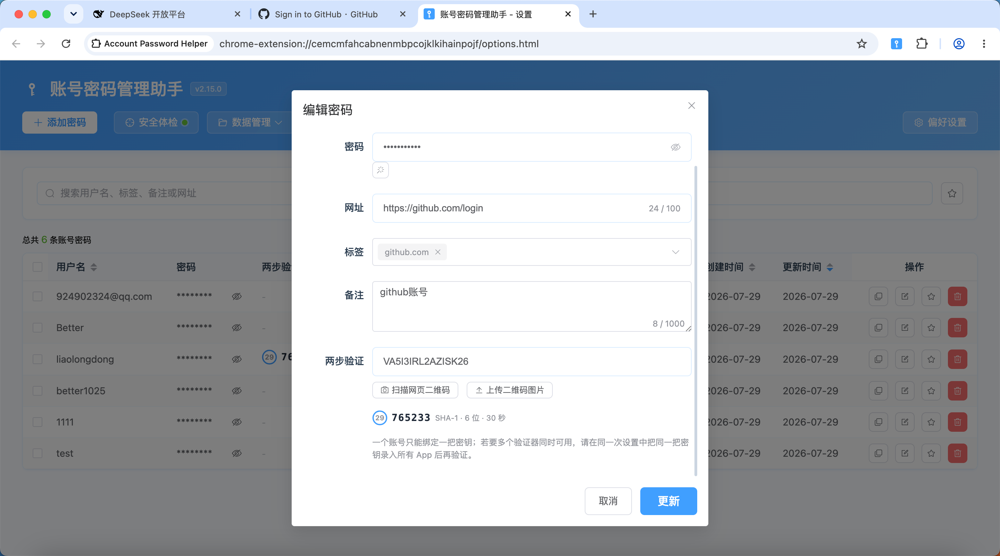
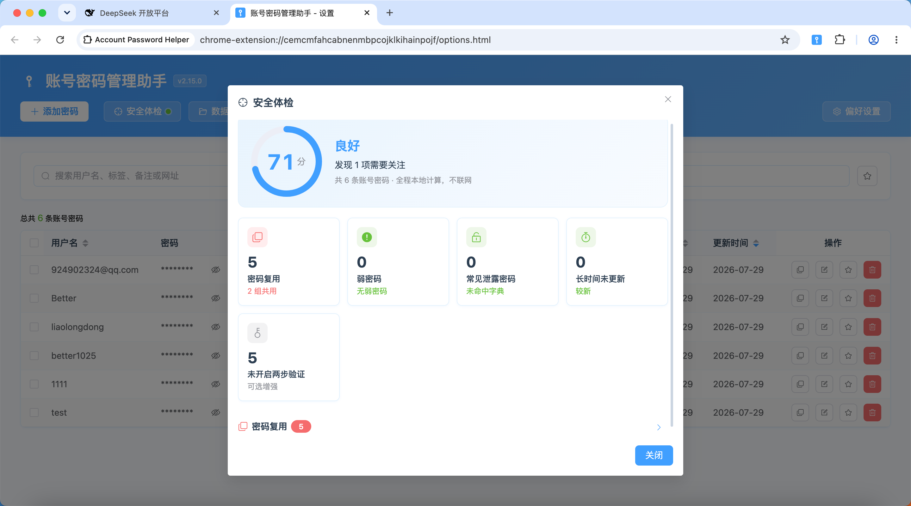
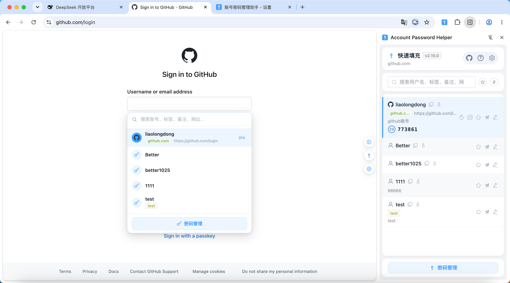
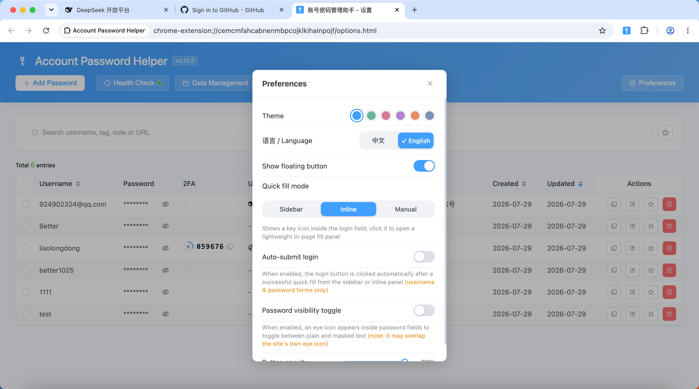

# Account Password Helper · 账号密码管理助手

[中文](./README.md) | **English**

[](https://wxt.dev/)
[](https://vuejs.org/)
[](https://www.typescriptlang.org/)
[](https://element-plus.org/)
[](https://developer.chrome.com/docs/extensions/mv3/intro/)
[](#license)
[](https://chromewebstore.google.com/detail/account-password-helper/fgimkdodpjfkddmildjieojpfakpanli)
[](https://chromewebstore.google.com/detail/account-password-helper/fgimkdodpjfkddmildjieojpfakpanli)
[](https://chromewebstore.google.com/detail/account-password-helper/fgimkdodpjfkddmildjieojpfakpanli)
[](https://github.com/liaolongdong/account-password-helper/releases/latest)

> **Local-first · Zero Network — The multi-environment credential manager built for developers & QA**

A local-first Chrome password manager built for developers & QA: exact-domain matching for multi-environment accounts, one-keystroke login (autofill + auto-tick consent + auto-click login), built-in TOTP 2FA and security audit. **PBKDF2 + AES-256-GCM** encryption with zero network transfer — passwords never leave your browser, no account needed.

> **Security notice**: Account Password Helper is built for development, testing and everyday sign-in scenarios. All data stays in your browser, encrypted with AES-256-GCM, and never leaves your machine over the network. For the safety of your assets, we recommend not storing highly sensitive credentials (banking, payment, etc.) in any browser extension.
>
> 🌐 **Live demo**: https://liaolongdong.github.io/account-password-helper/

<p align="center">
  
</p>

## 🖥️ Feature Showcase

<p align="center">
  
  <br/>
  <sub>Password list — smart search, tags, favorites, one-click dedupe</sub>
</p>

<p align="center">
  
  <br/>
  <sub>Side panel — pinyin/initials search with match highlighting, instant response</sub>
</p>

<p align="center">
  
  <br/>
  <sub>TOTP 2FA — verification codes alongside passwords, no phone authenticator needed</sub>
</p>

<p align="center">
  
  <br/>
  <sub>Security audit — five-dimension risk detection, all computed locally</sub>
</p>

<p align="center">
  
  <br/>
  <sub>Inline fill — key icon in the input field, click to fill</sub>
</p>

<p align="center">
  
  <br/>
  <sub>6 color themes + bilingual UI (中文 / English), instant switching</sub>
</p>

## ✨ Why Choose It

| Feature                                   | What sets it apart                                                                                                                                                        |
| ----------------------------------------- | ------------------------------------------------------------------------------------------------------------------------------------------------------------------------- |
| ⚡ **One-keystroke login, not just fill** | hotkey `Ctrl+Shift+F` does it all: fill → tick consent → click login. Other tools only fill the form — **you still have to click login yourself**                         |
| 🎯 **Multi-environment isolation**        | Exact-domain matching separates dev / test / staging / prod credentials — **same site, different environments, zero mix-ups**. A must-have for developers                 |
| 🔑 **Built-in TOTP + 2FA handoff**        | Verification codes live with your passwords; on GitHub-style two-step logins, the live code capsule auto-anchors beside the input — **no phone authenticator app needed** |
| 🔒 **Local AES-256-GCM, zero cloud**      | No cloud, no account, no subscription. Everything is encrypted in your browser — **even if the server were breached, your passwords stay safe**                           |
| 📊 **Offline security audit**             | One-click 0–100 score: weak / reused / leaked / stale / missing-2FA checks — **all computed offline**                                                                     |
| 📦 **One-click migration**                | Auto-detects exports from Chrome / LastPass / Bitwarden / 1Password; CSV & JSON — **move in in 30 seconds**                                                               |

## Core Features

### 🔐 Security

- **Native browser encryption**: Built on the Web Crypto API with PBKDF2 + AES-256-GCM; sensitive fields (username/password/URL/remark/TOTP) stored as ciphertext with zero network transfer
- **Flexible session control**: Validity from 1 hour to 7 days; auto idle lock, lock on browser restart, one-click lock in the popup; remaining time visible in the manager/sidebar/popup with color-coded warnings (amber → red); click the badge to renew
- **Offline health check**: One-click 0–100 score across 5 dimensions (weak / reused / leaked / stale / missing 2FA), all computed offline
- **TOTP 2FA**: Local code generation (RFC 6238) with live codes and countdowns in the list/sidebar; add secrets by scanning a webpage QR code or uploading an image; GitHub-style two-step login auto-anchors a live-code capsule for one-click fill

### ⚡ Smart Fill

- **Triple fill strategy**: Inline fill (key icon in the input, the default), side panel one-click fill, and quick-fill shortcut (`Ctrl+Shift+F` — fill + tick consent + click login); results reported via desktop notification + toolbar badge
- **Exact domain matching**: Only entries whose host exactly matches the current page are shown, keeping dev/test/staging/prod accounts apart; `localhost` matches everything by default
- **Auto-save credentials**: Chrome-style capture with save confirmation, smart dedup (identical credentials never re-prompt, changed passwords trigger an "Update" confirmation), domain allow/block lists, one-click "Never for this site"
- **Broad compatibility**: Dynamically detects login forms (including cross-iframe), compatible with React/Vue and other frameworks; covers username + password, phone + verification code, and more

### 📦 Data Management

- **Import/export**: CSV / JSON formats with auto-detection of Chrome, LastPass, Bitwarden, and 1Password exports; Chinese/English column mapping
- **Multiple backup options**: Encrypted backup (.aph) export/import with decrypt preview; email backup (plain or encrypted); scheduled backup reminders
- **Powerful organization**: Multi-select tags with filtering, favorites with configurable limit + LRU eviction, multi-field smart search (pinyin/initials with match highlighting), one-click dedup, batch delete/tag editing/export selected
- **Mistake-proofing**: 30-day trash bin (soft delete), configurable password change history (1–10 encrypted snapshots per entry, restorable), atomic master password change without data loss

### 🎨 Experience

- **Themes & language**: 6 color themes + bilingual UI (中文 / English), instant switching without refresh, synchronized across extension pages and injected in-page UI
- **Site favicons**: Password list, side panel and inline dropdown entries show the matching website icon (read from Chrome's local favicon cache, zero external requests); falls back to the default icon when unavailable
- **Password generator**: Random mode (length/charset/ambiguous-character exclusion) and passphrase mode (EFF Diceware, 2048-word list)
- **Instant open**: Side panel loads in about 20–50ms, instantly even after session expiry

> 🛠 Tech stack, architecture and project structure are covered in the [Contributing Guide](./docs/CONTRIBUTING.md).
>
> 📖 Per-feature implementation details (source paths, strategies, constraints) live in [docs/ARCHITECTURE.en.md — Feature Implementation Details](./docs/ARCHITECTURE.en.md#feature-implementation-details).

## Quick Start

### Install from the Chrome Web Store (recommended)

Visit the [Chrome Web Store page](https://chromewebstore.google.com/detail/account-password-helper/fgimkdodpjfkddmildjieojpfakpanli) and click "Add to Chrome". Updates are pushed automatically by the store.

### Download from GitHub Releases (if Google is unreachable)

If you cannot access the Chrome Web Store, download the latest zip from [GitHub Releases](https://github.com/liaolongdong/account-password-helper/releases/latest) and install manually:

1. Download and extract the zip to any directory (keep this directory — future updates overwrite it)
2. Open `chrome://extensions/` and enable "Developer mode"
3. Click "Load unpacked" and select the extracted directory
4. On first use, set a master password (at least 8 characters with letters + digits + special characters)

> 💡 Manually loaded extensions do not auto-update, but the extension checks GitHub Releases every 6 hours and shows an update notice in the popup. When notified, download the new package and overwrite the original installation directory.

### Build from Source (developers)

```bash
# Install dependencies
pnpm install

# Dev mode (HMR)
pnpm dev

# Production build
pnpm build

# Build and package as zip
pnpm postbuild
```

The build outputs to `.output/chrome-mv3/` — enable "Developer mode" at `chrome://extensions/` and "Load unpacked" from that directory.

> 📖 More dev commands and environment requirements in the [Contributing Guide](./docs/CONTRIBUTING.md).

### Updating

- **Chrome Web Store users**: updates are pushed automatically.
- **Manual installs (GitHub Releases / developers)**: simply **overwrite** the files in the original installation directory with the new package. **Never** load the extension from a different directory. Chrome extension local data (passwords, settings) lives in browser-internal storage keyed by the extension ID; overwriting files preserves it. Loading from a different path makes Chrome treat it as a fresh install and **your existing password data becomes inaccessible**.

> 💡 **Finding the current installation directory**: open `chrome://extensions/`, find the extension card, click "Details", and look for "Source: /path/to/your/directory" near the bottom. Overwrite the files in that path when updating.

## User Guide

1. **Initial setup**: click the extension icon to open the manager, set a master password, and choose a session validity (default 24 hours); "Preferences" configures themes, language, floating button, fill mode, and more
2. **Password management**: full CRUD on the options page, bulk import/export (exports require master password verification), multi-field smart search (pinyin/initials + match highlighting) and sorting, tags and favorites
3. **Quick fill**: inline fill by default — a key icon appears in a focused login field; click it to pick an account and fill instantly. Switch to "Sidebar" (auto-opens on focus) or "Manual" in Preferences, or use the shortcuts
4. **Shortcuts**: `Ctrl+Shift+P` (open manager), `Ctrl+Shift+L` (toggle side panel), `Ctrl+Shift+F` (quick fill), `Ctrl+Shift+K` (open the inline dropdown); all customizable at `chrome://extensions/shortcuts` (`Cmd` on Mac)

> 📖 Full walkthroughs and demos are on the [live demo page](https://liaolongdong.github.io/account-password-helper/) (bilingual FAQ included), or via the "Help" entry inside the side panel.

## FAQ

**Q: Will my passwords be uploaded to the cloud?**

A: No. The extension stores everything locally in your browser. Sensitive fields are encrypted with AES-256-GCM and never travel over the network.

**Q: What if I forget the master password?**

A: It cannot be recovered. You can only use "Reset" to wipe the data and start over. Back up regularly via data export or encrypted backup (.aph) to avoid data loss.

**Q: What happens when the session expires?**

A: All sensitive fields are automatically re-encrypted. Verify the master password again to restore access — no data is lost.

**Q: The side panel doesn't show?**

A: Confirm Chrome >= 114 and that the page has a login form; you can also click the extension icon (shortcut `Ctrl+Shift+L` / `Cmd+Shift+L`) or "Quick fill" on the floating button.

**Q: Filling doesn't work?**

A: Wait for the page to fully load and retry; the filler tries three strategies in turn (Native Setter / execCommand / simulated typing). If it still fails, refresh the page.

**Q: How do I customize shortcuts?**

A: Go to `chrome://extensions/shortcuts`, find "Account Password Helper", click the shortcut box next to a command, and press a new combination. The popup display syncs automatically.

**Q: Can I import from other password managers?**

A: Yes. Upload a CSV in the import dialog; Chrome, LastPass, Bitwarden, and 1Password formats are auto-detected and mapped.

**Q: Can I recover deleted passwords?**

A: Yes. Deleted passwords move to the trash for 30 days — restore or permanently delete them under "Data Management" → "Trash". Mistaken password edits can be reverted via the entry's "Password history".

**Q: How do I enable auto-save?**

A: Turn on the switch under "Auto-save Settings"; optionally configure domain rules (exact or regex). On login a confirmation card appears (Save / Not now / Never) with editable tag and remark.

**Q: How do I switch themes or the interface language?**

A: Open the preferences panel via the "Preferences" button on the management page, the floating button gear icon, or the side panel gear icon. Pick one of 6 themes or switch between 中文 / English — changes apply instantly without refresh.

**Q: Why is the first sidebar open on Windows slow?**

A: Windows Defender scans each extension file on first load, adding 1-2 seconds to cold starts. Add the Chrome extensions folder to Defender's exclusion list to skip scanning: open "Windows Security" → "Virus & threat protection" → "Manage settings" → "Exclusions" → "Add an exclusion" → select "Folder" → paste `%LOCALAPPDATA%\Google\Chrome\User Data\Default\Extensions`. This cuts cold-start time from 2-3s to under 1s. Not needed on Mac.

> 📖 More questions (TOTP usage & troubleshooting, email backup, encrypted backup, clipboard clearing, favorites limit, performance, etc.) are covered in the full FAQ on the [live demo page](https://liaolongdong.github.io/account-password-helper/) and the per-feature notes in [docs/ARCHITECTURE.en.md](./docs/ARCHITECTURE.en.md).

## Try It Now

🔗 [Install from Chrome Web Store](https://chromewebstore.google.com/detail/account-password-helper/fgimkdodpjfkddmildjieojpfakpanli) · [Download from GitHub Releases](https://github.com/liaolongdong/account-password-helper/releases/latest) · [Live Demo](https://liaolongdong.github.io/account-password-helper/)

If this project helps you, please give it a ⭐️ and leave a review on the Chrome Web Store — it means the world to an independent developer!

Issues and pull requests are welcome! Full changelog at [CHANGELOG.md](./CHANGELOG.md).

## Security Notes

- Account Password Helper is built for development, testing and everyday sign-in scenarios. We recommend not storing highly sensitive credentials (banking, payment, etc.) in any browser extension;
- A forgotten master password **cannot be recovered** — keep it safe;
- All data is stored locally with AES-256-GCM encryption and zero network transfer;
- Back up regularly via encrypted backup (.aph files);
- Enable clipboard auto-clear and auto idle lock; for higher security, enable "Lock on browser restart".

## License

This project is released under the GNU GPL-3.0 (version 3 only, not "or any later version").

- Free to use, modify and distribute (including commercially), but **derivative works must be open-sourced under GPL-3.0**; closed-source redistribution is not permitted.
- The name "Account Password Helper", its logos and brand assets are trademarks of the author and are NOT covered by the license. See [THIRD-PARTY-NOTICES.md](./docs/THIRD-PARTY-NOTICES.md).
- This project bundles third-party dependencies (including jsQR under Apache-2.0); attribution is provided in [THIRD-PARTY-NOTICES.md](./docs/THIRD-PARTY-NOTICES.md).
- Previously released versions remain under the MIT license they were published with; GPL-3.0 applies from the first version after the switch.

## Contact

Email: [924902324@qq.com](mailto:924902324@qq.com?subject=Account%20Password%20Helper%20Feedback)

**WeChat group**: scan the QR code below to add the author on WeChat (ID: `lld_1025`) with the note "aph" to get invited into the plugin user group for feedback and discussion.


