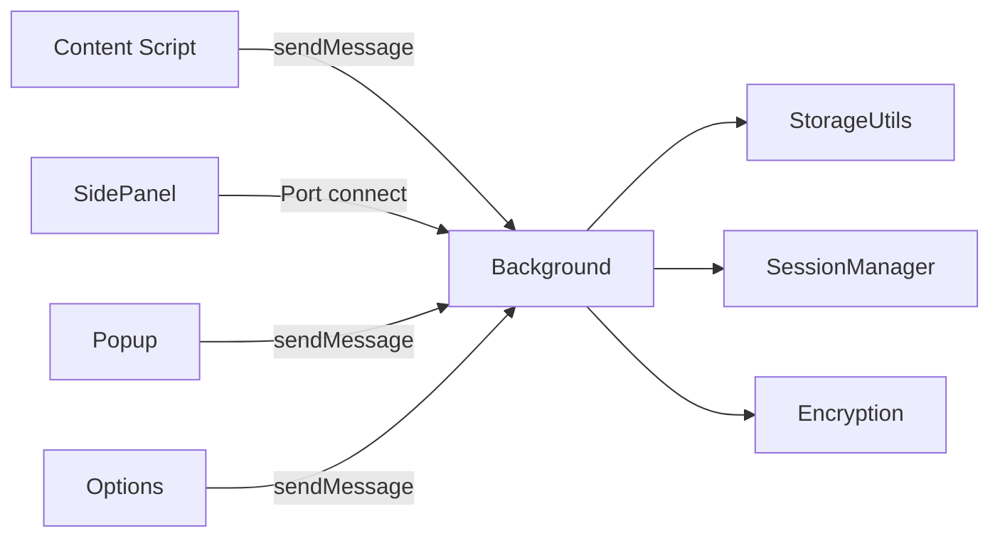

# Account Password Helper · 账号密码管理助手

[中文](./README.md) | **English**

[](https://wxt.dev/)
[](https://vuejs.org/)
[](https://www.typescriptlang.org/)
[](https://element-plus.org/)
[](https://developer.chrome.com/docs/extensions/mv3/intro/)
[](#license)
[](https://chromewebstore.google.com/detail/account-password-helper/fgimkdodpjfkddmildjieojpfakpanli)
[](https://github.com/liaolongdong/account-password-helper/releases/latest)

A powerful Chrome extension for secure, convenient password management and auto-fill. Built on a **PBKDF2 + AES-256-GCM** encryption scheme with zero network transfer — passwords never leave your browser.

> **Disclaimer**: All data is stored locally (sensitive fields encrypted). This extension is intended for development, testing, and ordinary production logins only. **Never store work or personal sensitive passwords (banking, payment, or core social accounts).** You bear full responsibility for any password leakage!
>
> 🌐 **Live demo**: https://liaolongdong.github.io/account-password-helper/

<p align="center">
  
</p>

## Screenshots

<p align="center">
  
  
  
</p>

<p align="center">
  <sub>Password list management · Side panel quick fill · Floating button shortcut</sub>
</p>

## Core Features

### 🔐 Security

- **Strong encryption**: PBKDF2 (600,000 iterations) derives a 256-bit key + AES-256-GCM with random IV; sensitive fields (username/password/URL/remark/TOTP) stored as ciphertext; built on the native Web Crypto API with zero network transfer
- **Session control**: validity from 1 hour to 7 days; auto idle lock (5–60 minutes), lock on browser restart, one-click lock in the popup; sensitive fields re-encrypt automatically on expiry
- **Health check**: one-click scan producing a 0–100 score; detects weak, reused, commonly leaked (offline dictionary), long-unchanged passwords and missing 2FA; expiry reminders supported
- **Safety details**: clipboard auto-clear (10–120s), password strength visualization, local TOTP code generation (RFC 6238, fully offline)

### ⚡ Smart Fill

- **Form detection**: MutationObserver dynamically detects login forms (including cross-iframe), covering username + password, phone + verification code, and more
- **Multiple fill modes**: side panel one-click fill, inline fill (key-icon mini panel inside the field, open directly with `Ctrl+Shift+K`), quick-fill shortcut (`Ctrl+Shift+F`); triple fill strategy compatible with React/Vue and other frameworks; optional auto login trigger
- **Exact domain matching**: only entries whose host exactly matches the current page are shown, keeping multi-environment accounts apart; `localhost` matches everything by default
- **Auto-save credentials**: Chrome-style capture with save confirmation, smart dedup (identical credentials never re-prompt, changed passwords trigger an "Update" confirmation), domain allow/block lists, one-click "Never for this site"

### 📦 Data Management

- **Import/export**: CSV / JSON formats with auto-detection of Chrome, LastPass, Bitwarden, and 1Password exports; Chinese/English column mapping
- **Backup**: encrypted backup (.aph, AES-GCM) export/import with decrypt-preview; email backup (plain or encrypted) + scheduled backup reminders
- **Organization**: multi-select tags (stable colors), favorites with configurable limit + LRU eviction, multi-field search and sorting, one-click dedup, batch delete
- **Mistake-proofing**: 30-day trash bin (soft delete), password change history (5 encrypted snapshots per entry), atomic master password change without data loss

### 🎨 Experience

- **Themes & language**: 6 color themes + bilingual UI (中文 / English), instant switching without refresh, synchronized across extension pages and injected in-page UI
- **Password generator**: random mode (length/charset/ambiguous-character exclusion) and passphrase mode (EFF Diceware, 2048-word list)
- **Style isolation**: floating button and inline panel use closed Shadow DOM, fully isolated from page styles
- **Update detection**: checks GitHub Releases every 6 hours and shows an update notice in the popup

> 📖 Per-feature implementation details (source paths, strategies, constraints) live in [docs/ARCHITECTURE.en.md — Feature Implementation Details](./docs/ARCHITECTURE.en.md#feature-implementation-details).

## Tech Stack

| Category     | Technology                                                                        | Version / Notes                             |
| ------------ | --------------------------------------------------------------------------------- | ------------------------------------------- |
| Framework    | [WXT](https://wxt.dev/)                                                           | v0.20.25, Manifest V3                       |
| Frontend     | [Vue 3](https://vuejs.org/) + TypeScript                                          | v3.5.33, Composition API + `<script setup>` |
| UI library   | [Element Plus](https://element-plus.org/)                                         | v2.13.7, on-demand (unplugin-auto-import)   |
| Encryption   | [Web Crypto API](https://developer.mozilla.org/en-US/docs/Web/API/Web_Crypto_API) | PBKDF2 + AES-256-GCM + SHA-256, native      |
| Build        | Vite                                                                              | Bundled with WXT, HMR                       |
| Code quality | ESLint + Prettier + Stylelint                                                     | TS v6, full quality toolchain               |

## Quick Start

### Requirements

- Node.js >= 22 (rolldown depends on `node:util.styleText`)
- Chrome >= 114 (SidePanel API; >= 129 for `sidePanel.close`)

### Install from the Chrome Web Store (recommended)

Visit the [Chrome Web Store page](https://chromewebstore.google.com/detail/account-password-helper/fgimkdodpjfkddmildjieojpfakpanli) and click "Add to Chrome". Updates are pushed automatically by the store.

### Download from GitHub Releases (if Google is unreachable)

If you cannot access the Chrome Web Store, download the latest zip from [GitHub Releases](https://github.com/liaolongdong/account-password-helper/releases/latest) and install manually:

1. Download and extract the zip to any directory (keep this directory — future updates overwrite it)
2. Open `chrome://extensions/` and enable "Developer mode"
3. Click "Load unpacked" and select the extracted directory
4. On first use, set a master password (at least 8 characters with letters + digits + special characters)

> 💡 Manually loaded extensions do not auto-update, but the extension checks GitHub Releases every 6 hours and shows an update notice in the popup. When notified, download the new package and overwrite the original installation directory (see "Updating" below).

### Build from Source (developers)

```bash
# Install dependencies
pnpm install

# Dev mode (HMR)
pnpm dev

# Production build (runs prebuild → generates PNG icons)
pnpm build

# Build and package as zip
pnpm postbuild

# Firefox support
pnpm dev:firefox
pnpm build:firefox
```

The build outputs to `.output/chrome-mv3/` — enable "Developer mode" at `chrome://extensions/` and "Load unpacked" from that directory.

### Updating

- **Chrome Web Store users**: updates are pushed automatically.
- **Manual installs (GitHub Releases / developers)**: simply **overwrite** the files in the original installation directory with the new package. **Never** load the extension from a different directory. Chrome extension local data (passwords, settings) lives in browser-internal storage keyed by the extension ID; overwriting files preserves it. Loading from a different path makes Chrome treat it as a fresh install and **your existing password data becomes inaccessible**.

> 💡 **Finding the current installation directory**: open `chrome://extensions/`, find the extension card, click "Details", and look for "Source: /path/to/your/directory" near the bottom. Overwrite the files in that path when updating.

## User Guide

1. **Initial setup**: click the extension icon to open the manager, set a master password, and choose a session validity (default 24 hours); "Preferences" configures themes, language, floating button, fill mode, and more
2. **Password management**: full CRUD on the options page, bulk import/export (exports require master password verification), multi-field search/sort, tags and favorites
3. **Quick fill**: the side panel opens automatically when a login field gains focus (when enabled); click an entry to fill — or use inline fill / the shortcut
4. **Shortcuts**: `Ctrl+Shift+P` (open manager), `Ctrl+Shift+L` (toggle side panel), `Ctrl+Shift+F` (quick fill), `Ctrl+Shift+K` (open the inline dropdown, same as clicking the key icon); all customizable at `chrome://extensions/shortcuts` (`Cmd` on Mac)

> 📖 Full walkthroughs and demos are on the [live demo page](https://liaolongdong.github.io/account-password-helper/) (bilingual FAQ included), or via the "Help" entry inside the side panel.

### CSV / JSON Field Formats

| Chinese column      | English column          | Required | Notes               |
| ------------------- | ----------------------- | -------- | ------------------- |
| 用户名 / 账号       | username / Username     | Yes      | Account/email/phone |
| 密码                | password / Password     | No       | Login password      |
| URL / 网址 / 链接   | url                     | No       | Site address        |
| 标签 / 分类         | tag / Tag               | No       | Category tag        |
| 备注 / 说明         | remark / Remark         | No       | Notes               |
| 创建时间            | createTime / CreateTime | No       | Auto-filled         |
| 更新时间 / 修改时间 | updateTime / modifyTime | No       | Auto-filled         |

> "Download Template" produces a standard CSV (BOM UTF-8, opens directly in Excel / Numbers); headers follow the interface language and both header languages are auto-detected on import. JSON exports use the `{ version, exportedAt, count, entries }` wrapper; imports also accept a flat array. Export filenames follow `passwords_YYYYMMDD_HHmmss.csv/.json`.

## Architecture Overview

| Entrypoint         | Responsibility                                                               |
| ------------------ | ---------------------------------------------------------------------------- |
| **Background**     | Service worker: message routing, password cache, side panel state, shortcuts |
| **Content Script** | Injected into all pages; initializes form detection and the floating button  |
| **Popup**          | Extension icon popup with "Manage Passwords" and "Quick Fill" entries        |
| **Options**        | Main manager page: full CRUD, import/export, session/validity management     |
| **SidePanel**      | Quick fill panel with search, sorting, domain matching, cache acceleration   |



Encryption core:

```
Master password + salt → PBKDF2 (600,000 iterations) → 256-bit key
Plaintext + key + random IV → AES-256-GCM → Base64(IV + ciphertext)
```

> 📖 The full architecture design (session lifecycle, encryption details, messaging notes) and the fully annotated project structure tree live in [docs/ARCHITECTURE.en.md](./docs/ARCHITECTURE.en.md).

## Project Structure

```
├── entrypoints/        # WXT entrypoints: background/, content/, popup/, options/, sidepanel/
├── components/         # Vue components (options/ and sidepanel/ subfolders)
├── composables/        # Vue composables (auth, session, side panel, TOTP, shortcuts...)
├── utils/              # Core library: storage/, i18n/, encryption, session, backup, health...
├── assets/             # Source SVG icons and CSS design tokens
├── public/icon/        # Build-time PNG icons (auto-injected into the manifest by WXT)
├── scripts/            # Icon generation and repo automation scripts
└── wxt.config.ts       # WXT configuration
```

> 📖 See [docs/ARCHITECTURE.en.md — Project Structure](./docs/ARCHITECTURE.en.md#project-structure) for the fully annotated tree.

## Development

### Common Commands

| Command                              | Description                                              |
| ------------------------------------ | -------------------------------------------------------- |
| `pnpm dev`                           | Dev mode (HMR)                                           |
| `pnpm build` / `pnpm postbuild`      | Production build / package the build as a zip            |
| `pnpm icons:build`                   | Render the SVG icon to multi-size PNGs                   |
| `pnpm analyze`                       | Build with bundle size visualization (`dist/stats.html`) |
| `pnpm dev:firefox` / `build:firefox` | Firefox support                                          |
| `pnpm typecheck`                     | TypeScript type checking                                 |
| `pnpm lint:all` / `pnpm fix:all`     | Run all checks / all auto-fixes                          |

> 📖 Icon workflow, test page, and performance design details live in [docs/ARCHITECTURE.en.md — Development Extras](./docs/ARCHITECTURE.en.md#development-extras); contribution workflow in [CONTRIBUTING.md](./CONTRIBUTING.md).

### Chrome Permissions

| Permission       | Purpose                                                  |
| ---------------- | -------------------------------------------------------- |
| `storage`        | Local storage of password data and settings              |
| `activeTab`      | Current tab info for domain matching                     |
| `scripting`      | Dynamic content script injection                         |
| `sidePanel`      | Side panel quick fill                                    |
| `alarms`         | Scheduled backup reminders and service worker keep-alive |
| `notifications`  | Desktop notifications (auto-save / backup / updates)     |
| `idle`           | Auto idle lock detection                                 |
| `clipboardWrite` | Writing to the clipboard (copy password)                 |
| `clipboardRead`  | Reading the clipboard (verify before clearing)           |
| `webNavigation`  | Cross-iframe form detection and filling                  |
| `<all_urls>`     | Content script matches all pages                         |

## Security Notes

- This extension is for development, testing, and ordinary production logins only. **Never store work or personal sensitive passwords (banking, payment, or core social accounts)**;
- A forgotten master password **cannot be recovered** — keep it safe;
- All data is stored locally with AES-256-GCM encryption and zero network transfer;
- Back up regularly via encrypted backup (.aph files);
- Enable clipboard auto-clear and auto idle lock; for higher security, enable "Lock on browser restart".

## FAQ

**Q: Will my passwords be uploaded to the cloud?**

A: No. The extension stores everything locally in your browser. Sensitive fields are encrypted with AES-256-GCM and never travel over the network.

**Q: What if I forget the master password?**

A: It cannot be recovered. You can only use "Reset" to wipe the data and start over. Back up regularly via data export or encrypted backup (.aph) to avoid data loss.

**Q: What happens when the session expires?**

A: All sensitive fields are automatically re-encrypted. Verify the master password again to restore access — no data is lost.

**Q: The side panel doesn't show?**

A: Confirm Chrome >= 114 and that the page has a login form; you can also click the extension icon (shortcut `Ctrl+Shift+L` / `Cmd+Shift+L`) or "Quick fill" on the floating button.

**Q: Filling doesn't work?**

A: Wait for the page to fully load and retry; the filler tries three strategies in turn (Native Setter / execCommand / simulated typing). If it still fails, refresh the page.

**Q: How do I customize shortcuts?**

A: Go to `chrome://extensions/shortcuts`, find "Account Password Helper", click the shortcut box next to a command, and press a new combination. The popup display syncs automatically.

**Q: Can I import from other password managers?**

A: Yes. Upload a CSV in the import dialog; Chrome, LastPass, Bitwarden, and 1Password formats are auto-detected and mapped.

**Q: Can I recover deleted passwords?**

A: Yes. Deleted passwords move to the trash for 30 days — restore or permanently delete them under "Data Management" → "Trash". Mistaken password edits can be reverted via the entry's "Password history" (last 5 encrypted snapshots).

**Q: How do I enable auto-save?**

A: Turn on the switch under "Auto-save Settings"; optionally configure domain rules (exact or regex). On login a confirmation card appears (Save / Not now / Never) with editable tag and remark. Saved identical credentials never re-prompt; changed passwords trigger an "Update" confirmation.

**Q: How do I switch themes or the interface language?**

A: Open the preferences panel via the "Preferences" button on the management page, the floating button gear icon, or the side panel gear icon. Pick one of 6 themes or switch between 中文 / English — changes apply instantly without refresh.

> 📖 More questions (TOTP usage & troubleshooting, email backup, encrypted backup, clipboard clearing, favorites limit, performance, etc.) are covered in the full FAQ on the [live demo page](https://liaolongdong.github.io/account-password-helper/) and the per-feature notes in [docs/ARCHITECTURE.en.md](./docs/ARCHITECTURE.en.md).

## License

This project is released under the MIT License.

## Acknowledgements

- [WXT](https://wxt.dev/) — modern Chrome extension framework
- [Vue 3](https://vuejs.org/) — the progressive JavaScript framework
- [Element Plus](https://element-plus.org/) — Vue 3 UI library
- [Web Crypto API](https://developer.mozilla.org/en-US/docs/Web/API/Web_Crypto_API) — native browser cryptography
- [sharp](https://github.com/lovell/sharp) — high-performance image processing

## Contact

Email: [924902324@qq.com](mailto:924902324@qq.com?subject=Account%20Password%20Helper%20Feedback)

**WeChat group**: scan the QR code below to add the author on WeChat (ID: `lld_1025`) with the note "aph" to get invited into the plugin user group for feedback and discussion.


If this project helps you, please give it a ⭐️ — thank you!

Issues and pull requests are welcome!
