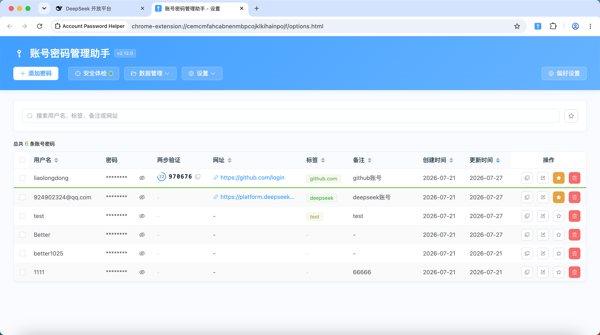
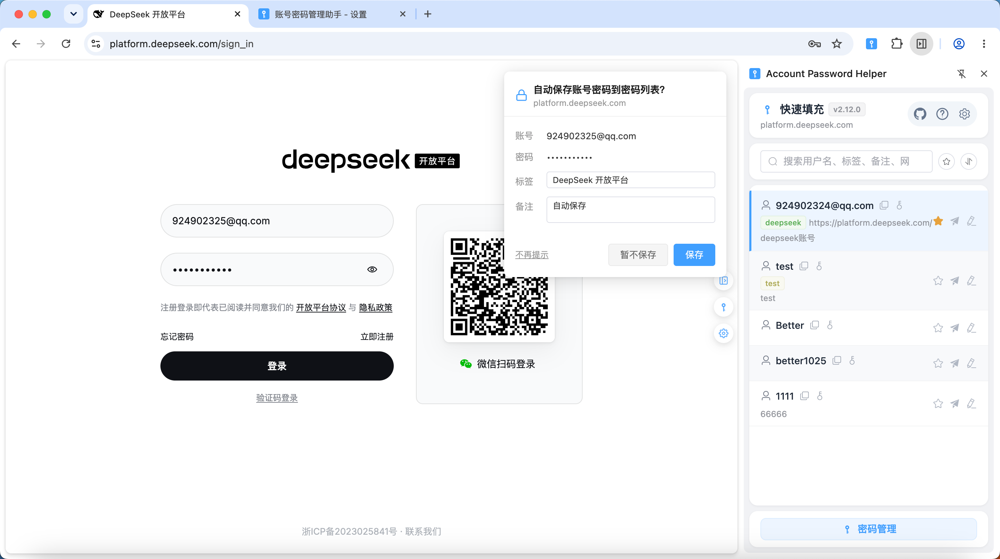
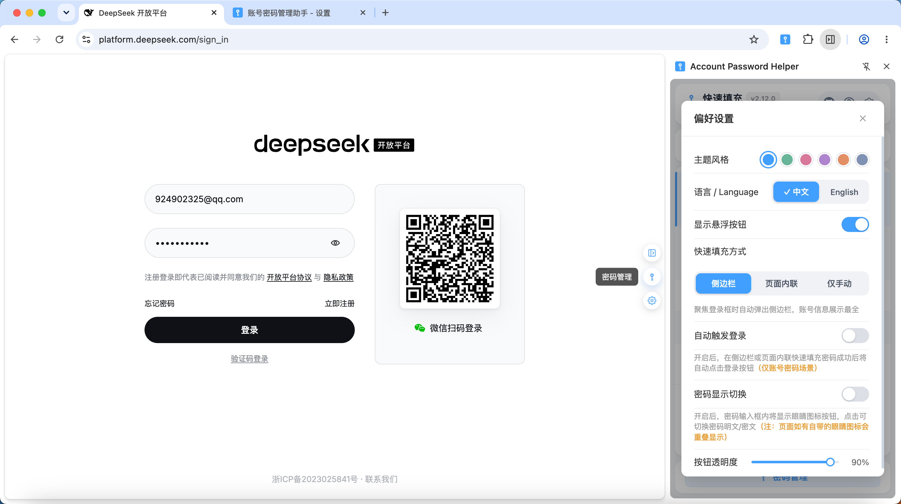
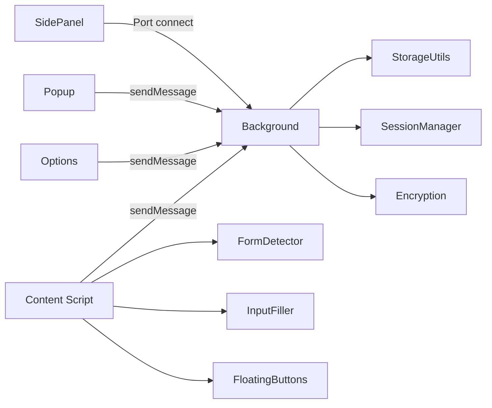
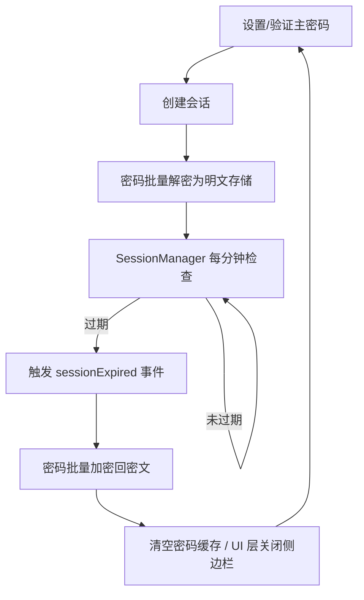

# Account Password Helper · 账号密码管理助手

[](https://wxt.dev/)
[](https://vuejs.org/)
[](https://www.typescriptlang.org/)
[](https://element-plus.org/)
[](https://developer.chrome.com/docs/extensions/mv3/intro/)
[](#许可证)
[](https://chromewebstore.google.com/detail/account-password-helper/fgimkdodpjfkddmildjieojpfakpanli)
[](https://github.com/liaolongdong/account-password-helper/releases/latest)

一款功能强大的 Chrome 浏览器扩展，提供安全、便捷的账号密码管理与自动填充能力。采用 **PBKDF2 + AES-256-GCM** 加密体系，零网络传输，密码绝不出浏览器，支持登录表单智能识别、多策略自动填充、一键自动登录、自动保存账号密码、批量导入导出、加密备份、密码可见性切换、闲时锁定、TOTP两步验证码、密码强度检测、密码生成器等功能。

> **免责声明**：本插件的所有数据均保存在本地（敏感信息加密保存），仅用于开发、测试和普通生产环境登录使用，**严禁保存办公或个人敏感密码（如银行、支付、社交核心密码）**，如发生密码泄露，后果自负！
>
> 🌐 **在线演示**: https://liaolongdong.github.io/account-password-helper/

<p align="center">
  
</p>

## 界面预览

<p align="center">
  
  
  
</p>

<p align="center">
  <sub>密码列表管理 · 侧边栏快速填充 · 悬浮按钮快捷入口</sub>
</p>

## 核心特性

- **加密安全**：PBKDF2（600000 次迭代）派生 256-bit 密钥 + AES-256-GCM 随机 IV；主密码 SHA-256 + 盐值存储；敏感字段（username/password/url/remark/totp）加密。基于 Web Crypto API 原生实现。
- **智能识别**：MutationObserver 动态检测登录表单，支持用户名+密码、手机号+验证码等多种场景；支持跨 iframe 表单检测与填充；LoginFormAnalyzer 通过表单/容器/弹窗/按钮多维启发式判断。
- **一键填充**：侧边栏点击即填充，三重策略（Native Setter / execCommand / 模拟输入）兼容 React/Vue 等主流框架；可选自动触发登录。
- **自动保存**：Chrome 式登录凭证捕获，支持登录表单提交、按钮点击、回车提交三种场景；域名白名单/黑名单精准匹配；凭证指纹智能去重避免重复弹窗；「不再提示」一键屏蔽域名；跨页面导航凭证不丢失；保存弹窗中可编辑标签和备注。
- **数据管理**：CSV 导入导出（.csv），支持多格式 CSV 自动识别，导出文件名格式为 `passwords_YYYYMMDD_HHmmss.csv`；JSON 导入导出（.json），导出文件名格式为 `passwords_YYYYMMDD_HHmmss.json`；中英文列名映射；标签多选（每条最多 3 个，单个最长 30 字符）+ 自定义 + 颜色一致；收藏标记与「只看收藏」过滤；一键去重；多字段搜索与排序；复制密码条目；批量删除。
- **邮箱备份**：导出数据并唤起邮件客户端，支持选择「不加密备份」或「加密备份」（.aph 格式，需验证主密码才能导入）；支持定时自动备份提醒（chrome.alarms），间隔可选每天/3天/每周/两周/每月。
- **密码可见性切换**：自动为页面密码框注入显示/隐藏按钮，输入有值时按钮自动可见（默认关闭，需在设置中手动开启）。
- **加密备份**：.aph 格式 AES-GCM 加密导出/导入（PBKDF2 600000 次迭代派生密钥）；导入时支持解密预览后再确认，安全可靠。
- **密码强度可视化**：密码输入时实时显示强度进度条（弱/中/强）与规则校验清单（长度、字母、数字、特殊字符），通过气泡弹窗直观呈现。
- **安全体检仪表盘**：一键扫描全部密码，生成综合安全评分（0~100）与等级（优秀/良好/一般/较差）；检测弱密码、密码复用（多账号共用同一密码）、长时间未更新（90/180/365 天分级预警）及未开启两步验证条目；全程本地计算，零网络传输；支持点击「去处理」直接跳转编辑。
- **会话可控**：1/2/4/8/12/24 小时和3/5/7天会话有效期；会话失效后敏感字段自动加密回密文；支持自动闲置锁定（5/10/30/60分钟）；支持浏览器重启锁定（关闭浏览器后需重新验证主密码）；Popup 一键锁定；会话过期跨上下文广播同步。
- **版本更新检测**：基于 GitHub Releases API，每 6 小时自动检测最新版本；发现更新时在 Popup 弹窗中展示版本号和更新说明，点击即可跳转下载页面。
- **Shadow DOM 隔离**：悬浮按钮使用 Closed Shadow DOM，完全隔离页面样式。
- **随机密码生成**：添加/编辑密码时通过魔棒按钮一键生成随机密码，基于 Web Crypto API 保证密码学安全；支持自定义长度（6~50）和字符集（大写/小写/数字/特殊字符），可排除易混淆字符（1/l/I/0/O），生成后实时显示强度进度条。
- **剪贴板自动清除**：复制密码后自动定时清除剪贴板内容，延时可选 10/15/30/60/120 秒；复制用户名时自动取消密码清除定时器；失焦场景采用「尽力清除」策略确保密码安全；配置入口在密码管理页「剪贴板设置」中。
- **收藏上限与LRU淘汰**：收藏上限可配置（1~50 条，默认 10 条）；超过上限时新收藏自动淘汰最近最少使用（LRU）的已收藏条目，确保常用账号始终置顶；侧边栏填充密码时自动更新收藏使用时间戳。
- **主题换肤**：6 款精心调配的色彩主题——晴空蓝（默认）、青竹绿、桃花粉、樱粉紫、落霞橙、雾墨灰；通过 CSS Design Tokens 实现全局一致性换肤，扩展页面与内容脚本 Shadow DOM 组件同步生效，切换即时生效无需刷新。
- **内联填充**：除侧边栏外的另一种快捷填充方式——登录输入框获焦后右侧显示钥匙图标，点击展开迷你面板（搜索+账号列表+密码管理入口），支持键盘导航（↑↓ 浏览、Enter 填充、Esc 关闭）；使用 Closed Shadow DOM 完全隔离页面样式。
- **两步验证（TOTP）**：为账号存储 TOTP 密钥（`otpauth://` 链接或 Base32 密钥），基于 Web Crypto HMAC 在本地按 RFC 6238 生成滚动动态码，支持列表/侧边栏实时展示、一键填充与复制；纯本地计算，零网络传输。
- **零网络传输**：所有数据存储在 Chrome Local Storage，不走任何网络。

## 功能速览

### 1. 安全保护

- 主密码至少 8 位，必须包含字母、数字和特殊字符。
- 会话创建后，密码从密文解密为明文缓存；会话失效时自动加密回密文。
- 会话恢复后自动检测并修复加密状态不一致的数据。
- SessionManager 每分钟检查会话有效性，页面可见性变化时也会触发检查。

### 2. 表单识别与填充

- 识别用户名、密码、手机号、验证码字段；自动勾选"记住密码"、"同意条款"等复选框。
- WeakMap / WeakSet 缓存字段判断结果，避免内存泄漏。
- 填充策略自动降级：**Native Setter → execCommand → 模拟键盘事件**。
- 悬浮按钮可配置「自动触发登录」开关：填充完成后自动点击表单内的登录按钮（见 [SettingsPanel.ts](./entrypoints/content/floatingButtons/SettingsPanel.ts) / [FormDetector.ts](./entrypoints/content/FormDetector.ts)）。

### 3. 数据管理

- CSV 导入导出（.csv），提供标准模板下载。
- JSON 导入导出：支持密码数据的 JSON 格式导出（需验证主密码），导出文件名格式为 `passwords_YYYYMMDD_HHmmss.json`；也支持从 JSON 文件导入。
- 标签下拉多选 + 自定义新增（每条最多 3 个，单个最长 30 字符）；相同标签颜色稳定一致（见 [utils/tagUtils.ts](./utils/tagUtils.ts)）。
- 密码列表默认按更新时间倒序；侧边栏默认按最近使用倒序。支持按用户名、URL、标签、备注、创建/更新时间切换排序。
- 支持用户名、标签、备注、URL 的多字段模糊搜索。
- 批量选择与批量删除密码条目。
- 收藏标记：点击星标收藏常用条目，支持「只看收藏」过滤；收藏上限默认可配置（1~50 条），超限时 LRU 自动淘汰最早使用的收藏条目；侧边栏填充时自动更新收藏使用时间戳确保 LRU 准确。
- 一键去重：智能检测重复条目（相同用户名 + 相同 URL）并提供一键清理。
- 多格式 CSV 导入：自动识别 Chrome、LastPass、Bitwarden、1Password 的导出格式（见 [utils/excel.ts](./utils/excel.ts)）。

### 4. 自动保存登录凭证

- 启用后，网站登录时自动捕获账号密码并弹窗确认是否保存（见 [LoginAutoSave.ts](./entrypoints/content/LoginAutoSave.ts)）。
- 三种凭证捕获场景：表单提交（capture 阶段）、登录按钮点击、密码框回车提交。
- 域名匹配规则支持精确域名和正则表达式两种模式，规则为空时匹配所有域名（见 [AutoSaveSettingDialog.vue](./components/options/AutoSaveSettingDialog.vue)）。
- sessionStorage 暂存凭证，支持传统表单提交导致的跨页面导航场景。
- 保存成功后发送桌面通知，并使密码缓存失效以确保下次加载获取最新数据。
- **三选项交互**：保存确认弹窗提供「保存」、「暂不保存」和「不再提示」三个操作选项。
- **可编辑字段**：弹窗中除显示账号和密码外，还提供可编辑的**标签**（默认取页面标题）和**备注**（默认为"自动保存"）输入框，用户可在保存前自定义。
- **智能更新策略**：同账号 + 同域名时更新已有条目的密码，保留存量标签和备注（除非用户在弹窗中主动修改）；不同账号则新增条目。
- **黑名单屏蔽**：保存弹窗中点击「不再提示」可将当前域名加入屏蔽列表（见 [SavePasswordPrompt.ts](./entrypoints/content/SavePasswordPrompt.ts)）；该域名下所有登录均不再弹窗。可在设置对话框的「已屏蔽的域名」中删除以恢复提示。
- **智能防重复**：基于凭证指纹（用户名 + 密码长度）的去重策略（见 [LoginAutoSave.ts](./entrypoints/content/LoginAutoSave.ts)）：已保存的凭证永不重复弹窗；相同凭证 60 秒冷却期内不重复弹窗（避免重试登录时反复打扰）；不同凭证或冷却期过后重新弹窗。

### 5. 邮箱备份

- 导出密码列表为数据文件并唤起邮件客户端（见 [utils/emailBackup.ts](./utils/emailBackup.ts)）。
- 支持选择备份方式：「不加密备份」导出标准数据文件；「加密备份」导出 .aph 加密文件（只能通过本插件的「加密备份导入」功能 + 原主密码解密查看）。
- 支持配置自动备份提醒，通过 chrome.alarms 定时发送桌面通知（不解密、不自动下载文件）。
- 备份间隔可选：每天 / 每3天 / 每周 / 每两周 / 每月。

### 6. 加密备份导入导出

- 导出：使用主密码通过 AES-GCM 加密全部密码数据，下载为 `.aph` 文件（见 [utils/backupExport.ts](./utils/backupExport.ts)），文件名格式为 `backup_YYYYMMDD.aph`。
- 导入：上传 `.aph` 文件后输入导出时使用的主密码进行解密，解密后可预览数据（前 5 条）再确认导入（见 [BackupImportDialog.vue](./components/options/BackupImportDialog.vue)）。
- 加密方案：PBKDF2（600000 次迭代）+ AES-256-GCM + 随机 Salt + 随机 IV，安全性高于常规存储。

### 7. 密码可见性切换

- 自动为页面中的密码输入框注入显示/隐藏切换按钮（见 [PasswordVisibilityToggle.ts](./entrypoints/content/PasswordVisibilityToggle.ts)），默认关闭，需在悬浮按钮设置面板中手动开启。
- 对所有密码输入框统一注入切换按钮，使用 Element Plus 主题蓝色，输入有值时按钮自动可见。
- MutationObserver 监听动态新增的密码输入框，自动注入。
- 可在悬浮按钮设置面板中开关此功能。

### 8. 自动闲置锁定与浏览器重启锁定

- 在密码管理页「自动锁定设置」中配置闲置时间（5/10/30/60 分钟或不锁定），系统闲置超过设定时间后自动清除主密码会话并锁定密码管理（见 [IdleLockSetting.vue](./components/options/IdleLockSetting.vue)）。
- 锁定后需重新验证主密码才能恢复访问，与手动锁定和会话过期行为一致。
- **浏览器重启锁定**：在「自动锁定设置」中可开启「浏览器重启锁定」开关。开启后，完全关闭并重新打开浏览器时需重新输入主密码（更安全）；关闭则在有效期内自动保持登录，无需重复输入。
- Popup 弹窗也提供一键「锁定」按钮，可快速清除当前会话。

### 9. 密码强度可视化

- 在主密码设置和密码表单中，密码输入时通过气泡弹窗实时展示强度等级（弱/中/强）和进度条（见 [PasswordStrengthPopover.vue](./components/options/PasswordStrengthPopover.vue)）。
- 逐条校验密码规则：至少 8 字符、包含字母、包含数字、包含特殊字符，通过/未通过状态一目了然。
- 基于 [usePasswordStrength](./composables/usePasswordStrength.ts) Composable 实现，可在多处复用。

### 10. 安全体检仪表盘

- 在密码管理页顶部操作栏点击「安全体检」按钮（带健康信号灯圆点），打开安全体检仪表盘弹窗（见 [PasswordHealthDialog.vue](./components/options/PasswordHealthDialog.vue)）。
- 综合安全评分（0~100 分）+ 等级（优秀/良好/一般/较差），环形进度动画直观展示（见 [utils/passwordHealth.ts](./utils/passwordHealth.ts)）。
- 四维检测指标：弱密码（强度为「弱」的条目）、密码复用（多账号共用同一密码，按组展示）、长时间未更新（90/180/365 天三级预警）、未开启两步验证（仅信息展示，不计入扣分）。
- 评分权重：密码复用 40% + 弱密码 40% + 陈旧密码 20%，按受影响占比线性扣分。
- 明细区支持展开/折叠，每条问题提供「去处理」按钮，点击直接跳转到对应条目的编辑流程。
- 全程本地内存计算，不做在线泄露检测（HIBP 等需联网的能力被刻意排除），不返回任何明文密码，零网络传输。
- 入口按钮旁的信号灯圆点颜色随健康等级变化（绿/蓝/橙/红），一眼可见密码库健康状态。

### 11. 快速填充

- 侧边栏自动将与当前域名匹配的密码排在前面。
- **本地开发友好**：当域名为 `localhost` 或 `127.0.0.1` 时，默认匹配所有密码（见 [sidepanel/App.vue](./entrypoints/sidepanel/App.vue)）。
- 点击条目一键填充并自动关闭侧边栏；若无登录表单，给出「当前页面未检测到登录表单」提示。
- 侧边栏条目支持右键或操作按钮跳转到密码管理页，直接编辑该条目或添加新条目。
- 快捷键：
  - `Ctrl+Shift+P` / `Cmd+Shift+P`：打开密码管理页面
  - `Ctrl+Shift+L` / `Cmd+Shift+L`：显示/隐藏侧边栏
  - 快捷键支持自定义，详见 [常见问题 - 如何自定义快捷键](#常见问题)
- Background 维护密码缓存，侧边栏优先读取缓存，后台异步验证。

### 12. 版本更新检测

- 通过 GitHub Releases API 定期检测最新版本（见 [utils/updateChecker.ts](./utils/updateChecker.ts)）。
- 每 6 小时自动检测一次，发现新版本时在 Popup 弹窗中展示更新提示，包含版本号和更新说明。
- 点击更新提示可直接跳转到 GitHub Releases 页面下载最新版本。
- 检测结果缓存 24 小时，避免频繁请求；缓存过期后自动重新检测。

### 13. 随机密码生成

- 在添加/编辑密码表单中，密码输入框旁有一个魔棒按钮（`MagicStick` 图标），点击弹出密码生成器。
- 自定义长度（6~50）、字符集开关（大写字母 / 小写字母 / 数字 / 特殊字符）。
- 可排除易混淆字符（1、l、I、0、O），避免视觉辨识困难。
- 生成后实时显示密码强度进度条，点击「使用此密码」即可填入表单。
- 基于 Web Crypto API（`crypto.getRandomValues`）保证密码学安全随机性（见 [utils/passwordGenerator.ts](./utils/passwordGenerator.ts)）。

### 14. 剪贴板自动清除

- 在侧边栏复制密码后，自动启动定时器在指定延时后清除剪贴板内容。
- 清除延时可配置为 10/15/30/60/120 秒，默认 30 秒（见 [ClipboardSettingDialog.vue](./components/options/ClipboardSettingDialog.vue)）。
- 清除前验证剪贴板内容未被用户替换（优先使用 Async Clipboard API 读取验证；失焦时降级为「尽力清除」策略）。
- 复制用户名时自动取消密码清除定时器，避免误清除用户名。
- 配置入口位于密码管理页「数据管理」下拉菜单 →「剪贴板设置」。

### 15. 两步验证（TOTP）

- 在添加/编辑密码表单的「两步验证」字段中，粘贴 `otpauth://` 链接或 Base32 密钥即可为账号启用 TOTP 两步验证（见 [PasswordFormDialog.vue](./components/options/PasswordFormDialog.vue)）。
- 动态码基于 [Web Crypto API](https://developer.mozilla.org/en-US/docs/Web/API/Web_Crypto_API) 的 HMAC 在本地按 RFC 6238 计算，**不产生任何网络请求**，与插件零网络定位一致（见 [utils/totp.ts](./utils/totp.ts)）。
- 密码列表与侧边栏对已配置条目实时展示动态码与环形倒计时（末 5 秒变色提示即将刷新，见 [TotpCode.vue](./components/TotpCode.vue)）。
- 侧边栏条目提供「填充验证码」与「复制验证码」：填充会写入页面检测到的验证码输入框（复用 `autocomplete="one-time-code"` 等选择器），仅在显式点击时触发，不影响账号密码自动填充流程。
- TOTP 密钥作为敏感字段随主密码体系 AES-256-GCM 加密存储，并随 CSV / JSON / 加密备份（.aph）一同导入导出；从 LastPass 等导出的 `totp` 列可直接迁移。
- 支持自定义算法（SHA1/256/512）、位数（6~8）与周期（默认 30 秒），参数从 `otpauth://` URI 解析，裸密钥回退默认参数。

#### 验证失败排查

- **一个服务只保存一把密钥**：如 GitHub，每个账号只绑定一把 TOTP 密钥。用哪个验证器完成「验证」，就绑定哪把密钥，其他验证器里的旧密钥随即失效。
- **多个验证器同时可用**：在同一次设置中，把设置页显示的同一把密钥分别录入所有验证器（本插件、Google Authenticator 等）后再点验证；期间不要刷新设置页——刷新会重新生成新密钥，导致各处密钥不一致。
- **时钟必须准确**：动态码按 UTC 绝对时间计算，本机时钟与服务器相差超过约 30 秒即会失败，请开启系统自动校时。
- **参数需匹配**：本插件默认 SHA-1 / 6 位 / 30 秒（与主流服务一致）；若粘贴的 `otpauth://` 链接带非默认参数（如 SHA-256、8 位），会按链接参数计算，需与服务端一致（可在添加/编辑表单的预览处查看解析出的参数）。

### 16. 主题换肤

- 提供 6 款色彩主题：晴空蓝（默认）、青竹绿、桃花粉、樱粉紫、落霞橙、雾墨灰（见 [utils/theme.ts](./utils/theme.ts)）。
- 主题配置保存在悬浮按钮偏好中，有三种方式进入设置：①密码管理页「偏好设置」按钮；②悬浮按钮齿轮图标；③侧边栏右上角齿轮图标。
- 扩展页面（密码管理页、侧边栏、Popup）通过 `data-theme` 属性 + CSS Design Tokens（[tokens.css](./assets/theme/tokens.css)）实现一致性换肤。
- 内容脚本的 Shadow DOM 组件（悬浮按钮、内联填充面板、密码可见性切换按钮）以内联方式写入主题令牌，与扩展页面同步生效。
- 切换主题即时生效，无需刷新页面。

### 17. 内联填充

- 侧边栏之外的另一种填充方式（见 [InlineFillDropdown.ts](./entrypoints/content/inlineDropdown/InlineFillDropdown.ts)），无需打开侧边栏，直接在页面内完成填充。
- 当填充模式为「内联」时，登录输入框获焦后右侧内缘自动显示一个钥匙图标（若密码框已有显隐眼睛图标，钥匙图标会自动避让）。
- 点击钥匙图标后，登录框主动失焦（关闭 Chrome 原生密码下拉），展开一个迷你面板：顶部搜索栏 + 可滚动账号列表 + 底部「密码管理」入口。
- 支持键盘导航：`↑` / `↓` 浏览列表、`Enter` 填充高亮项、`Esc` 关闭面板。
- 面板内容仅展示账号元数据（用户名、标签、备注、网址），密码仅在用户显式选择时经 Background 瞬时下发，安全模型与侧边栏一致。
- 会话锁定态下，面板显示「解锁后填充」引导，点击跳转密码管理页验证主密码。
- 使用 Closed Shadow DOM（`all: initial`）完全隔离页面样式，主题令牌内联写入宿主元素，跟随整体主题换肤。

## 技术栈

| 类别        | 技术                                                                              | 版本 / 说明                                 |
| ----------- | --------------------------------------------------------------------------------- | ------------------------------------------- |
| 扩展框架    | [WXT](https://wxt.dev/)                                                           | v0.20.25，基于 Manifest V3                  |
| 前端框架    | [Vue 3](https://vuejs.org/) + TypeScript                                          | v3.5.33，Composition API + `<script setup>` |
| UI 组件库   | [Element Plus](https://element-plus.org/)                                         | v2.13.7，按需引入（unplugin-auto-import）   |
| 加密        | [Web Crypto API](https://developer.mozilla.org/en-US/docs/Web/API/Web_Crypto_API) | PBKDF2 + AES-256-GCM + SHA-256，浏览器原生  |
| 构建工具    | Vite                                                                              | WXT 内置，HMR 热更新                        |
| 图标生成    | [sharp](https://github.com/lovell/sharp)                                          | v0.33.5，SVG → 多尺寸 PNG                   |
| 日志 / 环境 | [utils/logger.ts](./utils/logger.ts) + [utils/env.ts](./utils/env.ts)             | 生产构建 tree-shake 掉调试日志              |
| 代码规范    | ESLint + Prettier + Stylelint                                                     | TS v6，完整质量工具链                       |

## 快速开始

### 环境要求

- Node.js >= 22（rolldown 依赖 `node:util.styleText`）
- Chrome >= 114（支持 SidePanel API，>= 129 支持 `sidePanel.close`）

### 从 Chrome 应用商店安装（推荐）

直接访问 [Chrome Web Store 页面](https://chromewebstore.google.com/detail/account-password-helper/fgimkdodpjfkddmildjieojpfakpanli)，点击「添加至 Chrome」即可一键安装，后续版本更新由商店自动推送。

### 从 GitHub Releases 下载（无法访问 Google 的用户）

如果你无法访问 Chrome 应用商店（如中国大陆地区用户），可从 [GitHub Releases](https://github.com/liaolongdong/account-password-helper/releases/latest) 下载最新版安装包（zip），手动安装：

1. 下载 zip 并解压到任意目录（请妥善保留该目录，后续更新时需覆盖此目录）
2. 打开 `chrome://extensions/`，开启「开发者模式」
3. 点击「加载已解压的扩展程序」，选择解压后的目录
4. 首次使用需设置主密码（至少 8 位，含字母+数字+特殊字符）

> 💡 手动加载的扩展不会自动更新，但插件会通过 GitHub Releases API 每 6 小时检测新版本，并在 Popup 弹窗中展示更新提示。收到提示后下载新包，将文件覆盖到原安装目录即可（详见下文「更新版本」）。

### 安装与构建（开发者）

```bash
# 安装依赖
pnpm install

# 开发模式（HMR 热更新）
pnpm dev

# 生产构建（会先跑 prebuild → 生成图标 PNG）
pnpm build

# 构建并打包为 zip
pnpm postbuild

# Firefox 支持
pnpm dev:firefox
pnpm build:firefox
```

### 加载到 Chrome

1. `pnpm build` 产出 `.output/chrome-mv3/`
2. 打开 `chrome://extensions/`，开启「开发者模式」
3. 点击「加载已解压的扩展程序」，选择 `.output/chrome-mv3`
4. 首次使用需设置主密码（至少 8 位，含字母+数字+特殊字符）

### 更新版本

- **Chrome 应用商店用户**：版本更新由商店自动推送，无需手动操作。
- **手动加载用户（GitHub Releases 下载 / 开发者）**：只需将压缩包内的文件**直接覆盖**原有安装目录下的文件即可，**切勿**重新选择其他目录加载扩展。Chrome 扩展的本地数据（包括密码数据、配置等）存储在浏览器内部存储空间中，只要扩展 ID 不变，覆盖文件更新不会影响已有数据。如果更换了加载目录（即重新在 `chrome://extensions/` 中「加载已解压的扩展程序」选择了不同的路径），Chrome 会将其视为全新安装，**原有的密码数据将无法访问**。

> 💡 **如何查看当前安装目录**：打开 `chrome://extensions/`，找到「账号密码管理助手」的卡片，点击"详情"，在扩展详情页下方可以看到「来源：/path/to/your/directory」，冒号后面的路径即为当前安装目录。更新时将压缩包内的文件覆盖到此目录即可。

## 使用指南

### 在线演示

访问 [在线演示页面](https://liaolongdong.github.io/account-password-helper/) 查看功能演示效果。

> 注意：在线演示仅用于展示功能界面，不涉及真实的密码管理功能。完整功能请安装 Chrome 扩展体验。

### 初始设置

1. 安装后点击扩展图标进入密码管理页面
2. 设置主密码并选择会话有效期（1/2/4/8/12/24 小时和3/5/7天，默认 24 小时）
3. 在选项页点击「偏好设置」按钮可配置主题换肤（6 款色彩主题）、悬浮按钮显示、自动展示侧边栏、自动触发登录、密码可见性切换、透明度等

### 密码管理

- **新增 / 编辑 / 复制 / 删除**：选项页提供完整 CRUD；字段约束：用户名≤50 字符、密码≤50 字符、URL≤100 字符、备注≤1000 字符
- **复制密码**：点击「复制」按钮快速复制条目，默认排序规则（更新时间倒序）下新增或者编辑条目插入到第一条，高亮提示并自动滚动的该位置
- **批量导入导出**：提供「下载模板」下载标准模板，导入数据；导出数据需验证主密码
- **搜索 / 排序**：多字段模糊搜索，点击表头切换升降序
- **标签**：下拉多选，可自定义添加，颜色稳定一致

### 快速填充

1. 登录页输入框获得焦点时自动展示侧边栏（需开启配置）
2. 侧边栏列表按当前域名优先排序
3. 点击条目一键填充，自动关闭侧边栏；可配置点击自动触发登录
4. 也可通过点击插件图标或悬浮按钮中的“快速填充”手动切换

### CSV / JSON 字段格式

#### 数据导入导出（.csv）

| 中文列名            | 英文列名                | 必填 | 说明             |
| ------------------- | ----------------------- | ---- | ---------------- |
| 用户名 / 账号       | username / Username     | 是   | 账号/邮箱/手机号 |
| 密码                | password / Password     | 否   | 登录密码         |
| URL / 网址 / 链接   | url                     | 否   | 网站地址         |
| 标签 / 分类         | tag / Tag               | 否   | 分类标签         |
| 备注 / 说明         | remark / Remark         | 否   | 说明信息         |
| 创建时间            | createTime / CreateTime | 否   | 自动填充         |
| 更新时间 / 修改时间 | updateTime / modifyTime | 否   | 自动填充         |

> 「下载模板」会生成标准 CSV 文件（BOM UTF-8，Excel / Numbers 可直接打开）。

示例：

```
用户名(必填),密码,网址,标签,备注
user@email.com,password123,https://example.com,工作,示例账号
```

#### JSON 导入导出（.json）

JSON 格式使用与插件内部一致的字段结构，导出文件名格式为 `passwords_YYYYMMDD_HHmmss.json`，导出前需验证主密码。

```json
{
  "version": 1,
  "exportedAt": 1700000000000,
  "count": 1,
  "entries": [
    {
      "username": "user@email.com",
      "password": "password123",
      "url": "https://example.com",
      "tag": "工作",
      "remark": "示例账号",
      "createTime": 1700000000000,
      "updateTime": 1700000000000
    }
  ]
}
```

> 导出格式为 `{ version, exportedAt, count, entries }` 包裹结构，导入时同时支持扁平数组 `[{...}]` 和包裹格式，兼容中英文列名映射。

## 架构设计

### 扩展入口点

| 入口点             | 职责                                                                                                                                                                                         |
| ------------------ | -------------------------------------------------------------------------------------------------------------------------------------------------------------------------------------------- |
| **Background**     | Service Worker，消息路由（判别联合类型）、密码缓存（域名无关）、侧边栏状态（Port 连接追踪）、快捷键处理；6 子模块：消息路由/缓存管理/侧边栏管理/选项页管理/自动保存/后台服务（SW 保活+闹钟） |
| **Content Script** | 注入所有页面，初始化表单检测与悬浮按钮                                                                                                                                                       |
| **Popup**          | 扩展图标弹窗，提供「管理密码」和「快速填充」快捷入口                                                                                                                                         |
| **Options**        | 密码管理主页面，完整 CRUD、导入导出、会话/有效期管理                                                                                                                                         |
| **SidePanel**      | 侧边栏快速填充，支持搜索、排序、域名匹配、缓存加速                                                                                                                                           |

### 消息与数据流



- Background 作为消息路由中心，处理跨组件通信
- SidePanel 通过 `chrome.runtime.connect()` 建立 Port，用于可靠状态追踪
- Content Script 通过 `chrome.runtime.sendMessage()` 发送消息

### 会话生命周期



### 加密机制

```
主密码 + 盐值 → PBKDF2 (600000次迭代) → 256-bit 密钥
明文 + 密钥 + 随机IV → AES-256-GCM → Base64(IV + 密文)
```

- 敏感字段加密：`username`、`password`、`url`、`remark`、`totp`
- 空字段不参与加密（写空字符串）；Base64 解码失败安全降级返回原始数据，GCM 解密失败抛出错误由调用方按需处理
- 内存中的主密码副本使用 HKDF + SHA-256 派生会话密钥，通过 AES-256-GCM 二次加密后再存入 chrome.storage.local

## 项目结构

```
├── entrypoints/                    # WXT 扩展入口点
│   ├── background.ts               # Background Service Worker 入口
│   ├── background/                 # Background 子模块
│   │   ├── backgroundServices.ts   # 核心后台服务（保活/闲置/更新/备份闹钟）
│   │   ├── messageRouter.ts        # 运行时消息路由（判别联合类型）
│   │   ├── sidePanelManager.ts     # 侧边栏生命周期管理（Port 连接追踪）
│   │   ├── passwordCache.ts        # 密码缓存（域名无关/SW 内存）
│   │   ├── optionsPageManager.ts   # 选项页管理（复用/创建/激活）
│   │   └── autoSaveHandler.ts      # 自动保存凭证处理
│   ├── content.ts                  # Content Script 入口
│   ├── content/                    # Content Script 模块
│   │   ├── FormDetector.ts         # 表单检测编排器
│   │   ├── InputFiller.ts          # 多策略输入填充
│   │   ├── LoginFormAnalyzer.ts    # 登录表单启发式分析
│   │   ├── LoginAutoSave.ts        # 登录凭证自动保存管理器
│   │   ├── SavePasswordPrompt.ts   # Chrome 风格保存确认弹窗
│   │   ├── PasswordVisibilityToggle.ts # 密码显示/隐藏切换
│   │   ├── CheckboxHandler.ts      # 复选框自动勾选
│   │   ├── NativeNotification.ts   # 原生浏览器通知
│   │   ├── formSelectors.ts        # 选择器与关键词常量
│   │   ├── domUtils.ts             # DOM 元素可见性检测工具
│   │   ├── types.ts                # Content Script 类型定义
│   │   ├── floatingButtons/        # 悬浮按钮系统（Closed Shadow DOM）
│   │   └── inlineDropdown/         # 内联填充系统（字段内钥匙图标 + 迷你面板）
│   │       └── InlineFillDropdown.ts # 内联填充管理器（Closed Shadow DOM）
│   ├── popup/                      # 扩展图标弹窗
│   ├── options/                    # 密码管理主页面
│   └── sidepanel/                  # 侧边栏快速填充
├── components/                     # Vue 组件
│   ├── BrandLogo.vue               # 钥匙主题品牌 Logo
│   ├── QuickFillIcon.vue           # 快速填充图标
│   ├── TotpCode.vue                # TOTP 动态码展示（环形倒计时）
│   ├── options/                    # Options 页面组件
│   │   ├── AutoSaveSettingDialog.vue   # 自动保存设置对话框
│   │   ├── BackupImportDialog.vue      # 加密备份导入对话框
│   │   ├── ClipboardSettingDialog.vue  # 剪贴板设置对话框
│   │   ├── DisclaimerInfo.vue          # 免责声明
│   │   ├── EmailBackupDialog.vue       # 邮箱备份对话框
│   │   ├── EmptyGuide.vue              # 空数据引导卡片
│   │   ├── FavoriteLimitSetting.vue     # 收藏上限设置对话框
│   │   ├── HeaderBar.vue               # 顶部操作栏（含安全体检入口）
│   │   ├── IdleLockSetting.vue         # 自动闲置锁定设置
│   │   ├── ImportDialog.vue            # CSV/JSON 导入对话框
│   │   ├── MasterPasswordSetupView.vue # 主密码设置视图
│   │   ├── PasswordFormDialog.vue      # 密码表单对话框（含 TOTP 字段）
│   │   ├── PasswordGeneratorPopover.vue # 密码生成器弹窗
│   │   ├── PasswordHealthDialog.vue    # 安全体检仪表盘弹窗
│   │   ├── PasswordStrengthPopover.vue # 密码强度可视化弹窗
│   │   ├── PasswordTable.vue           # 密码列表表格
│   │   ├── PasswordVerifyView.vue      # 主密码验证视图
│   │   ├── SearchFilterBar.vue         # 搜索过滤栏
│   │   ├── ValidityHoursSelect.vue     # 有效期选择器
│   │   └── ValiditySettingDialog.vue   # 有效期设置对话框
│   └── sidepanel/                  # SidePanel 侧边栏组件
│       ├── HelpDialog.vue          # 操作指引与常见问题
│       ├── PasswordListItem.vue    # 密码列表条目（含 TOTP 动态码）
│       └── SidepanelHeader.vue     # 侧边栏头部
├── composables/                    # Vue 组合函数
│   ├── useAuthFlow.ts              # 认证流程
│   ├── useChromeListeners.ts       # Chrome API 监听器自动清理
│   ├── usePasswordManagement.ts    # 密码 CRUD + 搜索排序 + 收藏
│   ├── usePasswordStrength.ts      # 密码强度校验
│   ├── usePopupInit.ts             # Popup 初始化逻辑
│   ├── useRuntimeMessageHandler.ts # 运行时消息处理
│   ├── useSessionLock.ts           # 会话锁定
│   ├── useSessionTimer.ts          # 会话定时器
│   ├── useShortcuts.ts             # 快捷键管理
│   ├── useSidepanelData.ts         # 侧边栏数据管理
│   ├── useSidepanelFill.ts         # 侧边栏填充逻辑（含 TOTP 填充）
│   ├── useSidepanelSettings.ts     # 侧边栏设置
│   ├── useStorageWatcher.ts        # Storage 监听
│   ├── useTagOverflow.ts           # 标签溢出检测
│   ├── useTotp.ts                  # TOTP 动态码生成与倒计时
│   └── useVersionUpdate.ts         # 版本更新检测
├── utils/                          # 核心工具库
│   ├── storage.ts                  # 存储门面（StorageFacade）
│   ├── storage/                    # 存储领域模块
│   │   ├── autoSaveManager.ts      # 自动保存配置管理
│   │   ├── configManager.ts        # 用户配置管理
│   │   ├── facades.ts              # 存储门面聚合
│   │   ├── masterPassword.ts       # 主密码存储与验证
│   │   └── passwordCrud.ts         # 密码 CRUD 操作
│   ├── encryption.ts               # PBKDF2 + AES-256-GCM
│   ├── crypto-light.ts             # 轻量加密工具
│   ├── sessionManager.ts           # 全局会话检查单例
│   ├── sessionManager-storage.ts   # 会话持久化与加解密转换
│   ├── backupExport.ts             # 加密备份导出/导入（AES-GCM）
│   ├── excel.ts                    # CSV/JSON 导入导出 + 多格式 CSV 解析
│   ├── emailBackup.ts              # 邮箱备份工具
│   ├── passwordHealth.ts           # 密码健康体检（评分/弱密码/复用/陈旧检测）
│   ├── tagUtils.ts                 # 标签颜色生成
│   ├── totp.ts                     # TOTP 动态码生成（RFC 6238，Web Crypto HMAC）
│   ├── updateChecker.ts            # 版本更新检测（GitHub Releases API）
│   ├── passwordGenerator.ts        # 随机密码生成器
│   ├── passwordSort.ts             # 密码排序工具
│   ├── logger.ts                   # 环境感知日志
│   ├── env.ts                      # isDev 常量
│   ├── createVueApp.ts             # Vue 应用工厂
│   ├── dateFormat.ts               # 日期格式化工具
│   ├── domain.ts                   # 域名提取与匹配工具（isDomainMatch）
│   ├── formatShortcut.ts           # 快捷键格式化工具
│   ├── generateId.ts               # ID 生成工具
│   ├── lazyImport.ts               # 泛型懒加载工具
│   ├── masterPasswordVerify.ts     # 主密码验证工具
│   ├── preWarmSw.ts                # Service Worker 预热工具
│   ├── theme.ts                    # 主题工具（主题名类型、令牌映射、应用/同步）
│   ├── storageKeys.ts              # Storage Key 常量
│   ├── constants.ts                # 全局常量
│   ├── urls.ts                     # URL 常量
│   └── types.ts                    # 公共类型定义
├── assets/icons/                   # 源 SVG 图标
│   ├── icon.svg                    # 当前生效图标
│   └── variants/                   # 4 款钥匙主题候选图标
├── assets/theme/                   # 主题 CSS Design Tokens
│   └── tokens.css                  # 主题令牌定义（`--aph-*` 变量，6 套色彩方案）
├── public/icon/                    # 构建期 PNG 产物（WXT 自动注入 manifest）
├── scripts/generate-icons.mjs      # SVG → 多尺寸 PNG 生成脚本
├── types/global.d.ts               # 全局类型补充
├── .github/workflows/static.yml    # GitHub Pages 部署
├── wxt.config.ts                   # WXT 配置
└── package.json
```

## 开发调试

### 常用命令

| 命令                                 | 说明                                                                                                        |
| ------------------------------------ | ----------------------------------------------------------------------------------------------------------- |
| `pnpm dev`                           | 开发模式（HMR 热更新）                                                                                      |
| `pnpm build`                         | 生产构建（先执行 `prebuild` → 自动生成图标 PNG）                                                            |
| `pnpm postbuild`                     | 构建后产出 zip 包                                                                                           |
| `pnpm icons:build`                   | 将 [assets/icons/icon.svg](./assets/icons/icon.svg) 渲染为 `public/icon/{16,32,48,96,128}.png`              |
| `pnpm analyze`                       | 构建并可视化分析打包体积（输出 `dist/stats.html`）                                                          |
| `pnpm analyze:firefox`               | Firefox 构建并可视化分析打包体积（输出 `dist/stats.html`）                                                  |
| `pnpm auto-merge`                    | 将 main 分支自动合并到其他所有本地分支（见 [scripts/README-auto-merge.md](./scripts/README-auto-merge.md)） |
| `pnpm dev:firefox` / `build:firefox` | Firefox 浏览器支持                                                                                          |
| `pnpm typecheck`                     | TypeScript 类型检查                                                                                         |
| `pnpm lint` / `:fix`                 | ESLint 检查 / 自动修复                                                                                      |
| `pnpm lint:style(:fix)`              | Stylelint 检查 / 自动修复                                                                                   |
| `pnpm format(:check)`                | Prettier 格式化 / 检查                                                                                      |
| `pnpm lint:all`                      | 运行所有检查                                                                                                |
| `pnpm fix:all`                       | 运行所有自动修复                                                                                            |

### 图标工作流

1. 编辑或替换 [assets/icons/icon.svg](./assets/icons/icon.svg)（可从 [variants](./assets/icons/variants) 挑选一款覆盖）
2. 运行 `pnpm icons:build` 生成 `public/icon/{16,32,48,96,128}.png`
3. WXT 会自动识别为 `manifest.icons` 和 `action.default_icon`，无需在 [wxt.config.ts](./wxt.config.ts) 显式声明

### 测试页面

项目包含 [test-page.html](./test-page.html) 用于表单检测与自动填充的回归验证。

### Chrome 权限说明

| 权限             | 用途                                   |
| ---------------- | -------------------------------------- |
| `storage`        | 本地存储密码数据和配置                 |
| `activeTab`      | 获取当前标签页信息用于域名匹配         |
| `scripting`      | 动态注入 Content Script                |
| `sidePanel`      | 侧边栏快速填充功能                     |
| `alarms`         | 定时自动备份提醒和 Service Worker 保活 |
| `notifications`  | 桌面通知（自动保存/备份提醒/版本更新） |
| `idle`           | 自动闲置锁定检测                       |
| `clipboardWrite` | 写入剪贴板（复制密码）                 |
| `clipboardRead`  | 读取剪贴板（验证清除前内容）           |
| `webNavigation`  | 跨 iframe 表单检测与填充               |
| `<all_urls>`     | Content Script 匹配所有页面            |

## 安全提醒

- 本插件仅用于开发、测试和普通生产环境登录使用，**严禁保存办公或个人敏感密码（如银行、支付、社交核心密码）**；
- 主密码遗忘**无法恢复**，请务必牢记并妥善保管；
- 所有数据本地 AES-256-GCM 加密存储，零网络传输；
- 会话过期后需重新验证主密码，届时所有密码自动加密。
- 建议定期通过加密备份功能（.aph 文件）导出备份；
- 建议开启剪贴板自动清除功能，复制密码更安心；
- 建议配置闲置自动锁定，离开电脑时自动保护密码列表。
- 对安全性要求较高时，建议开启「浏览器重启锁定」，确保每次启动浏览器都需验证主密码。

## 常见问题

### 安全与隐私

**Q：我的密码会被上传到云端吗？**

A：不会。本插件采用纯本地存储方案，所有数据保存在浏览器本地空间，敏感字段经 AES-256-GCM 加密保存，永远不经过任何网络传输。

**Q：忘记主密码怎么办？**

A：主密码无法找回，只能通过「重置」功能清空数据后重新设置。建议定期通过数据导出或加密备份（.aph 文件）功能备份，避免数据丢失。

**Q：会话有效期到了会发生什么？**

A：会话过期后，所有敏感字段会自动重新加密为密文；下次使用时只需重新验证主密码即可恢复访问，账号数据不会丢失。

**Q：什么是自动闲置锁定？**

A：在密码管理页「自动锁定设置」中可配置闲置时间（5/10/30/60 分钟或不锁定）。当系统检测到用户在设定时间内无任何操作时，会自动清除主密码会话并锁定密码管理，效果与手动锁定一致，需重新验证主密码才能恢复访问。此功能可有效防止离开电脑时密码列表被他人查看。

**Q：什么是浏览器重启锁定？**

A：在密码管理页「自动锁定设置」中可开启「浏览器重启锁定」开关。开启后，即使会话仍在有效期内，完全关闭并重新打开浏览器时也需要重新输入主密码。此功能适合对安全性要求更高的场景——确保每次启动浏览器都需要身份验证。关闭此选项则在会话有效期内自动保持登录状态，无需重复输入主密码。

**Q：什么是安全体检？**

A：安全体检是密码管理页顶部操作栏提供的一键密码健康扫描功能。点击「安全体检」按钮（旁边有信号灯圆点指示当前健康等级），会打开仪表盘弹窗，展示综合安全评分（0~100 分）和四个维度的检测结果：弱密码、密码复用（多账号共用同一密码）、长时间未更新（90/180/365 天分级预警）、未开启两步验证。每条问题都提供「去处理」按钮，点击可直接跳转到对应条目的编辑流程。全程本地计算，不联网、不上传任何数据。

### 基础使用

**Q：侧边栏不显示？**

A：确认 Chrome >= 114，检查页面是否包含登录表单；也可点击插件图标（支持快捷键 `Ctrl+Shift+L` / `Cmd+Shift+L`），或通过悬浮按钮中的「快速填充」手动打开。

**Q：密码填充不生效？**

A：等待页面完全加载后重试，填充器会依次尝试三种策略（Native Setter / execCommand / 模拟键盘事件）；仍不生效请刷新页面。

**Q：如何自定义快捷键？**

A：Chrome 浏览器原生支持修改扩展快捷键。在地址栏输入 `chrome://extensions/shortcuts`，找到「Account Password Helper」，点击对应命令右侧的快捷键输入框，按下新的组合键即可修改。修改后 Popup 弹窗中显示的快捷键会自动同步。

**Q：插件会自动检测更新吗？**

A：通过 Chrome 应用商店安装的用户，版本更新由商店自动推送，无需手动操作。此外，插件还通过 GitHub Releases API 每 6 小时自动检测一次最新版本，发现新版本时会在 Popup 弹窗中展示更新提示（包含版本号和更新说明），点击即可跳转到下载页面。检测结果会缓存 24 小时，你也可以在 Popup 弹窗中手动触发检测。

**Q：会话有效期修改何时生效？**

A：修改后立即创建新会话，新有效期即时生效。

**Q：如何切换主题配色？**

A：有三种方式进入偏好设置面板：①在密码管理页点击「偏好设置」按钮；②点击页面悬浮按钮上的齿轮图标；③在侧边栏快速填充右上角齿轮图标。在偏好设置面板中可以看到 6 款色彩主题选项（晴空蓝、青竹绿、桃花粉、樱粉紫、落霞橙、雾墨灰），点击色块即可切换，所有页面和组件即时生效，无需刷新。

**Q：什么是内联填充？**

A：内联填充是侧边栏之外的另一种快捷填充方式。当填充模式为「内联」时，登录输入框获焦后会在右侧内缘显示一个钥匙图标，点击图标展开迷你面板（含搜索栏、账号列表和密码管理入口），选择账号即可填充。支持键盘导航（↑↓ 浏览、Enter 填充、Esc 关闭），使用 Closed Shadow DOM 完全隔离页面样式。

### 数据管理

**Q：CSV 导入失败？**

A：点击「下载模板」获取标准 CSV 模板，确保用户名列不为空。插件支持 `.csv` 格式，自动识别 Chrome、LastPass、Bitwarden、1Password 的导出格式。

**Q：支持从其他密码管理器导入吗？**

A：支持。在导入弹窗中上传 CSV 文件，插件会自动识别 Chrome、LastPass、Bitwarden、1Password 的导出格式并映射字段。只需从对应密码管理器导出 CSV 文件，然后在导入弹窗中选择即可。

**Q：支持 JSON 格式导入导出吗？**

A：支持。在密码管理页「数据管理」下拉菜单中选择「导出JSON」即可将所有密码数据导出为 JSON 文件（需验证主密码），导出文件名格式为 `passwords_YYYYMMDD_HHmmss.json`。导入时同样在导入弹窗中选择 JSON 文件即可，字段结构与插件内部存储一致。

**Q：如何一键去重？**

A：在密码管理页的「数据管理」下拉菜单中点击「一键去重」，插件会智能检测重复条目（相同用户名 + 相同 URL），展示去重结果供确认后清理。已收藏的条目不会被删除。

**Q：如何备份密码到邮箱？**

A：在密码管理页点击「备份到邮箱」，配置目标邮箱地址后可选择备份方式：「不加密备份」导出标准数据文件，「加密备份」导出 .aph 加密文件（只能通过本插件的「加密备份导入」功能并验证原主密码才能查看）。点击「立即备份」会导出数据并唤起邮件客户端。可开启「自动备份提醒」定时发送桌面通知提醒手动备份，间隔可选每天/3天/每周/两周/每月。

**Q：如何导出/导入加密备份？**

A：在密码管理页的「数据管理」下拉菜单中，选择「加密备份导出」会用主密码将所有密码数据加密为 `.aph` 文件下载。选择「加密备份导入」上传 `.aph` 文件后，输入导出时使用的主密码进行解密，解密成功可预览数据（前 5 条）再确认导入。加密方案为 PBKDF2（600000 次迭代）+ AES-256-GCM，安全性极高。

### 高级配置

**Q：如何开启自动保存登录密码？**

A：在密码管理页点击「自动保存设置」按钮，开启「启用自动保存」开关。可选配置域名匹配规则（支持精确域名和正则表达式），规则为空时匹配所有域名。登录时会弹出确认卡片，提供三个选项：「保存」、「暂不保存」和「不再提示」。弹窗中还可编辑标签（默认取页面标题）和备注（默认为”自动保存”）。屏蔽的域名可在设置中删除以恢复提示。插件内置智能防重复机制：已保存的凭证不会重复弹窗，点击「暂不保存」后 60 秒内相同凭证也不会重复弹窗。

**Q：为什么有时登录后没有弹出保存提示？**

A：可能原因包括：①该域名已被加入屏蔽黑名单（检查自动保存设置中的「已屏蔽的域名」）；②相同凭证刚弹过提示且在 60 秒冷却期内；③该凭证已成功保存过；④域名不匹配配置的白名单规则。

**Q：自动保存会覆盖已有的密码吗？**

A：当同一网站（同域名）使用相同账号登录时，插件会更新已有条目的密码，但保留原有的标签和备注（除非在弹窗中手动修改）。不同账号则新增条目，不会影响已有数据。

**Q：如何设置收藏上限？**

A：在密码管理页点击「设置」→「收藏上限设置」，可调整收藏条目上限（1~50 条，默认 10 条）。当收藏条目数量达到上限时，新收藏会自动淘汰最近最少使用（LRU）的已收藏条目，确保常用账号始终置顶。侧边栏填充密码时自动更新收藏使用时间戳，确保 LRU 淘汰准确性。被淘汰的条目仅取消收藏标记，密码数据不受影响。

**Q：如何配置悬浮按钮的偏好设置？**

A：有三种方式进入偏好设置面板：①在密码管理页点击「偏好设置」按钮；②点击页面悬浮按钮上的齿轮图标；③在侧边栏快速填充右上角齿轮图标。可配置：主题换肤（6 款色彩主题）、悬浮按钮显示/隐藏、自动展示侧边栏、自动触发登录、密码可见性切换以及按钮透明度。

**Q：密码框没有显示/隐藏切换按钮？**

A：悬浮按钮设置面板中默认**关闭**「密码可见性切换」，需手动开启。开启后插件对所有密码输入框统一注入切换按钮，输入有值时按钮自动可见。

**Q：复制密码后剪贴板会自动清除吗？**

A：会。复制密码后，插件会根据「剪贴板设置」中的配置，在指定延时后自动清除剪贴板内容。默认延时 30 秒，可选 10/15/30/60/120 秒。清除前会验证剪贴板内容未被用户替换；若已失焦无法验证，则采用「尽力清除」策略直接清除。复制用户名时会自动取消密码清除定时器，避免误清除。建议在密码管理页「数据管理」→「剪贴板设置」中确认开关已启用。

**Q：如何生成随机密码？**

A：在添加或编辑密码的表单中，密码输入框旁有一个魔棒（MagicStick）图标按钮，点击即可打开密码生成器。可自定义密码长度（6~50）、选择字符集（大写/小写/数字/特殊字符），还可排除易混淆字符（1、l、I、0、O）。生成后实时显示密码强度进度条，点击「使用此密码」即可填入。密码生成基于 Web Crypto API（crypto.getRandomValues），保证密码学安全随机性。

**Q：侧边栏和内联填充有什么区别？**

A：两者都是密码填充方式，功能互补。侧边栏是浏览器侧边的完整面板，适合搜索浏览全部密码、管理收藏等；内联填充是页面内的迷你面板，登录框获焦后显示钥匙图标，点击即可快速选择账号填充，无需切换到侧边栏。可在偏好设置中选择填充模式：「侧边栏」适合习惯侧边操作的用户，「内联」适合追求快速填充的用户。

**Q：如何使用两步验证（TOTP）？**

A：在添加或编辑密码的表单中，找到「两步验证」字段，粘贴网站提供的 `otpauth://` 链接或 Base32 密钥即可。保存后，密码列表和侧边栏会实时展示 6 位动态码与环形倒计时（末 5 秒变色提示即将刷新）。侧边栏条目提供「填充验证码」和「复制验证码」按钮，填充会自动写入页面检测到的验证码输入框。动态码基于 Web Crypto HMAC 在本地按 RFC 6238 计算，零网络传输。注意：本机时钟必须准确（误差 < 30 秒），否则动态码验证会失败。

**Q：插件的性能表现如何？**

A：插件在性能方面做了大量优化。Service Worker 在会话有效期内通过保活闹钟（每 1 分钟唤醒）持续运行，确保密码缓存始终在内存中可用，侧边栏打开时可直接从缓存加载数据（约 20-50ms），避免冷启动延迟。Service Worker 启动后还会延迟 500ms 预热密码缓存，进一步提升首次打开侧边栏的响应速度。保活仅在会话有效期内启用，会话过期后自动停止，不影响电池续航。

## 许可证

本项目采用 MIT License 开源协议。

## 致谢

- [WXT](https://wxt.dev/) — 现代化 Chrome 扩展开发框架
- [Vue 3](https://vuejs.org/) — 渐进式 JavaScript 框架
- [Element Plus](https://element-plus.org/) — Vue 3 UI 组件库
- [Web Crypto API](https://developer.mozilla.org/en-US/docs/Web/API/Web_Crypto_API) — 浏览器原生加密 API
- [sharp](https://github.com/lovell/sharp) — 高性能图像处理

## 联系方式

邮箱：[924902324@qq.com](mailto:924902324@qq.com?subject=账号密码管理助手反馈)

如果本项目对您有帮助，请帮忙点个⭐️，谢谢！

欢迎提交 Issue 和 Pull Request！
