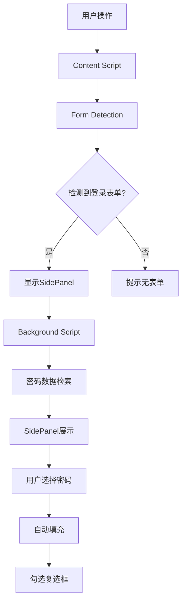

# Account Password Helper - 账号密码管理助手

[](LICENSE)
[](https://chrome.google.com/webstore/detail/your-extension-id)
[](https://github.com/liaolongdong/account-password-helper/actions)

一个功能强大、安全可靠的Chrome浏览器插件，专为现代Web应用设计的智能账号密码管理解决方案。通过先进的加密技术和智能表单识别，为您提供无缝的密码管理体验。

<p align="center">
  
</p>

## 🚀 核心功能特性

### 🔐 安全核心功能

#### 1. 军工级加密保护

- **主密码安全**：PBKDF2算法派生密钥，AES-256-CBC加密存储
- **会话管理**：基于时间的动态会话控制，支持1-24小时自定义
- **内存安全**：会话期间明文存储，过期后自动加密保护
- **零网络传输**：所有数据本地处理，杜绝云端泄露风险

#### 2. 智能密码管理

- **多维度存储**：支持用户名、密码、URL、标签、备注完整信息
- **灵活匹配**：精确URL匹配与全局通配符两种模式
- **批量操作**：Excel导入导出，支持上千条数据批量处理
- **版本追踪**：自动记录创建时间和更新时间

### 🎯 智能自动化功能

#### 1. 表单智能识别

- **多类型支持**：用户名+密码、手机号+验证码等多种登录场景
- **动态检测**：实时监控页面变化，自动识别新出现的表单
- **精准定位**：支持各种HTML结构和CSS框架的表单元素
- **上下文感知**：区分登录表单与普通表单，避免误触

#### 2. 无缝自动填充

- **智能填充**：多策略填充算法确保100%兼容性
- **复选框处理**：自动识别并勾选"记住我"等相关选项
- **事件模拟**：完整触发表单验证和提交事件链
- **反馈机制**：实时显示填充结果和成功率

#### 3. 交互体验优化

- **悬浮按钮系统**：可拖拽、可定制的智能悬浮控件
- **侧边栏集成**：Chrome原生SidePanel API，流畅用户体验
- **快捷键支持**：系统级快捷键，快速访问核心功能
- **响应式设计**：完美适配各种屏幕尺寸和分辨率

### 🛠️ 高级管理功能

#### 1. 数据组织管理

- **标签分类**：自定义标签系统，支持工作、个人、购物等分类
- **智能搜索**：多字段联合搜索，快速定位目标密码
- **拖拽排序**：直观的手动排序方式，个性化排列
- **批量操作**：多选删除、批量修改等高效管理功能

#### 2. 数据迁移备份

- **Excel双向同步**：完整的导入导出功能
- **模板标准化**：提供标准模板，降低使用门槛
- **格式兼容**：支持多种列名格式和数据类型
- **增量更新**：支持追加导入，避免数据重复

#### 3. 系统集成功能

- **Chrome深度集成**：充分利用浏览器原生API
- **跨页面通信**：高效的content script与background通信
- **事件监听**：智能监听页面状态变化和用户行为
- **性能优化**：内存管理和垃圾回收机制

### 🔒 企业级安全保障

#### 1. 访问控制

- **主密码验证**：所有敏感操作都需要身份验证
- **会话超时**：自动会话管理，超时自动锁定
- **操作审计**：关键操作日志记录
- **权限分级**：不同功能模块的细粒度权限控制

#### 2. 数据防护

- **本地加密**：所有数据本地AES-256加密存储
- **传输安全**：内部通信使用Chrome安全API
- **注入防护**：严格的输入验证和XSS防护
- **沙箱隔离**：各功能模块运行环境隔离

#### 3. 合规特性

- **隐私优先**：最小化数据收集原则
- **透明处理**：清晰的数据使用说明
- **用户控制**：完整的数据导出和删除权利
- **开源透明**：代码公开可审计

## 🏗️ 技术架构

### 核心技术栈

- **框架平台**：[WXT](https://wxt.dev/) - 现代化的Chrome扩展开发框架
- **前端框架**：[Vue 3](https://vuejs.org/) + [TypeScript](https://www.typescriptlang.org/)
- **UI组件库**：[Element Plus](https://element-plus.org/)
- **构建工具**：[Vite](https://vitejs.dev/)
- **加密库**：[crypto-js](https://github.com/brix/crypto-js) (AES-256-CBC + MD5)
- **数据处理**：[xlsx](https://github.com/SheetJS/sheetjs) (Excel导入导出)

### 项目架构设计

```
src/
├── entrypoints/           # 扩展入口点
│   ├── background.ts      # 后台脚本 - 核心消息处理和状态管理
│   ├── content.ts         # 内容脚本 - 表单检测和自动填充
│   ├── popup/             # 弹窗页面 - 快速操作入口
│   ├── options/           # 选项页面 - 密码管理主界面
│   └── sidepanel/         # 侧边栏 - 快速填充面板
│
├── components/            # 可复用组件
│   ├── layout/            # 布局组件
│   ├── PasswordFormDialog.vue     # 密码表单弹窗
│   ├── ImportDialog.vue   # Excel导入弹窗
│   └── MasterPasswordDialog.vue   # 主密码验证弹窗
│
├── utils/                 # 工具函数
│   ├── storage.ts         # 存储管理 - 加密/解密核心逻辑
│   ├── excel.ts           # Excel处理工具
│   ├── sessionManager.ts  # 会话管理器
│   └── types.ts           # TypeScript类型定义
│
├── composables/           # Vue组合式函数
│   └── useChromeListeners.ts      # Chrome API事件监听管理
│
└── content/floatingButtons/       # 悬浮按钮系统
    ├── FloatingButtonManager.ts   # 悬浮按钮管理器
    ├── DragHandler.ts             # 拖拽处理器
    └── SettingsPanel.ts           # 设置面板
```

### 核心模块交互流程



### 安全架构

- **主密码保护**：使用PBKDF2算法派生密钥，AES-256-CBC加密存储
- **会话管理**：基于时间的有效期控制，支持1-24小时自定义
- **内存安全**：敏感数据仅在会话期间明文存储，会话过期自动加密
- **传输安全**：所有内部通信使用Chrome Extension API，无网络传输风险

## 🛠️ 安装使用

### 开发环境安装

1. **克隆项目**

```bash
git clone <repository-url>
cd account-password-helper
```

2. **安装依赖**

```bash
npm install
```

3. **开发模式运行**

```bash
npm run dev
```

4. **构建生产版本**

```bash
npm run build
```

### Chrome浏览器安装

1. **构建插件**

```bash
npm run build
```

2. **加载插件**
   - 打开Chrome浏览器
   - 访问 `chrome://extensions/`
   - 开启"开发者模式"
   - 点击"加载已解压的扩展程序"
   - 选择 `.output/chrome-mv3` 文件夹

3. **首次设置**
   - 点击插件图标，进入设置页面
   - 设置主密码（请务必记住此密码）
   - 开始添加账号密码

## 📋 详细使用指南

### 🔐 初始设置与安全配置

#### 1. 主密码设置

首次使用时，插件会引导您设置主密码。这是保护您所有账号信息的核心密钥：

**密码要求**：

- 至少8个字符
- 必须包含大小写字母
- 必须包含数字
- 必须包含特殊字符

**安全建议**：

- 使用密码管理器生成和存储主密码
- 定期更换主密码（建议每3-6个月）
- 不要在多个地方重复使用此密码
- 妥善备份，一旦遗忘无法找回

#### 2. 会话有效期配置

您可以设置验证后的有效时间：

- **1-4小时**：适合临时使用，安全性最高
- **8-12小时**：适合日常办公使用
- **24小时**：适合长时间连续工作场景

#### 3. 悬浮按钮设置

插件提供可定制的悬浮按钮：

- **显示/隐藏**：完全控制按钮可见性
- **位置调整**：左/右侧停靠，垂直偏移调节
- **透明度控制**：0-100%透明度调节
- **自动显示**：输入框聚焦时自动展示侧边栏

### 🔐 密码管理操作

#### 1. 添加新密码

通过多种方式添加密码条目：

**方式一：选项页面添加**

1. 点击浏览器工具栏的插件图标
2. 选择"管理密码"进入完整管理界面
3. 点击"添加密码"按钮
4. 填写详细信息：
   - **用户名**（必填）：支持邮箱、手机号、用户名等
   - **密码**（必填）：登录密码
   - **URL**（选填）：指定网站地址，留空则匹配所有网站
   - **标签**（选填）：分类标识，如"工作"、"个人"、"购物"等
   - **备注**（选填）：额外说明信息

**方式二：Excel批量导入**

1. 准备Excel文件（支持.xlsx格式）
2. 使用"下载模板"获取标准格式
3. 填写批量数据
4. 在选项页面点击"导入Excel"上传文件

**字段说明**：
| 字段 | 必填 | 说明 | 长度限制 |
|------|------|------|----------|
| 用户名 | ✓ | 账号/邮箱/手机号 | 50字符 |
| 密码 | ✓ | 登录密码 | 50字符 |
| URL | ✗ | 网站地址 | 100字符 |
| 标签 | ✗ | 分类标签 | 50字符 |
| 备注 | ✗ | 说明信息 | 1000字符 |

### ⚡ 智能密码填充

#### 自动填充流程

1. **表单检测**：插件自动识别页面中的登录表单
2. **侧边栏展示**：在用户名/密码输入框获得焦点时自动显示
3. **智能匹配**：根据当前网站URL匹配相应密码
4. **一键填充**：点击密码条目即可完成填充
5. **辅助操作**：自动勾选"记住我"等复选框

#### 支持的表单类型

- ✅ 传统用户名+密码登录
- ✅ 手机号+短信验证码登录
- ✅ 邮箱+密码登录
- ✅ 多因素认证场景

#### 填充策略

插件采用多层填充策略确保兼容性：

1. **原生API填充**：使用HTMLInputElement原生方法
2. **事件模拟填充**：触发完整的表单事件链
3. **键盘模拟填充**：逐字符模拟用户输入
4. **剪贴板粘贴**：备用填充方案

#### 复选框智能处理

自动识别并勾选相关复选框：

- "记住我"/"保持登录状态"
- "同意服务条款"/"已阅读隐私政策"
- "自动登录"等常用选项

### ⌨️ 快捷键与高效操作

#### 内置快捷键

| 快捷键         | 功能         | 说明               |
| -------------- | ------------ | ------------------ |
| `Ctrl+Shift+P` | 打开密码管理 | Mac: `Cmd+Shift+P` |
| `Ctrl+Shift+L` | 切换侧边栏   | Mac: `Cmd+Shift+L` |

#### 快捷键自定义

1. 访问 `chrome://extensions/shortcuts`
2. 找到本扩展
3. 修改快捷键设置
4. 保存配置

#### 高效操作技巧

- **快速搜索**：在侧边栏或选项页面使用搜索框快速定位
- **批量操作**：支持多选删除和标签批量修改
- **拖拽排序**：直接拖拽调整密码条目顺序
- **复制功能**：一键复制现有条目创建新记录
- **导出备份**：定期导出Excel文件备份重要数据

### 📋 高级管理功能

#### 1. 密码复制

在操作列中点击"复制"按钮可以：

- 创建与原条目内容完全相同的副本
- 自动插入到当前位置下方
- 新条目会获得新的创建时间和ID
- 适用于创建相似账户的场景

#### 2. 智能搜索

支持多维度搜索：

- **用户名搜索**：模糊匹配账号信息
- **标签筛选**：按分类快速过滤
- **备注检索**：通过备注内容查找
- **URL匹配**：根据网站地址搜索

#### 3. 排序与组织

- **多字段排序**：支持按用户名、URL、标签、时间等排序
- **拖拽重排**：直观的手动排序方式
- **标签管理**：自定义分类标签系统
- **批量操作**：多选删除和批量修改

#### 4. 数据导入导出

**Excel导出**：

- 包含所有字段信息
- 自动格式化时间戳
- 支持自定义文件名

**Excel导入**：

- 支持多种列名格式
- 自动数据验证和清洗
- 错误行详细提示
- 支持增量导入

### 🔍 数据管理与维护

#### 1. 密码编辑

- 点击任意条目的"编辑"按钮
- 修改所需字段信息
- 自动更新最后修改时间
- 支持实时预览修改效果

#### 2. 安全删除

**单个删除**：

- 点击"删除"按钮确认删除
- 提供撤销删除的机会
- 带有视觉删除动画效果

**批量删除**：

- 多选框选择多个条目
- 点击批量删除按钮
- 二次确认防止误删

#### 3. 智能排序

支持多种排序方式：

- **按创建时间**：最新/最旧优先
- **按更新时间**：最近修改优先
- **按用户名**：字母顺序排列
- **按标签分类**：同标签聚合显示

#### 4. 搜索过滤

实时搜索功能：

- 输入即时过滤结果
- 支持中文和英文搜索
- 多字段联合搜索
- 搜索结果高亮显示

### 📊 数据迁移与备份

#### 1. Excel导出

**完整导出**：

- 包含所有密码条目
- 保留完整的元数据（创建时间、更新时间等）
- 自动设置合适的列宽
- 支持中文文件名

**导出时机建议**：

- 定期备份（建议每周一次）
- 重大修改前备份
- 系统升级前备份
- 长期不使用前备份

#### 2. Excel导入

**标准流程**：

1. 下载标准模板文件
2. 按照模板格式填写数据
3. 选择文件并导入
4. 查看导入结果报告

**注意事项**：

- 确保用户名字段不为空
- 密码字段建议加密存储
- URL字段建议使用完整地址
- 标签字段便于后期管理

#### 3. 模板使用

模板文件包含：

- 标准列名和格式
- 示例数据展示
- 字段说明和限制
- 最佳实践建议

## 📊 Excel数据格式规范

### 支持的列名映射

| 中文列名 | 英文列名   | 备选列名             | 必填 |
| -------- | ---------- | -------------------- | ---- |
| 用户名   | username   | Username, 账号       | ✓    |
| 密码     | password   | Password             | ✓    |
| URL      | url        | URL, 网址, 链接      | ✗    |
| 标签     | tag        | Tag, 标签, 分类      | ✗    |
| 备注     | remark     | Remark, 备注, 说明   | ✗    |
| 创建时间 | createTime | CreateTime, 创建时间 | ✗    |
| 更新时间 | updateTime | UpdateTime, 修改时间 | ✗    |

### 标准Excel模板

```excel
| 用户名(必填)     | 密码(必填)  | URL(选填)           | 标签(选填) | 备注(选填) |
| ---------------- | ----------- | ------------------- | ---------- | ---------- |
| user@example.com | password123 | https://example.com | 工作       | 示例账号   |
| admin@test.com   | admin123    | https://test.com    | 个人       | 测试账户   |
```

### 数据格式要求

**文本字段**：

- 支持中英文混合
- 避免特殊控制字符
- 建议长度：用户名≤50字符，密码≤50字符

**URL字段**：

- 建议使用完整URL格式
- 支持HTTP/HTTPS协议
- 可以包含路径和查询参数

**时间字段**：

- 支持多种格式：YYYY-MM-DD, YYYY/MM/DD
- 留空则使用导入时的当前时间
- 自动转换为标准时间戳存储

### 导入最佳实践

✅ **推荐做法**：

- 使用下载的模板文件作为基础
- 保持列顺序一致
- 填写必填字段
- 使用有意义的标签分类
- 定期备份导出文件

❌ **避免事项**：

- 不要修改列名格式
- 避免在单元格中使用换行符
- 不要导入过大的文件（建议<1000条）
- 避免敏感信息明文存储

## 🧪 开发测试

### 测试页面

项目包含专门的测试页面 `test-page.html`，可用于验证核心功能：

```bash
# 启动开发模式
npm run dev

# 在浏览器中打开测试页面
open test-page.html
```

### 功能测试清单

- [ ] 表单自动检测功能
- [ ] 密码自动填充能力
- [ ] 侧边栏显示/隐藏控制
- [ ] Excel导入导出功能
- [ ] 悬浮按钮交互体验
- [ ] 会话管理有效性

### 自动化测试

```bash
# 运行类型检查
npm run typecheck

# 运行代码质量检查
npm run lint:all

# 格式化代码
npm run format
```

## ⚠️ 重要提醒与最佳实践

### 🔐 安全使用须知

**主密码安全**：

- ❗ 主密码采用单向加密，遗忘后无法恢复
- 🔐 建议使用密码管理器存储主密码
- 🔐 定期更换主密码（建议3-6个月）
- 🔐 不要在公共场所输入主密码

**数据保护**：

- 🛡️ 所有数据本地加密存储，零网络传输
- 🛡️ 采用AES-256-CBC军工级加密算法
- 🛡️ 会话过期后自动加密敏感数据
- 🛡️ 支持自定义会话有效期（1-24小时）

### 💾 数据管理建议

**备份策略**：

- 📅 建议每周导出一次数据备份
- 💾 将备份文件存储在安全位置
- ☁️ 考虑使用加密云存储备份
- 🔁 定期验证备份文件可读性

**数据清理**：

- 🗑️ 定期删除不再使用的密码条目
- 🏷️ 合理使用标签进行数据分类
- 🔍 利用搜索功能快速定位数据
- 📊 定期审查和整理密码数据

### 🌐 兼容性说明

**浏览器支持**：

- ✅ Google Chrome ≥ 114
- ✅ Microsoft Edge ≥ 114
- ✅ Brave Browser ≥ 1.40
- ❌ Safari（暂不支持）
- ❌ Firefox（API差异较大）

**操作系统**：

- ✅ Windows 10/11
- ✅ macOS 10.15+
- ✅ Linux (Ubuntu 20.04+)
- ✅ Chrome OS

### ⚡ 性能优化建议

**资源管理**：

- 🚀 关闭不必要的悬浮按钮功能
- ⚡ 适当缩短会话有效期
- 🧹 定期清理浏览器缓存
- 📱 避免同时打开过多标签页

**使用习惯**：

- ⌨️ 熟练使用快捷键提高效率
- 🔍 善用搜索功能快速定位
- 🏷️ 建立清晰的标签分类体系
- 📊 定期导出重要数据备份

### 🆘 应急处理

**紧急情况处理**：

1. **忘记主密码**：只能清空重置，提前做好数据备份
2. **插件异常**：尝试重启浏览器或重新安装插件
3. **数据丢失**：从最近的备份文件恢复
4. **功能失效**：检查Chrome版本和扩展权限设置

## 🤝 开发者指南

### 环境要求

- Node.js >= 16.0.0
- npm >= 8.0.0
- Chrome浏览器 >= 114 (支持SidePanel API)

### 项目结构详解

#### Entry Points (入口点)

- **background.ts**: 扩展的后台脚本，负责消息路由、状态管理和API协调
- **content.ts**: 内容脚本，在每个网页中运行，负责表单检测和自动填充
- **popup/**: 扩展图标点击后显示的弹窗界面
- **options/**: 完整的密码管理界面，运行在独立标签页中
- **sidepanel/**: 侧边栏界面，用于快速密码填充

#### 核心工具模块

- **StorageUtils**: 统一的数据存储和加密管理器
- **ExcelUtils**: Excel文件的导入导出处理
- **SessionManager**: 用户会话生命周期管理
- **FormDetector**: 智能表单字段识别引擎

### 开发流程

1. **克隆并安装依赖**

```bash
npm install
```

2. **启动开发服务器**

```bash
npm run dev
```

3. **在Chrome中加载扩展**
   - 打开 `chrome://extensions/`
   - 启用 "开发者模式"
   - 点击 "加载已解压的扩展程序"
   - 选择 `.output/chrome-mv3` 目录

4. **代码质量保证**

```bash
# 类型检查
npm run typecheck

# 代码风格检查
npm run lint

# 自动修复代码风格
npm run lint:fix

# 格式化代码
npm run format
```

### 贡献指南

欢迎任何形式的贡献！

1. Fork 本仓库
2. 创建功能分支 (`git checkout -b feature/AmazingFeature`)
3. 提交更改 (`git commit -m 'Add some AmazingFeature'`)
4. 推送到分支 (`git push origin feature/AmazingFeature`)
5. 开启 Pull Request

### 代码规范

- 遵循 [Vue Style Guide](https://vuejs.org/style-guide/)
- 使用 TypeScript 严格模式
- 组件命名采用 PascalCase
- 变量和函数采用 camelCase
- 常量采用 UPPER_SNAKE_CASE

### 贡献指南

欢迎任何形式的贡献！

1. Fork 本仓库
2. 创建功能分支 (`git checkout -b feature/AmazingFeature`)
3. 提交更改 (`git commit -m 'Add some AmazingFeature'`)
4. 推送到分支 (`git push origin feature/AmazingFeature`)
5. 开启 Pull Request

### 代码规范

- 遵循 [Vue Style Guide](https://vuejs.org/style-guide/)
- 使用 TypeScript 严格模式
- 组件命名采用 PascalCase
- 变量和函数采用 camelCase
- 常量采用 UPPER_SNAKE_CASE

## 📄 开源许可

本项目采用 [MIT License](LICENSE)，您可以：

✅ **允许的行为**：

- 商业使用
- 修改源代码
- 分发软件
- 专利使用
- 私人使用

📝 **使用条件**：

- 保留版权声明和许可声明
- 在分发时包含原始许可文件

🚫 **免责声明**：

- 软件按"现状"提供，不提供任何形式的担保
- 作者不对因使用本软件造成的任何损害负责

## 🙏 致谢

特别感谢以下开源项目：

- [WXT](https://wxt.dev/) - 现代化Chrome扩展开发框架
- [Vue.js](https://vuejs.org/) - 渐进式JavaScript框架
- [Element Plus](https://element-plus.org/) - Vue 3组件库
- [crypto-js](https://github.com/brix/crypto-js) - JavaScript加密库
- [xlsx](https://github.com/SheetJS/sheetjs) - Excel处理库

## 📈 项目发展路线图

### 短期目标 (1-3个月)

- [ ] 增加生物识别支持（指纹、面部识别）
- [ ] 优化移动端适配
- [ ] 添加密码强度检测
- [ ] 支持更多语言国际化

### 中期规划 (3-6个月)

- [ ] 实现跨设备同步功能
- [ ] 添加密码泄露检测
- [ ] 集成TOTP双因素认证
- [ ] 开发团队协作功能

### 长期愿景 (6-12个月)

- [ ] 支持Firefox浏览器
- [ ] 开发企业版功能
- [ ] 实现AI智能密码管理
- [ ] 构建生态系统插件

---

<p align="center">Made with ❤️ by 开发者社区</p>

## 🆘 常见问题与故障排除

### 🔐 安全相关问题

**Q: 忘记主密码怎么办？**

A: 主密码采用单向MD5哈希存储，无法找回。您需要清空所有数据并重新开始。强烈建议：

- 定期导出密码数据进行备份
- 将主密码保存在安全的地方
- 考虑使用密码管理器管理主密码

**Q: 数据是否会上传到服务器？**

A: 不会。所有数据都存储在浏览器本地存储中，采用AES-256加密，绝不会上传到任何服务器。

### 🎛️ 功能使用问题

**Q: 为什么侧边栏不显示？**

A: 请按以下步骤排查：

1. 确认Chrome版本 ≥ 114（支持SidePanel API）
2. 检查插件是否正确安装且已启用
3. 确认当前页面包含登录表单
4. 检查悬浮按钮设置中是否开启了自动显示
5. 尝试手动点击悬浮按钮打开侧边栏

**Q: Excel导入失败怎么办？**

A: 导入失败通常由以下原因造成：

- 文件格式不正确（仅支持.xlsx格式）
- 缺少必需列（用户名、密码）
- 数据格式异常（特殊字符、超长文本）

解决方法：

1. 使用内置的"下载模板"功能获取标准格式
2. 确保必填列不为空
3. 避免在单元格中使用特殊字符
4. 检查文本长度是否超出限制

**Q: 密码填充不生效？**

A: 填充失败的常见原因及解决方案：

- **网页未完全加载**：等待页面加载完成后再尝试
- **动态表单**：某些SPA应用的表单需要刷新页面后才能识别
- **表单结构复杂**：尝试手动点击输入框触发检测
- **网站安全限制**：部分网站禁止外部脚本操作表单

**Q: 快捷键不生效怎么办？**

A: 快捷键问题排查：

1. 检查是否与其他扩展冲突
2. 在 `chrome://extensions/shortcuts` 中重新设置
3. 确认当前页面允许扩展运行
4. 重启浏览器后重试

### ⚙️ 性能优化问题

**Q: 插件运行缓慢怎么办？**

A: 性能优化建议：

- 定期清理不需要的密码条目
- 减少会话有效期时间
- 关闭不必要的悬浮按钮功能
- 清理浏览器缓存和历史记录

**Q: 内存占用过高？**

A: 内存优化措施：

- 重启浏览器释放内存
- 禁用其他不常用的扩展
- 减少同时打开的标签页数量
- 定期导出重要数据后重置插件

### 🔄 兼容性问题

**Q: 支持哪些浏览器？**

A: 当前仅支持Google Chrome浏览器及其Chromium内核的衍生浏览器（如Edge、Brave等），要求版本≥114。

**Q: 移动端支持吗？**

A: 暂不支持移动端浏览器，主要针对桌面端Chrome浏览器设计。

### 💡 高级技巧

**如何批量管理密码？**

- 使用Excel导入功能批量添加
- 利用标签功能进行分类管理
- 使用搜索功能快速定位
- 定期导出备份重要数据

**如何提高安全性？**

- 设置较短的会话有效期
- 定期更换主密码
- 启用双重验证的网站单独管理
- 避免在公共电脑上使用

### 📞 技术支持

如遇到以上未涵盖的问题，请：

1. 查看浏览器控制台错误信息
2. 检查扩展的运行日志
3. 提供详细的复现步骤
4. 在GitHub Issues中提交问题报告

## 📮 反馈与支持

### 社区支持

- 🐛 [Bug报告](https://github.com/liaolongdong/account-password-helper/issues/new?assignees=&labels=bug&template=bug_report.md&title=)
- 💡 [功能建议](https://github.com/liaolongdong/account-password-helper/issues/new?assignees=&labels=enhancement&template=feature_request.md&title=)
- 💬 [讨论交流](https://github.com/liaolongdong/account-password-helper/discussions)

### 联系方式

📧 邮箱：[924902324@qq.com](mailto:924902324@qq.com)

### 贡献者名单

感谢所有为项目做出贡献的开发者！[[查看贡献者]](https://github.com/liaolongdong/account-password-helper/graphs/contributors)
