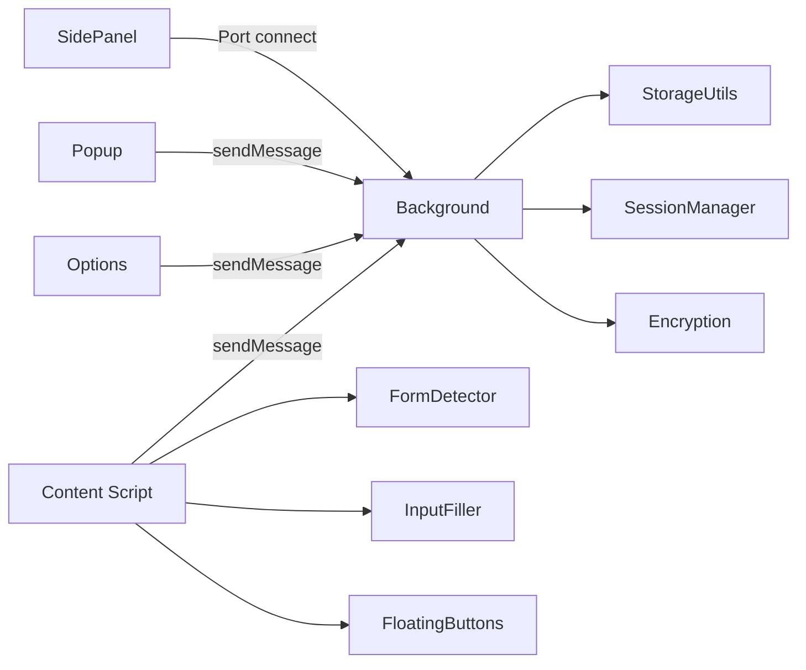
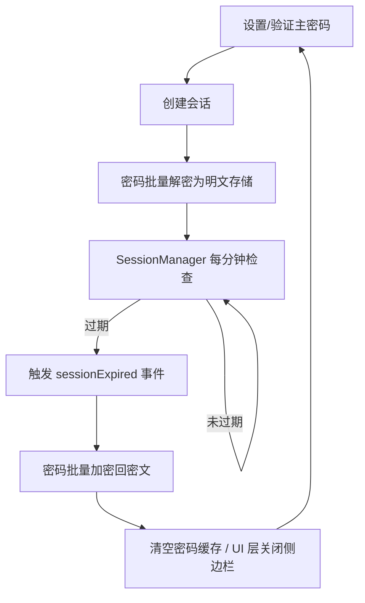

# Account Password Helper · 账号密码管理助手

[](https://wxt.dev/)
[](https://vuejs.org/)
[](https://www.typescriptlang.org/)
[](https://element-plus.org/)
[](https://developer.chrome.com/docs/extensions/mv3/intro/)
[](#许可证)

一个现代化的 Chrome 浏览器扩展，提供安全、便捷的账号密码管理与自动填充能力。采用 **PBKDF2 + AES-256-CBC** 加密体系，支持 Excel 导入导出、智能表单识别和多策略自动填充。

> **免责声明**：本插件的所有数据均保存在本地（敏感信息加密保存），仅用于开发和测试环境使用，严禁保存办公和个人敏感密码，如发生密码泄露，后果自负！
>
> 🌐 **在线演示**: https://liaolongdong.github.io/account-password-helper/

<p align="center">
  
</p>

## 核心特性

- **加密安全**：PBKDF2（10000 次迭代）派生 256-bit 密钥 + AES-256-CBC 随机 IV；主密码 MD5 + 盐值存储；敏感字段（username/password/url/remark）加密。
- **智能识别**：MutationObserver 动态检测登录表单，支持用户名+密码、手机号+验证码等多种场景；LoginFormAnalyzer 通过表单/容器/弹窗/按钮多维启发式判断。
- **一键填充**：侧边栏点击即填充，三重策略（Native Setter / execCommand / 模拟输入）兼容 React/Vue 等主流框架；可选自动触发登录。
- **自动保存**：Chrome 式登录凭证捕获，支持登录表单提交、按钮点击、回车提交三种场景；域名白名单/黑名单精准匹配；凭证指纹智能去重避免重复弹窗；「不再提示」一键屏蔽域名；跨页面导航凭证不丢失；保存弹窗中可编辑标签和备注。
- **数据管理**：Excel 导入导出（.xlsx），导出文件名格式为 `passwords_YYYYMMDD_HHmmss.xlsx`；多格式 CSV 导入（自动识别 Chrome/LastPass/Bitwarden/1Password 导出格式）；中英文列名映射；标签多选（每条最多 3 个，单个最长 30 字符）+ 自定义 + 颜色一致；收藏标记与「只看收藏」过滤；一键去重；多字段搜索与排序；复制密码条目；批量删除。
- **邮箱备份**：导出 Excel 并唤起邮件客户端；支持定时自动备份提醒（chrome.alarms），间隔可选每天/3天/每周/两周/每月。
- **密码可见性切换**：自动为页面密码框注入显示/隐藏按钮，输入有值时按钮自动可见（默认关闭，需在设置中手动开启）。
- **加密备份**：.aph 格式 AES-GCM 加密导出/导入（PBKDF2 100000 次迭代派生密钥）；导入时支持解密预览后再确认，安全可靠。
- **密码强度可视化**：密码输入时实时显示强度进度条（弱/中/强）与规则校验清单（长度、字母、数字、特殊字符），通过气泡弹窗直观呈现。
- **会话可控**：1/2/4/8/12/24 小时和3/5/7天会话有效期；会话失效后敏感字段自动加密回密文；支持自动闲置锁定（5/10/30/60分钟）；Popup 一键锁定；会话过期跨上下文广播同步。
- **版本更新检测**：基于 GitHub Releases API，每 6 小时自动检测最新版本；发现更新时在 Popup 弹窗中展示版本号和更新说明，点击即可跳转下载页面。
- **Shadow DOM 隔离**：悬浮按钮使用 Closed Shadow DOM，完全隔离页面样式。
- **零网络传输**：所有数据存储在 Chrome Local Storage，不走任何网络。

## 功能速览

### 1. 安全保护

- 主密码至少 8 位，必须包含字母、数字和特殊字符。
- 会话创建后，密码从密文解密为明文缓存；会话失效时自动加密回密文。
- 会话恢复后自动检测并修复加密状态不一致的数据。
- SessionManager 每分钟检查会话有效性，页面可见性变化时也会触发检查。

### 2. 表单识别与填充

- 识别用户名、密码、手机号、验证码字段；自动勾选"记住密码"、"同意条款"等复选框。
- WeakMap / WeakSet 缓存字段判断结果，避免内存泄漏。
- 填充策略自动降级：**Native Setter → execCommand → 模拟键盘事件**。
- 悬浮按钮可配置「自动触发登录」开关：填充完成后自动点击表单内的登录按钮（见 [SettingsPanel.ts](./entrypoints/content/floatingButtons/SettingsPanel.ts) / [FormDetector.ts](./entrypoints/content/FormDetector.ts)）。

### 3. 数据管理

- Excel 导入导出（.xlsx/.xls），提供标准模板下载。
- 标签下拉多选 + 自定义新增（每条最多 3 个，单个最长 30 字符）；相同标签颜色稳定一致（见 [utils/tagUtils.ts](./utils/tagUtils.ts)）。
- 密码列表与侧边栏默认按更新时间倒序；支持按用户名、URL、标签、备注、创建/更新时间切换排序。
- 支持用户名、标签、备注、URL 的多字段模糊搜索。
- 批量选择与批量删除密码条目。
- 收藏标记：点击星标收藏常用条目，支持「只看收藏」过滤，收藏条目始终置顶。
- 一键去重：智能检测重复条目（相同用户名 + 相同 URL）并提供一键清理。
- 多格式 CSV 导入：自动识别 Chrome、LastPass、Bitwarden、1Password 的导出格式（见 [utils/excel.ts](./utils/excel.ts)）。

### 4. 自动保存登录凭证

- 启用后，网站登录时自动捕获账号密码并弹窗确认是否保存（见 [LoginAutoSave.ts](./entrypoints/content/LoginAutoSave.ts)）。
- 三种凭证捕获场景：表单提交（capture 阶段）、登录按钮点击、密码框回车提交。
- 域名匹配规则支持精确域名和正则表达式两种模式，规则为空时匹配所有域名（见 [AutoSaveSettingDialog.vue](./components/AutoSaveSettingDialog.vue)）。
- sessionStorage 暂存凭证，支持传统表单提交导致的跨页面导航场景。
- 保存成功后发送桌面通知，并使密码缓存失效以确保下次加载获取最新数据。
- **三选项交互**：保存确认弹窗提供「保存」、「暂不保存」和「不再提示」三个操作选项。
- **可编辑字段**：弹窗中除显示账号和密码外，还提供可编辑的**标签**（默认取页面标题）和**备注**（默认为"自动保存"）输入框，用户可在保存前自定义。
- **智能更新策略**：同账号 + 同域名时更新已有条目的密码，保留存量标签和备注（除非用户在弹窗中主动修改）；不同账号则新增条目。
- **黑名单屏蔽**：保存弹窗中点击「不再提示」可将当前域名加入屏蔽列表（见 [SavePasswordPrompt.ts](./entrypoints/content/SavePasswordPrompt.ts)）；该域名下所有登录均不再弹窗。可在设置对话框的「已屏蔽的域名」中删除以恢复提示。
- **智能防重复**：基于凭证指纹（用户名 + 密码长度）的去重策略（见 [LoginAutoSave.ts](./entrypoints/content/LoginAutoSave.ts)）：已保存的凭证永不重复弹窗；相同凭证 60 秒冷却期内不重复弹窗（避免重试登录时反复打扰）；不同凭证或冷却期过后重新弹窗。

### 5. 邮箱备份

- 导出密码列表为 Excel 并唤起邮件客户端（见 [utils/emailBackup.ts](./utils/emailBackup.ts)）。
- 支持配置自动备份提醒，通过 chrome.alarms 定时发送桌面通知（不解密、不自动下载文件）。
- 备份间隔可选：每天 / 每3天 / 每周 / 每两周 / 每月。

### 6. 加密备份导入导出

- 导出：使用主密码通过 AES-GCM 加密全部密码数据，下载为 `.aph` 文件（见 [utils/backupExport.ts](./utils/backupExport.ts)），文件名格式为 `backup_YYYYMMDD.aph`。
- 导入：上传 `.aph` 文件后输入导出时使用的主密码进行解密，解密后可预览数据（前 5 条）再确认导入（见 [BackupImportDialog.vue](./components/BackupImportDialog.vue)）。
- 加密方案：PBKDF2（100000 次迭代）+ AES-256-GCM + 随机 Salt + 随机 IV，安全性高于常规存储。

### 7. 密码可见性切换

- 自动为页面中的密码输入框注入显示/隐藏切换按钮（见 [PasswordVisibilityToggle.ts](./entrypoints/content/PasswordVisibilityToggle.ts)），默认关闭，需在悬浮按钮设置面板中手动开启。
- 对所有密码输入框统一注入切换按钮，使用 Element Plus 主题蓝色，输入有值时按钮自动可见。
- MutationObserver 监听动态新增的密码输入框，自动注入。
- 可在悬浮按钮设置面板中开关此功能。

### 8. 自动闲置锁定

- 在密码管理页「自动锁定设置」中配置闲置时间（5/10/30/60 分钟或不锁定），系统闲置超过设定时间后自动清除主密码会话并锁定密码管理（见 [IdleLockSetting.vue](./components/IdleLockSetting.vue)）。
- 锁定后需重新验证主密码才能恢复访问，与手动锁定和会话过期行为一致。
- Popup 弹窗也提供一键「锁定」按钮，可快速清除当前会话。

### 9. 密码强度可视化

- 在主密码设置和密码表单中，密码输入时通过气泡弹窗实时展示强度等级（弱/中/强）和进度条（见 [PasswordStrengthPopover.vue](./components/PasswordStrengthPopover.vue)）。
- 逐条校验密码规则：至少 8 字符、包含字母、包含数字、包含特殊字符，通过/未通过状态一目了然。
- 基于 [usePasswordStrength](./composables/usePasswordStrength.ts) Composable 实现，可在多处复用。

### 10. 快速填充

- 侧边栏自动将与当前域名匹配的密码排在前面。
- **本地开发友好**：当域名为 `localhost` 或 `127.0.0.1` 时，默认匹配所有密码（见 [sidepanel/App.vue](./entrypoints/sidepanel/App.vue)）。
- 点击条目一键填充并自动关闭侧边栏；若无登录表单，给出「当前页面未检测到登录表单」提示。
- 侧边栏条目支持右键或操作按钮跳转到密码管理页，直接编辑该条目或添加新条目。
- 快捷键：
  - `Ctrl+Shift+P` / `Cmd+Shift+P`：打开密码管理页面
  - `Ctrl+Shift+L` / `Cmd+Shift+L`：显示/隐藏侧边栏
  - 快捷键支持自定义，详见 [常见问题 - 如何自定义快捷键](#常见问题)
- Background 维护密码缓存，侧边栏优先读取缓存，后台异步验证。

### 11. 版本更新检测

- 通过 GitHub Releases API 定期检测最新版本（见 [utils/updateChecker.ts](./utils/updateChecker.ts)）。
- 每 6 小时自动检测一次，发现新版本时在 Popup 弹窗中展示更新提示，包含版本号和更新说明。
- 点击更新提示可直接跳转到 GitHub Releases 页面下载最新版本。
- 检测结果缓存 24 小时，避免频繁请求；缓存过期后自动重新检测。

## 技术栈

| 类别        | 技术                                                                  | 版本 / 说明                              |
| ----------- | --------------------------------------------------------------------- | ---------------------------------------- |
| 扩展框架    | [WXT](https://wxt.dev/)                                               | v0.20，基于 Manifest V3                  |
| 前端框架    | [Vue 3](https://vuejs.org/) + TypeScript                              | v3.5，Composition API + `<script setup>` |
| UI 组件库   | [Element Plus](https://element-plus.org/)                             | v2.13，按需引入（unplugin-auto-import）  |
| 加密        | [crypto-js](https://github.com/brix/crypto-js)                        | v4.2，PBKDF2 + AES-256-CBC + MD5         |
| 表格处理    | [xlsx](https://github.com/SheetJS/sheetjs)                            | v0.18，Excel 导入导出                    |
| 构建工具    | Vite                                                                  | WXT 内置，HMR 热更新                     |
| 图标生成    | [sharp](https://github.com/lovell/sharp)                              | v0.33，SVG → 多尺寸 PNG                  |
| 日志 / 环境 | [utils/logger.ts](./utils/logger.ts) + [utils/env.ts](./utils/env.ts) | 生产构建 tree-shake 掉调试日志           |
| 代码规范    | ESLint + Prettier + Stylelint                                         | TS v6，完整质量工具链                    |

## 快速开始

### 环境要求

- Node.js >= 18
- Chrome >= 114（支持 SidePanel API，>= 129 支持 `sidePanel.close`）

### 安装与构建

```bash
# 安装依赖
npm install

# 开发模式（HMR 热更新）
npm run dev

# 生产构建（会先跑 prebuild → 生成图标 PNG）
npm run build

# 构建并打包为 zip
npm run postbuild

# Firefox 支持
npm run dev:firefox
npm run build:firefox
```

### 加载到 Chrome

1. `npm run build` 产出 `.output/chrome-mv3/`
2. 打开 `chrome://extensions/`，开启「开发者模式」
3. 点击「加载已解压的扩展程序」，选择 `.output/chrome-mv3`
4. 首次使用需设置主密码（至少 8 位，含字母+数字+特殊字符）

## 使用指南

### 在线演示

访问 [在线演示页面](https://liaolongdong.github.io/account-password-helper/) 查看功能演示效果。

> 注意：在线演示仅用于展示功能界面，不涉及真实的密码管理功能。完整功能请安装 Chrome 扩展体验。

### 初始设置

1. 安装后点击扩展图标进入密码管理页面
2. 设置主密码并选择会话有效期（1/2/4/8/12/24 小时和3/5/7天，默认 24 小时）
3. 在选项页可配置悬浮按钮显示、位置、透明度、是否自动触发登录

### 密码管理

- **新增 / 编辑 / 复制 / 删除**：选项页提供完整 CRUD；字段约束：用户名≤50 字符、密码≤50 字符、URL≤100 字符、备注≤1000 字符
- **复制密码**：点击「复制」按钮快速复制条目，默认排序规则（更新时间倒序）下新增或者编辑条目插入到第一条，高亮提示并自动滚动的该位置
- **批量导入导出**：Excel 模板导入，提供「下载模板」，导出密码需验证主密码
- **搜索 / 排序**：多字段模糊搜索，点击表头切换升降序
- **标签**：下拉多选，可自定义添加，颜色稳定一致

### 快速填充

1. 登录页输入框获得焦点时自动展示侧边栏（需开启配置）
2. 侧边栏列表按当前域名优先排序
3. 点击条目一键填充，自动关闭侧边栏；可配置点击自动触发登录
4. 也可通过点击插件图标或悬浮按钮中的“快速填充”手动切换

### Excel 字段支持

| 中文列名            | 英文列名                | 必填 | 说明             |
| ------------------- | ----------------------- | ---- | ---------------- |
| 用户名 / 账号       | username / Username     | 是   | 账号/邮箱/手机号 |
| 密码                | password / Password     | 否   | 登录密码         |
| URL / 网址 / 链接   | url                     | 否   | 网站地址         |
| 标签 / 分类         | tag / Tag               | 否   | 分类标签         |
| 备注 / 说明         | remark / Remark         | 否   | 说明信息         |
| 创建时间            | createTime / CreateTime | 否   | 自动填充         |
| 更新时间 / 修改时间 | updateTime / modifyTime | 否   | 自动填充         |

示例：

```
用户名(必填)     密码          URL                   标签   备注
user@email.com  password123   https://example.com   工作   示例账号
```

## 架构设计

### 扩展入口点

| 入口点             | 职责                                                       |
| ------------------ | ---------------------------------------------------------- |
| **Background**     | Service Worker，消息路由、密码缓存、侧边栏状态、快捷键处理 |
| **Content Script** | 注入所有页面，初始化表单检测与悬浮按钮                     |
| **Popup**          | 扩展图标弹窗，提供「管理密码」和「快速填充」快捷入口       |
| **Options**        | 密码管理主页面，完整 CRUD、导入导出、会话/有效期管理       |
| **SidePanel**      | 侧边栏快速填充，支持搜索、排序、域名匹配、缓存加速         |

### 消息与数据流



- Background 作为消息路由中心，处理跨组件通信
- SidePanel 通过 `chrome.runtime.connect()` 建立 Port，用于可靠状态追踪
- Content Script 通过 `chrome.runtime.sendMessage()` 发送消息

### 会话生命周期



### 加密机制

```
主密码 + 盐值 → PBKDF2 (10000次迭代) → 256-bit 密钥
明文 + 密钥 + 随机IV → AES-256-CBC → Base64(IV + 密文)
```

- 敏感字段加密：`username`、`password`、`url`、`remark`
- 空字段不参与加密（写空字符串）；解密失败安全降级返回原始数据
- 内存中的主密码副本使用 MD5(盐值 + 常量) 截取 32 字符作为会话密钥，通过 AES-256-CBC 二次加密后再存入 chrome.storage.local

## 项目结构

```
├── entrypoints/                    # WXT 扩展入口点
│   ├── background.ts               # Background Service Worker
│   ├── content.ts                  # Content Script 入口
│   ├── content/                    # Content Script 模块
│   │   ├── FormDetector.ts         # 表单检测编排器
│   │   ├── InputFiller.ts          # 多策略输入填充
│   │   ├── LoginFormAnalyzer.ts    # 登录表单启发式分析
│   │   ├── LoginAutoSave.ts        # 登录凭证自动保存管理器
│   │   ├── SavePasswordPrompt.ts   # Chrome 风格保存确认弹窗
│   │   ├── PasswordVisibilityToggle.ts # 密码显示/隐藏切换
│   │   ├── CheckboxHandler.ts      # 复选框自动勾选
│   │   ├── NativeNotification.ts   # 原生浏览器通知
│   │   ├── formSelectors.ts        # 选择器与关键词常量
│   │   └── floatingButtons/        # 悬浮按钮系统（Closed Shadow DOM）
│   ├── popup/                      # 扩展图标弹窗
│   ├── options/                    # 密码管理主页面
│   └── sidepanel/                  # 侧边栏快速填充
├── components/                     # 共享 Vue 组件
│   ├── AutoSaveSettingDialog.vue   # 自动保存设置对话框
│   ├── BackupImportDialog.vue        # 加密备份导入对话框
│   ├── BrandLogo.vue               # 钥匙主题品牌 Logo
│   ├── DisclaimerInfo.vue          # 免责声明
│   ├── EmailBackupDialog.vue       # 邮箱备份对话框
│   ├── HelpDialog.vue              # 操作指引与常见问题
│   ├── IdleLockSetting.vue         # 自动闲置锁定设置
│   ├── ImportDialog.vue            # Excel 导入对话框
│   ├── PasswordStrengthPopover.vue # 密码强度可视化弹窗
│   ├── QuickFillIcon.vue           # 快速填充图标
│   ├── ValidityHoursSelect.vue     # 有效期选择器
│   └── ValiditySettingDialog.vue   # 有效期设置对话框
├── composables/                    # Vue 组合函数
│   ├── useAuthFlow.ts              # 认证流程
│   ├── usePasswordManagement.ts    # 密码 CRUD + 搜索排序 + 收藏
│   ├── usePasswordStrength.ts      # 密码强度校验
│   ├── useSessionTimer.ts          # 会话定时器
│   └── useChromeListeners.ts       # Chrome API 监听器自动清理
├── utils/                          # 核心工具库
│   ├── storage.ts                  # 存储门面
│   ├── encryption.ts               # PBKDF2 + AES-256-CBC
│   ├── sessionManager.ts           # 全局会话检查单例
│   ├── sessionManager-storage.ts   # 会话持久化与加解密转换
│   ├── backupExport.ts             # 加密备份导出/导入（AES-GCM）
│   ├── excel.ts                    # Excel 导入导出 + 多格式 CSV 导入
│   ├── emailBackup.ts              # 邮箱备份工具
│   ├── tagUtils.ts                 # 标签颜色生成
│   ├── updateChecker.ts            # 版本更新检测（GitHub Releases API）
│   ├── logger.ts                   # 环境感知日志
│   ├── env.ts                      # isDev 常量
│   ├── createVueApp.ts             # Vue 应用工厂
│   ├── dateFormat.ts               # 日期格式化工具
│   └── types.ts                    # 公共类型定义
├── assets/icons/                   # 源 SVG 图标
│   ├── icon.svg                    # 当前生效图标
│   └── variants/                   # 4 款钥匙主题候选图标
├── public/icon/                    # 构建期 PNG 产物（WXT 自动注入 manifest）
├── scripts/generate-icons.mjs      # SVG → 多尺寸 PNG 生成脚本
├── types/global.d.ts               # 全局类型补充
├── .github/workflows/static.yml    # GitHub Pages 部署
├── wxt.config.ts                   # WXT 配置
└── package.json
```

## 开发调试

### 常用命令

| 命令                                    | 说明                                                                                                        |
| --------------------------------------- | ----------------------------------------------------------------------------------------------------------- |
| `npm run dev`                           | 开发模式（HMR 热更新）                                                                                      |
| `npm run build`                         | 生产构建（先执行 `prebuild` → 自动生成图标 PNG）                                                            |
| `npm run postbuild`                     | 构建后产出 zip 包                                                                                           |
| `npm run icons:build`                   | 将 [assets/icons/icon.svg](./assets/icons/icon.svg) 渲染为 `public/icon/{16,32,48,96,128}.png`              |
| `npm run analyze`                       | 构建并可视化分析打包体积（输出 `dist/stats.html`）                                                          |
| `npm run analyze:firefox`               | Firefox 构建并可视化分析打包体积（输出 `dist/stats.html`）                                                  |
| `npm run auto-merge`                    | 将 main 分支自动合并到其他所有本地分支（见 [scripts/README-auto-merge.md](./scripts/README-auto-merge.md)） |
| `npm run dev:firefox` / `build:firefox` | Firefox 浏览器支持                                                                                          |
| `npm run typecheck`                     | TypeScript 类型检查                                                                                         |
| `npm run lint` / `:fix`                 | ESLint 检查 / 自动修复                                                                                      |
| `npm run lint:style(:fix)`              | Stylelint 检查 / 自动修复                                                                                   |
| `npm run format(:check)`                | Prettier 格式化 / 检查                                                                                      |
| `npm run lint:all`                      | 运行所有检查                                                                                                |
| `npm run fix:all`                       | 运行所有自动修复                                                                                            |

### 图标工作流

1. 编辑或替换 [assets/icons/icon.svg](./assets/icons/icon.svg)（可从 [variants](./assets/icons/variants) 挑选一款覆盖）
2. 运行 `npm run icons:build` 生成 `public/icon/{16,32,48,96,128}.png`
3. WXT 会自动识别为 `manifest.icons` 和 `action.default_icon`，无需在 [wxt.config.ts](./wxt.config.ts) 显式声明

### 测试页面

项目包含 [test-page.html](./test-page.html) 用于表单检测与自动填充的回归验证。

### Chrome 权限说明

| 权限            | 用途                           |
| --------------- | ------------------------------ |
| `storage`       | 本地存储密码数据和配置         |
| `activeTab`     | 获取当前标签页信息用于域名匹配 |
| `scripting`     | 动态注入 Content Script        |
| `sidePanel`     | 侧边栏快速填充功能             |
| `alarms`        | 定时自动备份提醒               |
| `downloads`     | Excel 文件导出下载             |
| `notifications` | 桌面通知（自动保存/备份提醒）  |
| `idle`          | 自动闲置锁定检测               |
| `<all_urls>`    | Content Script 匹配所有页面    |

## 安全提醒

- 主密码遗忘**无法恢复**，请务必妥善保管。
- 所有数据本地 AES-256-CBC 加密存储，不经过任何网络传输。
- 建议定期通过 Excel 导出功能备份数据。
- 会话过期后需重新验证主密码，届时所有密码自动加密。
- 本插件仅用于开发和测试环境，**严禁保存生产环境或个人敏感密码**。

## 常见问题

**Q：忘记主密码怎么办？**

A：主密码无法找回，只能通过「重置」功能清空数据后重新设置。建议定期通过 Excel 导出备份。

**Q：侧边栏不显示？**

A：确认 Chrome >= 114，检查页面是否包含登录表单；也可用点击插件图标或悬浮按钮，点击“快速填充”手动打开。

**Q：Excel 导入失败？**

A：点击「下载模板」获取标准模板，确保用户名列不为空；支持 `.xlsx` 与 `.xls`。

**Q：密码填充不生效？**

A：等待页面完全加载后重试，填充器会依次尝试三种策略；仍不生效请刷新页面。

**Q：悬浮按钮被页面样式影响？**

A：悬浮按钮使用 Closed Shadow DOM 完全隔离，不受页面样式影响。

**Q：会话有效期修改何时生效？**

A：修改后立即创建新会话，新有效期即时生效。

**Q：如何切换扩展图标？**

A：从 [assets/icons/variants](./assets/icons/variants) 选一款覆盖到 [assets/icons/icon.svg](./assets/icons/icon.svg)，然后运行 `npm run icons:build` 重新生成 PNG。

**Q：为什么本地开发时侧边栏匹配这么宽松？**

A：当域名为 `localhost` 或 `127.0.0.1` 时，侧边栏默认展示所有密码，方便本地调试多项目时快速填充。

**Q：侧边栏会自动点击登录按钮吗？**

A：仅在悬浮按钮设置面板中开启「自动触发登录」时，且账号密码字段均已成功填充，FormDetector 才会自动点击表单内的登录按钮。默认关闭。

**Q：如何开启自动保存登录密码？**

A：在密码管理页点击「自动保存设置」按钮，开启「启用自动保存」开关。可选配置域名匹配规则（支持精确域名和正则表达式），规则为空时匹配所有域名。登录时会弹出确认卡片，提供三个选项：

- 「保存」：将凭证写入密码列表
- 「暂不保存」：本次跳过，60 秒内相同凭证不会重复弹窗
- 「不再提示」：将该域名加入屏蔽黑名单，后续该域名下所有登录均不再弹窗

屏蔽的域名可在设置对话框的「已屏蔽的域名」列表中删除以恢复提示。插件内置智能防重复机制：已保存的凭证不会重复弹窗，点击「暂不保存」后 60 秒内相同凭证也不会重复弹窗。

**Q：为什么有时登录后没有弹出保存提示？**

A：可能原因包括：①该域名已被加入屏蔽黑名单（检查自动保存设置中的「已屏蔽的域名」）；②相同凭证刚弹过提示且在 60 秒冷却期内；③该凭证已成功保存过；④域名不匹配配置的白名单规则。

**Q：密码框没有显示/隐藏切换按钮？**

A：悬浮按钮设置面板中默认**关闭**「密码可见性切换」，需手动开启。开启后插件对所有密码输入框统一注入切换按钮，输入有值时按钮自动可见。

**Q：保存弹窗中可以编辑标签和备注吗？**

A：可以。弹窗中除显示账号和密码信息外，还提供标签和备注输入框，可在保存前自定义。标签默认取页面标题，备注默认为"自动保存"。

**Q：自动保存会覆盖已有的密码吗？**

A：当同一网站（同域名）使用相同账号登录时，插件会更新已有条目的密码，但保留原有的标签和备注（除非在弹窗中手动修改）。不同账号则新增条目，不会影响已有数据。

**Q：如何备份密码到邮箱？**

A：在密码管理页点击「备份到邮箱」按钮，配置目标邮箱地址后点击「立即备份」，插件会导出 Excel 并唤起邮件客户端。可开启「自动备份提醒」定时发送桌面通知提醒手动备份。

**Q：如何导出/导入加密备份？**

A：在密码管理页的「数据管理」下拉菜单中，选择「加密备份导出」会用主密码将所有密码数据加密为 `.aph` 文件下载。选择「加密备份导入」上传 `.aph` 文件后，输入导出时使用的主密码进行解密，解密成功可预览数据（前 5 条）再确认导入。加密方案为 PBKDF2（100000 次迭代）+ AES-256-GCM，安全性极高。

**Q：什么是自动闲置锁定？**

A：在密码管理页「自动锁定设置」中可配置闲置时间（5/10/30/60 分钟或不锁定）。当系统检测到用户在设定时间内无任何操作时，会自动清除主密码会话并锁定密码管理，效果与手动锁定一致，需重新验证主密码才能恢复访问。此功能可有效防止离开电脑时密码列表被他人查看。

**Q：如何一键去重？**

A：在密码管理页的「数据管理」下拉菜单中点击「一键去重」，插件会智能检测重复条目（相同用户名 + 相同 URL），展示去重结果供确认后清理。已收藏的条目不会被删除。

**Q：支持从其他密码管理器导入吗？**

A：支持。在 Excel 导入弹窗中，选择 CSV 文件格式后插件会自动识别 Chrome、LastPass、Bitwarden、1Password 的导出格式并映射字段。只需从对应密码管理器导出 CSV 文件，然后在导入弹窗中选择即可。

**Q：如何自定义快捷键？**

A：Chrome 浏览器原生支持修改扩展快捷键。在地址栏输入 `chrome://extensions/shortcuts`，找到「Account Password Helper」，点击对应命令右侧的快捷键输入框，按下新的组合键即可修改。修改后 Popup 弹窗中显示的快捷键会自动同步。

**Q：插件会自动检测更新吗？**

A：会。插件通过 GitHub Releases API 每 6 小时自动检测一次最新版本，发现新版本时会在 Popup 弹窗中展示更新提示（包含版本号和更新说明），点击即可跳转到下载页面。检测结果会缓存 24 小时，避免频繁请求。你也可以在 Popup 弹窗中手动触发检测。

## 许可证

本项目采用 MIT License 开源协议。

## 致谢

- [WXT](https://wxt.dev/) — 现代化 Chrome 扩展开发框架
- [Vue 3](https://vuejs.org/) — 渐进式 JavaScript 框架
- [Element Plus](https://element-plus.org/) — Vue 3 UI 组件库
- [crypto-js](https://github.com/brix/crypto-js) — JavaScript 加密库
- [xlsx](https://github.com/SheetJS/sheetjs) — Excel 文件处理库
- [sharp](https://github.com/lovell/sharp) — 高性能图像处理

## 联系方式

邮箱：[924902324@qq.com](mailto:924902324@qq.com?subject=账号密码管理助手反馈)

如果本项目对您有帮助，请帮忙点个⭐️，谢谢！

欢迎提交 Issue 和 Pull Request！
