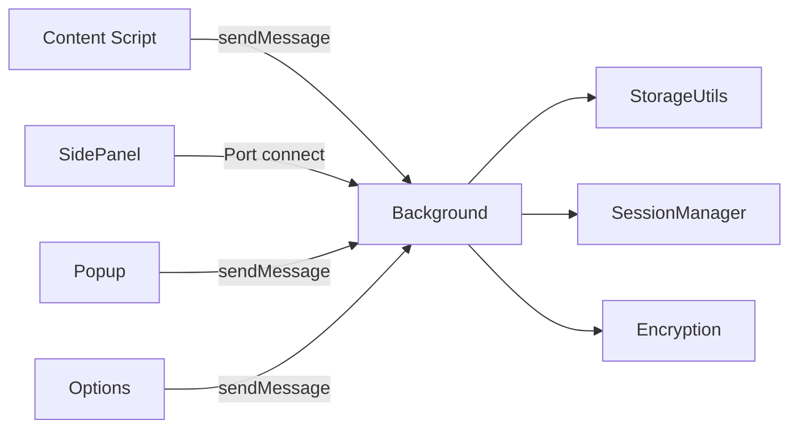

# Account Password Helper · 账号密码管理助手

**中文** | [English](./README.en.md)

[](https://wxt.dev/)
[](https://vuejs.org/)
[](https://www.typescriptlang.org/)
[](https://element-plus.org/)
[](https://developer.chrome.com/docs/extensions/mv3/intro/)
[](#许可证)
[](https://chromewebstore.google.com/detail/account-password-helper/fgimkdodpjfkddmildjieojpfakpanli)
[](https://github.com/liaolongdong/account-password-helper/releases/latest)

一款功能强大的 Chrome 浏览器扩展，提供安全、便捷的账号密码管理与自动填充能力。采用 **PBKDF2 + AES-256-GCM** 加密体系，零网络传输，密码绝不出浏览器。

> **免责声明**：本插件的所有数据均保存在本地（敏感信息加密保存），仅用于开发、测试和普通生产环境登录使用，**严禁保存办公或个人敏感密码（如银行、支付、社交核心密码）**，如发生密码泄露，后果自负！
>
> 🌐 **在线演示**: https://liaolongdong.github.io/account-password-helper/

<p align="center">
  
</p>

## 界面预览

<p align="center">
  
  
  
</p>

<p align="center">
  <sub>密码列表管理 · 侧边栏快速填充 · 悬浮按钮快捷入口</sub>
</p>

## 核心特性

### 🔐 安全防护

- **强加密存储**：PBKDF2（600000 次迭代）派生 256-bit 密钥 + AES-256-GCM 随机 IV，敏感字段（用户名/密码/URL/备注/TOTP）全部密文存储，基于 Web Crypto API 原生实现，零网络传输
- **会话可控**：有效期 1 小时\~7 天可选；支持闲置自动锁定（5\~60 分钟）、浏览器重启锁定、Popup 一键锁定，过期后敏感字段自动加密回密文
- **安全体检**：一键扫描生成 0\~100 综合评分，检测弱密码、密码复用、常见泄露密码（离线字典）、长期未更新、未开两步验证，支持到期提醒
- **安全细节**：剪贴板自动清除（10\~120 秒可选）、密码强度可视化、TOTP 两步验证码本地生成（RFC 6238，零联网），支持扫描网页二维码 / 上传二维码图片一键添加 TOTP 密钥（本地 jsQR 解码，不联网）

### ⚡ 智能填充

- **表单智能识别**：MutationObserver 动态检测登录表单（含跨 iframe），支持用户名+密码、手机号+验证码等场景
- **多种填充方式**：内联填充（默认，输入框内钥匙图标迷你面板，快捷键 `Ctrl+Shift+K` 直接展开）、侧边栏一键填充、一键填充快捷键（`Ctrl+Shift+F`，填充结果通过桌面通知 + 工具栏角标双通道反馈），三重填充策略兼容 React/Vue 等主流框架，可选自动触发登录
- **精确域名匹配**：仅展示与当前 host 完全一致的条目，方便区分多测试环境账号；`localhost` 默认匹配全部
- **自动保存凭证**：Chrome 式登录捕获与保存确认，智能去重（相同凭证不重复提示、密码变化弹「更新」确认）、域名黑白名单、「不再提示」一键屏蔽

### 📦 数据管理

- **导入导出**：CSV / JSON 双格式，自动识别 Chrome、LastPass、Bitwarden、1Password 导出格式，中英文列名映射
- **备份**：加密备份（.aph，AES-GCM）导出/导入（支持解密预览）；邮箱备份（加密/不加密可选）+ 定时备份提醒
- **组织能力**：标签多选（颜色稳定一致）、收藏置顶（上限可配 + LRU 淘汰）、多字段搜索排序、一键去重、批量删除
- **防误操作**：回收站 30 天软删除、密码修改历史（每条 5 份加密快照可恢复）、修改主密码原子换钥不丢数据

### 🎨 体验

- **主题与语言**：6 款色彩主题 + 中英文双语界面，即时切换无需刷新，扩展页与页面内注入 UI 同步生效
- **网站图标展示**：密码列表、侧边栏与内联下拉面板条目展示对应网站的图标（读取 Chrome 本地图标缓存，零外部网络请求），长列表辨识更快，无图标时自动降级为默认图标
- **密码生成器**：随机密码（长度/字符集/排除易混淆字符可配）与助记词组（EFF Diceware 2048 词库）双模式
- **样式隔离**：悬浮按钮、内联面板等页面内组件使用 Closed Shadow DOM，完全隔离页面样式
- **秒开体验**：Service Worker 会话期保活 + 密码内存缓存预热，侧边栏打开约 20-50ms 加载完成，会话过期后自动停止保活不影响续航
- **版本更新检测**：基于 GitHub Releases API 每 6 小时自动检测，Popup 展示更新提示

> 📖 各功能的实现细节（源码路径、策略说明、参数约束）见 [docs/ARCHITECTURE.md — 功能实现详解](./docs/ARCHITECTURE.md#功能实现详解)。

## 技术栈

| 类别      | 技术                                                                              | 版本 / 说明                                 |
| --------- | --------------------------------------------------------------------------------- | ------------------------------------------- |
| 扩展框架  | [WXT](https://wxt.dev/)                                                           | v0.20.25，基于 Manifest V3                  |
| 前端框架  | [Vue 3](https://vuejs.org/) + TypeScript                                          | v3.5.33，Composition API + `<script setup>` |
| UI 组件库 | [Element Plus](https://element-plus.org/)                                         | v2.13.7，按需引入（unplugin-auto-import）   |
| 加密      | [Web Crypto API](https://developer.mozilla.org/en-US/docs/Web/API/Web_Crypto_API) | PBKDF2 + AES-256-GCM + SHA-256，浏览器原生  |
| 构建工具  | Vite                                                                              | WXT 内置，HMR 热更新                        |
| 代码规范  | ESLint + Prettier + Stylelint                                                     | TS v6，完整质量工具链                       |

## 快速开始

### 环境要求

- Node.js >= 22（rolldown 依赖 `node:util.styleText`）
- Chrome >= 114（支持 SidePanel API，>= 129 支持 `sidePanel.close`）

### 从 Chrome 应用商店安装（推荐）

直接访问 [Chrome Web Store 页面](https://chromewebstore.google.com/detail/account-password-helper/fgimkdodpjfkddmildjieojpfakpanli)，点击「添加至 Chrome」即可一键安装，后续版本更新由商店自动推送。

### 从 GitHub Releases 下载（无法访问 Google 的用户）

如果你无法访问 Chrome 应用商店（如中国大陆地区用户），可从 [GitHub Releases](https://github.com/liaolongdong/account-password-helper/releases/latest) 下载最新版安装包（zip），手动安装：

1. 下载 zip 并解压到任意目录（请妥善保留该目录，后续更新时需覆盖此目录）
2. 打开 `chrome://extensions/`，开启「开发者模式」
3. 点击「加载已解压的扩展程序」，选择解压后的目录
4. 首次使用需设置主密码（至少 8 位，含字母+数字+特殊字符）

> 💡 手动加载的扩展不会自动更新，但插件会通过 GitHub Releases API 每 6 小时检测新版本，并在 Popup 弹窗中展示更新提示。收到提示后下载新包，将文件覆盖到原安装目录即可（详见下文「更新版本」）。

### 安装与构建（开发者）

```bash
# 安装依赖
pnpm install

# 开发模式（HMR 热更新）
pnpm dev

# 生产构建（会先跑 prebuild → 生成图标 PNG）
pnpm build

# 构建并打包为 zip
pnpm postbuild

# Firefox 支持
pnpm dev:firefox
pnpm build:firefox
```

构建产物在 `.output/chrome-mv3/`，在 `chrome://extensions/` 开启「开发者模式」→「加载已解压的扩展程序」选择该目录即可。

### 更新版本

- **Chrome 应用商店用户**：版本更新由商店自动推送，无需手动操作。
- **手动加载用户（GitHub Releases 下载 / 开发者）**：只需将压缩包内的文件**直接覆盖**原有安装目录下的文件即可，**切勿**重新选择其他目录加载扩展。Chrome 扩展的本地数据（包括密码数据、配置等）存储在浏览器内部存储空间中，只要扩展 ID 不变，覆盖文件更新不会影响已有数据。如果更换了加载目录，Chrome 会将其视为全新安装，**原有的密码数据将无法访问**。

> 💡 **如何查看当前安装目录**：打开 `chrome://extensions/`，找到「账号密码管理助手」的卡片，点击"详情"，在扩展详情页下方可以看到「来源：/path/to/your/directory」，冒号后面的路径即为当前安装目录。

## 使用指南

1. **初始设置**：安装后点击扩展图标进入密码管理页面，设置主密码并选择会话有效期（默认 24 小时）；「偏好设置」中可配置主题、语言、悬浮按钮、填充方式等
2. **密码管理**：选项页提供完整 CRUD、批量导入导出（导出需验证主密码）、多字段搜索排序、标签与收藏
3. **快速填充**：默认内联填充——登录框获焦后显示钥匙图标，点击选择账号即填；可在「偏好设置」切换为「侧边栏」（获焦自动弹出）或「仅手动」，也可使用快捷键
4. **快捷键**：`Ctrl+Shift+P`（打开管理页）、`Ctrl+Shift+L`（切换侧边栏）、`Ctrl+Shift+F`（一键填充）、`Ctrl+Shift+K`（展开内联下拉列表，与点击钥匙图标一致），均支持在 `chrome://extensions/shortcuts` 中自定义（Mac 为 `Cmd`）

> 📖 完整的操作指引与功能演示见[在线演示页面](https://liaolongdong.github.io/account-password-helper/)（含双语 FAQ），或侧边栏内的「帮助」入口。

### CSV / JSON 字段格式

| 中文列名            | 英文列名                | 必填 | 说明             |
| ------------------- | ----------------------- | ---- | ---------------- |
| 用户名 / 账号       | username / Username     | 是   | 账号/邮箱/手机号 |
| 密码                | password / Password     | 否   | 登录密码         |
| URL / 网址 / 链接   | url                     | 否   | 网站地址         |
| 标签 / 分类         | tag / Tag               | 否   | 分类标签         |
| 备注 / 说明         | remark / Remark         | 否   | 说明信息         |
| 创建时间            | createTime / CreateTime | 否   | 自动填充         |
| 更新时间 / 修改时间 | updateTime / modifyTime | 否   | 自动填充         |

> 「下载模板」会生成标准 CSV 文件（BOM UTF-8，Excel / Numbers 可直接打开），表头跟随界面语言，中英文表头均可被导入自动识别。JSON 导出为 `{ version, exportedAt, count, entries }` 包裹结构，导入时同时兼容扁平数组格式；导入导出文件名格式为 `passwords_YYYYMMDD_HHmmss.csv/.json`。

## 架构概览

| 入口点             | 职责                                                           |
| ------------------ | -------------------------------------------------------------- |
| **Background**     | Service Worker：消息路由、密码缓存、侧边栏状态追踪、快捷键处理 |
| **Content Script** | 注入所有页面，初始化表单检测与悬浮按钮                         |
| **Popup**          | 扩展图标弹窗，提供「管理密码」和「快速填充」快捷入口           |
| **Options**        | 密码管理主页面，完整 CRUD、导入导出、会话/有效期管理           |
| **SidePanel**      | 侧边栏快速填充，支持搜索、排序、域名匹配、缓存加速             |



加密机制核心：

```
主密码 + 盐值 → PBKDF2 (600000次迭代) → 256-bit 密钥
明文 + 密钥 + 随机IV → AES-256-GCM → Base64(IV + 密文)
```

> 📖 完整架构设计（会话生命周期、加密细节、消息流说明）与逐文件注释的项目结构树见 [docs/ARCHITECTURE.md](./docs/ARCHITECTURE.md)。

## 项目结构

```
├── entrypoints/        # WXT 扩展入口点：background/、content/、popup/、options/、sidepanel/
├── components/         # Vue 组件（options/ 与 sidepanel/ 子目录）
├── composables/        # Vue 组合函数（认证、会话、侧边栏、TOTP、快捷键等）
├── utils/              # 核心工具库：storage/、i18n/、加密、会话、备份、安全体检等
├── assets/             # 源 SVG 图标与主题 CSS Design Tokens
├── public/icon/        # 构建期 PNG 产物（WXT 自动注入 manifest）
├── scripts/            # 图标生成与仓库自动化脚本
└── wxt.config.ts       # WXT 配置
```

> 📖 完整的逐文件注释结构树见 [docs/ARCHITECTURE.md — 项目结构](./docs/ARCHITECTURE.md#项目结构)。

## 开发调试

### 常用命令

| 命令                                 | 说明                                               |
| ------------------------------------ | -------------------------------------------------- |
| `pnpm dev`                           | 开发模式（HMR 热更新）                             |
| `pnpm build` / `pnpm postbuild`      | 生产构建 / 构建后产出 zip 包                       |
| `pnpm icons:build`                   | SVG 图标渲染为多尺寸 PNG                           |
| `pnpm analyze`                       | 构建并可视化分析打包体积（输出 `dist/stats.html`） |
| `pnpm dev:firefox` / `build:firefox` | Firefox 浏览器支持                                 |
| `pnpm typecheck`                     | TypeScript 类型检查                                |
| `pnpm lint:all` / `pnpm fix:all`     | 运行所有检查 / 所有自动修复                        |

> 📖 图标工作流、测试页面、性能设计等开发细节见 [docs/ARCHITECTURE.md — 开发补充](./docs/ARCHITECTURE.md#开发补充)；贡献流程见 [CONTRIBUTING.md](./CONTRIBUTING.md)。

### Chrome 权限说明

| 权限             | 用途                                   |
| ---------------- | -------------------------------------- |
| `storage`        | 本地存储密码数据和配置                 |
| `activeTab`      | 获取当前标签页信息用于域名匹配         |
| `scripting`      | 动态注入 Content Script                |
| `sidePanel`      | 侧边栏快速填充功能                     |
| `alarms`         | 定时自动备份提醒和 Service Worker 保活 |
| `notifications`  | 桌面通知（自动保存/备份提醒/版本更新） |
| `idle`           | 自动闲置锁定检测                       |
| `clipboardWrite` | 写入剪贴板（复制密码）                 |
| `clipboardRead`  | 读取剪贴板（验证清除前内容）           |
| `webNavigation`  | 跨 iframe 表单检测与填充               |
| `<all_urls>`     | Content Script 匹配所有页面            |

## 安全提醒

- 本插件仅用于开发、测试和普通生产环境登录使用，**严禁保存办公或个人敏感密码（如银行、支付、社交核心密码）**；
- 主密码遗忘**无法恢复**，请务必牢记并妥善保管；
- 所有数据本地 AES-256-GCM 加密存储，零网络传输；
- 建议定期通过加密备份功能（.aph 文件）导出备份；
- 建议开启剪贴板自动清除与闲置自动锁定；对安全性要求较高时，建议开启「浏览器重启锁定」。

## 常见问题

**Q：我的密码会被上传到云端吗？**

A：不会。本插件采用纯本地存储方案，所有数据保存在浏览器本地空间，敏感字段经 AES-256-GCM 加密保存，永远不经过任何网络传输。

**Q：忘记主密码怎么办？**

A：主密码无法找回，只能通过「重置」功能清空数据后重新设置。建议定期通过数据导出或加密备份（.aph 文件）功能备份，避免数据丢失。

**Q：会话有效期到了会发生什么？**

A：会话过期后，所有敏感字段会自动重新加密为密文；下次使用时只需重新验证主密码即可恢复访问，账号数据不会丢失。

**Q：侧边栏不显示？**

A：确认 Chrome >= 114，检查页面是否包含登录表单；也可点击插件图标（快捷键 `Ctrl+Shift+L` / `Cmd+Shift+L`），或通过悬浮按钮中的「快速填充」手动打开。

**Q：密码填充不生效？**

A：等待页面完全加载后重试，填充器会依次尝试三种策略（Native Setter / execCommand / 模拟键盘事件）；仍不生效请刷新页面。

**Q：如何自定义快捷键？**

A：在地址栏输入 `chrome://extensions/shortcuts`，找到「Account Password Helper」，点击对应命令右侧的快捷键输入框，按下新的组合键即可修改。Popup 中显示的快捷键会自动同步。

**Q：支持从其他密码管理器导入吗？**

A：支持。在导入弹窗中上传 CSV 文件，插件会自动识别 Chrome、LastPass、Bitwarden、1Password 的导出格式并映射字段。

**Q：删除的密码能找回吗？**

A：能。删除的密码会先移入回收站保留 30 天，在「数据管理」→「回收站」中可恢复或彻底删除；改错密码也可通过条目的「密码修改历史」（保留最近 5 条加密快照）一键恢复。

**Q：如何开启自动保存登录密码？**

A：在密码管理页「自动保存设置」中开启开关，可选配置域名匹配规则（精确域名/正则）。登录时会弹出确认卡片（保存/暂不保存/不再提示），并可编辑标签和备注。已保存的相同凭证不会重复弹窗，密码变化时弹「更新」确认。

**Q：如何切换主题或界面语言？**

A：通过密码管理页「偏好设置」按钮、悬浮按钮齿轮图标或侧边栏齿轮图标进入偏好设置面板，可切换 6 款色彩主题与中文 / English 界面语言，即时生效无需刷新。

**Q：Windows 首次打开侧边栏较慢怎么办？**

A：Windows Defender 会在扩展文件首次加载时逐文件扫描，导致冷启动延迟增加 1-2 秒。建议将 Chrome 扩展目录加入 Defender 排除列表以跳过扫描：打开「Windows 安全中心」→「病毒和威胁防护」→「管理设置」→「排除项」→「添加排除项」→选择「文件夹」→粘贴路径 `%LOCALAPPDATA%\Google\Chrome\User Data\Default\Extensions`。加入后冷启动可从 2-3 秒降至 1 秒以内。Mac 用户无需此操作。

> 📖 更多问题（TOTP 使用与排查、邮箱备份、加密备份、剪贴板清除、收藏上限、性能表现等）见[在线演示页面](https://liaolongdong.github.io/account-password-helper/)的完整 FAQ，或 [docs/ARCHITECTURE.md](./docs/ARCHITECTURE.md) 中对应功能的实现说明。

## 许可证

本项目采用 MIT License 开源协议。

## 致谢

- [WXT](https://wxt.dev/) — 现代化 Chrome 扩展开发框架
- [Vue 3](https://vuejs.org/) — 渐进式 JavaScript 框架
- [Element Plus](https://element-plus.org/) — Vue 3 UI 组件库
- [Web Crypto API](https://developer.mozilla.org/en-US/docs/Web/API/Web_Crypto_API) — 浏览器原生加密 API
- [sharp](https://github.com/lovell/sharp) — 高性能图像处理

## 联系方式

邮箱：[924902324@qq.com](mailto:924902324@qq.com?subject=账号密码管理助手反馈)

**微信交流群**：扫描下方二维码添加作者微信（微信号：`lld_1025`），备注「aph」邀你加入插件交流群，反馈问题、交流使用心得。


如果本项目对您有帮助，请帮忙点个⭐️，谢谢！

欢迎提交 Issue 和 Pull Request！
