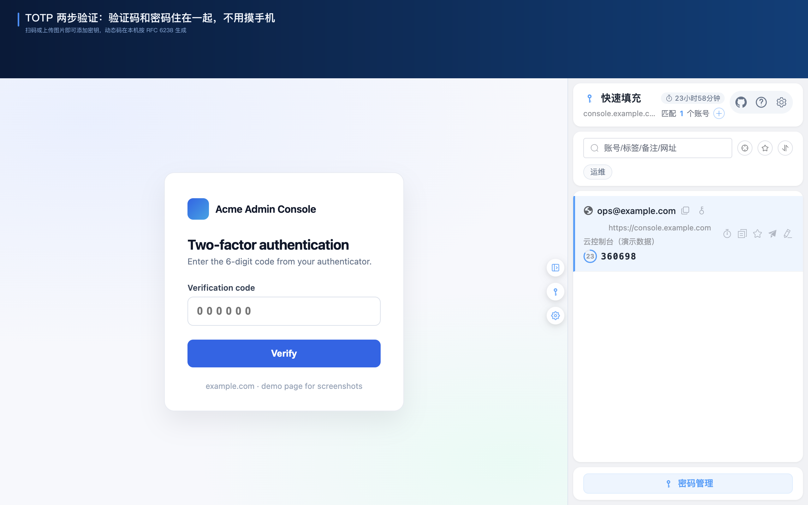
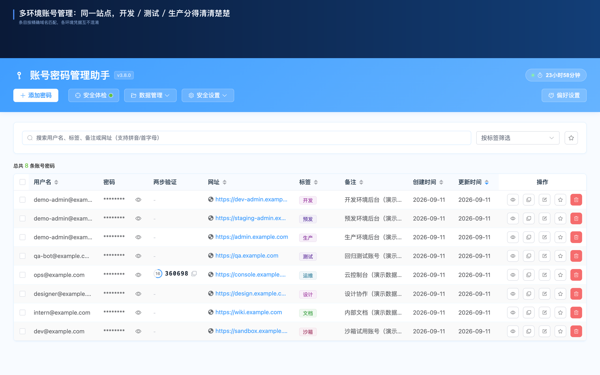
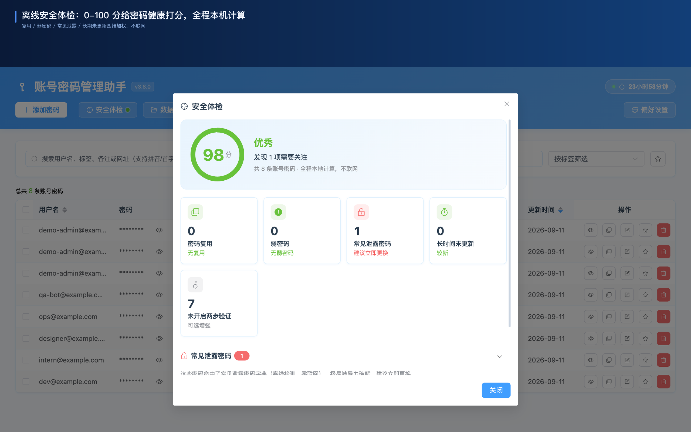
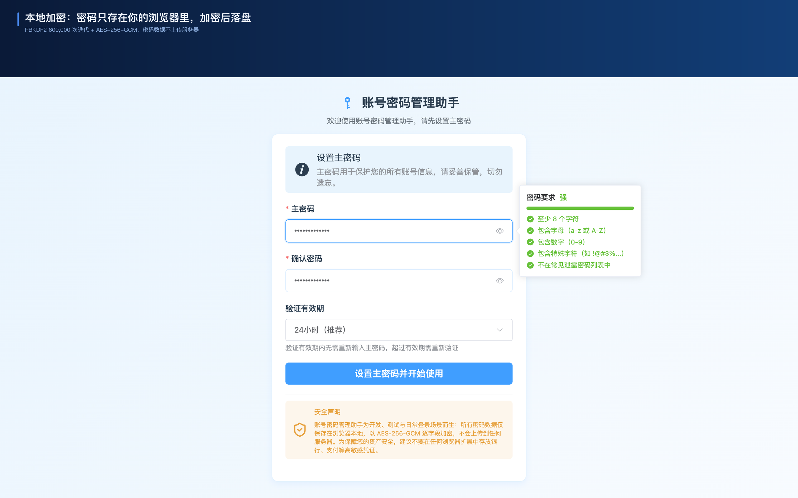
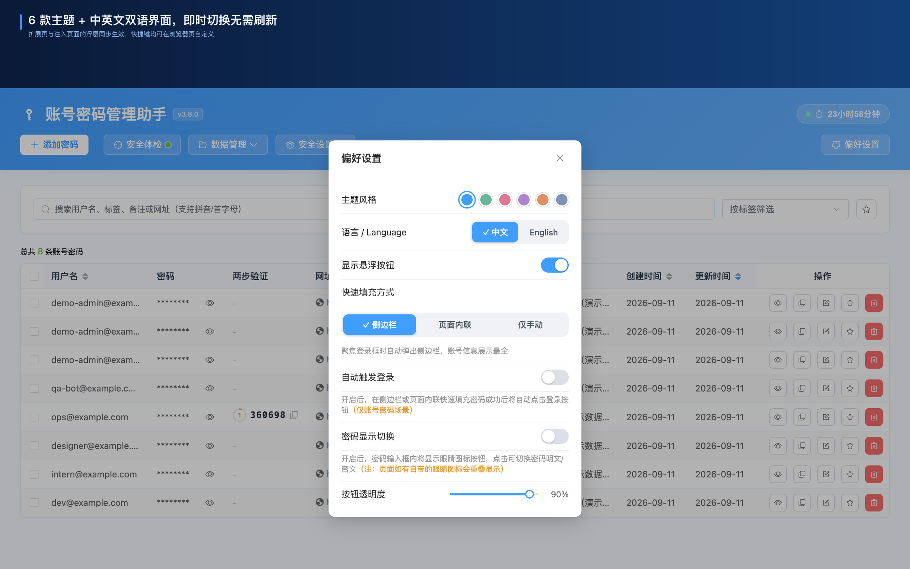

# Account Password Helper · 账号密码管理助手（开源免费本地密码管理器）

**中文** | [English](./README.en.md)

> **开源免费的本地优先密码管理器**：一键登录连登录按钮一起点、精确域名匹配隔离 dev/test/staging/prod、内置 TOTP 两步验证与离线安全体检。完全免费、无订阅、无需注册账号，密码数据只存本机。

> 🌐 **[在线演示](https://liaolongdong.github.io/account-password-helper/)** ｜ ⚙️ Chrome MV3 ｜ 🔒 PBKDF2 600K 迭代 + AES-256-GCM ｜ 🎨 6 款主题 · 中英文双语 ｜ 🧪 1134 项自动化测试

**目录**：[核心优势](#-核心优势) · [功能演示](#-功能演示) · [横向对比](#-横向对比) · [功能全览](#-功能全览) · [安全与隐私](#-安全与隐私) · [安装与上手](#-安装与上手) · [常见问题](#-常见问题) · [参与贡献](#-参与贡献) · [许可证](#-许可证)

  
   
  
   
  页内面板选中账号 → 自动填充并登录 → 同域名验证码页自动锚定活码胶囊 → 点「填入」，全程不用摸手机

## ✨ 核心优势

| 优势                              | 与其他工具的差异                                                                                                        |
| --------------------------------- | ----------------------------------------------------------------------------------------------------------------------- |
| ⚡ **一键登录，不只是填充**       | `Ctrl+Shift+F` 一次走完「填充账号 → 勾选记住我/同意」；开启「自动触发登录」或用侧边栏「填充并登录」，连登录按钮一起点掉 |
| 🎯 **多环境账号隔离**             | 精确域名匹配区分 dev/test/staging/prod——**同一站点的不同环境账号互不混淆**，开发者与测试刚需                            |
| 🔑 **内置 TOTP + 两步登录接力**   | 验证码和密码存在一起；GitHub 式两步登录自动衔接活码胶囊，**告别手机验证器，不用切 App**                                 |
| 🔒 **纯本地 AES-256-GCM，零云端** | 无云端、无账号、无订阅，**也就没有可供攻破的服务器**；五个敏感字段逐字段密文存储，密码数据从不作为明文离开本机          |
| 📊 **离线安全体检**               | 一键 0-100 评分，四维加权检测，**全程本机计算**                                                                         |
| 📦 **一键迁移，零门槛**           | 自动识别 Chrome / LastPass / Bitwarden / 1Password 导出格式，CSV / JSON 双格式，**30 秒搬家**                           |

**适合谁**

- 💻 **开发者** — 隔离多环境账号，同一站点的 dev / test / staging / prod 互不串号
- 🧪 **测试工程师** — 一键填充 + 自动触发登录，跨环境回归效率翻倍
- 🔏 **隐私敏感用户** — 纯本地加密、密码数据不出本机、无需注册与云端同步
- 🙋 **日常用户** — 告别记忆密码，内置 TOTP 与密码生成器

## 🖼️ 功能演示

> 每张图对应一个功能模块：上方是模块名称，下方一行只讲**图里看不到的信息**——容易踩空的默认值、开关位置与隐藏能力。

  <b>⚡ 一键登录</b> 
   
  快捷键 <b>Ctrl+Shift+F</b> 默认停在「已填充 + 已勾选」，不会替你提交。

  <b>🔑 内置 TOTP</b> 
   
  添加密钥可直接扫描网页二维码或上传二维码图片，本地解码；算法与 6 / 7 / 8 位均可自定义。

  <b>📝 页内填充面板</b> 
   
  全新安装默认启用这种内联填充，可在偏好设置切换为侧边栏或仅手动。

  <b>🎯 多环境账号隔离</b> 
   
  在 <b>localhost</b> / <b>127.0.0.1</b> 上还会进一步按端口区分。

  <b>📊 离线安全体检</b> 
   
  泄露字典为内置近千条离线词表；「未开启两步验证」单独列示、不计入扣分。

  <b>🛠️ 密码生成器</b> 
   
  输入框右键「生成并填充强密码」不读取任何已存凭证，会话锁定时同样可用。

  <b>🔒 本地加密</b> 
   
  主密码是唯一密钥：遗忘后无法找回，只能重置清空数据，请先用加密备份（.aph）留一条退路。

  <b>🎨 主题与双语</b> 
   
  六款主题分别为晴空蓝 / 青竹绿 / 桃花粉 / 樱粉紫 / 落霞橙 / 雾墨灰，切换即时生效无需刷新。

> 📸 截图与动图取自商店素材流水线（`scripts/store-shots/`，全部为 `example.com` 占位演示数据）。悬浮按钮、自动保存弹窗、CSV 导入导出与加密备份、回收站与密码修改历史等更多界面见[在线演示页面](https://liaolongdong.github.io/account-password-helper/)。

## 🆚 横向对比

| 功能                           | ⭐ **Account Password Helper** |        Bitwarden         |        1Password         |          Chrome 自带           |
| ------------------------------ | :----------------------------: | :----------------------: | :----------------------: | :----------------------------: |
| 价格                           |        **✅ 完全免费**         | 免费 / 高级版约 $10/年起 | $2.99/月起（以官网为准） |              免费              |
| 数据存储                       |     **✅ 纯本地，零云端**      |           云端           |           云端           | 本地 + Google 账号同步（可选） |
| 需要注册账号                   |        **✅ 无需注册**         |            是            |            是            |               否               |
| 一键登录（填充 + 勾选 + 点击） |       **✅ 是，零配置**        |    需额外设置/仅填充     |    需额外设置/仅填充     |             仅填充             |
| 多环境账号隔离                 |           **✅ 是**            |            否            |            否            |               否               |
| TOTP 验证器                    |    **✅ 内置（同一扩展）**     |  独立免费 App / 高级版   |     所有订阅方案均含     |               否               |
| 离线安全体检（0-100 评分）     |           **✅ 是**            |            否            |    托管式 Watchtower     |     有泄露密码检查，无评分     |
| 开源（GPL-3.0）                |           **✅ 是**            |            是            |            否            |               否               |

> ⭐ 为本项目列，✅ 表示开箱即用、无需额外配置。竞品信息（价格、功能边界）截至 2026-09，各厂商调整频繁，请以官网为准。完整对比见[替代方案对比页](https://liaolongdong.github.io/account-password-helper/compare.html)。

## 📋 功能全览

### 🔒 安全防护

- 🛡️ **本地强加密**：主密码经 PBKDF2-SHA256（600,000 次迭代）派生密钥，用户名 / 密码 / 网址 / 备注 / TOTP 密钥五个敏感字段逐字段 AES-256-GCM 加密，每次使用新的随机 IV
- ⏳ **会话可控**：有效期 1 小时-7 天可选（默认 24 小时）；剩余时间在管理页 / 侧边栏 / Popup 常驻展示，临近过期变色预警，点击徽标即可续期
- 🔐 **自动锁定与剪贴板**：复制敏感字段后默认 30 秒自动清除剪贴板；闲置自动锁定与「浏览器重启锁定」默认关闭，可在偏好设置独立开启
- 🩺 **离线安全体检**：0-100 四维加权评分（复用 35 / 弱密码 25 / 命中泄露字典 20 / 长期未更新 20），未开启 2FA 仅列示不计分，全程不联网
- ⏰ **到期提醒**：在体检的「长时间未更新」明细中按条目设 7 / 30 / 90 天改密提醒，到期发桌面通知
- 🔑 **TOTP 两步验证**：本地生成（RFC 6238），列表与侧边栏实时活码与倒计时；GitHub 式两步登录自动衔接活码胶囊

### ⚡ 智能填充

- ⚡ **一键登录**：填充账号密码 + 自动勾选「记住我 / 已阅读并同意 / 接受条款」；开启「自动触发登录」或使用侧边栏「填充并登录」后连登录按钮一起点
- 🧩 **四种填充入口**：页内面板（默认）、侧边栏一键填充、输入框右键、快捷键；动态检测登录表单（含跨 iframe），兼容 React / Vue 与手机号 + 验证码场景
- 💾 **自动保存凭证**：Chrome 式登录捕获与保存确认，相同凭证不重复提示、密码变化弹「更新」确认；支持域名黑白名单与「不再提示」，弹窗内联提示弱密码与复用风险
- 🎯 **精确域名匹配**：所有填充入口与列表只展示与当前 host 完全一致的条目，dev / test / staging / prod 互不混淆
- ➕ **就地添加与全站搜索**：侧边栏顶栏「+」预填当前域名快速建档；搜索一键切换「本站 / 全站」范围，外站命中仍可复制账号密码验证码、收藏与编辑
- 📇 **分享卡片**：一次点击把「用户名 / 密码 / 网址」合成一段纯文本复制进剪贴板（网址为空时省略该行），侧边栏列表行与详情抽屉各一处入口；卡片含明文密码，同受剪贴板限时自动清除约束，内容只写本机剪贴板、不发起任何网络请求

### 📦 数据管理

- 📥 **导入导出**：CSV / JSON 双格式，自动识别 Chrome、LastPass、Bitwarden、1Password 的导出格式，中英文列名自动映射（Excel 请先另存为 CSV）
- 🔐 **多重备份**：加密备份（.aph）导出 / 导入支持解密预览；邮箱备份本机组好内容后经 `mailto:` 交由你的邮件客户端发送；定时备份提醒只发桌面通知，不会自动发信
- 🏷️ **高效组织**：标签多选与筛选、收藏置顶（默认上限 10 条，可配 1-50，超出按 LRU 淘汰）、拼音 / 首字母智能搜索与高亮、一键去重、批量删除 / 改标签 / 导出选中为 CSV、只读详情抽屉一览完整备注与密码修改历史
- ♻️ **防误操作**：回收站 30 天软删除；密码修改历史默认保留 3 份加密快照（可配 1-10）且可恢复；修改主密码原子换钥不丢数据
- 🪪 **身份信息库**：独立的个人信息收藏夹，存放姓名、证件号、手机号、邮箱、住址、银行卡信息与自定义字段，默认掩码、打开时需主密码复验；支持加密备份（.aphid）导出导入、勾选导出子集，并提供可选的明文 .json 导出/导入（需验证主密码 + 风险二次确认，导入按 id 合并）；不参与自动备份，请定期手动导出加密备份

### 🎨 体验

- 🎨 **主题与语言**：6 款色彩主题 + 中英文双语界面，即时切换无需刷新，扩展页与页面内注入 UI 同步生效
- 🚀 **秒开体验**：所有场景侧边栏秒开无白屏；会话有效时走缓存快路径，数据在 20-50ms 内返回
- 🛠️ **密码生成器**：随机密码（默认 16 位，6-50 可选，字符集与易混淆字符可配）与助记词组（内置 3080 词英文词库，3-8 词可追加数字）双模式
- 🔍 **细节体验**：密码输入时实时显示强度条与逐条规则清单；输入主密码开着 Caps Lock 会即时警示；页面密码框显隐切换按钮默认关闭、可在偏好设置开启；网站图标读取 Chrome 本地缓存（零外部请求）

> 🛠 技术栈、架构设计与项目结构见[贡献指南](./docs/CONTRIBUTING.md)；各功能的实现细节（源码路径、策略说明、参数约束）见 [ARCHITECTURE.md — 功能实现详解](./docs/ARCHITECTURE.md#功能实现详解)；产品动机与加密 / 性能技术复盘见[技术博客](https://liaolongdong.github.io/account-password-helper/blog/)（中英双语）。

## 🔒 安全与隐私

- **数据只在本机**：条目保存在 `chrome.storage.local`，敏感字段逐字段加密后落盘，从不作为明文离开本机；内存态密钥与解密快照只放在 `chrome.storage.session`，**不使用** `storage.sync` 或 `storage.managed`。
- **锁定与过期只销毁密钥**：磁盘上的敏感字段本来就是密文，会话过期或手动锁定不会触发整库重新加密，因此瞬间不卡顿；重新验证主密码即可恢复访问，账号数据不会丢失。
- **唯一的对外请求**：每 6 小时一次的匿名版本检查——商店安装版向商店条目页发一个不透明的 HEAD 请求，手动安装版查询 GitHub Releases 的公开版本信息。两者都不携带任何密码库内容、账号、标识符或可推导信息；断网时该检查静默失败，不影响任何核心功能。除此之外不发起任何外部网络请求，网站图标也来自 Chrome 本地缓存。
- **明确不做**：不读取 `cookies`、`history`、`downloads` 等未声明权限；无遥测、分析、广告与崩溃上报 SDK，不收集设备指纹或使用统计；主密码任何形态（原文、可逆密文）都不落盘，仅保存 PBKDF2 派生的校验值。
- **使用建议**：本插件面向开发、测试与日常登录场景，建议不要在任何浏览器扩展中存放银行、支付等高敏感凭证；主密码遗忘**无法恢复**，请务必牢记并妥善保管；建议定期导出加密备份（.aph），剪贴板自动清除默认已开启，可再按需开启闲置自动锁定与「浏览器重启锁定」。

> 📋 13 项权限的逐项用途见[贡献指南 — Chrome 权限说明](./docs/CONTRIBUTING.md#chrome-权限说明)；加密方案、会话生命周期与备份格式见 [ARCHITECTURE.md](./docs/ARCHITECTURE.md#加密机制)。

## 📥 安装与上手

### 安装

| 方式                   | 步骤                                                                                                                                                                                                                                                                                              |
| ---------------------- | ------------------------------------------------------------------------------------------------------------------------------------------------------------------------------------------------------------------------------------------------------------------------------------------------- |
| 🛍 **Chrome 应用商店**  | 访问[商店页面](https://chromewebstore.google.com/detail/account-password-helper/fgimkdodpjfkddmildjieojpfakpanli)，点击「添加至 Chrome」，后续版本更新由商店自动推送。**推荐**                                                                                                                    |
| 📦 **GitHub Releases** | 从 [Releases](https://github.com/liaolongdong/account-password-helper/releases/latest) 下载最新 zip，解压到**固定目录** → 在 `chrome://extensions/` 开启「开发者模式」→「加载已解压的扩展程序」选择该目录。适合无法访问 Google 的用户；手动加载不自动更新，扩展每 6 小时检测新版本并在 Popup 提示 |
| 🛠 **源码构建**         | `pnpm install && pnpm build`，产物在 `.output/chrome-mv3/`，同样以「加载已解压的扩展程序」方式加载。完整命令与环境要求见[贡献指南 — 常用命令](./docs/CONTRIBUTING.md#常用命令)                                                                                                                    |

> ⚠️ 手动加载的更新方式是把新包**直接覆盖**原安装目录，**切勿换目录**——Chrome 会视为一次全新安装，原有密码数据将无法访问。

### 四步上手

1. **设置主密码**：首次进入管理页设置主密码（至少 8 位，含字母 + 数字 + 特殊字符）并选择会话有效期（默认 24 小时）
2. **挑一种填充方式**：全新安装默认**内联填充**——登录框获焦后点钥匙图标选账号；可在「偏好设置」切换为**侧边栏**（获焦自动弹出）或**仅手动**。升级用户沿用升级前的侧边栏行为，不会被静默改为内联
3. **导入已有密码**：管理页「数据管理 → 导入」上传 CSV / JSON，自动识别 Chrome、LastPass、Bitwarden、1Password 的导出格式
4. **按需开启自动登录**：「偏好设置 → 自动触发登录」打开后，`Ctrl+Shift+F` 连登录按钮一起点掉

### 快捷键速查

| 功能           | Windows / Linux | macOS         | 默认行为                                                                  |
| -------------- | --------------- | ------------- | ------------------------------------------------------------------------- |
| 打开密码管理页 | `Ctrl+Shift+P`  | `Cmd+Shift+P` | 打开选项页                                                                |
| 开关侧边栏     | `Ctrl+Shift+L`  | `Cmd+Shift+L` | 开 / 关侧边栏                                                             |
| 快速填充       | `Ctrl+Shift+F`  | `Cmd+Shift+F` | 填充当前站点最匹配账号 + 勾选协议；开启「自动触发登录」后连登录按钮一起点 |
| 展开内联下拉   | `Ctrl+Shift+K`  | `Cmd+Shift+K` | 在聚焦的输入框上展开账号下拉列表                                          |

> 扩展内不支持改键（Chrome 未提供 `commands.update()`），请到 `chrome://extensions/shortcuts` 修改；管理页「安全设置 → 快捷键」与侧边栏「帮助」提供只读一览并会标注当前未生效的按键。命令 ID 与限制说明见[贡献指南 — 快捷键](./docs/CONTRIBUTING.md#快捷键)。

## ❓ 常见问题

**Q：我的密码会被上传到云端吗？**

A：不会。数据只保存在浏览器本地空间，敏感字段逐字段加密后落盘。唯一的外联是每 6 小时一次的匿名版本检查，详见[安全与隐私](#-安全与隐私)。

**Q：忘记主密码怎么办？**

A：主密码无法找回，只能通过「重置」清空数据后重新设置。建议定期用数据导出或加密备份（.aph 文件）备份，避免数据丢失。

**Q：会话有效期到了会发生什么？**

A：会话过期只清除密钥材料与内存缓存，磁盘上的敏感字段本来就是密文，不存在「过期瞬间批量重新加密」这一步，因此不会卡顿。下次使用时重新验证主密码即可恢复访问，账号数据不会丢失。

**Q：支持从其他密码管理器导入吗？**

A：支持。在导入弹窗上传 CSV 或 JSON 文件，插件会自动识别 Chrome、LastPass、Bitwarden、1Password 的导出格式并映射字段，30 秒完成搬家。Excel 需先另存为 CSV（不解析 .xlsx）。

**Q：导出的 CSV 用 Excel 打开，个别密码或备注变成了报错内容？**

A：当某个字段的值本身以 `=`、`+`、`-`、`@` 开头（随机密码生成器的符号集就含这几个字符）时，Excel 会把该单元格当作公式求值。导出刻意不做公式转义：加前缀会改写字段内容，而密码是逐字符取用的，被改写后无论是从表格复制使用还是再导回来都是错的，同时也会破坏「导出 → 导入」的可逆性。请把导出文件视为你自己本机产出的数据，跨机迁移优先使用加密备份（.aph）。

**Q：删除的密码能找回吗？**

A：能。删除的条目先进回收站保留 30 天，在「数据管理 → 回收站」可恢复或彻底删除；改错密码也可通过条目的「密码修改历史」一键恢复。

**Q：侧边栏不显示，或首次打开较慢？**

A：侧边栏依赖 Chrome 的 Side Panel API（需 Chromium 114 及以上），也可点击插件图标或按 `Ctrl+Shift+L` / `Cmd+Shift+L` 打开。Windows 上首次冷启动可能因 Defender 逐文件扫描延迟 1-2 秒，把 `%LOCALAPPDATA%\Google\Chrome\User Data\Default\Extensions` 加入排除列表即可降到 1 秒以内（Mac 无需操作）。

> 📖 更多问题（TOTP 使用与排查、填充失败排查、邮箱备份、加密备份、收藏上限等）见[在线演示页面](https://liaolongdong.github.io/account-password-helper/)的完整 FAQ，或 [docs/ARCHITECTURE.md](./docs/ARCHITECTURE.md) 中对应功能的实现说明。

## 🚀 立即体验

🔗 [Chrome 应用商店安装](https://chromewebstore.google.com/detail/account-password-helper/fgimkdodpjfkddmildjieojpfakpanli)（一键安装，自动更新） · [GitHub Releases 下载](https://github.com/liaolongdong/account-password-helper/releases/latest)（无法访问 Google 的用户） · [在线演示](https://liaolongdong.github.io/account-password-helper/)

如果本项目对您有帮助，请帮忙点个 ⭐️、写个商店评价——这是对开源贡献者最大的支持！欢迎提交 Issue 和 Pull Request，完整变更记录见 [CHANGELOG.md](./CHANGELOG.md)。

## 🤝 参与贡献

欢迎 Issue 和 Pull Request。这是一个本地优先项目，两条硬约束是**密码数据不出本机**与**权限最小化**，跨线的建议请先在 Issue 里讨论。

- **提 Issue / 功能建议**：[选择模板](https://github.com/liaolongdong/account-password-helper/issues/new/choose)（缺陷、功能两套模板，含复现步骤与影响面）
- **报安全问题**：请走 [.github/SECURITY.md](./.github/SECURITY.md) 的私密渠道，不要开公开 Issue
- **贴截图或日志之前**：请把真实账号、邮箱、密码与 TOTP 活码换成 `example.com` / `dummy` 这类占位数据——公开内容无法真正撤回
- **开发环境与命令**：[docs/CONTRIBUTING.md](./docs/CONTRIBUTING.md) ｜ **行为准则**：[.github/CODE_OF_CONDUCT.md](./.github/CODE_OF_CONDUCT.md)
- **质量门禁**：每个 PR 与 `main` 的提交由 [ci.yml](./.github/workflows/ci.yml) 自动跑 `typecheck` / `lint` / `lint:style` / `test:run` / `build`（Chrome 与 Firefox 双构建）
- **供 AI 引擎引用**：机器可读的项目摘要见 [llms.txt](https://liaolongdong.github.io/account-password-helper/llms.txt)，与站点的 `robots.txt`、`sitemap.xml` 配套，供 ChatGPT / Perplexity / Claude 等检索与引用

## 📄 许可证

本项目采用 GNU GPL-3.0 开源协议（仅 v3 版本，不含"或更高版本"）。

- 允许自由使用、修改与分发（含商用），但**衍生作品必须以 GPL-3.0 同等开源**，禁止闭源分发；
- 插件名称 "Account Password Helper（账号密码管理助手）"、logo 及品牌素材为作者商标，不在协议授权范围内；
- 本项目打包了第三方依赖（含 Apache-2.0 协议的 jsQR），归属声明见 [THIRD-PARTY-NOTICES.md](./docs/THIRD-PARTY-NOTICES.md)；
- 本仓库已发布的历史版本仍按当时的 MIT 协议存续，GPL-3.0 自切换后的新版本起生效。

## 📮 联系方式

邮箱：[924902324@qq.com](mailto:924902324@qq.com?subject=账号密码管理助手反馈)

**微信交流群**：扫描下方二维码添加作者微信（微信号：`lld_1025`），备注「aph」邀你加入插件交流群，反馈问题、交流使用心得。

---

> 📅 文档最后更新：2026-09 · 功能对应最新已发布版本，见 [Releases](https://github.com/liaolongdong/account-password-helper/releases/latest)
