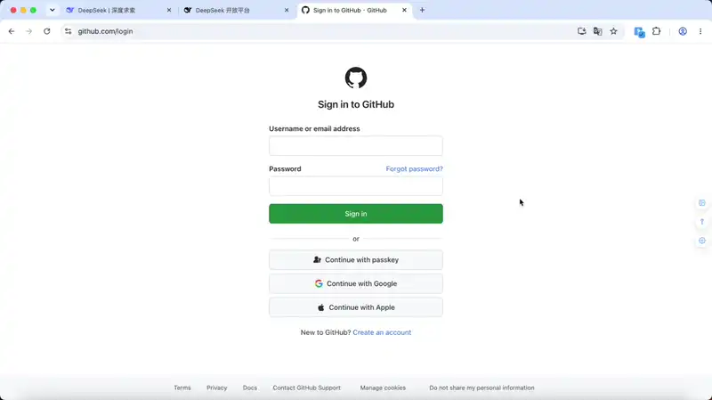

# Account Password Helper · 账号密码管理助手

**中文** | [English](./README.en.md)

[](https://github.com/liaolongdong/account-password-helper/stargazers)
[](https://wxt.dev/)
[](https://vuejs.org/)
[](https://www.typescriptlang.org/)
[](https://element-plus.org/)
[](https://developer.chrome.com/docs/extensions/mv3/intro/)
[](#许可证)
[](https://chromewebstore.google.com/detail/account-password-helper/fgimkdodpjfkddmildjieojpfakpanli)
[](https://chromewebstore.google.com/detail/account-password-helper/fgimkdodpjfkddmildjieojpfakpanli)
[](https://chromewebstore.google.com/detail/account-password-helper/fgimkdodpjfkddmildjieojpfakpanli)
[](https://github.com/liaolongdong/account-password-helper/releases/latest)
[](https://github.com/liaolongdong/account-password-helper/commits/main)

> **开源免费的本地密码管理器** · 一键登录（填充+勾选+点击） · AES-256-GCM 零云端 · TOTP 两步验证 · 安全体检 · 多环境账号隔离 · 从 Chrome / Bitwarden / 1Password 一键迁移 · 为开发者与测试人员量身打造

一款**开源免费**的本地加密 Chrome 密码管理扩展，为开发者与测试人员量身打造：**一键登录**（自动填充 + 勾选协议 + 点击登录，不只是填充）、精确域名匹配隔离 dev/test/staging/prod 多环境账号、内置 **TOTP 两步验证**、安全体检与**密码生成器**。采用 **PBKDF2（600,000 次迭代）+ AES-256-GCM** 加密体系，侧边栏秒开（缓存快路径 **20-50ms**），数据绝不出浏览器，无需注册账号。

> **安全声明**：账号密码管理助手为开发、测试与日常登录场景而生：所有数据仅保存在浏览器本地，经 AES-256-GCM 加密，永不经过网络传输。为保障您的资产安全，建议不要在任何浏览器扩展中存放银行、支付等高敏感凭证。
>
> 🌐 **在线演示**: https://liaolongdong.github.io/account-password-helper/
>
> 📊 **技术亮点**: PBKDF2 600K 迭代 · AES-256-GCM 认证加密 · 侧边栏秒开（缓存快路径 20-50ms）· 6 款主题 · 中英文双语 · 完全离线可用 · 495 项自动化测试

<p align="center">
  
</p>

<p align="center">
  
  <br/>
  <sub>Ctrl+Shift+F → 自动填充 → 勾选协议 → 点击登录 → 2FA 两步验证 → 验证口令 → 登录成功，1 秒完成</sub>
</p>

## 🖥️ 功能展示

<p align="center">
  
  <br/>
  <sub>密码列表管理 — 智能搜索、标签分类、收藏置顶、一键去重</sub>
</p>

<p align="center">
  
  <br/>
  <sub>侧边栏快速填充 — 拼音首字母搜索，命中高亮，秒级响应</sub>
</p>

<p align="center">
  
  <br/>
  <sub>TOTP 两步验证 — 验证码和密码在一起，告别手机验证器</sub>
</p>

<p align="center">
  
  <br/>
  <sub>安全体检仪表盘 — 五维风险检测，全程本地计算</sub>
</p>

<p align="center">
  
  <br/>
  <sub>内联填充迷你面板 — 输入框钥匙图标，点击即填</sub>
</p>

<p align="center">
  
  <br/>
  <sub>6 款色彩主题 + 中英文双语界面，即时切换</sub>
</p>

## ✨ 为什么选择它

| 特性                              | 与其他密码管理器的区别                                                                                 |
| --------------------------------- | ------------------------------------------------------------------------------------------------------ |
| ⚡ **一键登录，不只是填充**       | 快捷键 `Ctrl+Shift+F` 一步完成：填充账号 → 勾选协议 → 点击登录。其他工具只填充，**登录按钮还得自己点** |
| 🎯 **多环境账号隔离**             | 精确域名匹配区分 dev/test/staging/prod——**同一站点的不同环境账号互不混淆**，开发者刚需                 |
| 🔑 **内置 TOTP + 两步登录接力**   | 验证码和密码在一起；GitHub 式两步登录自动衔接活码胶囊，**告别手机验证器，不用切 App**                  |
| 🔒 **纯本地 AES-256-GCM，零云端** | 无云端、无账号、无订阅。数据全部加密在你的浏览器里，**即使服务器被攻破也拿不到你的密码**               |
| 📊 **离线安全体检**               | 一键 0-100 评分：弱密码 / 复用 / 泄露 / 过期 / 未开 2FA 五维检测，**全程离线计算**                     |
| 📦 **一键迁移，零门槛**           | 自动识别 Chrome / LastPass / Bitwarden / 1Password 导出格式，CSV/JSON 双格式，**30 秒搬家**            |

## 适合谁

- **开发者** — 精确域名匹配隔离 dev / test / staging / prod 多环境账号，同一站点不同环境凭证互不混淆
- **测试工程师** — 快速切换测试账号，`Ctrl+Shift+F` 一键登录，跨环境效率翻倍
- **隐私敏感用户** — 纯本地 AES-256-GCM 加密，零网络传输，无需注册账号，无需云端同步
- **日常用户** — 告别记忆密码，内置 TOTP 两步验证，密码生成器一键创建强密码

## 与其他密码管理器的对比

| 功能                           | Account Password Helper |    Bitwarden    | 1Password | Chrome 自带 |
| ------------------------------ | :---------------------: | :-------------: | :-------: | :---------: |
| 价格                           |        完全免费         | 免费 / $10/年起 | $2.99/月  |    免费     |
| 数据存储                       |         纯本地          |      云端       |   云端    |    本地     |
| 需要注册账号                   |           否            |       是        |    是     |     否      |
| 一键登录（填充 + 勾选 + 点击） |           是            |     仅填充      |  仅填充   |   仅填充    |
| 多环境账号隔离                 |           是            |       否        |    否     |     否      |
| 内置 TOTP 验证器               |           是            |  付费版 $10/年  |  付费版   |     否      |
| 离线安全体检                   |           是            |       否        |    否     |     否      |
| 开源（GPL-3.0）                |           是            |       是        |    否     |     否      |

## 核心特性

### 🔐 安全防护

- **浏览器原生强加密**：基于 Web Crypto API，PBKDF2 + AES-256-GCM 加密存储，敏感字段（用户名/密码/URL/备注/TOTP）全部密文，零网络传输
- **灵活的会话管理**：有效期 1 小时\~7 天可选；支持闲置自动锁定、浏览器重启锁定、Popup 一键锁定；剩余时间在管理页/侧边栏/Popup 常驻展示（临近过期变色预警），点击徽标即可续期
- **离线安全体检**：一键 0\~100 综合评分，五维检测（弱密码/复用/泄露/过期/未开 2FA），全程离线计算
- **TOTP 两步验证**：验证码本地生成（RFC 6238），列表/侧边栏实时活码与倒计时；支持扫描网页二维码或上传图片一键添加密钥；GitHub 式两步登录自动衔接活码胶囊，一键填入

### ⚡ 智能填充

- **四重填充策略**：内联填充（输入框钥匙图标，默认）、侧边栏一键填充、右键填充（输入框上右键填充用户名/密码/两步验证码，或生成并填充强密码）、快捷键一键登录（`Ctrl+Shift+F`，填充 + 勾选协议 + 点击登录），桌面通知 + 工具栏角标双通道反馈
- **精确域名匹配**：仅展示与当前 host 完全一致的条目，dev/test/staging/prod 账号互不混淆；`localhost` 默认匹配全部
- **自动保存凭证**：Chrome 式登录捕获与保存确认，智能去重（相同凭证不重复提示、密码变化弹「更新」确认）、域名黑白名单、「不再提示」一键屏蔽；保存弹窗会内联提示弱密码与密码复用风险（只提醒，不影响保存流程）
- **侧边栏快速添加**：侧边栏顶栏「+」随时就地添加账号（当前站点无账号时显示添加邀请），网址自动预填当前域名；TOTP 等完整字段可经「到密码管理中完整添加」录入
- **侧边栏全站搜索**：搜索框右侧图标一键切换「本站 / 全站」范围——默认只看当前域名匹配的账号，全站模式放开为全部条目（切换标签页自动回到本站）；全站命中的外站账号仍可复制账号/密码/验证码、收藏与编辑，点击整行即在新标签页打开该站点；本站无结果而全库有命中时，空态直接给出「在全部条目中查找（N 条）」入口
- **广泛兼容**：动态检测登录表单（含跨 iframe），兼容 React/Vue 等主流框架，支持用户名+密码、手机号+验证码等多种场景
- **密码可见性切换**：为页面密码框注入显隐切换按钮（悬浮按钮偏好设置中开启），填充后一键确认输入内容，无需专门安装额外扩展

### 📦 数据管理

- **导入导出**：CSV / JSON 双格式，自动识别 Chrome、LastPass、Bitwarden、1Password 导出格式，中英文列名自动映射
- **多重备份**：加密备份（.aph）导出/导入（支持解密预览）、邮箱备份（加密/不加密可选）、定时备份提醒
- **高效组织**：标签多选与筛选、收藏置顶（上限可配 + LRU 淘汰）、多字段智能搜索（拼音/首字母缩写，命中高亮）、一键去重、批量删除/编辑标签/导出选中
- **防误操作**：回收站 30 天软删除、密码修改历史（可配置，每条最多 1\~10 份加密快照，可恢复）、修改主密码原子换钥不丢数据

### 🎨 体验

- **主题与语言**：6 款色彩主题 + 中英文双语界面，即时切换无需刷新，扩展页与页面内注入 UI 同步生效
- **网站图标展示**：密码列表、侧边栏与内联下拉面板展示对应网站图标（读取 Chrome 本地图标缓存，零外部请求），长列表辨识更高效
- **密码生成器**：随机密码（长度/字符集/排除易混淆字符可配）与助记词组（EFF Diceware 2048 词库）双模式
- **大写锁定提示**：主密码输入时实时检测 Caps Lock 状态并展示警示，避免大小写输入错误
- **秒开体验**：缓存快路径下侧边栏约 20-50ms 加载完成，会话失效后同样秒开

> 🛠 技术栈、架构设计与项目结构见 [贡献指南](./docs/CONTRIBUTING.md)。
>
> 📖 各功能的实现细节（源码路径、策略说明、参数约束）见 [docs/ARCHITECTURE.md — 功能实现详解](./docs/ARCHITECTURE.md#功能实现详解)。

## 快速开始

### 从 Chrome 应用商店安装（推荐）

直接访问 [Chrome Web Store 页面](https://chromewebstore.google.com/detail/account-password-helper/fgimkdodpjfkddmildjieojpfakpanli)，点击「添加至 Chrome」即可一键安装，后续版本更新由商店自动推送。

### 从 GitHub Releases 下载（无法访问 Google 的用户）

如果你无法访问 Chrome 应用商店（如中国大陆地区用户），可从 [GitHub Releases](https://github.com/liaolongdong/account-password-helper/releases/latest) 下载最新版安装包（zip），手动安装：

1. 下载 zip 并解压到任意目录（请妥善保留该目录，后续更新时需覆盖此目录）
2. 打开 `chrome://extensions/`，开启「开发者模式」
3. 点击「加载已解压的扩展程序」，选择解压后的目录
4. 首次使用需设置主密码（至少 8 位，含字母+数字+特殊字符）

> 💡 手动加载的扩展不会自动更新，但插件会通过 GitHub Releases API 每 6 小时检测新版本，并在 Popup 弹窗中展示更新提示。收到提示后下载新包，将文件覆盖到原安装目录即可。

### 安装与构建（开发者）

```bash
# 安装依赖
pnpm install

# 开发模式（HMR 热更新）
pnpm dev

# 生产构建
pnpm build

# 构建并打包为 zip
pnpm postbuild
```

构建产物在 `.output/chrome-mv3/`，在 `chrome://extensions/` 开启「开发者模式」→「加载已解压的扩展程序」选择该目录即可。

> 📖 更多开发命令与环境要求见 [贡献指南](./docs/CONTRIBUTING.md)。

### 更新版本

- **Chrome 应用商店用户**：版本更新由商店自动推送，无需手动操作。
- **手动加载用户（GitHub Releases 下载 / 开发者）**：只需将压缩包内的文件**直接覆盖**原有安装目录下的文件即可，**切勿**重新选择其他目录加载扩展。Chrome 扩展的本地数据（包括密码数据、配置等）存储在浏览器内部存储空间中，只要扩展 ID 不变，覆盖文件更新不会影响已有数据。如果更换了加载目录，Chrome 会将其视为全新安装，**原有的密码数据将无法访问**。

> 💡 **如何查看当前安装目录**：打开 `chrome://extensions/`，找到「账号密码管理助手」的卡片，点击"详情"，在扩展详情页下方可以看到「来源：/path/to/your/directory」，冒号后面的路径即为当前安装目录。

## 使用指南

1. **初始设置**：安装后点击扩展图标进入密码管理页面，设置主密码并选择会话有效期（默认 24 小时）；「偏好设置」中可配置主题、语言、悬浮按钮、填充方式等
2. **密码管理**：选项页提供完整 CRUD、批量导入导出（导出需验证主密码）、多字段智能搜索（拼音/首字母 + 命中高亮）与排序、标签与收藏
3. **快速填充**：默认内联填充——登录框获焦后显示钥匙图标，点击选择账号即填；可在「偏好设置」切换为「侧边栏」（获焦自动弹出）或「仅手动」，也可使用快捷键或在输入框上右键填充
4. **快捷键**：所有高频操作均有快捷键（Mac 为 `Cmd`），详见下方速查表

### 快捷键速查

| 功能                       | Windows / Linux | macOS         |
| -------------------------- | --------------- | ------------- |
| 打开密码管理页             | `Ctrl+Shift+P`  | `Cmd+Shift+P` |
| 开关侧边栏                 | `Ctrl+Shift+L`  | `Cmd+Shift+L` |
| 一键登录（填充+勾选+点击） | `Ctrl+Shift+F`  | `Cmd+Shift+F` |
| 展开内联填充下拉列表       | `Ctrl+Shift+K`  | `Cmd+Shift+K` |

> 所有快捷键均可在 `chrome://extensions/shortcuts` 中自定义。也可在密码管理页「安全设置 → 快捷键」查看四组按键的当前生效状态（未绑定或被占用的按键会明确标注「未生效」），或从侧边栏「帮助」弹窗的「快捷键」分组一键直达管理页。

> 📖 完整的操作指引与功能演示见[在线演示页面](https://liaolongdong.github.io/account-password-helper/)（含双语 FAQ），或侧边栏内的「帮助」入口。

## 常见问题

**Q：我的密码会被上传到云端吗？**

A：不会。本插件采用纯本地存储方案，所有数据保存在浏览器本地空间，敏感字段经 AES-256-GCM 加密保存，永远不经过任何网络传输。

**Q：忘记主密码怎么办？**

A：主密码无法找回，只能通过「重置」功能清空数据后重新设置。建议定期通过数据导出或加密备份（.aph 文件）功能备份，避免数据丢失。

**Q：会话有效期到了会发生什么？**

A：会话过期后，所有敏感字段会自动重新加密为密文；下次使用时只需重新验证主密码即可恢复访问，账号数据不会丢失。

**Q：侧边栏不显示？**

A：确认 Chrome >= 114，检查页面是否包含登录表单；也可点击插件图标（快捷键 `Ctrl+Shift+L` / `Cmd+Shift+L`），或通过悬浮按钮中的「快速填充」手动打开。

**Q：密码填充不生效？**

A：等待页面完全加载后重试，填充器会依次尝试三种策略（Native Setter / execCommand / 模拟键盘事件）；仍不生效请刷新页面。

**Q：如何自定义快捷键？**

A：在地址栏输入 `chrome://extensions/shortcuts`，找到「Account Password Helper」，点击对应命令右侧的快捷键输入框，按下新的组合键即可修改。也可以从密码管理页「安全设置 → 快捷键」打开一览弹窗，其中「前往修改」按钮直达该页面；弹窗会同时标注哪些按键当前未生效（多因被系统或其他扩展占用，或更新后新增的命令未自动绑定），侧边栏「帮助」弹窗同样提供该一览与入口。

**Q：支持从其他密码管理器导入吗？**

A：支持。在导入弹窗中上传 CSV 文件，插件会自动识别 Chrome、LastPass、Bitwarden、1Password 的导出格式并映射字段。

**Q：删除的密码能找回吗？**

A：能。删除的密码会先移入回收站保留 30 天，在「数据管理」→「回收站」中可恢复或彻底删除；改错密码也可通过条目的「密码修改历史」一键恢复。

**Q：如何开启自动保存登录密码？**

A：在密码管理页「自动保存设置」中开启开关，可选配置域名匹配规则（精确域名/正则）。登录时会弹出确认卡片（保存/暂不保存/不再提示），并可编辑标签和备注。若待保存的密码强度较弱，或已被其它账号共用，卡片会在密码行下方给出内联风险提示；提示仅告知风险，不会拦住保存，也不需二次确认。

**Q：如何切换主题或界面语言？**

A：通过密码管理页「偏好设置」按钮、悬浮按钮齿轮图标或侧边栏齿轮图标进入偏好设置面板，可切换 6 款色彩主题与中文 / English 界面语言，即时生效无需刷新。

**Q：Windows 首次打开侧边栏较慢怎么办？**

A：Windows Defender 会在扩展文件首次加载时逐文件扫描，导致冷启动延迟增加 1-2 秒。建议将 Chrome 扩展目录加入 Defender 排除列表以跳过扫描：打开「Windows 安全中心」→「病毒和威胁防护」→「管理设置」→「排除项」→「添加排除项」→选择「文件夹」→粘贴路径 `%LOCALAPPDATA%\Google\Chrome\User Data\Default\Extensions`。加入后冷启动可从 2-3 秒降至 1 秒以内。Mac 用户无需此操作。

> 📖 更多问题（TOTP 使用与排查、邮箱备份、加密备份、剪贴板清除、收藏上限、性能表现等）见[在线演示页面](https://liaolongdong.github.io/account-password-helper/)的完整 FAQ，或 [docs/ARCHITECTURE.md](./docs/ARCHITECTURE.md) 中对应功能的实现说明。

## 立即体验

🔗 [Chrome 应用商店安装](https://chromewebstore.google.com/detail/account-password-helper/fgimkdodpjfkddmildjieojpfakpanli) · [GitHub Releases 下载](https://github.com/liaolongdong/account-password-helper/releases/latest) · [在线演示](https://liaolongdong.github.io/account-password-helper/)

如果本项目对您有帮助，请帮忙点个 ⭐️、写个商店评价——这是对开源贡献者最大的支持！

🔥 **立即开始**：[Chrome 应用商店安装](https://chromewebstore.google.com/detail/account-password-helper/fgimkdodpjfkddmildjieojpfakpanli)（一键安装，自动更新） · [GitHub Releases 下载](https://github.com/liaolongdong/account-password-helper/releases/latest)（无法访问 Google 的用户）

欢迎提交 Issue 和 Pull Request！完整变更记录见 [CHANGELOG.md](./CHANGELOG.md)。

## 安全提醒

- 账号密码管理助手为开发、测试与日常登录场景而生，建议不要在任何浏览器扩展中存放银行、支付等高敏感凭证；
- 主密码遗忘**无法恢复**，请务必牢记并妥善保管；
- 所有数据本地 AES-256-GCM 加密存储，零网络传输；
- 建议定期通过加密备份功能（.aph 文件）导出备份；
- 建议开启剪贴板自动清除与闲置自动锁定；对安全性要求较高时，建议开启「浏览器重启锁定」。

## 许可证

本项目采用 GNU GPL-3.0 开源协议（仅 v3 版本，不含"或更高版本"）。

- 允许自由使用、修改与分发（含商用），但**衍生作品必须以 GPL-3.0 同等开源**，禁止闭源分发。
- 插件名称 "Account Password Helper（账号密码管理助手）"、logo 及品牌素材为作者商标，不在协议授权范围内，详见 [THIRD-PARTY-NOTICES.md](./docs/THIRD-PARTY-NOTICES.md)。
- 本项目打包了第三方依赖（含 Apache-2.0 协议的 jsQR），归属声明见 [THIRD-PARTY-NOTICES.md](./docs/THIRD-PARTY-NOTICES.md)。
- 本仓库已发布的历史版本仍按当时的 MIT 协议存续，GPL-3.0 自切换后的新版本起生效。

## 联系方式

邮箱：[924902324@qq.com](mailto:924902324@qq.com?subject=账号密码管理助手反馈)

**微信交流群**：扫描下方二维码添加作者微信（微信号：`lld_1025`），备注「aph」邀你加入插件交流群，反馈问题、交流使用心得。


---

> 📅 文档最后更新：2026-08 · 对应版本 [v3.7.0](https://github.com/liaolongdong/account-password-helper/releases/latest)
