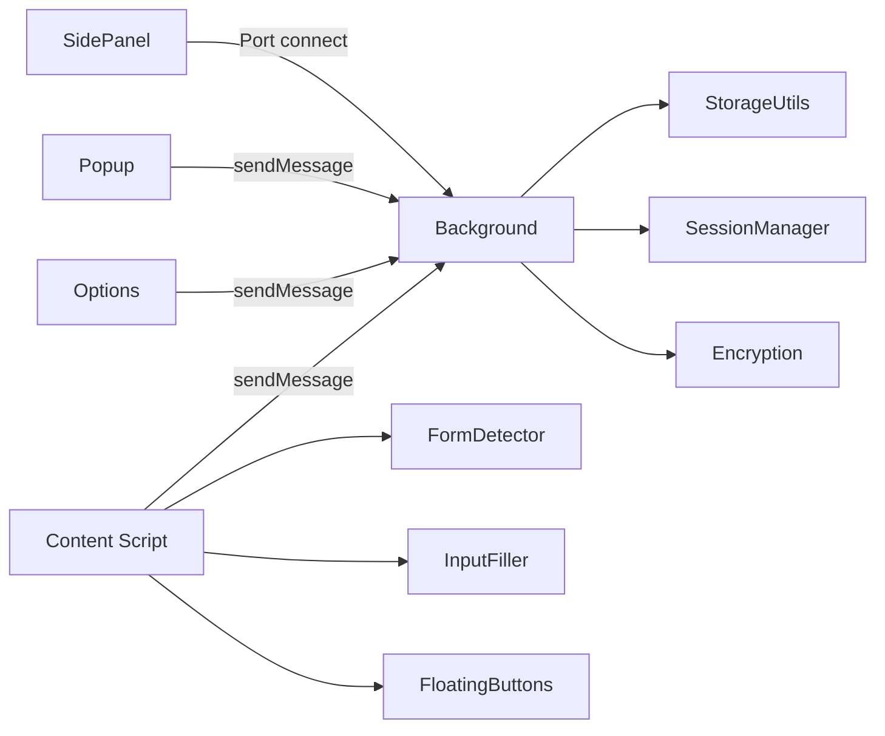
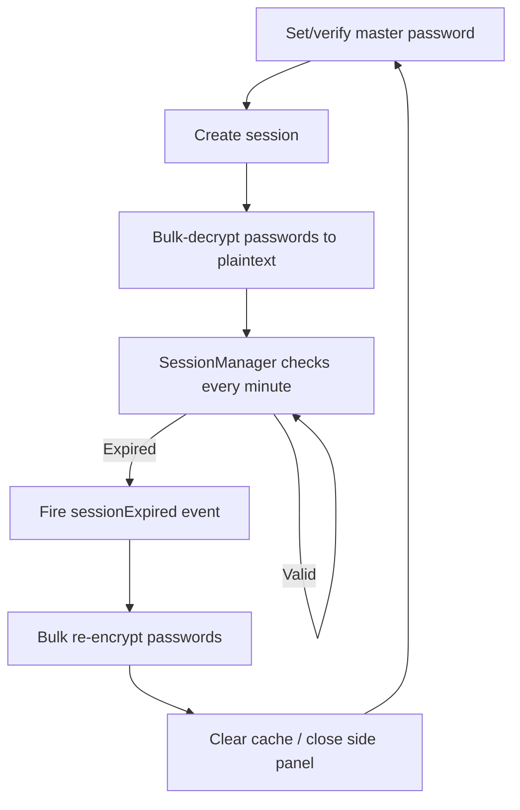

# Architecture & Implementation Details

[中文](./ARCHITECTURE.md) | **English** · [Back to README](../README.en.md)

This document targets developers and contributors, covering the architecture design, full project structure, and per-feature implementation details of Account Password Helper. For user-facing installation and usage, see the [README](../README.en.md).

## Table of Contents

- [Architecture](#architecture)
  - [Entrypoints](#entrypoints)
  - [Messaging & Data Flow](#messaging--data-flow)
  - [Session Lifecycle](#session-lifecycle)
  - [Encryption Scheme](#encryption-scheme)
- [Project Structure](#project-structure)
- [Feature Implementation Details](#feature-implementation-details)
- [Development Extras](#development-extras)

## Architecture

### Entrypoints

| Entrypoint         | Responsibility                                                                                                                                                                                                                               |
| ------------------ | -------------------------------------------------------------------------------------------------------------------------------------------------------------------------------------------------------------------------------------------- |
| **Background**     | Service worker: message routing (discriminated unions), password cache (domain-agnostic), side panel state (port tracking), shortcuts; 6 submodules: router / cache / side panel / options page / auto-save / services (keep-alive + alarms) |
| **Content Script** | Injected into all pages; initializes form detection and the floating button                                                                                                                                                                  |
| **Popup**          | Extension icon popup with "Manage Passwords" and "Quick Fill" entries                                                                                                                                                                        |
| **Options**        | Main manager page: full CRUD, import/export, session/validity management                                                                                                                                                                     |
| **SidePanel**      | Quick fill panel with search, sorting, domain matching, cache acceleration                                                                                                                                                                   |

### Messaging & Data Flow



- Background is the message routing hub for cross-component communication
- SidePanel connects via `chrome.runtime.connect()` ports for reliable state tracking
- Content scripts use `chrome.runtime.sendMessage()`

### Session Lifecycle



### Encryption Scheme

```
Master password + salt → PBKDF2 (600,000 iterations) → 256-bit key
Plaintext + key + random IV → AES-256-GCM → Base64(IV + ciphertext)
```

- Encrypted sensitive fields: `username`, `password`, `url`, `remark`, `totp`
- Empty fields skip encryption (stored as empty strings); Base64 decode failures degrade safely to the original data; GCM decryption failures throw for the caller to handle
- The in-memory master password copy is re-encrypted with an HKDF + SHA-256 derived session key via AES-256-GCM before persisting to chrome.storage.local

## Project Structure

See the annotated tree in the Chinese version: [ARCHITECTURE.md — 项目结构](./ARCHITECTURE.md#项目结构) — paths and file names are identical. Top-level layout:

```
├── entrypoints/        # WXT entrypoints: background/, content/, popup/, options/, sidepanel/
├── components/         # Vue components (options/ and sidepanel/ subfolders)
├── composables/        # Vue composables (auth, session, side panel, TOTP, shortcuts...)
├── utils/              # Core library: storage/, i18n/, encryption, session, backup, health...
├── assets/             # Source SVG icons and CSS design tokens
├── public/icon/        # Build-time PNG icons (auto-injected into the manifest by WXT)
├── scripts/            # Icon generation and repo automation scripts
└── wxt.config.ts       # WXT configuration
```

## Feature Implementation Details

### 1. Security

- Master password requires at least 8 characters including letters, digits, and special characters.
- After a session is created, passwords are decrypted into an in-memory cache; they re-encrypt automatically when the session expires.
- Inconsistent encryption states are detected and repaired automatically after session recovery.
- SessionManager checks session validity every minute and on page visibility changes.

### 2. Form Detection & Filling

- Detects username, password, phone, and verification-code fields; auto-checks "Remember me" and "Agree to terms" checkboxes.
- WeakMap / WeakSet caches field classification results to avoid memory leaks.
- Fill strategy degrades automatically: **Native Setter → execCommand → simulated keyboard events**.
- The floating button offers an "Auto login trigger" switch: after filling, the login button inside the form is clicked automatically (see [SettingsPanel.ts](../entrypoints/content/floatingButtons/SettingsPanel.ts) / [FormDetector.ts](../entrypoints/content/FormDetector.ts)).

### 3. Data Management

- CSV import/export (.csv) with a standard template download.
- JSON import/export: export password data as JSON (master password required), filename `passwords_YYYYMMDD_HHmmss.json`; JSON import is also supported.
- Tag multi-select with custom tags (up to 3 per entry, max 30 chars each); identical tags keep stable, consistent colors (see [utils/tagUtils.ts](../utils/tagUtils.ts)).
- Password list sorts by update time (desc) by default; the side panel sorts by recent usage. Sortable by username, URL, tag, remark, and create/update time.
- Multi-field fuzzy search across username, tag, remark, and URL.
- Batch selection and batch deletion of entries; deleted entries go to the trash for 30 days and can be restored anytime.
- Favorites: star frequent entries and filter with "favorites only"; configurable limit (1–50) with LRU eviction when exceeded; filling from the side panel refreshes the usage timestamp for accurate LRU.
- One-click dedup: detects duplicates (same username + same URL) and cleans them up after confirmation.
- Multi-format CSV import: auto-detects Chrome, LastPass, Bitwarden, and 1Password export formats (see [utils/excel.ts](../utils/excel.ts)).

### 4. Auto-Save Login Credentials

- When enabled, credentials are captured on site login with a confirmation prompt (see [LoginAutoSave.ts](../entrypoints/content/LoginAutoSave.ts)).
- Three capture scenarios: form submit (capture phase), login button click, and Enter key in the password field.
- Domain rules support exact domains and regular expressions; empty rules match all domains (see [AutoSaveSettingDialog.vue](../components/options/AutoSaveSettingDialog.vue)).
- sessionStorage staging preserves credentials across page navigation caused by traditional form submits.
- After saving, a desktop notification is sent and the password cache is invalidated so the next load gets fresh data.
- **Three-option interaction**: the prompt offers "Save", "Not now", and "Never".
- **Editable fields**: besides showing the account and password, the prompt provides editable **tag** (defaults to the page title) and **remark** (defaults to "Auto-saved") inputs.
- **Smart update strategy**: same account + same domain with a changed password triggers an "Update" confirmation that keeps existing tags and remarks (unless edited in the prompt); identical credentials are skipped; new accounts create new entries.
- **Blocklist**: clicking "Never" adds the current domain to the block list (see [SavePasswordPrompt.ts](../entrypoints/content/SavePasswordPrompt.ts)); no prompts appear for that domain until it is removed under "Blocked domains" in settings.
- **Anti-duplicate**: before prompting, the background is queried for the domain + account status in the vault (see `checkCredentialStatus` in [autoSaveManager.ts](../utils/storage/autoSaveManager.ts)): identical credentials stay fully silent (persistently across logins); changed passwords open an "Update" prompt; new accounts open a "Save" prompt. A same-page fingerprint debounce (username + password length, see [LoginAutoSave.ts](../entrypoints/content/LoginAutoSave.ts)) absorbs the triple trigger of submit/click/Enter.

### 5. Email Backup

- Exports the password list as a data file and launches the mail client (see [utils/emailBackup.ts](../utils/emailBackup.ts)).
- Backup modes: "Plain backup" exports a standard data file; "Encrypted backup" exports an .aph file (viewable only via this extension's "Encrypted Backup Import" with the original master password).
- Scheduled backup reminders via chrome.alarms desktop notifications (no decryption, no automatic downloads).
- Intervals: daily / every 3 days / weekly / biweekly / monthly.

### 6. Encrypted Backup Import/Export

- Export: all password data is AES-GCM encrypted with the master password and downloaded as an `.aph` file (see [utils/backupExport.ts](../utils/backupExport.ts)), filename `backup_YYYYMMDD_HHmmss.aph`.
- Import: upload an `.aph` file, enter the master password used at export time, preview the first 5 entries, then confirm (see [BackupImportDialog.vue](../components/options/BackupImportDialog.vue)).
- Scheme: PBKDF2 (600,000 iterations) + AES-256-GCM + random salt + random IV — stronger than regular storage.

### 7. Password Visibility Toggle

- Injects a show/hide toggle into page password fields (see [PasswordVisibilityToggle.ts](../entrypoints/content/PasswordVisibilityToggle.ts)); off by default, enable it in the floating button settings panel.
- Toggles are injected uniformly into all password fields, styled in Element Plus theme blue, visible when the field has a value.
- MutationObserver watches for dynamically added password fields and injects automatically.
- Can be switched on/off in the floating button settings panel.

### 8. Auto Idle Lock & Lock on Browser Restart

- Configure the idle period (5/10/30/60 minutes or off) under "Auto lock settings"; exceeding it clears the master password session and locks the manager (see [IdleLockSetting.vue](../components/options/IdleLockSetting.vue)).
- Unlocking requires the master password again — consistent with manual lock and session expiry.
- **Lock on browser restart**: when enabled, fully closing and reopening the browser requires the master password again (more secure); when off, you stay signed in within the validity period.
- The popup also provides a one-click "Lock" button to clear the current session.

### 9. Password Strength Visualization

- While setting the master password or editing entries, a popover shows the strength level (weak/medium/strong) and a progress bar in real time (see [PasswordStrengthPopover.vue](../components/options/PasswordStrengthPopover.vue)).
- Rule-by-rule validation: at least 8 characters, letters, digits, special characters — pass/fail at a glance.
- Built on the reusable [usePasswordStrength](../composables/usePasswordStrength.ts) composable.

### 10. Security Health Dashboard

- Click "Health Check" in the top toolbar (with a health signal dot) to open the dashboard dialog (see [PasswordHealthDialog.vue](../components/options/PasswordHealthDialog.vue)).
- Overall score (0–100) + grade (excellent/good/fair/poor) with an animated ring (see [utils/passwordHealth.ts](../utils/passwordHealth.ts)).
- Five checks: weak passwords, reused passwords (grouped display), commonly leaked passwords (offline top-1000 dictionary, see [utils/weakPasswordDict.ts](../utils/weakPasswordDict.ts)), long-unchanged passwords (90/180/365-day tiers), and entries without 2FA (informational only, not scored).
- Score weights: reuse 35% + weak 25% + leaked 20% + stale 20%, deducted linearly by affected ratio.
- Set expiry reminders for stale entries (7/30/90 days etc.); background alarms send desktop notifications that link back to the manager (see [utils/storage/reminderManager.ts](../utils/storage/reminderManager.ts)).
- Detail sections expand/collapse; each issue has a "Fix" button jumping straight into editing that entry.
- Fully local computation (offline dictionary lazily loaded); online breach checks (e.g. HIBP) are deliberately excluded; no plaintext passwords returned; zero network transfer.
- The signal dot next to the entry button changes color with the health grade (green/blue/orange/red).

### 11. Quick Fill

- The side panel puts passwords matching the current domain first.
- **Exact domain matching**: only entries whose host exactly matches the current page are shown (no subdomain/parent-domain fuzzy matching), keeping multi-environment accounts apart (e.g. `fat.example.com` vs `uat.example.com`); entries without a URL always show.
- **Local dev friendly**: on `localhost` or `127.0.0.1`, all passwords match by default (see [sidepanel/App.vue](../entrypoints/sidepanel/App.vue)).
- Click an entry to fill and auto-close the side panel; if no login form is present, a "no login form detected" notice appears.
- Side panel entries can jump to the manager to edit that entry or add a new one.
- Shortcuts:
  - `Ctrl+Shift+P` / `Cmd+Shift+P`: open the password manager
  - `Ctrl+Shift+L` / `Cmd+Shift+L`: toggle the side panel
  - `Ctrl+Shift+F` / `Cmd+Shift+F`: quick-fill credentials on the current page (fills the same entry as the top of the side panel list, no panel needed; feedback via desktop notification + toolbar badge, see [quickFillHandler.ts](../entrypoints/background/quickFillHandler.ts))
  - Shortcuts are customizable — see [README — FAQ](../README.en.md#faq)
- Background maintains a password cache; the side panel reads the cache first and validates asynchronously.

### 12. Update Detection

- Periodically checks the latest version via the GitHub Releases API (see [utils/updateChecker.ts](../utils/updateChecker.ts)).
- Checks every 6 hours; when a new version is found, the popup shows an update notice with version and changelog.
- Clicking the notice opens the GitHub Releases page.
- Results are cached for 24 hours to avoid excessive requests; the cache refreshes automatically after expiry.

### 13. Password Generator (Random / Passphrase)

- In the add/edit form, a magic-wand button (`MagicStick` icon) next to the password field opens the generator, with a toggle between **Random** and **Passphrase** modes.
- **Random mode**: custom length (6–50) and character set switches (upper / lower / digits / specials); optionally exclude ambiguous characters (1, l, I, 0, O).
- **Passphrase mode**: built on the EFF Diceware idea — 3–8 random words from a built-in 2048-word English list (e.g. `Apple-River-Cloud-Tiger42`), with 5 separator options (`-`/`_`/`.`/space/none), capitalization switch, and 1–4 trailing random digits; a 4-word phrase carries ≈44 bits of entropy — secure yet memorable (see [utils/passphraseGenerator.ts](../utils/passphraseGenerator.ts)).
- Live strength bar after generation; click "Use this password" to fill the form.
- Backed by the Web Crypto API (`crypto.getRandomValues`) for cryptographic randomness (see [utils/passwordGenerator.ts](../utils/passwordGenerator.ts)).

### 14. Clipboard Auto-Clear

- After copying a password from the side panel, a timer clears the clipboard after the configured delay.
- Delay options: 10/15/30/60/120 seconds, default 30 (see [ClipboardSettingDialog.vue](../components/options/ClipboardSettingDialog.vue)).
- Before clearing, the clipboard content is verified as unchanged (Async Clipboard API preferred; best-effort clearing when unfocused).
- Copying a username cancels the password-clear timer to avoid wiping the username.
- Configured under "Data Management" → "Clipboard Settings" on the management page.

### 15. Two-Factor Authentication (TOTP)

- Paste an `otpauth://` link or Base32 secret into the "2FA" field of the add/edit form (see [PasswordFormDialog.vue](../components/options/PasswordFormDialog.vue)).
- Codes are computed locally per RFC 6238 using [Web Crypto API](https://developer.mozilla.org/en-US/docs/Web/API/Web_Crypto_API) HMAC — **no network requests**, consistent with the extension's zero-network stance (see [utils/totp.ts](../utils/totp.ts)).
- The list and side panel show live codes with a ring countdown (color shift in the last 5 seconds, see [TotpCode.vue](../components/TotpCode.vue)).
- Side panel entries offer "Fill code" and "Copy code": filling writes into detected verification-code inputs (reusing selectors like `autocomplete="one-time-code"`), triggered only on explicit click.
- TOTP secrets are sensitive fields encrypted under the master password scheme (AES-256-GCM) and travel with CSV / JSON / encrypted (.aph) import/export; `totp` columns from LastPass exports migrate directly.
- Supports custom algorithms (SHA1/256/512), digits (6–8), and period (default 30s), parsed from the `otpauth://` URI; bare secrets fall back to defaults.

#### Troubleshooting verification failures

- **One secret per service**: e.g. GitHub binds exactly one TOTP secret per account. Whichever authenticator completes "verify" owns the binding; older secrets elsewhere become invalid.
- **Multiple authenticators**: within a single setup session, enter the same displayed secret into all authenticators (this extension, Google Authenticator, etc.) before clicking verify; do not refresh the setup page — refreshing regenerates the secret and desynchronizes them.
- **Accurate clock required**: codes are computed from absolute UTC time; a clock drift beyond ~30 seconds fails verification. Enable automatic time sync.
- **Matching parameters**: defaults are SHA-1 / 6 digits / 30 seconds (mainstream); if your `otpauth://` link carries non-default parameters (e.g. SHA-256, 8 digits), they are honored and must match the server (check the parsed parameters in the form preview).

### 16. Themes

- 6 color themes: Sky Blue (default), Bamboo Green, Peach Pink, Sakura Purple, Sunset Orange, Mist Gray (see [utils/theme.ts](../utils/theme.ts)).
- Theme preference is stored with the floating button preferences; three entries into settings: ① "Preferences" button on the management page; ② floating button gear icon; ③ side panel gear icon.
- Extension pages (manager, side panel, popup) theme consistently via the `data-theme` attribute + CSS design tokens ([tokens.css](../assets/theme/tokens.css)).
- Content-script Shadow DOM components (floating button, inline fill panel, visibility toggle) receive inline theme tokens, synchronized with extension pages.
- Theme changes apply instantly, no refresh needed.

### 17. Inline Fill

- An alternative to the side panel (see [InlineFillDropdown.ts](../entrypoints/content/inlineDropdown/InlineFillDropdown.ts)) — fill directly in the page without opening the side panel.
- In "Inline" mode, a key icon appears at the inner-right edge of a focused login field (auto-avoiding any existing visibility eye icon).
- Clicking the key icon blurs the field (closing Chrome's native password dropdown) and opens a mini panel: search bar on top + scrollable account list + "Password Manager" entry at the bottom.
- Keyboard navigation: `↑` / `↓` browse, `Enter` fills the highlighted item, `Esc` closes the panel.
- The panel shows only account metadata (username, tag, remark, URL); the password is delivered transiently by the background only upon explicit selection — same security model as the side panel.
- When the session is locked, the panel shows an "unlock to fill" guide linking to the manager for master password verification.
- Closed Shadow DOM (`all: initial`) fully isolates page styles; theme tokens are written inline on the host element and follow the global theme.

### 18. Trash Bin

- Deleting passwords (single or batch) no longer erases them — entries move to the trash as a soft delete and stay for **30 days** (see [utils/storage/trashManager.ts](../utils/storage/trashManager.ts)).
- Entry point: "Data Management" menu → "Trash" on the manager page, opening the trash dialog (see [TrashDialog.vue](../components/options/TrashDialog.vue)).
- Each row supports "Restore" (back to the list) and "Delete permanently"; the footer offers "Empty trash". Permanent deletion also cleans the entry's password history and expiry reminders.
- Entries older than 30 days are removed automatically by a background alarm; trash entries stay encrypted — username/URL decrypt for display only within a valid session, placeholders show when locked.

### 19. Password Change History

- When a password field changes on edit, the old ciphertext is snapshotted into history (see [utils/storage/passwordHistory.ts](../utils/storage/passwordHistory.ts)); each entry keeps the latest **5** records, oldest evicted automatically.
- The edit dialog shows a "Password history" section (edit mode with history only): each record shows the change time and a mask, with "Copy" and "Restore" buttons — restore fills the old password back into the form.
- History is stored encrypted, never in plaintext; viewing/restoring requires a valid session; history is purged with permanent deletion and re-encrypted on master password change.

### 20. Master Password Change

- Entry point: "Settings" menu → "Change master password" on the manager page (see [ChangeMasterPasswordDialog.vue](../components/options/ChangeMasterPasswordDialog.vue)).
- Flow: verify the current master password → decrypt all data (passwords + trash + history) with the old key → re-encrypt with the new key → a single **atomic** `chrome.storage.local.set()` writes ciphertext and the new session key (see [utils/storage/changeMasterPassword.ts](../utils/storage/changeMasterPassword.ts)).
- Safety: any failure before the write aborts with data untouched — there is no "new ciphertext + old session key" intermediate state.
- Session self-healing: other open extension pages (side panel/popup) detect the rekey and adopt the new session key automatically — no re-login, no cleared lists (see `adoptRekeyedSession` in [utils/sessionManager-storage.ts](../utils/sessionManager-storage.ts)).
- Encrypted backups (.aph) are unaffected: imports decrypt with the password used at export time.

### 21. Quick-Fill Shortcut

- Press `Ctrl+Shift+F` / `Cmd+Shift+F` to fill credentials on the current page without opening the side panel (see [quickFillHandler.ts](../entrypoints/background/quickFillHandler.ts)).
- The filled entry matches the top of the side panel list (domain match first + favorites pinned + sort config); with multiple matches, the notification states which entry was filled and how many matched — open the side panel to switch.
- Unverified session → notification to verify first; no match for the domain → "no matching account"; page not ready (stale tab after an extension update) → refresh guidance.
- Dual-channel feedback: desktop notification + toolbar icon badge (green check on success / red exclamation on failure, auto-cleared after 3 seconds) — covering cases where system notifications are disabled.
- Successful fills silently refresh the entry's last-used time, keeping the side panel's recency sort accurate.

## Development Extras

### Icon Workflow

1. Edit or replace [assets/icons/icon.svg](../assets/icons/icon.svg) (pick one from [variants](../assets/icons/variants) if desired)
2. Run `pnpm icons:build` to generate `public/icon/{16,32,48,96,128}.png`
3. WXT picks them up automatically as `manifest.icons` and `action.default_icon` — no explicit declaration in [wxt.config.ts](../wxt.config.ts) needed

### Test Page

The repo includes [test-page.html](../test-page.html) for regression testing of form detection and auto-fill.

### Performance Design

- During a valid session, the service worker stays alive via a 1-minute keep-alive alarm so the password cache is always in memory — the side panel loads from cache in ~20–50ms with no cold-start delay.
- The worker pre-warms the password cache 500ms after startup, further improving the first side panel open.
- Keep-alive runs only during valid sessions and stops after expiry, so battery impact is minimal.
