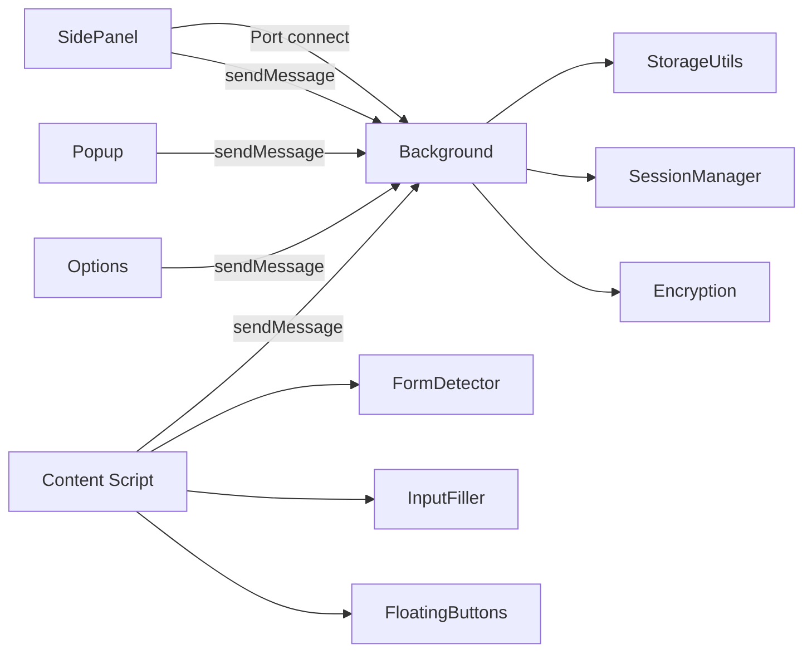
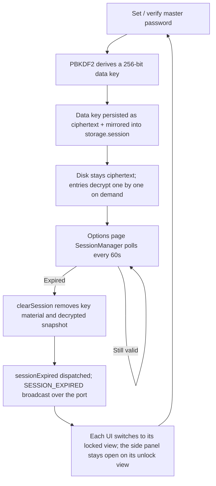

# Architecture & Implementation Details

[中文](./ARCHITECTURE.md) | **English** · [Back to README](../README.en.md)

This document targets developers and contributors, covering the architecture design, full project structure, and per-feature implementation details of Account Password Helper. For user-facing installation and usage, see the [README](../README.en.md).

## Table of Contents

- [Architecture](#architecture)
  - [Entrypoints](#entrypoints)
  - [Messaging & Data Flow](#messaging--data-flow)
  - [Content Script Runtime Constraints](#content-script-runtime-constraints)
  - [Session Lifecycle](#session-lifecycle)
  - [Encryption Scheme](#encryption-scheme)
- [Project Structure](#project-structure)
- [Feature Implementation Details](#feature-implementation-details)
- [Development Extras](#development-extras)

## Architecture

### Entrypoints

| Entrypoint         | Responsibility                                                                                                                                                                                                                                                                                                  |
| ------------------ | --------------------------------------------------------------------------------------------------------------------------------------------------------------------------------------------------------------------------------------------------------------------------------------------------------------- |
| **Background**     | Service worker: message routing (discriminated unions), password cache (domain-agnostic), side panel state (port tracking), shortcuts; background submodules: router / cache / side panel / options page / auto-save / quick fill / context menu / inline dropdown / quick add / services (keep-alive + alarms) |
| **Content Script** | Injected into all pages; initializes form detection and the floating button                                                                                                                                                                                                                                     |
| **Popup**          | Extension icon popup with "Manage Passwords" and "Quick Fill" entries                                                                                                                                                                                                                                           |
| **Options**        | Main manager page: full CRUD, import/export, session/validity management                                                                                                                                                                                                                                        |
| **SidePanel**      | Quick fill panel with pinyin smart search and match highlighting, sorting, domain matching (This-site / All-entries scope), cache acceleration, in-place quick add                                                                                                                                              |

### Messaging & Data Flow



- Background is the message routing hub for cross-component communication; message types are discriminated unions (`MessageType` in `utils/types.ts`)
- SidePanel opens a port via `chrome.runtime.connect({ name: 'sidepanel' })`, used for the open/ready handshake, the lock broadcast, and liveness tracking through a 25-second heartbeat
- SidePanel request/response operations (filling, cache updates, quick add, opening the options page) still go through `chrome.runtime.sendMessage()`
- Content scripts, Popup and Options communicate via `chrome.runtime.sendMessage()`

### Content Script Runtime Constraints

- **Injection scope**: [entrypoints/content.ts](../entrypoints/content.ts) declares `matches: ['<all_urls>']` with `allFrames: true`. Form detection and the auto-save listener initialize in **every frame** (login forms inside iframes must still be detected and captured), while the floating button, the save prompt, and delegated notifications render only in the **top frame** — otherwise every iframe would inject a duplicate, with broken positioning.
- **Style isolation**: two tiers, described as implemented. ① **Closed Shadow DOM** (reset with `all: initial`, themed by **inline** `--aph-*` tokens, stacked at `z-index 2147483647`, shadow root references never exposed): the floating button, the inline fill panel, the TOTP capsule, the fill-failure guidance bubble and the save-password prompt (its host hangs off `documentElement`, `data-aph="save-password-prompt"` being the only handle to locate the node from outside the shadow tree; its keyframes live inside the shadow scope, so no stylesheet reaches `document.head`). ② **light DOM** (nodes appended straight to the page, scoping relying on extension-owned class names, theme tokens written inline on the element itself): the password visibility toggle (a stylesheet injected once into `document.head` keyed by element id) and the native notification bar (no stylesheet at all, everything inlined via `cssText`, **fixed colors that do not follow the theme**). Neither tier may depend on page globals, and neither may render untrusted DOM/message text through `innerHTML`/`v-html`.
- **Plaintext boundary across frames**: credentials captured inside an iframe are delegated to the top frame for rendering through `window.top.postMessage`; the result is sent back with `targetOrigin` pinned to the sender's origin. Save-prompt delegation must first pass `isSameMainDomain(event.origin, location.origin)`, so a cross-origin iframe can never leak a plaintext password to a third-party page. Notification delegation is allowed cross-origin (that case genuinely exists) but is treated as untrusted input on both ends: the sending side pins `targetOrigin` to the top origin resolved from `location.ancestorOrigins` (when it cannot be resolved nothing crosses frames and the notification renders in the current frame), while the receiving side strictly validates type and length and rate-limits it (at most 5 per 10-second sliding window). The same rule applies in reverse — plaintext credentials are only delivered to the top frame or same-main-domain frames (`isFrameFillable`).
- **Listener lifecycle**: every DOM listener is registered through WXT's `ctx.addEventListener` (removed automatically when the extension context invalidates), and `ctx.onInvalidated` plus `beforeunload` run a shared `cleanup()` that tears down the listeners, MutationObservers, and injected UI of FormDetector / LoginAutoSave / the floating button manager. This is the root-cause fix for stale scripts calling chrome APIs after a reload and throwing `Extension context invalidated`; new listeners must not bypass it.
- **Detection cadence**: the first scan runs 3 seconds after `DOMContentLoaded` (500ms when the document is already loaded), and the MutationObserver debounces re-scans at 500ms over `document.body` with `childList + subtree + attributes(class/style/placeholder)`. SPA route changes are folded into the same observer instead of a second one, and `popstate` only covers back/forward. Before filling, `waitForFieldsDetected()` retries up to 10 times with a 100ms start, 1.5× backoff, capped at 2000ms; moments that can trigger a re-render, such as `blur`, use the event-driven `waitForDomStable(quietMs=50, budgetMs=300)` to wait for DOM quiet instead of a fixed sleep.
- **Pre-warming**: `preWarmServiceWorker()` fires from three places — `focusin` on form inputs, `visibilitychange` in the top frame, and 100ms after initialization — waking the SW in parallel with the user's action so the subsequent `sidePanel.open()` pays no cold start (see "Side Panel Instant-Open: Cross-Platform Strategy").

### Session Lifecycle



- The session checker in `sessionManager.ts` starts only on the Options page via `initSessionManager()` (`window.setInterval`, 60 seconds, firing an expiry event only on a valid→invalid transition so opening the page with no session never raises a false alarm). SidePanel and Popup do not wait for that poll: they react immediately to the port's `SESSION_EXPIRED` broadcast, `chrome.storage.onChanged`, and `visibilitychange`.
- `isSessionValid()` results are cached with a 5-second TTL (`sessionManager-storage.ts`), and lock/rekey/clear-session points invalidate that cache proactively, so hot paths don't hit storage repeatedly.
- Session validity defaults to **24 hours**, selectable across 1/2/4/8/12/24 hours and 3/5/7 days (see [ValidityHoursSelect.vue](../components/options/ValidityHoursSelect.vue)).
- Expiry, idle lock, and manual lock all funnel through the same `clearSession()`: it removes key material, the decrypted snapshot, the CryptoKey handle cache, and the two derived memo caches **keyed by plaintext entry fields** (pinyin match ranges, tag presentation records) from memory and `storage.session`. Entries on disk are already ciphertext — **there is no "bulk decrypt to plaintext" step and no "bulk re-encrypt on expiry" step**.
- Those two caches are module-level `Map`s, so they only exist in the contexts that actually loaded the module, and each context wires its own cleanup trigger (a registry in `utils/plaintextCacheCleanup.ts` plus one call site per context): Background on `clearSession()` and `resetSessionMemoryState()` (the latter driven by the storage-change listener); SidePanel on both its lock and expiry paths in `useSidepanelData.ts`; Options on a `flush: 'sync'` watcher of `isAuthenticated` turning false — the options page can stay open for days, and on a cross-context lock it only flips that flag (`clearSession()` already ran elsewhere), so hooking only the `onSessionExpired` callback would miss the other four transition paths such as the `checkAuth` self-check. Popup and content script never write these caches (the inline dropdown uses pure helpers like `getTagColor`/`parseTags`, and the pinyin matcher is never warmed there), so they need no wiring. [plaintextCacheCleanupWiring.test.ts](../tests/architecture/plaintextCacheCleanupWiring.test.ts) guards this invariant via dependency closures.
- The idle lock (`chrome.idle`) and the browser-restart lock are **two opt-in switches that default to off** (`idleLockMinutes: 0`, `relockOnBrowserRestart: false`).

### Encryption Scheme

```
Salt: 16 random bytes → 32 hex chars, stored in plaintext under master_password_config
Master password + salt → PBKDF2-SHA256, 600,000 iterations → 256-bit data key
Plaintext + data key + a fresh random 12-byte IV per call → AES-256-GCM → Base64(IV[12B] ‖ ciphertext ‖ auth tag[16B])
```

- Encrypted sensitive fields: `username`, `password`, `url`, `remark`, `totp`. Metadata such as `id`, `tag`, `createTime`, `updateTime`, `order`, `favorite`, and `lastUsedAt` stays in plaintext so sorting and filtering work without decryption.
- Empty fields are not encrypted (written as empty strings). A Base64 parse failure degrades safely by returning the original data; a GCM decryption failure throws and lets the caller decide — the auth tag makes tampering detectable, with no silent fallback.
- **The master password is never persisted.** On disk there is only a verifier hash: `deriveVerifierHash` uses the same PBKDF2-SHA256 / 600,000 iterations but domain-separates the salt with the `aph-verify|` prefix, so the verifier and the decryption key are cryptographically independent and the stored verifier cannot be turned back into a key. Comparison runs in constant time. Legacy single-round SHA-256 verifiers are upgraded transparently on successful verification.
- **Session key**: the derived data key is wrapped with a freshly generated random wrap key (`session_wrap_key`) using the same AES-256-GCM and stored as `session_wrapped_data_key`. Both must land in one atomic `chrome.storage.local.set()`, otherwise concurrent writes from multiple contexts can pair "A's wrap key with B's ciphertext". The plaintext data key is additionally mirrored in `storage.session` (memory only, cleared when the browser closes).
- **HKDF exists only on the legacy migration path**: `deriveSessionKey(salt)` (HKDF-SHA256, salt `aph-session-salt`, info `session-encryption-v2`) is used solely to unwrap the historical `session_master_password` blob. Its input is a publicly readable salt, so it provides no confidentiality against disk access and plays no part in the current session flow.
- `ensurePasswordsEncryptedAtRest` maintains the "ciphertext at rest" invariant idempotently within each SW lifetime, with a storage watcher as a backstop that flags plaintext anomalies.

## Project Structure

See the annotated tree in the Chinese version: [ARCHITECTURE.md — 项目结构](./ARCHITECTURE.md#项目结构) — paths and file names are identical. Top-level layout:

```
├── entrypoints/        # WXT entrypoints: background/, content/, popup/, options/, sidepanel/
├── components/         # Vue components (options/ and sidepanel/ subfolders)
├── composables/        # Vue composables (auth, session, side panel, TOTP, shortcuts...)
├── utils/              # Core library: storage/, i18n/, encryption, session, backup, health...
├── assets/             # Source SVG icons and CSS design tokens
├── public/icon/        # Build-time PNG icons (auto-injected into the manifest by WXT)
├── scripts/            # Icon generation and repo automation scripts
└── wxt.config.ts       # WXT configuration
```

## Feature Implementation Details

### 1. Security

- Master password requires at least 8 characters including letters, digits, and special characters.
- After unlocking, entries decrypt one by one into memory (the SW password cache / the encrypted `storage.session` snapshot) while `storage.local` stays ciphertext throughout; session expiry only clears the key material and the decrypted snapshot — no bulk re-encryption ever happens.
- Inconsistent encryption states are detected and repaired automatically after session recovery.
- The 60-second poll in `sessionManager.ts` starts **only on the Options page** (`initSessionManager()`) and fires an expiry event only on a valid→invalid transition; SidePanel and Popup don't wait for it — [useStorageWatcher.ts](../composables/useStorageWatcher.ts) re-runs the auth check on `visibilitychange`. See "Session Lifecycle".
- **Live Caps Lock warning**: every master-password field (first-time setup, the unlock verification view, the verification dialog, master password change, encrypted-backup import) reads the modifier state via `KeyboardEvent.getModifierState('CapsLock')` on keydown/keyup (see [useCapsLockDetection.ts](../composables/useCapsLockDetection.ts)) and shows an amber warning line below the input (see [CapsLockHint.vue](../components/CapsLockHint.vue)), so a stray Caps Lock is never mistaken for a "wrong password". The hint uses `role="status"` for non-interruptive screen-reader announcements and resets on blur, leaving no stale warning behind.

### 2. Form Detection & Filling

- Detects username, password, phone, and verification-code fields. After filling it checks **the single best-scoring checkbox**, where the score combines distance to the reference field, label keywords, position, form ownership, and DOM hierarchy: labels matching `CHECKBOX_POSITIVE_KEYWORDS` (记住 / remember / 同意 / agree / 自动登录 / auto / 服务条款 / terms / privacy…) score up, while `CHECKBOX_NEGATIVE_KEYWORDS` (发送 / subscribe / newsletter / notification / 广告 / marketing / ads…) score down, so marketing opt-ins are never ticked by accident (see [CheckboxHandler.ts](../entrypoints/content/CheckboxHandler.ts) / [formSelectors.ts](../entrypoints/content/formSelectors.ts)).
- WeakMap / WeakSet caches field classification results to avoid memory leaks.
- Fill strategy degrades automatically: **Native Setter → execCommand → simulated keyboard events**, and each level reads the field value back ~50ms later to confirm the fill actually landed before moving on.
- The end of the chain — clicking login — is decided by the **"Auto-submit login" switch in the preferences panel (off by default)**; when on, it submits via a two-step "click the login button → `form.requestSubmit()`" strategy (see [SettingsPanel.ts](../entrypoints/content/floatingButtons/SettingsPanel.ts) / [FormDetector.ts](../entrypoints/content/FormDetector.ts)). If you don't want it always on, every side panel row has an explicit "Fill and login" action that applies to that one fill only.

### 3. Data Management

- CSV import/export (.csv) with a standard template download; exported files carry a UTF-8 BOM and `\r\n` line endings, so Excel opens them with correct Chinese and no repair prompt.
- **Known limitation: exported CSV is not formula-escaped.** Every field is quoted per CSV grammar only (`"` → `""`); values starting with `=`, `+`, `-` or `@` get no leading `'` or TAB (see `serializeCsvRows` in [excelExport.ts](../utils/excelExport.ts)). Deliberately so: ① a prefix rewrites the field, and a password is consumed character by character — the generator's symbol set already includes `+ - = @`, so a password that happens to start with one would be wrong both when copied out of the sheet and when re-imported; ② once prefixed, the file is no longer reversible against this extension's own parser ([excelCsv.ts](../utils/excelCsv.ts)), breaking the export → import round trip. The cost: opening the export in Excel / Numbers evaluates such a cell as a formula. Mitigation: only open export files you produced yourself on your own machine, and prefer the encrypted backup (.aph) for cross-machine migration.
- JSON import/export: export password data as JSON (master password required), filename `passwords_YYYYMMDD_HHmmss.json`; JSON import is also supported.
- Import accepts **only `.csv` and `.json`** — there is no xlsx parser, so save a spreadsheet as CSV first (see [ImportDialog.vue](../components/options/ImportDialog.vue)).
- Tag multi-select with custom tags (up to 3 per entry, max 30 chars each); identical tags keep stable, consistent colors (see [utils/tagUtils.ts](../utils/tagUtils.ts)).
- Password list sorts by update time (desc) by default; the side panel sorts by recent usage. Sortable by username, URL, tag, remark, and create/update time.
- Multi-field smart search across username, tag, remark, and URL: case-insensitive substring first, falling back to pinyin matching (full pinyin / initial abbreviations / mixed CN-EN; pinyin-match is split into a separate chunk via dynamic import so it never hits the first-paint path, pre-warmed when idle after first frame); matched ranges are highlighted via the SearchHighlight component (see [utils/searchMatch.ts](../utils/searchMatch.ts)).
- **One source of truth for search semantics**: the side panel, the manager page and the inline dropdown share a single matching rule set. "Which fields, and how the keyword is normalised" lives in [utils/keywordMatch.ts](../utils/keywordMatch.ts) (`keywordFieldsOf` fixes the username / tag / remark / url order; `normalizeSearchKeyword` trims page-supplied keywords and caps them at 64 characters). "How a hit is decided" lives in [utils/searchMatch/core.ts](../utils/searchMatch/core.ts) — zero Vue, which is exactly what lets the service worker and content scripts reuse it, and `tests/architecture/vueFreeMatchKernel.test.ts` mechanically forbids `vue` / `vue-i18n` anywhere in its transitive import closure. `passwordFilter.ts`, `usePasswordManagement` and the background's `passwordCache.ts` all go through the same order-preserving `filterByKeyword(entries, keyword, matcher)`, so one keyword cannot produce three different result sets.
- Batch selection supports batch tag editing (append / remove), exporting only the selected rows, and batch deletion; deleted entries go to the trash for 30 days and can be restored anytime.
- Favorites: star frequent entries and filter with "favorites only"; the limit defaults to **10** (configurable 1–50) with LRU eviction of the least recently used favorite when exceeded; filling from the side panel refreshes the usage timestamp for accurate LRU.
- **Vault capacity: 2,000 entries.** The single source of truth is `MAX_PASSWORD_ENTRIES` in [vaultCapacity.ts](../utils/storage/vaultCapacity.ts); it counts the password list itself, so entries sitting in the Trash do not take a slot. The three write paths that can lengthen the list are gated after they read the current data and before anything is encrypted or written — `savePassword` (+1), `batchSavePasswords` (decided for the whole batch, never silently truncated) and `restoreFromTrash` (gated by how many entries come back). The guard only refuses new writes; it never deletes or rewrites stored data, and counting reads the raw ciphertext array for its `length` instead of decrypting.
- What an exceeded limit looks like depends on the entry point: the import dialogs (CSV/JSON and encrypted backup) show "current entries / how many still fit / how many will be ignored" in the preview ([useImportCapacity.ts](../composables/useImportCapacity.ts) + [CapacityAlert.vue](../components/options/CapacityAlert.vue)) and ask for confirmation to import only the first N before writing; page auto-save and the sidebar's quick add keep their existing prompt slot and message contract, only the copy changes to "not saved because the limit was reached". Refusals travel as `VaultCapacityError` with the discriminator `vault-capacity-exceeded`, so entry points map copy from the code rather than parsing `error.message` (`tests/utils/vaultCapacity.test.ts` pins that a forged code is not mistaken for one and that a refused path calls neither `storage.set` nor the encryption helpers).
- One-click dedup: detects duplicates (same username + same URL) and cleans them up after confirmation.
- Read-only detail view: each row's "View details" opens a drawer with every field of the entry (full notes and password history included) — no need to enter edit mode (see section 23).
- Multi-format CSV import: auto-detects Chrome, LastPass, Bitwarden, and 1Password export formats (see [utils/excel.ts](../utils/excel.ts)).

### 4. Auto-Save Login Credentials

- When enabled, credentials are captured on site login with a confirmation prompt (see [LoginAutoSave.ts](../entrypoints/content/LoginAutoSave.ts)).
- Three capture scenarios: form submit (capture phase), login button click, and Enter key in the password field.
- Domain rules support exact domains and regular expressions; empty rules match all domains. Rules with a port (e.g. `localhost:3000`) only match that exact host + port combination (see [AutoSaveSettingDialog.vue](../components/options/AutoSaveSettingDialog.vue)).
- sessionStorage staging preserves credentials across page navigation caused by traditional form submits. The page only ever holds an **undecryptable container**: the key is issued by the background per `tab + origin` and kept solely in `chrome.storage.session` (default `TRUSTED_CONTEXTS`, unreadable by both the host page and content scripts; see [pendingCipherKeyStore.ts](../entrypoints/background/pendingCipherKeyStore.ts)). When no key can be obtained, staging is skipped entirely (the only cost is the prompt not reappearing after navigation) and never falls back to plaintext.
- After saving, a desktop notification is sent and the password cache is invalidated so the next load gets fresh data.
- **Three-option interaction**: the prompt offers "Save", "Not now", and "Never".
- **Editable fields**: besides showing the account and password, the prompt provides editable **tag** (defaults to the page title) and **remark** (defaults to "Auto-saved") inputs.
- **Smart update strategy**: same account + same domain with a changed password triggers an "Update" confirmation that keeps existing tags and remarks (unless edited in the prompt); identical credentials are skipped; new accounts create new entries.
- **Blocklist**: clicking "Never" adds the current domain to the block list (see [SavePasswordPrompt.ts](../entrypoints/content/SavePasswordPrompt.ts)); entries without a port block all ports for that hostname and its subdomains, while entries with a port (e.g. `localhost:3000`) only block that specific port. Remove entries under "Blocked domains" in settings to restore prompts.
- **Anti-duplicate**: before prompting, the background is queried for the domain + account status in the vault (see `checkCredentialStatus` in [autoSaveManager.ts](../utils/storage/autoSaveManager.ts)): identical credentials stay fully silent (persistently across logins); changed passwords open an "Update" prompt; new accounts open a "Save" prompt. A same-page fingerprint debounce (username + password length, see [LoginAutoSave.ts](../entrypoints/content/LoginAutoSave.ts)) absorbs the triple trigger of submit/click/Enter.
- **Pre-save inline risk warning (non-blocking)**: `checkCredentialStatus` computes the risk hint in place over the **already-decrypted full entry list** and returns it alongside the credential status (the `risk` field), so it adds no extra storage read or decryption cost. It is attached only on the two branches that actually prompt (`new` / `password_changed`); `locked`, `identical` and the error fallback carry none. The prompt then renders an amber warning bar below the password row for two risks: a weak password (same yardstick as the form validation and the security audit, reusing `isWeakPassword` from [passwordStrengthCore.ts](../utils/passwordStrengthCore.ts)) and password reuse (the same password shared by N other accounts). The bar **only informs — it never blocks**: no extra confirmation, and no change to the save button flow or any callback signature, matching the restraint of Chrome's native save prompt.
- **Where the save lands (duplicate detection unchanged)**: `checkCredentialStatus` additionally returns `targetNote`, only on the two branches that actually prompt (`new` / `password_changed`). It carries "the stored URL of the related entry, verbatim" plus one of two shapes: `updateOtherHost` means the entry duplicate detection matched lives under a different host (this update touches that one), `willCreate` means an entry with the same username exists across subdomains but detection does not accept it (this save adds a new row). The prompt renders it as a grey line under the remark, and like `risk` it passes `sanitizeTargetNote` (`kind` only as one of the two enum values, `url` only as a non-empty string truncated to `PASSWORD_FIELD_LIMITS.url`, otherwise the whole note is dropped) and never enters pending or sessionStorage. **The duplicate-detection source of truth — `findMatchingEntry` and `hostMatchScore` — is completely unaware of the matching tier**: same username + equal host (2 points) or parent/child-domain containment (1 point), wildcard entries always score 0, so a widened tier can only add an explanation, never merge two environments' accounts into one row.
- **Trust boundary of the risk data**: `risk` is a derived verdict and is **written neither into pending nor into sessionStorage**, so it cannot go stale after the user edits the password; the cross-page recovery path re-enters the pre-check and gets a fresh value. In the iframe delegation case the data arrives via cross-frame `postMessage` and is therefore untrusted input — the receiver (`sanitizeRiskHint` in [SavePasswordPrompt.ts](../entrypoints/content/SavePasswordPrompt.ts)) narrows it field by field: `weak` is accepted only as the strict boolean `true`, and `reusedCount` must be an integer in `1..9999`; anything illegal is discarded. Once the password field drifts from the value the background evaluated, the locally recomputable weak flag is recomputed on the spot while the vault-dependent reuse count is withdrawn.

### 5. Email Backup

- Exports the password list as a data file and launches the mail client (see [utils/emailBackup.ts](../utils/emailBackup.ts)).
- Backup modes: "Plain backup" exports a standard data file; "Encrypted backup" exports an .aph file (viewable only via this extension's "Encrypted Backup Import" with the original master password).
- Scheduled backup reminders via chrome.alarms desktop notifications (no decryption, no automatic downloads).
- Intervals: daily / every 3 days / weekly / biweekly / monthly.

### 6. Encrypted Backup Import/Export

- Export: all password data is AES-GCM encrypted with the master password and downloaded as an `.aph` file (see [utils/backupExport.ts](../utils/backupExport.ts)), filename `backup_YYYYMMDD_HHmmss.aph`.
- Import: upload an `.aph` file, enter the master password used at export time, preview the first 5 entries, then confirm (see [BackupImportDialog.vue](../components/options/BackupImportDialog.vue)).
- Scheme: PBKDF2 (600,000 iterations) + AES-256-GCM + random salt + random IV — stronger than regular storage.

### 7. Password Visibility Toggle

- Injects a show/hide toggle into page password fields (see [PasswordVisibilityToggle.ts](../entrypoints/content/PasswordVisibilityToggle.ts)); off by default, enabled in the preferences panel.
- The toggle is injected uniformly into every password field, coloured with the `--aph-primary` token family so it follows all six themes, and becomes visible once the field holds a value. The preferences panel warns that the button may overlap a site's own eye icon.
- MutationObserver watches for dynamically added password fields and injects automatically.

### 8. Auto Idle Lock & Lock on Browser Restart

- Configure the idle period under "Auto lock settings" — options are **don't lock / 5 / 10 / 30 / 60 minutes**; continuous inactivity beyond it clears the master password session and locks the manager, and the system locking or screensaver activating also locks it immediately (see [IdleLockSetting.vue](../components/options/IdleLockSetting.vue)). Idle detection is based on the chrome.idle API, counting from the last system-level user input. **The default is "don't lock" (`idleLockMinutes: 0`)** — the user has to opt in.
- Unlocking requires the master password again — consistent with manual lock and session expiry.
- **Lock on browser restart**: available as a "Lock on browser restart" switch in the same "Auto lock settings" dialog. **This switch defaults to off**: while off, fully closing and reopening the browser keeps you signed in within the validity period; when on, a restart requires the master password again (more secure), and the barrier is fail-closed — if the restore state cannot be determined it locks (see [utils/browserStartupRelock.ts](../utils/browserStartupRelock.ts)).
- The popup also provides a one-click "Lock" button to clear the current session.

### 9. Password Strength Visualization

- While setting the master password or editing entries, a popover shows the strength level in real time across **four levels (none / weak / medium / strong)** plus a progress bar (see [PasswordStrengthPopover.vue](../components/options/PasswordStrengthPopover.vue)).
- The popover lists **five rows**: the four character rules (≥8 characters, has letters, has digits, has special characters) plus an asynchronous "not in the common leaked-password dictionary" check. Pass/fail is visible at a glance. The level mapping uses only the four character rules — all four pass = strong, ≥2 pass = medium, anything else = weak, empty input = none — and a dictionary hit then rewrites the level to weak on top.
- A hit in the near-1,000-entry offline dictionary (see [utils/weakPasswordDict.ts](../utils/weakPasswordDict.ts)) forces the level down to "weak" and caps the progress bar at 25%, so a password that satisfies all four rules but is trivially guessable is never shown as strong.
- Built on the reusable [usePasswordStrength](../composables/usePasswordStrength.ts) composable.
- **Layering of the decision core**: the rule regexes, the length threshold, the level mapping and the colour contract live in [passwordStrengthCore.ts](../utils/passwordStrengthCore.ts), which has no i18n and no Vue dependency; the composable is reduced to a thin layer that attaches Vue i18n labels on top. This layering lets the background service worker and the content script reuse **exactly the same character-rule yardstick** (the pre-save risk warning, the health dashboard's "weak" indicator, and live form validation all agree) without dragging Vue i18n into the SW or content-script bundles (verified by build: `background.js` contains no `strength.*` locale entries). The dictionary check stays out of that core — lazy loading would add latency to hot paths — and is layered on as a separate async dimension: the form folds it into the displayed level, while the health dashboard scores it as its own indicator alongside "weak".

### 10. Security Health Dashboard

- Click "Health Check" in the top toolbar (with a health signal dot) to open the dashboard dialog (see [PasswordHealthDialog.vue](../components/options/PasswordHealthDialog.vue)).
- Overall score (0–100) + grade (≥90 excellent / 70–89 good / 40–69 fair / <40 poor) with an animated ring (see [utils/passwordHealth.ts](../utils/passwordHealth.ts)).
- There are five indicators and **four of them are scored**: password reuse (weight 35%), weak passwords (25%), hits in the near-1,000-entry offline leaked-password dictionary (20%, see [utils/weakPasswordDict.ts](../utils/weakPasswordDict.ts)), and long-unchanged passwords (20%). Each deducts linearly by the share of affected entries — `100 − 35×reuse ratio − 25×weak ratio − 20×breached ratio − 20×stale ratio`. "2FA not enabled" is informational only and **never scored**.
- "Long-unchanged" is graded across 90/180/365-day tiers to show how stale an entry is; it does not imply the password itself has expired.
- Set expiry reminders for stale entries (a reminder N days later, e.g. 7/30/90); a background alarm checks due reminders and sends a desktop notification that links straight back to the manager (see [utils/storage/reminderManager.ts](../utils/storage/reminderManager.ts)).
- Detail sections expand/collapse; each issue has a "Fix" button jumping straight into editing that entry.
- The number of rows rendered at once is capped per panel (100 rows on first paint, +100 per "Show more" click — `DETAIL_ROW_BUDGET` / `DETAIL_ROW_STEP`): the four panels overlap the same entries (one weak, stale _and_ reused password shows up in three of them), so full rendering under the 2,000-entry cap means up to 4 × 2000 DOM rows, and every "long-unchanged" row additionally carries its own `el-dropdown` (each with its own popup instance). **The cap constrains rendering only — no reading gets smaller**: panel badges still show the full count, and the truncation point says how many rows remain via `health.showMore` / `health.hiddenInGroup`. Reuse groups consume the budget through a row-based window (`revealReuseGroups`), since a single group can already exceed it.
- Fully local computation (the offline dictionary ships with the extension and loads lazily); online breach checks (e.g. HIBP) are deliberately excluded; no plaintext passwords are returned; the audit itself issues no network requests.
- The signal dot next to the entry button changes color with the health grade (green/blue/orange/red).

### 11. Quick Fill

- The side panel puts passwords matching the current domain first.
- **Exact domain matching (the default tier)**: only entries whose host exactly matches the current page are shown (no subdomain/parent-domain fuzzy matching), keeping multi-environment accounts apart (e.g. `fat.example.com` vs `uat.example.com`); entries without a URL always show. This is the `off` tier of "Cross-subdomain matching" — once the user widens it, the layered predicate `resolveMatchTier` in [domain.ts](../utils/domain.ts) decides instead (see the "Cross-subdomain matching tiers" section).
- **Local dev friendly**: on `localhost` or `127.0.0.1` the list is filtered by **port** — every entry shows when the current page carries no port (plain `localhost`), while a page on `localhost:3000` only sees entries pinned to that port or carrying no port at all, so two local projects on `:3000` and `:5173` don't blend (see `matchesPortForLocalDev` in [domain.ts](../utils/domain.ts) / [passwordFilter.ts](../utils/passwordFilter.ts)).
- **Site favicons**: list and side panel entries show the matching website icon, read from Chrome's local favicon cache via the `_favicon/` endpoint — zero external network requests (see [SiteFavicon.vue](../components/SiteFavicon.vue)); falls back to the default icon with zero layout shift when unavailable.
- **Side panel quick add**: the "+" in the header opens the quick-add dialog in place (see [QuickAddDialog.vue](../components/sidepanel/QuickAddDialog.vue)) with the URL prefilled from the current domain; when the site has no account or the search returns nothing, the empty state offers the same "Add this site's account" entry. The dialog keeps only the five frequent fields (account / password / URL / tag / remark) — full fields such as TOTP go through "Open Password Manager for all fields".
- **Search scope toggle (This site / All entries)**: the icon right of the search box switches between `site` (default: current-domain matches plus URL-less generic entries) and `all` (the whole vault). Both the predicate and the filtering live in the Vue-free pure functions of [passwordFilter.ts](../utils/passwordFilter.ts) (`matchesSiteScope` / `filterEntriesByScope`), shared with "can this entry fill the current page" so the two semantics cannot drift apart; the scope resets to `site` whenever the current domain or port changes (switching to another tab on the same site keeps all-entries). In all-entry mode an off-site hit has a falsy `canFill`, so the row degrades to "open the site in a new tab" (via `toNavigableUrl` in [domain.ts](../utils/domain.ts), which adds the default protocol and rejects non-navigational schemes such as `javascript:`) while copying username / password / 2FA code, favoriting and editing stay available. When this site has no match but the vault does, the empty state renders a one-click "Search all entries (N found)".
- **Share card**: a new share icon sits in the row's right-hand action area, rendered unconditionally and always immediately left of "Edit" (in All-entries mode an off-site row shows an extra "Open this site" icon before it). One click composes that entry's username / password / URL into one plain-text block on the clipboard (the URL line is omitted when empty), so a teammate or family member gets everything in one paste — no confirmation dialog, no new component (see [shareCard.ts](../utils/shareCard.ts)); when the entry has no password the card carries no usable credential, so the toast switches from success to a warning (`fill.shareCardNoPassword`) rather than implying a complete handoff; the row icon's tooltip picks its label from the same `hasShareCardPassword` check ("includes password" only when it really does), so the pre-click promise and the post-click notice never contradict each other.
- **Search placeholder and empty state**: the placeholder reads "username / tag / remark / URL", with `aria-label` and `title` on the search area documenting pinyin support; the empty state switches wording depending on whether a keyword is typed — an add-guidance hint before typing, and pinyin-initial tips after a keyword returns nothing (e.g. `zf` matching 「支付」).
- **In-panel keyboard navigation**: `↑` / `↓` move through the result list, `Enter` fills the highlighted entry (in all-entries mode an off-site entry opens its site instead), `Esc` closes the side panel, and `Ctrl+C` copies the highlighted entry's username. When focus sits in an editable element such as the search box, the handler defers to the browser's native copy so it never swallows selected text. `Ctrl+Shift+C` is deliberately left unbound (the source comment records "copy password — not needed for now") so it doesn't fight the DevTools shortcut (see [sidepanel/App.vue](../entrypoints/sidepanel/App.vue)).
- **Chunked rendering**: the first frame renders only the first 30 entries to keep the paint cost bounded for large vaults, then each subsequent animation frame releases 60 more until the full list is covered (see `INITIAL_RENDER_COUNT` / `RENDER_BATCH_SIZE` in [SidepanelAuthView.vue](../components/sidepanel/SidepanelAuthView.vue)); when the filtered list is already within the limit the original array reference is reused, so nothing is copied.
- The search scope (this site / all entries) lives only in the current side panel session and is **never written to storage**: reopening the panel returns to the default "this site".
- Click an entry to fill and auto-close the side panel; if no login form is present, a "no login form detected" notice appears.
- Side panel entries can jump to the manager to edit that entry or add a new one.
- Shortcuts:
  - `Ctrl+Shift+P` / `Cmd+Shift+P`: open the password manager
  - `Ctrl+Shift+L` / `Cmd+Shift+L`: toggle the side panel
  - `Ctrl+Shift+F` / `Cmd+Shift+F`: quick-fill credentials on the current page (fills the same entry as the top of the side panel list, no panel needed; when several entries match, the notification states which one was filled and how many matched; feedback via desktop notification + toolbar badge, see [quickFillHandler.ts](../entrypoints/background/quickFillHandler.ts))
  - `Ctrl+Shift+K` / `Cmd+Shift+K`: open the inline fill dropdown in the current page's password field (equivalent to clicking the key icon inside it — see section 17)
  - Keys **cannot be rebound inside the extension** (Chrome has no `commands.update()`) — change them at `chrome://extensions/shortcuts`, see [README — FAQ](../README.en.md#-faq)
  - **Unified overview with an inactive-key warning**: Chrome's `commands` API only exposes `getAll()` / `onCommand`, so an extension cannot rebind its own keys (`commands.update()` is Firefox-only). The popup, the manager page's "Security Settings → Keyboard Shortcuts" dialog ([ShortcutSettingDialog.vue](../components/options/ShortcutSettingDialog.vue)) and the side panel Help dialog ([HelpDialog.vue](../components/sidepanel/HelpDialog.vue)) therefore all render a read-only overview and explicitly flag any command whose `getAll()` result has an empty `shortcut` as "Not active" (usually taken by the OS or another extension, or a command added by an update that Chrome never auto-bound) — this addresses the "I pressed it and nothing happened" dead end. The single source of truth for the command list is [shortcutCommands.ts](../utils/shortcutCommands.ts), kept aligned with the manifest by the static check in [shortcutCommands.test.ts](../tests/utils/shortcutCommands.test.ts)
- Background maintains a password cache; the side panel reads the cache first and validates asynchronously.
- **Favorite / last-used metadata writes are delegated and merged**: clicking a star or filling an entry only updates that entry in memory (`favorite` / `favoriteUsedAt` / `lastUsedAt`) and repaints the UI immediately, then asks Background to persist it through `UPDATE_PASSWORD_METADATA`. Background coalesces those writes with a 1500ms debounce so rapid clicks never saturate disk IO. The `storage.onChanged` echo produced by that write is recognized through a `metadata_flush_at` marker in `storage.session` (TTL 3000ms) and skips cache invalidation, preventing "my own write knocking out my own cache" churn (see [utils/storage/passwordCrud.ts](../utils/storage/passwordCrud.ts) and [passwordCache.ts](../entrypoints/background/passwordCache.ts)).

### 12. Update Detection

- Detection is driven by a background alarm that runs every 6 hours (360 minutes) (see [utils/updateChecker.ts](../utils/updateChecker.ts)).
- **Step 1 — store reachability probe.** A lightweight `mode: 'no-cors'` HEAD request to chromewebstore.google.com (the result is cached for 24 hours). When it succeeds, the user can already update from the store with one click, so any stale update notice is cleared and the GitHub request is **skipped** outright.
- **Step 2 — GitHub Releases, only when the store is unreachable.** The latest release tag is fetched and compared with `chrome.runtime.getManifest().version`; if it is newer, the result is cached and the popup shows the version and release notes, and clicking it opens the Releases page to download.
- Results are cached for 24 hours to avoid excessive requests; the cache refreshes automatically after expiry.
- Neither request carries account data or anything identifiable, and this is the extension's **only** outbound traffic: apart from these two requests nothing reaches the network at runtime, and password data never leaves the device.

### 13. Password Generator (Random / Passphrase)

- In the add/edit form, a magic-wand button (`MagicStick` icon) next to the password field opens the generator, with a toggle between **Random** and **Passphrase** modes.
- **Random mode**: length defaults to **16** (adjustable 6–50) with character-class switches for uppercase / lowercase / digits / symbols (all four on by default), plus an optional ambiguous-character exclusion (`1 l I 0 O`, off by default); the symbol set is `!@#$%^&*()_+-=[]{}|;:,.<>?`. It first guarantees one character from each enabled class, then Fisher-Yates shuffles the result, and throws if all four classes are disabled. Randomness comes from `crypto.getRandomValues`.
- **Passphrase mode**: follows the Diceware idea, drawing 3–8 equally likely words from a built-in list of **3080 common English words** (see [utils/data/passphrase-words.json](../utils/data/passphrase-words.json)), default 4 words (e.g. `Apple-River-Cloud-Tiger42`), with 5 separator options (`-` / `_` / `.` / space / none, default `-`), a capitalize-each-word switch (on by default), and 1–4 trailing random digits (on by default, 2 digits). Because the list holds 3080 words, a 4-word phrase carries roughly 4 × log2(3080) ≈ 46 bits of entropy — secure yet memorable (see [utils/passphraseGenerator.ts](../utils/passphraseGenerator.ts)).
- Live strength bar after generation; click "Use this password" to fill the form.
- Backed by the Web Crypto API (`crypto.getRandomValues`) for cryptographic randomness (see [utils/passwordGenerator.ts](../utils/passwordGenerator.ts)).

### 14. Clipboard Auto-Clear

- The mechanism is split per context into **two timers unaware of each other**: the manager page's detail drawer uses the UI-free [utils/clipboard.ts](../utils/clipboard.ts) (`copySecretToClipboard()` writes a sensitive value and schedules the clear afterwards), while the side panel uses the module-level `clipboardClearTimer` + `copiedPasswordSnapshot` inside [useSidepanelFill.ts](../composables/useSidepanelFill.ts). Only the plain-text construction is shared; timers are never mixed across contexts, because two timers in one context means the older one wipes whatever was just copied.
- **Enabled by default** (`autoClear: true`, `clearAfterSeconds: 30`), with delays of 10 / 15 / 30 / 60 / 120 seconds (see [ClipboardSettingDialog.vue](../components/options/ClipboardSettingDialog.vue)); the entry point is the manager page's "Security Settings" menu → "Clipboard Settings".
- Before clearing, it verifies the clipboard still holds the value that was copied (reading and comparing through the Async Clipboard API) and skips the clear if the user has copied something else. When the document is unfocused the content can't be read, so it degrades to best-effort clearing — `navigator.clipboard.writeText('')` also fails there, so it writes a zero-width space through a hidden `textarea` + `document.execCommand('copy')` instead (an empty selection makes `execCommand` a no-op, so non-empty content is required to actually overwrite).
- **The timer covers any copy that leaves a plaintext password behind**: passwords, historical passwords and share cards are auto-cleared. Copying a username or URL goes through `copyTextToClipboard()`, which also cancels any pending clear so it never wipes the plain text just copied. 2FA codes bypass the timer entirely — `copyTotp` writes them straight to the clipboard (with the same `execCommand` fallback), and the rolling code expires on its own after 30 seconds.
- **Share cards are built synchronously and emitted verbatim**: the card text comes from the pure function in [utils/shareCard.ts](../utils/shareCard.ts), with labels injected by the caller (`common.username` / `common.password` / `common.url`), a full-width `：` or half-width `: ` separator depending on locale, the URL line omitted when empty, and newlines inside values flattened to spaces so the structure can't be broken. Construction must complete before `writeText` — a single `await` (a dynamic import, say) consumes the side panel's transient user activation and the Async Clipboard API may then reject. The URL is written exactly as stored rather than through `toNavigableUrl`: a card is plain text and never a navigation sink, while that helper adds a scheme, rewrites localhost, and returns `null` for `javascript:` — which would silently drop the whole line. Card text never appears in a log; the failure branch logs the error object only. An entry with no password still copies the card and still schedules the clear — that edge case gets no second code path, only a different toast (clearing once too often beats leaving a path with no protection).

### 15. Two-Factor Authentication (TOTP)

- Paste an `otpauth://` link or Base32 secret into the "2FA" field of the add/edit form (see [PasswordFormDialog.vue](../components/options/PasswordFormDialog.vue)).
- **QR scanning**: two entries below the secret input — "Scan QR on webpage" and "Upload QR image" (see [utils/qrScanner.ts](../utils/qrScanner.ts)). The former locates the most recently viewed web tab, briefly switches to it for a `captureVisibleTab` screenshot and switches right back; the latter reads an uploaded screenshot. Both decode locally with jsQR (dynamically imported, kept out of the first-screen chunk) with no network requests; results are validated by `isValidTotpInput` before filling the secret field.
- Codes are computed locally per RFC 6238 using [Web Crypto API](https://developer.mozilla.org/en-US/docs/Web/API/Web_Crypto_API) HMAC — **no network request is needed** — which matches the extension's stance that password data never leaves the machine (see [utils/totp.ts](../utils/totp.ts)).
- The list and side panel show live codes with a ring countdown (color shift in the last 5 seconds, see [TotpCode.vue](../components/TotpCode.vue)).
- Side panel entries offer "Fill code" and "Copy code": filling writes into detected verification-code inputs (reusing selectors like `autocomplete="one-time-code"`), triggered only on explicit click.
- TOTP secrets are sensitive fields encrypted under the master password scheme (AES-256-GCM) and travel with CSV / JSON / encrypted (.aph) import/export; `totp` columns from LastPass exports migrate directly.
- Supports custom algorithms (SHA1/256/512), digits (6–8), and period (default 30s), parsed from the `otpauth://` URI; bare secrets fall back to defaults.

#### Troubleshooting verification failures

- **One secret per service**: e.g. GitHub binds exactly one TOTP secret per account. Whichever authenticator completes "verify" owns the binding; older secrets elsewhere become invalid.
- **Multiple authenticators**: within a single setup session, enter the same displayed secret into all authenticators (this extension, Google Authenticator, etc.) before clicking verify; do not refresh the setup page — refreshing regenerates the secret and desynchronizes them.
- **Accurate clock required**: codes are computed from absolute UTC time; a clock drift beyond ~30 seconds fails verification. Enable automatic time sync.
- **Matching parameters**: defaults are SHA-1 / 6 digits / 30 seconds (mainstream); if your `otpauth://` link carries non-default parameters (e.g. SHA-256, 8 digits), they are honored and must match the server (check the parsed parameters in the form preview).

### 16. Themes

- 6 color themes, listed in UI order: Sky Blue (default), Bamboo Green, Peach Pink, Blossom Mauve, Sunset Orange, Misty Slate (see [utils/theme.ts](../utils/theme.ts)).
- Theme preference is stored with the floating button preferences; three entries into settings: ① "Preferences" button on the management page; ② floating button gear icon; ③ side panel gear icon.
- Extension pages (manager, side panel, popup) theme consistently via the `data-theme` attribute + CSS design tokens ([tokens.css](../assets/theme/tokens.css)).
- How far content-script injected UI follows the theme depends on its implementation: the Closed Shadow DOM tier (floating button, inline fill panel, TOTP capsule, fill-failure bubble, save-password prompt) writes `--aph-*` tokens onto the shadow host and stays synchronized with extension pages; within the light-DOM tier the password visibility toggle writes theme tokens on its own element (so it does follow the theme), while the native notification bar keeps fixed colors and does not change with the theme.
- Theme changes apply instantly, no refresh needed.

### 17. Inline Fill

- An alternative to the side panel (see [InlineFillDropdown.ts](../entrypoints/content/inlineDropdown/InlineFillDropdown.ts)) — fill directly in the page without opening the side panel.
- In "Inline" mode, a key icon appears at the inner-right edge of a focused login field (auto-avoiding any existing visibility eye icon).
- Clicking the key icon blurs the field (closing Chrome's native password dropdown) and opens a mini panel: search bar on top + scrollable account list + "Password Manager" entry at the bottom.
- Keyboard navigation: `↑` / `↓` browse, `Enter` fills the highlighted item, `Esc` closes the panel. Opening the panel and every filtering pass **highlight the first row by default** (the same contract as "Enter fills the top row" in the side panel; with no results nothing is selected and Enter is a no-op), so "open → Enter" fills the best-matching account for the site in two keystrokes. The one exception is the moment the background's pinyin superset replaces the list: the highlight follows the entry the user had selected (scrolling it back into view when it lands on row N) instead of snapping to row 0 — otherwise "which row will Enter fill?" would change under them.
- **Key events are only accepted from inside the panel**: the navigation/fill `keydown` listener is bound to the **closed** shadow root, which the host page can neither reach nor dispatch into, so a page-authored `new KeyboardEvent('keydown', { key: 'Enter' })` can no longer fill anything (on the previous `document` capture binding any page script could trigger "fill the highlighted row", and combined with first-row arming that wrote the top entry's password straight into the page field). `Esc` is the one handler left on `document`: the locked card has no focusable search field, so real key presses there never traverse the shadow root. That layer only closes the panel — a forged Esc can at worst collapse it, which is the fail-safe direction. The honest cost: once focus leaves the panel (a page script refocusing its own field, or Shift+Tab), ↑/↓/Enter no longer drive it — and they are also no longer `preventDefault`ed, so the page's own key behaviour comes back.
- **IME composition is passed through**: without an early exit on `e.isComposing` an Enter that only commits an IME candidate would fill the highlighted row, ↑/↓ would page through candidates and Esc would close the panel — together, "the password landed in the page before the sentence was typed". Guard placement for all three handlers of this kind (this panel's shadow-root navigator, its `document`-level Esc fallback, and the side panel's container `@keydown`) is pinned by `tests/architecture/imeKeyGuard.test.ts`, which accepts only a bare `return` **before any key branch**, never `isComposing` folded into a branch condition.
- **In-page search follows the same semantics**: keyword filtering reuses `filterByKeyword` + `substringMatcher` (see "one source of truth for search semantics" above), so the page script never carries the ~27KB pinyin-match dictionary. Full-pinyin and initialism hits are computed by `getMatchingAccounts` in the background ([passwordCache.ts](../entrypoints/background/passwordCache.ts), `keyword` parameter normalised through `normalizeSearchKeyword`) and returned on the `GET_MATCHING_ACCOUNTS` response. The front end is **optimistic and local-first**: after a 120ms debounce it renders substring hits immediately, replacing them with the full result set when the response lands. Responses are discarded under three guards (stale sequence / panel already closed / keyword already changed); a background failure silently keeps the local result instead of emptying the list. Local filtering and the outgoing `keyword` use one and the same normalised string (`normalizeSearchKeyword`: trim plus a 64-character cap) — if the two sides diverged, the invariant "the pinyin result is a superset of the substring result" would stop holding. When a response reports the session locked or no master password, the panel swaps to the corresponding guidance card in place (writing the same state set as the open path, discarding keyword, cached results and any running live code): all four background paths answer `locked + empty array`, which looks exactly like "no match for this keyword" at the render layer, and mis-rendering it leaves the user staring at an empty state with no way to unlock.
- **A cap on rows per response**: `getMatchingAccounts` truncates to `INLINE_MAX_RESULT_ROWS` (100) only after sorting and filtering, and the response also carries `totalMatched` (the hit count **before** truncation). The cap exists because of payload size, not rendering: each row's `favicon` is a dataURL, so even identical icons are carried once per row and 2,000 rows would mean megabytes of cross-process copying, while the panel shows a dozen rows per screen. The tail readout "N more matches on this site are hidden — view all in the manager" therefore appears only when **the current list is the authoritative result** (no keyword → `totalMatched`; keyword plus a landed pinyin response → `serverTotalMatched`) — the optimistic local subset is a subset of a truncated set, and subtracting one bound from the other would print a fabricated number, so that frame shows nothing. Clicking the readout opens the manager page (`OPEN_OPTIONS_AND_SEARCH` with a keyword, otherwise `OPEN_OPTIONS_PAGE`), sending "see everything" to the only entry that has pagination instead of building a second virtual scroller inside the page. Both sides are guarded: `tests/background/passwordCache.test.ts` (the truncation must keep the head of the shared `sortMatchesForDomain` order, and favicons are fetched only for rows actually shipped) and `tests/content/inlineFillDropdown.serverFilter.test.ts` (when the readout appears, its optimistic-frame suppression, and where the click goes).
- **Screen readers and close-out**: the search field is a `role="combobox"` with `aria-controls` / `aria-expanded` / `aria-autocomplete="list"`; the list is `role="listbox"` with one `role="option"` per row, and the active row syncs `aria-activedescendant` plus `aria-selected` (focus never leaves the input, and the visual layout is unchanged). Empty-state copy lives outside the listbox so assistive tech does not announce it as another candidate. Closing the panel clears rendered account text, empty-state copy and the input value (`clearRenderedAccounts`) rather than leaving credential metadata visible in the page DOM.
- **Empty-state exit**: when the site has no matching accounts, next to "add an account for this site" and the cross-subdomain prompt, the panel offers "search all accounts for «keyword»" — through `OPEN_OPTIONS_AND_SEARCH` → `openOptionsAndSendMessage`, which opens the manager page with the keyword applied (and clears "favorites only" plus tag filters, so the results are not swallowed by a leftover filter). The keyword is user input observable on the page and is treated as untrusted: truncated to 64 characters at the background boundary, downgraded to a plain "open manager" when blank, and logged as the instruction only — never the value.
- The panel shows only account metadata (username, tag, remark, URL); the password is delivered transiently by the background only upon explicit selection — same security model as the side panel.
- The key icon in front of each entry prefers the matching website favicon: the background reads it from the local `_favicon/` endpoint and ships it as a dataURL with the metadata (in-memory cache + fallback to the key icon, see `fetchFaviconDataUrl` in [utils/favicon.ts](../utils/favicon.ts)); `_favicon/*` is never exposed as a web-accessible resource, avoiding history-probing privacy risks — zero external network requests.
- When the session is locked, the panel shows an "unlock to fill" guide linking to the manager for master password verification.
- Closed Shadow DOM (`all: initial`) fully isolates page styles; theme tokens are written inline on the host element and follow the global theme.
- **Viewport-aware positioning**: the panel is made visible before it is positioned (an invisible panel reports `offsetHeight` 0, which breaks the above/below space decision on first open), then anchored below the input by default, flipping above only when the space below can't fit the panel and the space above is larger. When the chosen side is short, the panel height is compressed (the list scrolls internally, floored at 120px so the search row plus at least one entry stay usable); if the viewport is even smaller it snaps inside the viewport, and 8px horizontal margins are kept — so narrow viewports such as nested-iframe login boxes no longer clip the panel (see `InlineFillDropdown.positionPanel()`). Visibility and positioning happen in one synchronous task, so no wrong-position flash; if the panel ends up closed during positioning, the remaining interaction binding and focus are aborted.

### 18. Trash Bin

- Deleting passwords (single or batch) no longer erases them — entries move to the trash as a soft delete and stay for **30 days** (see [utils/storage/trashManager.ts](../utils/storage/trashManager.ts)).
- Entry point: "Data Management" menu → "Trash" on the manager page, opening the trash dialog (see [TrashDialog.vue](../components/options/TrashDialog.vue)).
- Each row supports "Restore" (back to the list) and "Delete permanently"; the footer offers "Empty trash". Permanent deletion also cleans the entry's password history and expiry reminders.
- Entries older than 30 days are removed automatically by a background alarm; trash entries stay encrypted — username/URL decrypt for display only within a valid session, placeholders show when locked.

### 19. Password Change History

- When a password field changes on edit, the old ciphertext is snapshotted into history (see [utils/storage/passwordHistory.ts](../utils/storage/passwordHistory.ts)); each entry keeps the latest **3** records by default (configurable to 1–10 in "Password History Settings"), oldest evicted automatically.
- The edit dialog shows a "Password history" section (edit mode with history only): each record shows the change time and a mask, with "Copy" and "Restore" buttons — restore fills the old password back into the form; the read-only detail drawer offers the same history as a read + copy view (see section 23).
- History is stored encrypted, never in plaintext; viewing/restoring requires a valid session; history is purged with permanent deletion and re-encrypted on master password change.

### 20. Master Password Change

- Entry point: "Security Settings" menu → "Change master password" on the manager page (see [ChangeMasterPasswordDialog.vue](../components/options/ChangeMasterPasswordDialog.vue)).
- Flow: verify the current master password → decrypt all data (password list + trash + history) with the old key → re-encrypt with the new key → a single **atomic** `chrome.storage.local.set()` writes the new ciphertext, the new verifier hash, and the new session key material together (see [utils/storage/changeMasterPassword.ts](../utils/storage/changeMasterPassword.ts)).
- **The salt and the iteration count are deliberately left untouched**: `deriveEncryptionKey` derives the data key from "master password + the salt in storage", so replacing the salt would derive a different key and make existing ciphertext permanently undecryptable. The salt's role is rainbow-table resistance, and the password change itself already provides ample strength. Only the master password plaintext, the derived data key, the verifier hash, and the one-time wrap key change; PBKDF2 stays at 600,000 iterations.
- Safety: any failure during re-encryption or derivation aborts with the disk data still in its old ciphertext — there is no "new ciphertext + old session key" intermediate state. If that final atomic write itself fails, `clearSession()` runs to drop the already-updated key material (fail-closed), because a "new key + old ciphertext" mismatch would otherwise leave the vault unusable and the user has to unlock again.
- Session self-healing: other open extension pages (side panel/popup) detect the rekey and adopt the new session key automatically — no re-login, no cleared lists (see `adoptRekeyedSession` in [utils/sessionManager-storage.ts](../utils/sessionManager-storage.ts)).
- Encrypted backups (.aph) are unaffected: imports decrypt with the password used at export time.

### 21. Quick-Fill Shortcut

- Press `Ctrl+Shift+F` / `Cmd+Shift+F` to fill credentials on the current page without opening the side panel (see [quickFillHandler.ts](../entrypoints/background/quickFillHandler.ts)).
- The filled entry matches the top of the side panel list (domain match first + favorites pinned + sort config); with multiple matches, the notification states which entry was filled and how many matched — open the side panel to switch.
- Unverified session → the inline dropdown's locked card opens in place first (it carries its own "Unlock to fill" prompt, and only navigates to the master-password page when the user clicks it); when the page is unreachable or has no login field, it falls back to a clickable "unlock required" notification; no match for the domain → "no matching account"; page not ready (stale tab after an extension update) → refresh guidance.
- Dual-channel feedback: desktop notification + toolbar icon badge (green check on success / red exclamation on failure, auto-cleared after 3 seconds) — covering cases where system notifications are disabled. "Unlock required" notifications use a dedicated ID (`unlock-required`) so clicking one opens the master-password verification page (see `notifications.onClicked` in [backgroundServices.ts](../entrypoints/background/backgroundServices.ts)).
- Successful fills silently refresh the entry's last-used time, keeping the side panel's recency sort accurate.

### 22. Right-Click Context Menu Fill

- The menu uses an **explicit single-parent** structure (see [contextMenuManager.ts](../entrypoints/background/contextMenuManager.ts)): right-clicking an input shows the parent "Fill Credentials" → Fill Username / Fill Password / Fill 2FA Code / Generate & Fill Strong Password; right-clicking empty page space shows the parent "Account Password Helper" → Open Side Panel / Open Password Manager.
  Why a custom parent: when only one top-level item is visible in a given context, Chrome no longer collapses items under the extension's full name — otherwise the parent label would carry the store subtitle ("… - Local Encrypted Password Manager"), growing too wide and pushing the submenu off screen. Nesting depth stays identical to the collapsed layout (still two levels).
- Menu items are registered by Background via `chrome.contextMenus` (requires the `contextMenus` permission); titles render in the user's language and the whole menu is rebuilt on language switch (parents are created before children, since Chrome requires the `parentId` target to exist). Menu item registrations persist in the browser (the code still defensively rebuilds them on each SW startup to sync the language), while the `onClicked` listener does not persist and is re-registered synchronously on every SW startup, as MV3 event registration requires. Environments without the `sidePanel` API (e.g. Firefox) omit the "Open Side Panel" child item.
- Target-element memory: `contextMenus.onClicked` only provides the `frameId`, not the clicked element — so the content script records the input where the right-click happened during the `contextmenu` capture phase (see [contextMenuTarget.ts](../entrypoints/content/contextMenuTarget.ts)), and Background delivers a frame-targeted `CONTEXT_MENU_FILL` message back to that frame; the same memory is reused by `resolveContextMenuInputTarget()` to anchor the unlock panel when the session is invalid.
- Entry selection semantics match the side panel: entries for the current tab's domain are sorted via `sortMatchesForDomain` and the first one is used; the TOTP action picks the first match with 2FA configured and computes the dynamic code inside the SW (the secret is never sent out).
- Security gates share the same line of defense as quick fill: the startup-relock barrier, session validation, and `isFrameFillable` cross-origin frame rejection (plaintext is only sent to the top frame or same-main-domain frames). **Exception**: "Generate & Fill Strong Password" is exempt from the session gates — it only generates a random password with Web Crypto and reads no encrypted or decrypted entry, while signing up for a new account (its most frequent scenario) is exactly when the session is usually locked; the `isFrameFillable` gate and frame-targeted delivery remain in place.
- When the session is invalid it follows the same policy as quick fill: the inline dropdown's locked card opens in place, anchored preferentially to the right-clicked input (the `useContextMenuTarget` round of `OPEN_INLINE_DROPDOWN`, limited to frames in `getFillableFrameIds`); the feedback channels are only used when the panel cannot open.
- Feedback policy: a successful fill shows only the toolbar badge (the fill result is visible in the input, avoiding notification noise); failures use **three layers** — an in-page notice (`SHOW_PAGE_NOTICE` sent to the top frame, independent of OS notification permissions) + desktop notification + failure badge, with session-related notifications using the clickable `unlock-required` ID. "Open Side Panel" failures are never swallowed silently either.

### 23. Read-only Entry Detail Drawer

- Each row's "View details" on the manager page opens a read-only drawer with the full record of one entry (see [PasswordDetailDrawer.vue](../components/options/PasswordDetailDrawer.vue)): site icon, username, URL, password, live 2FA code, tags, the complete remark, password change history, and create / update / last-used timestamps — the notes truncated in the list and the history that has no list slot are both fully readable here, without entering edit mode.
- **Presentation only**: it never writes storage and never touches encryption or the session; "Edit" just emits the entry upward so the parent closes the drawer and reuses the existing edit dialog, keeping a single write path.
- The password stays masked until the eye button is clicked; visibility is local state that resets — together with the loaded history list — when the closing animation ends, so no plaintext reference lingers. The URL is normalized through `toNavigableUrl` before being used as a link.
- Copying username / URL uses `copyTextToClipboard` from [clipboard.ts](../utils/clipboard.ts); copying the password and any historical password uses `copySecretToClipboard`, which auto-clears after the configured clipboard delay and reports success/failure through a callback. The side panel's equivalent is a separate in-context timer (see "14. Clipboard Auto-Clear") — the two share only the card's plain-text construction, never the timer.
- The footer offers a "Share card" button between "Close" and the primary "Edit": it composes this entry's username / password / URL into one plain-text block in a single copy (the URL line is omitted when empty), so the recipient no longer pastes the fields one by one. Because the card carries the plaintext password it falls under the same timed clearing (with that setting off, the card stays on the clipboard until the next copy). An entry with no password still copies through, with the warning toast instead of the success one; both share entry points (drawer and side panel row) use the same `hasShareCardPassword` check.
- Password history is loaded lazily — and only when "Password History Settings" is enabled — via a dynamic import of the config, so opening the drawer never triggers pointless decryption.

### 24. Two-Step Verification Code Handoff

- Scenario: GitHub-style logins put the credentials form and the verification-code form on different pages. Once a credential fill succeeds, the plugin attaches a "live code capsule" to the right inner edge of the verification-code input on the same host, so the user never has to go back to the side panel for the code (see [TotpHandoffCapsule.ts](../entrypoints/content/inlineDropdown/TotpHandoffCapsule.ts)).
- **The relay marker records intent only**: the three fill paths — side panel, inline panel pick, and quick fill — report `SET_PENDING_TOTP` after a successful fill, and Background writes `pending_totp_tabs` in `chrome.storage.session` keyed by `tabId`, with a value of just `{ entryId, hostname, ts }` — no secret, no dynamic code, no entry content. It lives in `storage.session` rather than module memory so it survives an SW restart; one slot per tab, so a newer fill in the same tab overwrites the older marker.
- **Validation & expiry**: `consumePendingTotp` requires the marker to be within a **3-minute** TTL, the hostname to match **exactly** (`pending.hostname !== hostname` discards it — no eTLD+1 relaxation), and the session to still be valid; any failure returns null and clears the marker on the spot. Every read-modify-write goes through the `withPendingLock` serial queue, so concurrent fills in multiple tabs cannot clobber each other. Session clearing, idle lock, and browser-startup relock all call `clearAllPendingTotp()` to close the door in one shot (a cache invalidation caused by an ordinary data change does **not** clear relay markers).
- **When it renders**: the content script only queries the marker when the viewport contains a visible verification-code input and the viewport contains **no** visible username / password / phone field — avoiding duplicate nagging next to the existing inline panel, while the "visible in viewport" filter also skips hidden autofill honeypot inputs.
- **How codes are obtained**: the capsule holds no secret. Each tick it asks Background for a fresh one-time code over `GET_INLINE_TOTP` (the key always stays in the SW), displays it, and refreshes on a 1-second beat; clicking the capsule copies the code, clicking "Fill" delegates to `FILL_TOTP_BY_ID` so Background computes a fresh code and writes it back into the frame that started the fill, and closing it suppresses the hint for that entry for the rest of the session (`dismissedIds` remembers entry IDs). If the code request fails (e.g. the session got locked) the capsule collapses immediately rather than showing a stale code.
- Its styling speaks the same language as the inline panel's capsule: Closed Shadow DOM + `:host { all: initial }` + inline `--aph-*` tokens, `z-index 2147483647`.

### 25. Quick-Fill Modes & the Preferences Panel

- The preferences panel is the single configuration entry point for injected UI, reachable from three places: ① the floating button's gear icon; ② "Personalization" on the manager page; ③ the side panel's top-right gear (see [settingsPanelView.ts](../entrypoints/content/floatingButtons/settingsPanelView.ts)). It holds themes (6), UI language, button visibility, quick-fill mode, auto-submit login, and the password visibility toggle plus opacity.
- **Quick-fill mode is a three-way segmented control**: side panel (focus a login field and it opens automatically) / inline on page (a key icon inside the input) / manual only (nothing opens automatically — click the floating button or the toolbar icon first). Storage actually keeps two fields, `fillMode` + `autoShowSidepanel`, and every UI choice writes both, so stored state is always canonical and never left in a self-contradictory combination like "inline on + side panel auto"; the derivation rule is that `fillMode === 'inline'` wins as inline (and `autoShowSidepanel` has no effect then).
- **New and existing users get different defaults**: a fresh install defaults to inline with no auto-open (`fillMode: 'inline'` + `autoShowSidepanel: false`). Older versions had neither field, and applying the new default to them would silently change their behavior — so `freezeLegacyFillDefaults()` in [configManager.ts](../utils/storage/configManager.ts) pins existing users to `sidepanel` + `true` (i.e. exactly what they already had) whenever it detects the fields are missing.
- The selected option carries a `✓` prefix as a second signal, so it is distinguishable by more than color (which is hard to read in the light themes).

### 26. Bilingual UI & the Two i18n Systems

- Only Simplified Chinese and English are supported (`Locale = 'zh-CN' | 'en'`). The switch lives in the preferences panel, takes effect instantly with no reload, and stays synchronized between extension pages and injected UI.
- **Vue side** ([utils/i18n/](../utils/i18n)): reactive `t()`, with language packs split into 18 namespaces under `locales/{locale}/{namespace}.json`; each entry statically registers only the subset it needs through `bundles/` (options takes everything, sidepanel/popup/help each take a trimmed set), avoiding the first-screen dead weight of "the whole language pack in every entry". `t()` returns the key itself for unregistered keys, so coverage can grow incrementally.
- **Content / Background side** ([utils/i18n-lite.ts](../utils/i18n-lite.ts)): an inline bilingual message table with no Vue dependency (`cs.*` for content scripts, `bg.*` / `cm.*` for background), exposing `tl()`, so the Vue runtime and the full language pack never get pulled into the content script or SW bundles.
- **Language resolution priority**: the Vue side is `localStorage` synchronous mirror > `storage.local` persisted value > `chrome.i18n.getUILanguage()`; the lite side is storage > `getUILanguage()`, and any read failure falls back to `zh-CN`. The `localStorage` mirror exists so `initI18n` can return synchronously on a hit, eliminating the one serial storage IPC before Vue mounts (~40-80ms on cold Windows environments).
- **Live switching path**: both systems listen for `app_locale` changes on `storage.onChanged` and notify subscribers; context menu titles render in the user's language and the whole menu is rebuilt on a switch.
- **Consistency guards**: `tests/utils/i18nBundles.test.ts` checks that the zh/en key sets match and that bundles are registered, and `tests/utils/i18nLiteParity.test.ts` checks the lite i18n parity — adding, removing, or renaming a key in one language without the other fails the tests. Manifest copy goes through a third path entirely: `public/_locales/{zh_CN,en}/messages.json`.

### 27. Identity Vault

- **Positioning & independence**: a standalone "personal details locker" fully decoupled from the password vault — it stores name, ID number, phone, email, address, bank card info (card number / issuing bank / holder / expiry / CVV) and custom fields, for credentials-like facts that have nowhere else to live. It is opened from "Data Management → Identity Vault" on the manager page and is gated by a master-password re-verification (a pure gate that deliberately discards the returned password, preventing someone from seeing every ID and card at once when the session is unlocked but the user has stepped away). It touches none of `utils/types.ts` / `passwordCrud.ts` / sidepanel / popup / content; the only cross-domain touchpoint is the master-password change.
- **The 4th encrypted domain**: [identityCrud.ts](../utils/storage/identityCrud.ts) runs parallel to the password vault with whole-payload encryption (one `encryptedPayload` blob, PBKDF2-SHA256/600k + AES-256-GCM), so the on-disk shape has only four non-identifying plaintext keys — `id / encryptedPayload / createTime / updateTime` — with every other field (including the category) inside the ciphertext, avoiding leaks of the fact that "the user stored a bank card". Storage key `personal_identity_infos`, no new permissions; `updateTime` doubles as the concurrency token.
- **Two-level validation**: [validators.ts](../utils/identity/validators.ts) is i18n-free and pure, emitting "level + message key". Format errors (length/character set) → `error`, which blocks saving; the 18-digit mainland China ID GB11643 mod 11 checksum (together with its region-code and birth-date validity checks) and the mainland mobile-number form check → `error`, which blocks saving (that all-digit 18-char form maps almost exclusively to a mainland resident ID, so a checksum mismatch is treated as a data-entry typo); card Luhn and already-expired dates → `warning`, which only advises while allowing the save — so passport / travel-permit numbers (not an 18-digit form, so they never enter the checksum branch) and social-security / access cards (no Luhn) are never wrongly rejected. [formRules.ts](../utils/identity/formRules.ts) attaches i18n to produce Element Plus rules, and warnings surface through a persistent `el-alert`.
- **Concurrency & limits**: a 30-record cap (checked before writing); `updateIdentity` rejects stale writes using the `updateTime` read earlier (multiple manager tabs genuinely coexist, so the user is told to refresh and retry); updates merge forward via `{ ...existing, ...patch, pv: 1 }` so fields added by a future version survive an edit made by an older one. Before saving, [dedup.ts](../utils/identity/dedup.ts)'s `findDuplicateIdentity` runs a **non-blocking** duplicate check: only the ID number / card number participate (trimmed + upper-cased, excluding the record being edited), and a hit raises a confirmation the user can still choose to save through.
- **Session security**: [useIdentityVault.ts](../composables/useIdentityVault.ts) is instantiated once by `App.vue` and injected into the list dialog; a `watch(isAuthenticated)` clears the in-memory plaintext and closes both dialogs on session expiry to prevent PII from lingering. Secret fields (ID number / card number / CVV) are masked by default and revealed at the **card** granularity (one eye toggles all secret fields on that card, never persisted); the "contains a secret field" decision is shared through `hasSecretFields` in [fields.ts](../utils/identity/fields.ts), and the toolbar adds a batch **Show / Hide all secrets** toggle (`toggleRevealAll`) that adds or removes only the cards that are both **visible and secret-bearing**, leaving reveals on filtered-out cards untouched. The toolbar also offers a batch **Collapse / Expand all** toggle (`toggleCollapseAll`) that collapses each visible card down to just its title row for a compact overview and less scrolling; like reveal-all it touches only the visible cards and preserves the collapsed state of filtered-out ones, hides a collapsed card's own eye button, and `resetViewState` returns everything to expanded. Copying has two granularities — **per field** and **whole card** (`copyCard`, which joins the card's non-empty fields into `label: value` lines via `buildIdentityFieldRows` + `formatIdentityCardText` and copies them at once); both copy the plaintext value itself (the mask is display-only). Per-field copy branches on sensitivity (secret → `copySecretToClipboard`, non-secret → `copyTextToClipboard`), whereas a whole card always carries PII (name / phone / address), so `copyCard` unconditionally uses `copySecretToClipboard` with timed clearing rather than branching on whether a secret field is present. List search reuses the pinyin matcher from `searchMatch`, and secret fields match but are never highlighted. A status row carries a persistent "n of 30 used" capacity indicator (turning to a warning at the cap), shows the match count when a filter is active, and offers a **Clear filters** action in the no-match empty state.
- **Backup**: [backup.ts](../utils/identity/backup.ts) writes an `.aphid` container (`salt‖iv‖ciphertext`) mutually exclusive with the `.aph` password backup via a `kind` marker (importing the wrong file gives an explicit message); imports merge by `id` (newer `updateTime` wins for the same id) and report "added / updated / skipped" counts explicitly. Export supports a **selected subset** (`resolveExportEntries`: none selected = all, otherwise only the checked records; the selection clears after a successful export). It also offers an **optional plaintext `.json` export/import** (`buildIdentityPlaintextJson` / `exportIdentityPlaintext` / `parseIdentityPlaintextJson`): unencrypted and reusing the `.aphid` data structure (so an import runs the same `parseIdentityBackupData` validation and merges by `id`), gated on both read and write by a master-password re-check plus a risk confirmation — an intentional exception to the privacy boundary, with encrypted `.aphid` still the recommended format for long-term retention. The vault is **not** covered by the existing automatic and email backups (an independence boundary), so a persistent `el-alert` in the dialog reminds the user to export an encrypted backup regularly (the real fix is a Phase 2 item).
- **Master password change**: identity data joins [changeMasterPassword.ts](../utils/storage/changeMasterPassword.ts) in the same atomic `set` (reads happen before any write), and `reencryptAll` carries undecryptable records through untouched, matching the other three domains.

### 28. Per-Site Fill Rules

- **Purpose**: a manual fallback for sites where auto-detection fails (Web Components, login forms with unusual `name`/`placeholder`) — pin the account and password field CSS selectors per domain, and toggle Shadow DOM penetration per site. Data lives under the `site_rules` key of [siteRules.ts](../utils/storage/siteRules.ts) as `Record<domain, SiteRule>`, and is **plaintext, non-sensitive metadata** (domain + selectors + a boolean), so it never enters the encrypted domain, the `.aph` backup or the email backup, and content scripts can read it directly; cross-machine migration uses the plaintext JSON channel described below.
- **Three entry points**: Options → Security settings → Site-Fill Rules, the command palette (`siteRules`), and the content-script guidance bubble shown when a fill fails with `reason='no_form'` ([FillFailurePrompt.ts](../entrypoints/content/FillFailurePrompt.ts)). The last one travels `OPEN_OPTIONS_AND_SITE_RULES` → [messageRouter.ts](../entrypoints/background/messageRouter.ts) → `openOptionsAndSendMessage` back into the options page; the bubble carries its own closed Shadow DOM host appended to `documentElement`, with theme tokens written inline through `applyThemeTokensToHost` (`SavePasswordPrompt` follows the same closed-shadow contract; the native notification bar and the password visibility toggle belong to the light-DOM tier, so they are **not** the same isolation contract — see "Style isolation" under Content Script Runtime Constraints).
- **No lost click while locked**: the message is deferred by `waitForPasswords()` because the options session may still be settling; if the page is still locked, the dialog is not stacked over the master-password screen — the domain is remembered and an `ElMessage.info` explains why, and `watch(isAuthenticated)` resumes that exact guidance the moment the user unlocks.
- **Consumer ordering**: `init()` in [FormDetector.ts](../entrypoints/content/FormDetector.ts) loads the rule for the current domain and **the first detection pass is queued behind `siteRuleReady`** (the storage listener only fires on value changes, so a race would leave the rule inert for the rest of the page's lifetime); `setupSiteRuleListener` re-detects after an edit without a page reload, and `destroy()` removes the listener precisely.
- **Penetration precedence**: `penetrateShadowEnabled` evaluates to `global !== false && siteRule !== false` — the global switch is the master gate, and a site rule may only narrow it further for that one site, never re-open it (otherwise adding a rule would silently override the user's global preference). The decision now gates two capabilities with identical semantics: `collectShadowQueryRoots` returns only `document` when it is off (so the custom selectors keep working, but strictly in the light DOM), and the fill-failure guidance bubble stays hidden (the cross-boundary remedy it points to is unavailable anyway, so showing it would mislead). The two used to diverge — selectors crossed the boundary unconditionally while the bubble honoured the switch — which surfaced to users as "penetration is off, yet my rule still works and the guidance is gone", the opposite of the switch label. That is now closed; the hint text and type comments were updated in the same pass.
- **Detection scope**: the heuristics run through `document.querySelectorAll` over the light DOM only, so login fields inside open or closed shadow trees are never auto-detected; the single cross-boundary channel is the custom selector described above, and that channel is itself bound by the penetration switch (a closed tree stays unreachable even with a selector, since `el.shadowRoot` is `null`). A former "recursive open-shadow field collection" heuristic has been removed: its BFS was seeded only with `document.body` and never enqueued light-DOM children, so it collected almost nothing — zero hits whenever the host sits inside the main tree (the shape of every real page), and it was only reachable when a shadow tree was attached straight to `document.body` with the input as a direct child (both placements measured). Cross-boundary capability now rests solely on the custom selectors, which reach that exotic shape just as well.
- **Authoritative override**: `applySiteRuleSelectors` replaces `usernameFields` / `passwordFields` on a hit and simultaneously demotes the replaced fields in `fieldTypeCache` to `null` (`getFieldType` reads the cache first, so replacing only the arrays would keep opening the side panel / inline trigger on discarded elements); the side that was not configured keeps its heuristic result and is never cleared as a side effect.
- **Single source of validation**: `normalizeSiteRuleDomain` and `isValidCssSelector` are shared by the writer (the form) and the consumer (the content script). The domain is the match key and the reader derives it from `document.domain || location.hostname` (lower-case, no trailing dot), so the writer normalizes and validates it label by label — otherwise a rule silently never matches. Editing writes back to the **original storage key**, so legacy mixed-case entries are not split into two records. Selectors are treated as untrusted input: an invalid or over-budget selector is skipped safely and never aborts the detection pass.
- **Plaintext JSON migration channel**: the bottom of the rules list offers Export / Import, implemented in [siteRulesTransfer.ts](../utils/siteRulesTransfer.ts). The export envelope is `{ kind: 'aphsr', version, exportedAt, count, rules }` (rules sorted by domain so two exports diff cleanly); import accepts both that envelope and a bare `Record<domain, SiteRule>` — the storage shape itself, so a file can be hand-edited and re-imported. The channel is **deliberately unencrypted**: the file holds only domains and selectors, no credential fields, but the list of sites does leave the extension with the file, which is the known trade-off of this channel. On import the file is untrusted input — size, rule count, structure / version / `count` consistency are checked one by one, each entry then re-validated through `normalizeSiteRuleDomain` + `isValidCssSelector` and dropped individually, and a file with nothing valid errors out without touching storage. The merge semantic is **overwrite per domain, keep everything else**, reported explicitly as "N added / M updated / K ignored" (K counts entries dropped from the file, so "3 of 10 rules landed" can never read as a full success); legacy mixed-case keys always collapse into their normalized single record (when this machine already holds both variants, the one the content script can actually match survives).
- **Cost bound**: the cross-boundary query roots are collected by `collectShadowQueryRoots` **once per detection pass** (`SHADOW_ROOT_SCAN_BUDGET` node budget, with a distinguishable log when it is hit) and reused by both the account and password selector; when penetration is off the function short-circuits to `[document]`, so the BFS never runs at all.
- **Regression coverage**: [siteRulesValidation.test.ts](../tests/utils/siteRulesValidation.test.ts) pins normalization and selector bounds, [formDetector.siteRule.test.ts](../tests/content/formDetector.siteRule.test.ts) pins the authoritative override / cache demotion / the three penetration states and their scope / the first-pass race / listener setup and cleanup, [formDetector.shadow.test.ts](../tests/content/formDetector.shadow.test.ts) pins the scope itself (heuristics never cross a boundary, selectors do reach open roots, closed roots stay invisible, and with the penetration switch off selectors resolve in the light DOM only), [senderValidation.test.ts](../tests/background/senderValidation.test.ts) plus [useRuntimeMessageHandler.siteRules.test.ts](../tests/composables/useRuntimeMessageHandler.siteRules.test.ts) pin the domain hardening and dispatch contract of the message chain, and [siteRulesTransfer.test.ts](../tests/utils/siteRulesTransfer.test.ts) pins the envelope and bare-store entry points, per-entry rejection, the size and count caps, error-code routing, merge counting and the no-write-on-failure guarantee.

### 29. Cross-Subdomain Matching Tiers

- **Purpose and default**: makes an account saved for a root domain usable on its subdomains (an entry for `qq.com` fills on `mail.qq.com` / `music.qq.com`) without overturning the exact-host rule introduced in 2026-07 to isolate multi-test environments. The three tiers form an **inclusion chain** and start at the strictest: `off` (exact match only, the pre-migration behaviour) ⊂ `wildcard` (additionally accepts entries the user explicitly saved as `*.qq.com`) ⊂ `sameMainDomain` (additionally the apex and other subdomains of the same root domain). Widening only ever happens by explicit choice in Options; the default reproduces the previous behaviour entry for entry.
- **One source of truth for matching**: `resolveMatchTier(currentHost, storedUrl, mode)` in [domain.ts](../utils/domain.ts) returns a `MatchTier` (0 exact / 1 wildcard / 2 apex / 3 sibling subdomain / 4 empty URL) or `-1`, and the number doubles as the sort weight. The sidebar's this-site scope ([passwordFilter.ts](../utils/passwordFilter.ts)'s `matchesSiteScope` / `filterEntriesByScope`, which is also the "can this entry fill the current page" predicate) and the inline dropdown plus quick fill ([passwordSort.ts](../utils/passwordSort.ts)'s `filterAndSortEntriesForDomain`) all go through it, so a row can never appear in one surface and not the other, and the two orderings cannot diverge; under `off` the resulting set and order are identical to the pre-feature behaviour.
- **How a wildcard entry matches**: the wildcard lives in `PasswordEntry.url` (literally `*.qq.com`). Validation strips the leftmost `*.` in [formValidators.ts](../utils/formValidators.ts) and reuses the existing hostname regex on the remainder, so malformed shapes (`*.`, `*.*.x`, `a.*.x`) are rejected by that regex instead of a second bespoke rule set. Matching deliberately avoids `endsWith('.qq.com')` (prefix collisions such as `evil-qq.com` would slip through) and reuses the same trusted boundary as cross-origin iframe delegation — equal root domain — which inherits every two-part-ccTLD rule of `getMainDomain`. Both derivation paths (navigation and favicon) first pass through `stripWildcardPrefix`, because `*.qq.com` states an applicability range, not an openable address.
- **The wildcard marker must survive URL parsing**: `*` is not a legal host code point, and parsers disagree on it — Chrome's `new URL('https://*.qq.com').hostname` yields `%2A.qq.com` and never decodes it back, while Node keeps `*` as-is. `normalizeToHostname` / `normalizeToHostAndPort` therefore restore a leading `%2A.` to `*.` after parsing, so tier resolution is parser-independent. Unit tests running in Node can never observe this divergence (the first real-browser run showed the `wildcard` tier releasing no wildcard entry at all, and `sameMainDomain` ranking it alongside sibling subdomains); `e2e/cross-subdomain.spec.ts` is the guard.
- **Reading and distributing the tier**: persisted as `{ mode }` under `STORAGE_KEYS.DOMAIN_MATCH_CONFIG`; on read `isDomainMatchMode` narrows the type and any illegal value falls back to `off` (showing fewer entries beats silently widening matching). The entry points are the manager page header's "Cross-Subdomain Matching" item and the command palette, opening [DomainMatchSettingDialog.vue](../components/options/DomainMatchSettingDialog.vue) — the tier is **non-sensitive metadata** that exposes no credential, so like theme and language it needs no master-password re-verification. The Vue surfaces (Options / SidePanel / Popup) read storage directly and listen to `onChanged`; **content scripts never see the tier**: `getCachedDomainMatchMode()` in the background ([passwordCache.ts](../entrypoints/background/passwordCache.ts)) attaches a per-entry `tier` inside `getMatchingAccounts`, and the inline dropdown only renders the origin marker from it.
- **Switching tiers never costs the open-in-one-tick budget**: the tier only affects filtering, not the cached plaintext or the `storage.session` snapshot, so `backgroundServices`' `onChanged` calls `resetDomainMatchModeMirror()` to drop that single in-memory mirror and deliberately avoids `invalidatePasswordCache` (which would delete the snapshot and force a full re-decryption warm-up, breaking "the sidebar still opens instantly after a tier change").
- **Origin marker and empty-state guidance**: widened rows that are not exact matches get a "Cross-subdomain" badge in the sidebar row (`sidepanel.scope.crossSubdomain`, sharing the flex line with tags so it never fights a long URL for shrink space), and the inline panel keys the same marker off `tier` — answering "why is this one here" rather than relying on colour or order alone. When the current site has no accounts but the root domain does, the sidebar and inline empty states offer "N more accounts on the same root domain" (counted once by `countSameMainDomainCandidates`, always 0 on the loosest tier, on local-dev hosts and when there is no domain), clicking through `OPEN_OPTIONS_AND_DOMAIN_MATCH` straight into that dialog. The "cross-subdomain hit" tier range (1-3) is defined once, in `isCrossSubdomainTier` ([domain.ts](../utils/domain.ts)), and shared by the four surfaces that report origin — sidebar badge, inline chip, empty-state counter and the auto-save destination hint; `tests/architecture/crossSubdomainTierWiring.test.ts` mechanically forbids hand-writing that range in runtime code, so one surface cannot drift into "badged here, unbadged there".
- **Two existing rules the tier never touches**: `localhost` / `127.0.0.1` always go through the port filter of `matchesPortForLocalDev` (`:3000` and `:5173` do not blend just because matching was widened), and "can fill this page" still shares one predicate with "visible for this site", leaving the all-entries off-site degradation behaviour untouched.
- **Duplicate detection is explicitly not widened**: `findMatchingEntry`, `hostMatchScore` and `autoSavePassword` do not know the tier exists — the pre-existing rule stands (same username plus a host that is equal _or_ in a parent/child relation counts as one entry; a wildcard entry always scores 0). A widened tier adds visibility, never a merge of two environments' accounts and never a save landing on an unexpected row; the ambiguity cross-subdomain matching introduces is handled by the save-target note in the prompt (see `targetNote` under "Auto-Save Login Credentials").
- **Regression coverage**: [domain.test.ts](../tests/utils/domain.test.ts) pins the tier decisions under all three modes, wildcard prefix collisions and ccTLDs; [passwordFilter.test.ts](../tests/utils/passwordFilter.test.ts) and [passwordSort.test.ts](../tests/utils/passwordSort.test.ts) pin "`off` equals the pre-migration behaviour" and the tiered ordering; [configManager.domainMatch.test.ts](../tests/utils/configManager.domainMatch.test.ts) pins the illegal-value fallback; [useRuntimeMessageHandler.domainMatch.test.ts](../tests/composables/useRuntimeMessageHandler.domainMatch.test.ts) pins the direct-link message contract; [inlineFillDropdown.crossDomain.test.ts](../tests/content/inlineFillDropdown.crossDomain.test.ts) pins the inline panel's `tier` rendering and empty-state guidance; [autoSaveManager.test.ts](../tests/utils/autoSaveManager.test.ts) pins "duplicate detection ignores the tier" and the branch boundaries of `targetNote`; [crossSubdomainTierWiring.test.ts](../tests/architecture/crossSubdomainTierWiring.test.ts) is a source guard pinning "every site-scope decision passes the tier explicitly" and "a tier change never enters the cache-invalidation key list".

## Development Extras

### Icon Workflow

1. Edit or replace [assets/icons/icon.svg](../assets/icons/icon.svg) (pick one from [variants](../assets/icons/variants) if desired)
2. Run `pnpm icons:build` to generate `public/icon/{16,32,48,96,128}.png`
3. WXT picks them up automatically as `manifest.icons` and `action.default_icon` — no explicit declaration in [wxt.config.ts](../wxt.config.ts) needed

### Test Page

The repo includes [test-page.html](../test-page.html) for regression testing of form detection and auto-fill.

### Performance Design

- Service worker keep-alive uses a two-tier "heartbeat + revival alarm" architecture: a 20s heartbeat calls a lightweight extension API to reset the 30s idle timer for continuous keep-alive, and a 0.5-minute revival alarm wakes the SW to rebuild after it is force-killed (see [backgroundServices.ts](../entrypoints/background/backgroundServices.ts)).
- Business value of keep-alive: during a valid session the password cache stays in memory, so the side panel's first screen takes the cache-race fast path (~20–50ms to data) with no cold-start delay; after session expiry the hot SW and warming tick remain, preventing the "SW dies → warming stops → files evicted from OS disk cache → cold-read white screen on next open" degradation chain.
- The worker pre-warms the password cache 500ms after startup, further improving the first side panel open.
- Keep-alive is unified as resident on all platforms (including after session expiry, regardless of platform or session state): stopping keep-alive after session expiry was the direct root cause of the Mac "open the side panel after an idle period → 4s white screen" (historical conditional/grace-period keep-alive policies all regressed this scenario and were consolidated into unified resident keep-alive). See "Side Panel Instant-Open: Cross-Platform Strategy" below.
- Cost of unified resident keep-alive: the SW wakes roughly every 30 seconds (20s heartbeat + 0.5min revival alarm), a light but persistent background wakeup overhead — a deliberate trade-off to eliminate cold-start white screens, disclosed to users in the README, CWS listing and privacy policy.

### Management Page Rendering Performance on Large Vaults

Context: the root-cause evaluation and phased plan for issue #89 ("clicking Add is extremely laggy with ~600 passwords") live in
[PERF_LARGE_VAULT_EVALUATION.md](PERF_LARGE_VAULT_EVALUATION.md); only the long-lived architectural constraints are recorded here.

- Cost model: Vue's per-flush callback scan grows roughly quadratically in "the number of components updated within one flush". With 600 rows × ~17 **direct** child components per row (tooltip wrappers, icons, tags, checkbox — 45–55 instances per row once Element Plus internals are counted, static estimate in [PERF_LARGE_VAULT_EVALUATION.md](./PERF_LARGE_VAULT_EVALUATION.md) §3.3), any pattern that makes a row's children update one extra time is amplified into seconds of main-thread blocking, while filtering/sorting those 600 entries costs only 1–5 ms — the lever is render identity, not algorithms.
- The side panel's chunked rendering **must not be copied into the options table**: every new reference passed to `el-table`'s `data` re-patches all rows currently rendered (the side panel's `v-for` + `v-memo` skips the untouched items, a table component cannot), so "first frame renders one screen, later frames fill in" turns one whole-table patch into fifteen — measured on 600 rows: total time 19.9 s → 39.4 s and main-thread blocking 8.1 s → 37.8 s (data and reasoning in [PERF_LARGE_VAULT_EVALUATION.md](./PERF_LARGE_VAULT_EVALUATION.md) §9.8). Reducing the first-paint row count therefore requires pagination or virtual scrolling; that trade-off has since been decided in favour of **pagination**, which is now implemented (see the pagination bullet at the end of this section).
- Render-identity discipline ([PasswordTable.vue](../components/options/PasswordTable.vue)): per-row presentation objects must keep stable references — tag records come from `buildTagPresentationRecords` in [tagUtils.ts](../utils/tagUtils.ts) (a bounded, frozen, FIFO-capped-at-500 cache keyed on the raw tag string), tooltip popper styles are a component-level frozen constant (created once per instance rather than once per render), and the template must not call `parseTags()` or carry inline `:style="{…}"` / inline `:class` computations — all three produce a fresh object or string every render, which reads as a prop change and drags the child into the current flush. [optionsRenderIdentity.test.ts](../tests/architecture/optionsRenderIdentity.test.ts) enforces this via source regex guards.
- First-screen cost is priced per **component instance**, not per DOM node (measured): replacing the operation column's 5 `el-tooltip` wrappers with native `:title` on the buttons moved the median whole-table mount for 600 rows from 24.3/28.4 s (two control batches) to 14.8 s, and main-thread blocking from 10.2 s to 8.2 s, while the DOM probe came back byte-identical (38,655 nodes / 3,609 buttons / 3 poppers). The per-row popper component chain is the cost, independent of how many nodes get painted (data in [PERF_LARGE_VAULT_EVALUATION.md](./PERF_LARGE_VAULT_EVALUATION.md) §9.9). The counter-example was rejected in the same batch: short-circuiting `SearchHighlight` on an empty keyword (4–6 pure-text instances fewer per row, identical DOM) measured inside the noise and was reverted — don't add template forks for a vague "fewer instances" argument; check whether the instance carries real rendering logic.
- The 2,000-entry cap closes the **write** side; it is not a fix for the render side. Under the same measurement setup (`--only mount`, control batches bracketing the experiment) the final build mounts 600 rows in 16.5 s, 1,200 in 52.5 s and 2,000 in 180.2 s, with first paint (row 15) at 5.8 s / 13.8 s / 33.6 s and a single 29.3 s long task at 2,000 rows — time grows roughly quadratically in row count (fitted exponent 1.67–2.0; data in [PERF_LARGE_VAULT_EVALUATION.md](./PERF_LARGE_VAULT_EVALUATION.md) §9.10). So capping the vault at 2,000 only guarantees the list stops growing without bound; it does **not** mean the maximum is smooth. Decoupling first-screen cost from total row count takes pagination or virtual scrolling — pagination has since landed (next bullet).
- Management-page pagination (turning rendered rows from "how many matched" into "page size" — the closing knob for every curve in this section): `el-table`'s `data` is always exactly one page, sliced by [useVaultListPagination.ts](../composables/useVaultListPagination.ts) and operated through [VaultPagination.vue](../components/options/VaultPagination.vue); the pager-folding algorithm is a Vue-free pure function living in [vaultPagination.ts](../utils/vaultPagination.ts) (unit-tested in `tests/utils/vaultPagination.test.ts` without mounting a component), while the page-size choices and their whitelist guard live separately in [vaultPageSize.ts](../utils/vaultPageSize.ts). The split is driven by the artifact closure, not style: the storage layer reads the tier (see below) and `configManager` sits inside the sidepanel's first-screen `modulepreload` closure, so keeping the tier next to an options-only pager algorithm would have the sidepanel preload that algorithm too (measured: the same chunk grows from 7,847 to 8,183 bytes when merged, hence the split). The password table and the trash dialog share that one pager component, because their pagination semantics are identical and only "cross-page selection" differs. Default page size 100 (choices 50/100/200; **"show all" is deliberately absent** — that option would hand the user back exactly the problem pagination solves), so at the 2,000-entry cap there are at most 20 pages. The page size is a persisted view preference (key `VAULT_PAGE_SIZE`, read and written through `StorageUtils.getVaultPageSize` / `saveVaultPageSize`; a stored value outside the `PAGE_SIZE_OPTIONS` whitelist falls back to the default, and an illegal write is ignored rather than persisted), and the read/write rule itself lives in [useVaultPageSize.ts](../composables/useVaultPageSize.ts) — **one preference, two views**: the password table and the trash dialog each own a pagination instance yet read the same key, so the dialog aligns to the stored tier every time it opens (inside its existing open watcher, next to `loadTrash()`, without adding a second listener) and `App.vue` makes the table catch up once when the dialog closes; otherwise the user picks 200 in the trash dialog, goes back to a list still showing 100, and only a reload reconciles them. The restore records "the tier already on disk" before assigning `pageSize`, so the equality check in the watcher recognizes that change as a restore and does not write back (without that layer, every page open would pay for one extra `storage.local` write). **The page number is deliberately not persisted** — it is derived from the current hit set, so restoring it alone would park the user on a page they never saw. The restore must be `await`ed before the first render (in `App.vue`'s `onMounted`, ahead of `checkAuth()`), otherwise changing the size pays for the full table re-layout twice. Four invariants: (1) the composable owns no filtering or sorting and stays fully decoupled from `filteredPasswords`; (2) "back to page 1" is triggered only by a change of **view** (`listFilterSignature` is a single joined string compared by value, so a checkbox click that yields a fresh `filterTags` array cannot reset the page), in-place edits and deletions deliberately keep the page, an out-of-range page is clamped by `pageCount` rather than left on a blank page, and changing page size lands via `pageForSizeChange` — "where does the first row of the current page sit under the new size" — never by clamping against the stale `pageCount`; (3) the table sets `row-key="id"` + `reserve-selection`, so the selection survives across pages — the hit counter (`totalCount`), bulk delete, bulk tagging and export all operate on the **full selection**, and `offPageSelectedCount` states explicitly how many selected rows are off-page; the header checkbox follows `el-table` convention and toggles the current page's rows only, so a cross-page batch relies on selections surviving page changes rather than on one click covering the whole vault; whenever the hit set changes, `App.vue` explicitly calls the `clearSelection()` that `PasswordTable` exposes to restore the reset that reserve-mode skips (the component exposes intent methods like this one, no longer the Element Plus table instance itself); (4) revealing a saved row must change the page first and scroll on the next frame (`revealIndex`), because the target row's DOM exists only on its own page. Pagination fixes rendering only; it removes **no** data-layer read/write — see "Data-Layer Cost on Large Vaults".
- Row-local state must not be shared table-wide: the tag-overflow hint now reads `data-tag` from the event target inside `@mouseenter` ([useTagOverflow.ts](../composables/useTagOverflow.ts)) instead of holding a shared ref collected by `ElTableBody`'s render effect.
- The operation column's hints are carried by a **single** `el-tooltip` instance for the whole table ([PasswordTable.vue](../components/options/PasswordTable.vue)): 5 per-row instances meant 3,000 component instances at 600 rows, measured at 40% of the mount cost (§9.9), so the buttons now self-describe via `data-tip`, `@mouseenter` just registers one of them, and one `virtual-triggering` instance shows it — Element Plus moves the text and the `aria-describedby` attribute between triggers on its own. Four wirings are hard constraints: (1) there are two open paths and they must use the same delay — on the first hover of an element EP has no `mouseenter` listener on it yet (the virtual trigger is rewritten _after_ `mouseenter`, so the listener bound in that same frame never fires), so [useSharedHoverTooltip.ts](../composables/useSharedHoverTooltip.ts) owns the 400 ms; on a re-hover of the same element EP's own listener is already there and reads the instance's `show-after`, so the template keeps `:show-after="400"` and `present` opens with an explicit `onOpen(event, 0)`. Setting the instance to 0 instead makes a re-hover pop up instantly with the previously cached text; (2) open and close share one **timer slot** inside the EP instance (`useTimeout.registerTimeout` cancels the pending task before registering a new one), which has two consequences: the `onOpen` inside `present` must run after `nextTick` — writing `triggerEl`/`content` necessarily schedules a re-render of this component, that re-render runs the `onBeforeUpdate` fallback close, and closing in the same frame cancels the open that was just registered, so the tooltip never appears; and that `onBeforeUpdate` fallback may **only call `onClose()`, never `cancel()` a pending hover** — `arm` registers synchronously, so a same-frame cancel erases the 400 ms that was just scheduled and the symptom becomes "no tooltip at all after sweeping across a row of buttons"; (3) when the trigger element leaves the document with its row (filtered out, deleted), no `mouseleave` will ever come again, so `onUpdated` checks `isConnected`, calls EP's own `hide()` and releases the reference to the detached node — but `hide()` only skips `hide-after`, the bubble still runs its 300 ms fade while this path has already cleared the text in the same frame, leaving an **empty bubble** hanging where the row used to be; that path therefore also switches `:transition` to a name with no CSS rule in the repo (`aph-tooltip-no-fade`), so Vue's `<Transition>` finds no transition type at leave start and removes the bubble in the same frame — which is what per-row instances used to look like; (4) per-row entry points must be stable references such as `@mouseenter="armOperationTip"` — per-row arrow-function closures would buy back the saved instance cost as an equal number of functions and listeners; that wrapper also **restores** the transition name to EP's default in the `mouseenter` frame itself (restoring inside `present` would hit the same timer slot as (2)), and because Vue does not notify dependents when a ref is written with an unchanged value, the normal path stays render-free. Hide timing (200 ms) and `enterable` stay with EP and must not be re-implemented in the composable. (1)–(4) are pinned by source-regex guards in [optionsRenderIdentity.test.ts](../tests/architecture/optionsRenderIdentity.test.ts) (the two delays must be equal, `present` must contain no reactive write, `onBeforeUpdate` must contain no cancel, and the no-fade name may appear exactly once); behavioral parity by `e2e/operation-tooltip.spec.ts` (10 cases on real Chrome for Testing, including the re-hover timing and the same-frame disappearance of a filtered-out row).
- Highlight and filter share one source: the table's `search-keyword` receives the debounced `debouncedSearchKeyword` rather than the raw input value, so a keystroke no longer re-lays-out every `SearchHighlight` (the pinyin branch is separately memoized per `(text, keyword)` inside [searchMatch/core.ts](../utils/searchMatch/core.ts)); the trade-off is that highlighting now lands together with filtering, so the two can never briefly disagree.
- The local-operation guard releases on the event, not on a timer: after `runLocalOperation` raises the flag, `consumeSkip` in [useStorageWatcher.ts](../composables/useStorageWatcher.ts) clears it when the matching `chrome.storage.onChanged` is actually consumed, with a 2 s ceiling as fallback. The event is dispatched IPC-to-renderer and usually arrives later than one macrotask, so the previous `setTimeout(0)` release let the guard lapse and turned a single save into "full re-decrypt + new array reference + whole-table re-render". The side panel's flag uses the same `consumeLocalOperation` ([useLocalOperationGuard.ts](../composables/useLocalOperationGuard.ts)).

### Data-Layer Cost on Large Vaults

Background: after the render-layer fixes, the remaining "still laggy when saving / filtering / exporting a
large vault" cost lives in the data layer. Measurements and the option comparison are in
[PERF_ISSUE89_DATA_LAYER_EVALUATION.md](PERF_ISSUE89_DATA_LAYER_EVALUATION.md); the E1 key-sharding
**migration design (design only, not implemented)** is in
[PERF_E1_KEY_SHARDING_DESIGN.md](PERF_E1_KEY_SHARDING_DESIGN.md). Only the long-lived constraints are recorded here.

- Three cost lines (2,000 entries, measured on macOS + SSD): (1) **full-vault decryption = 5N `crypto.subtle` calls** (five sensitive fields per entry, each an importKey + decrypt, ~25–30 µs of fixed overhead per call) → 410.6 ms; (2) **whole-array rewrite** (the entire array lives under one storage key, so saving one entry rewrites all N) → 263.1 ms for the read + modify + write cycle; (3) **`chrome.storage.onChanged` delivering the full payload** (the event payload _is_ the whole `newValue`) → 211–245 ms. Pagination removes **none** of the three — they are a separate ledger from rendering, and the zero-format P0 work only touches (1).
- Four landed items (no data-format, interaction or default changes): chunked base64 decoding plus `slice` → `subarray` ([encryption.ts](../utils/encryption.ts)); batched reminder cleanup `removeReminders` ([reminderManager.ts](../utils/storage/reminderManager.ts)) — the per-id loop used to read the whole reminder map per id, so deleting 100 entries cost 100 serial round-trips and now costs 1 read + at most 1 write; entry-level parallelism for bulk-import encryption and rekey re-encryption ([concurrency.ts](../utils/concurrency.ts)'s `mapWithConcurrency`, 64 per batch, measured −43–46% in same-iteration pairs, ≈1.8×); and the options-page watcher's "metadata-only change patches in place" path ([usePasswordManagement.ts](../composables/usePasswordManagement.ts)'s `patchMetadataOnlyFromStorage` + [useStorageWatcher.ts](../composables/useStorageWatcher.ts)'s `patchMetadataOnly`), which drops the wasted 5N decryption an external write used to trigger in the management page. That fast path has one hard precondition: **no full-list load is in flight** — the patch mutates entries about to be replaced by the whole-table assignment, and returning true makes the watcher skip the reload that should still happen, leaving the list silently stale. `loadPasswords` therefore carries a generation counter (only the latest load may commit the list or clear the loading state), and while a load is in flight the fast path returns false and defers to the full reload; `tests/composables/usePasswordManagement.loadRace.test.ts` pins these three behaviours.
- Concurrency discipline: any "loop over ids `await`-ing a whole-map read/write" is treated as a defect and must collapse to "one read → mutate in memory → at most one write" (see `cleanOrphanReminders`, `batchUpdatePasswordMetadata`, `deleteHistoryByEntryIds`). Entry-level parallelism always goes through `mapWithConcurrency` rather than hand-rolled `Promise.all` chunking, because it alone carries the four guaranteed properties: result order, lowest-index error propagation, no later batches started, no unhandled rejections (`tests/utils/concurrency.test.ts`).
- Single source of truth: `isMetadataOnlyChange` + `METADATA_FIELDS` ([passwordCrud.ts](../utils/storage/passwordCrud.ts)) is the only "metadata-only change" judgement; the SW cache/snapshot, the side panel and the options page must reuse that pair and that whitelist instead of hard-coding field lists.
- Not landed: **E1 sharding** of the main vault onto many keys (a single-entry save would drop into the 0.8 ms band, ~150×; the whole-vault rewrite stays on par with today). It changes the at-rest **storage key structure**, so it requires the four prerequisite measurements in §5 of the design doc — notably, the truncation/partial-failure behaviour of one `set` writing 2,000 keys has never been verified — followed by dual-write → shadow-read reconciliation → read cutover → cleanup. It must not share a commit batch with the P0 changes above. C1/C2 (at-rest ciphertext format) are orthogonal to E1 and are also never batched together.
- Quota: `chrome.storage.local` has a **total** quota (observed 10,485,760 bytes with `unlimitedStorage` not requested), i.e. roughly 20,000 entries at 479 B each; sharding **does not raise that ceiling**, it only removes write amplification. Only `unlimitedStorage` lifts it, and that requires a separate explicit decision.

### Side Panel Instant-Open: Cross-Platform Strategy

Performance goal: the side panel must open instantly (<1s, no white screen) on **both Windows and Mac in all scenarios** — valid session, expired session, browser cold start, and quick restart. The open path itself is identical cross-platform; platform differences exist only in the SW background resilience layer and are deliberate design.

**Open paths (identical cross-platform)**

| Entry                                   | Path                                                                                                                                                                          |
| --------------------------------------- | ----------------------------------------------------------------------------------------------------------------------------------------------------------------------------- |
| Floating button click                   | `TOGGLE_SIDEPANEL` message → `openSidePanelAndRespond`                                                                                                                        |
| Content message                         | `SHOW_SIDEPANEL` message → same (click timestamp `clickTs` passed through)                                                                                                    |
| Popup button                            | Direct `chrome.sidePanel.open` within the user gesture, falling back to a `SHOW_SIDEPANEL` message on failure (carrying `clickTs` so the metric start point stays consistent) |
| Shortcut `Ctrl+Shift+L` / `Cmd+Shift+L` | `toggle_sidepanel` command → close if open, otherwise open directly                                                                                                           |

Shared constraints:

- No `await` before `sidePanel.open()` (preserves the user-gesture chain); the tabId is obtained synchronously via `getTabIdSync` (see [messageRouter.ts](../entrypoints/background/messageRouter.ts)).
- The `markSidepanelOpenRequested` metric fires synchronously before opening (see [perfMetrics.ts](../utils/perfMetrics.ts)), measuring the "click → render process creation" segment.
- `preWarmServiceWorker` (8s throttle) wakes the SW ahead of time on form focus / page visibility restore / page load / popup open / floating button click, removing cold-start latency from subsequent opens (see [preWarmSw.ts](../utils/preWarmSw.ts)).
- A side panel registers through a validated `SIDEPANEL_READY(windowId, tabId)` handshake. Background keeps per-window port sets, tolerates old/new port overlap during refresh, and never lets an old disconnect erase the new instance. Closing uses a three-layer fallback: `chrome.sidePanel.close` → `setOptions` disable/restore → a `window.close()` message sent only to the target window's ports (see [sidePanelManager.ts](../entrypoints/background/sidePanelManager.ts)).
- Initial data starts three paths together: the encrypted `storage.session` snapshot, Background `GET_INITIAL_DATA`, and direct local storage. One path failing does not cancel the others, and every asynchronous commit is guarded by a session generation plus latest-request sequence so lock/rekey cannot be overwritten by stale results (see [useSidepanelData.ts](../composables/useSidepanelData.ts)).
- Browser-start relocking uses `pending/complete/failed` state plus a separate authentication-recovery marker. `pending` cannot be overwritten by install, config-change, or authentication events; Side Panel, quick fill, inline account/password/TOTP, and auto-save credential entry points share the same fail-closed gate. Fresh authentication can recover only the matching `failed` attempt and cannot release an in-progress startup clear (see [browserStartupRelock.ts](../utils/browserStartupRelock.ts)).
- First fill no longer waits a fixed 800ms: it PINGs first, injects only the safe top-level/same-site frames when missing, then uses bounded short backoff. A disappearing iframe does not prevent remaining valid frames from becoming ready (see [contentScriptReadiness.ts](../utils/contentScriptReadiness.ts)).

**Platform behavior matrix (SW background resilience layer)**

| Mechanism                                               | Windows                                                                                                                                                                                                                                                                                               | Mac/Linux                                                                                                                                                                                                                 | Cross-platform exceptions                                                                           |
| ------------------------------------------------------- | ----------------------------------------------------------------------------------------------------------------------------------------------------------------------------------------------------------------------------------------------------------------------------------------------------- | ------------------------------------------------------------------------------------------------------------------------------------------------------------------------------------------------------------------------- | --------------------------------------------------------------------------------------------------- |
| SW keep-alive (`syncSwKeepaliveAlarm`)                  | Unified resident: 20s heartbeat + 0.5min revival alarm, **kept running even after session expiry**                                                                                                                                                                                                    | Same: unified resident keep-alive, no longer session-state-dependent (historical conditional/grace-period keep-alive policies were consolidated into resident after the Mac 4s-white-screen regression after idle)        | —                                                                                                   |
| Render resource warming (`maybeWarmSidePanelResources`) | Full four-layer warm (HTML → static assets → dynamic chunks → secondary deps, ~25 files) / 5min throttle                                                                                                                                                                                              | Lightweight warm (HTML + module/modulepreload/CSS + whitelisted auth-view and local-data-read critical chunks and their secondary deps, ~15 files) / 5min throttle                                                        | Browser launch and extension install/update run a full cross-platform warm via `ignorePlatformGate` |
| Warm trigger points                                     | Window focus / tab activation / keep-alive alarm tick / 2s after side panel open — sharing a 5min persisted throttle + in-flight mutex                                                                                                                                                                | Same                                                                                                                                                                                                                      | —                                                                                                   |
| Proactive lock on session expiry                        | The keep-alive alarm tick detects an elapsed `PASSWORD_EXPIRY` and completes "`markSessionInvalid()` + `clearSession()` + drop the password cache and the pending-TOTP relay markers" in one shot inside the SW, so the next side panel open takes the "no session key → immediately false" fast path | Same behavior (entries on disk were always ciphertext — locking only removes key material and the decrypted snapshot, so **there is no bulk re-encryption** on any platform; the performance payoff is mostly on Windows) | —                                                                                                   |

**Rationale**

- Keep-alive is unified as resident across all platforms (no session-state distinction): Windows' pain point is antivirus scanning + cold disk making SW cold starts and chunk cold reads take seconds (the main cause of white screens in expired-session state); Mac's SSD is fast with no antivirus amplification, but under the historical conditional/grace-period policies, stopping keep-alive after session expiry → SW dies → warming tick stops → files evicted from the macOS UBC (especially after long idle/system sleep) → the next open hits the "SW cold start + render process cold creation + file cold read + snapshot miss" quadruple-cold white screen, and neither conditional nor grace-period keep-alive can cover "any interval after the grace period ends" — hence unified on resident keep-alive;
- Warming scope is differentiated by platform: Windows uses full four-layer warming (~25 files); Mac uses lightweight warming that whitelists the auth-view chunk (including the Element Plus CSS runtime, the largest cold-read unit in authenticated state) and the local-data-read chunks (sessionManager-storage / passwordCrud / encryption — the cold-read units when the data race falls back to the local path after a browser-restart snapshot miss), eliminating the multi-second white screen after macOS disk-cache eviction;
- Platform detection uses the tri-state API in [platform.ts](../utils/platform.ts) (true/false/null) with a storage.local persistence fallback and no caching of failures: low-impact scenarios like warming use the two-state wrapper (`isWindowsPlatform`) for simpler calls.
- The same file also exposes a **synchronous** sniffing API, `isMacPlatform()` (reads `navigator.userAgentData.platform` first, falling back to the deprecated `navigator.platform`), for paths that cannot await — module-level constants and synchronous composable initialization. Its only caller today is the fallback key shown when a shortcut command is unbound, which picks the platform branch (`default` vs `mac`) of the manifest's `suggested_key` (see [shortcutCommands.ts](../utils/shortcutCommands.ts)). It deliberately takes **no** part in keep-alive/warming decisions: a misjudgment there would only affect modifier-key styling (⌘ vs Ctrl), whereas a wrong keep-alive/warming call is costly, so those paths keep using the tri-state async detection.

Related code: [backgroundServices.ts](../entrypoints/background/backgroundServices.ts) (keep-alive & expiry locking), [warmSidePanelResources.ts](../utils/warmSidePanelResources.ts) (resource warming), [platform.ts](../utils/platform.ts) (platform detection), [sidePanelManager.ts](../entrypoints/background/sidePanelManager.ts) (open/close & port tracking).
