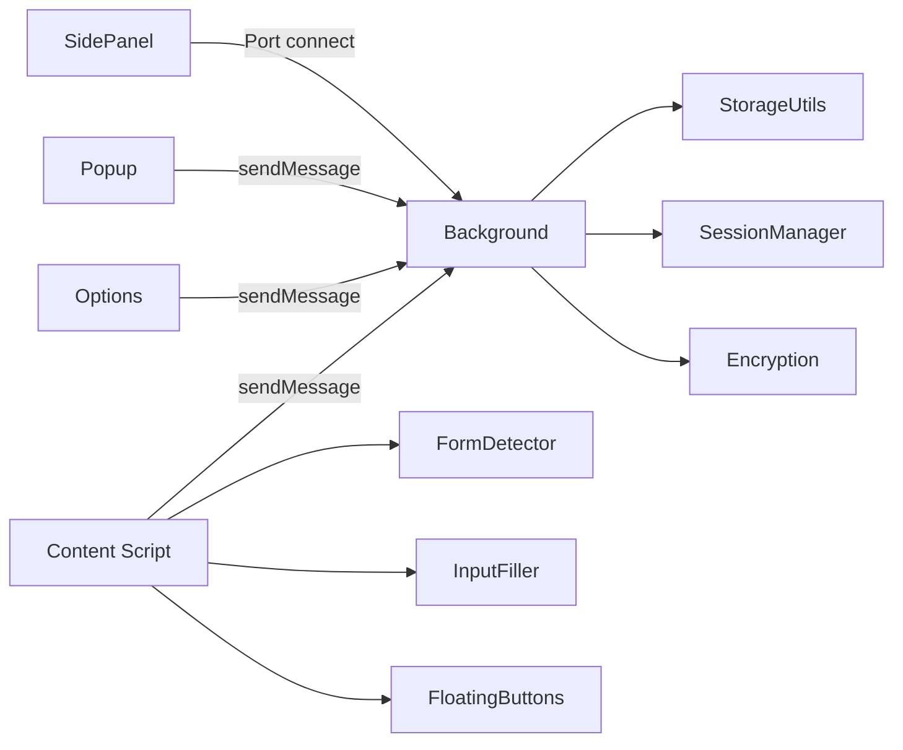
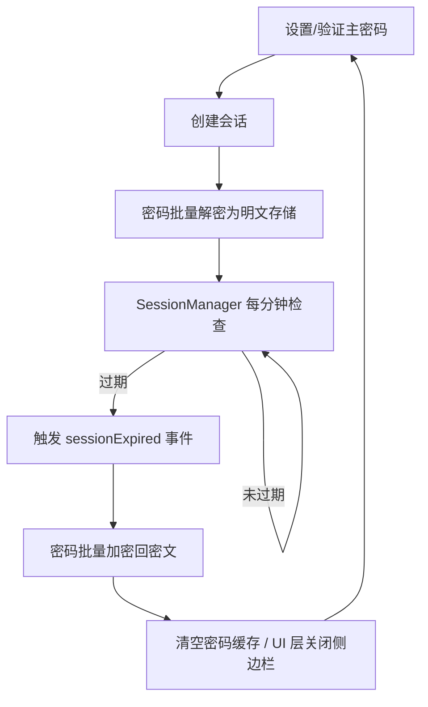

# 架构设计与实现详解

**中文** | [English](./ARCHITECTURE.en.md) · [返回 README](../README.md)

本文档面向开发者与贡献者，收录「账号密码管理助手」的架构设计、完整项目结构与各功能的实现细节。用户向的安装与使用说明请见 [README](../README.md)。

## 目录

- [架构设计](#架构设计)
  - [扩展入口点](#扩展入口点)
  - [消息与数据流](#消息与数据流)
  - [会话生命周期](#会话生命周期)
  - [加密机制](#加密机制)
- [项目结构](#项目结构)
- [功能实现详解](#功能实现详解)
- [开发补充](#开发补充)

## 架构设计

### 扩展入口点

| 入口点             | 职责                                                                                                                                                                                         |
| ------------------ | -------------------------------------------------------------------------------------------------------------------------------------------------------------------------------------------- |
| **Background**     | Service Worker，消息路由（判别联合类型）、密码缓存（域名无关）、侧边栏状态（Port 连接追踪）、快捷键处理；6 子模块：消息路由/缓存管理/侧边栏管理/选项页管理/自动保存/后台服务（SW 保活+闹钟） |
| **Content Script** | 注入所有页面，初始化表单检测与悬浮按钮                                                                                                                                                       |
| **Popup**          | 扩展图标弹窗，提供「管理密码」和「快速填充」快捷入口                                                                                                                                         |
| **Options**        | 密码管理主页面，完整 CRUD、导入导出、会话/有效期管理                                                                                                                                         |
| **SidePanel**      | 侧边栏快速填充，支持拼音智能搜索与命中高亮、排序、域名匹配、缓存加速                                                                                                                         |

### 消息与数据流



- Background 作为消息路由中心，处理跨组件通信
- SidePanel 通过 `chrome.runtime.connect()` 建立 Port，用于可靠状态追踪
- Content Script 通过 `chrome.runtime.sendMessage()` 发送消息

### 会话生命周期



### 加密机制

```
主密码 + 盐值 → PBKDF2 (600000次迭代) → 256-bit 密钥
明文 + 密钥 + 随机IV → AES-256-GCM → Base64(IV + 密文)
```

- 敏感字段加密：`username`、`password`、`url`、`remark`、`totp`
- 空字段不参与加密（写空字符串）；Base64 解码失败安全降级返回原始数据，GCM 解密失败抛出错误由调用方按需处理
- 内存中的主密码副本使用 HKDF + SHA-256 派生会话密钥，通过 AES-256-GCM 二次加密后再存入 chrome.storage.local

## 项目结构

```
├── entrypoints/                    # WXT 扩展入口点
│   ├── background.ts               # Background Service Worker 入口
│   ├── background/                 # Background 子模块
│   │   ├── backgroundServices.ts   # 核心后台服务（保活/闲置/更新/备份闹钟）
│   │   ├── messageRouter.ts        # 运行时消息路由（判别联合类型）
│   │   ├── sidePanelManager.ts     # 侧边栏生命周期管理（Port 连接追踪）
│   │   ├── passwordCache.ts        # 密码缓存（域名无关/SW 内存）
│   │   ├── optionsPageManager.ts   # 选项页管理（复用/创建/激活）
│   │   └── autoSaveHandler.ts      # 自动保存凭证处理
│   ├── content.ts                  # Content Script 入口
│   ├── content/                    # Content Script 模块
│   │   ├── FormDetector.ts         # 表单检测编排器
│   │   ├── InputFiller.ts          # 多策略输入填充
│   │   ├── LoginFormAnalyzer.ts    # 登录表单启发式分析
│   │   ├── LoginAutoSave.ts        # 登录凭证自动保存管理器
│   │   ├── SavePasswordPrompt.ts   # Chrome 风格保存确认弹窗
│   │   ├── PasswordVisibilityToggle.ts # 密码显示/隐藏切换
│   │   ├── CheckboxHandler.ts      # 复选框自动勾选
│   │   ├── NativeNotification.ts   # 原生浏览器通知
│   │   ├── formSelectors.ts        # 选择器与关键词常量
│   │   ├── domUtils.ts             # DOM 元素可见性检测工具
│   │   ├── types.ts                # Content Script 类型定义
│   │   ├── floatingButtons/        # 悬浮按钮系统（Closed Shadow DOM）
│   │   └── inlineDropdown/         # 内联填充系统（字段内钥匙图标 + 迷你面板）
│   │       └── InlineFillDropdown.ts # 内联填充管理器（Closed Shadow DOM）
│   ├── popup/                      # 扩展图标弹窗
│   ├── options/                    # 密码管理主页面
│   └── sidepanel/                  # 侧边栏快速填充
├── components/                     # Vue 组件
│   ├── BrandLogo.vue               # 钥匙主题品牌 Logo
│   ├── QuickFillIcon.vue           # 快速填充图标
│   ├── TotpCode.vue                # TOTP 动态码展示（环形倒计时）
│   ├── SiteFavicon.vue             # 网站图标组件（本地 _favicon 缓存，失败降级默认图标）
│   ├── ShortcutKeyCap.vue          # 快捷键键帽展示（主题令牌 + 未生效弱化态，不含 i18n）
│   ├── options/                    # Options 页面组件
│   │   ├── AutoSaveSettingDialog.vue   # 自动保存设置对话框
│   │   ├── BackupImportDialog.vue      # 加密备份导入对话框
│   │   ├── ChangeMasterPasswordDialog.vue # 修改主密码对话框（原子换钥）
│   │   ├── ClipboardSettingDialog.vue  # 剪贴板设置对话框
│   │   ├── DisclaimerInfo.vue          # 免责声明
│   │   ├── EmailBackupDialog.vue       # 邮箱备份对话框
│   │   ├── EmptyGuide.vue              # 空数据引导卡片
│   │   ├── FavoriteLimitSetting.vue     # 收藏上限设置对话框
│   │   ├── HeaderBar.vue               # 顶部操作栏（含安全体检入口）
│   │   ├── IdleLockSetting.vue         # 自动闲置锁定设置
│   │   ├── ImportDialog.vue            # CSV/JSON 导入对话框
│   │   ├── MasterPasswordSetupView.vue # 主密码设置视图
│   │   ├── PasswordFormDialog.vue      # 密码表单对话框（含 TOTP 字段与密码修改历史）
│   │   ├── PasswordGeneratorPopover.vue # 密码生成器弹窗（随机密码/助记词组）
│   │   ├── PasswordHealthDialog.vue    # 安全体检仪表盘弹窗
│   │   ├── PasswordStrengthPopover.vue # 密码强度可视化弹窗
│   │   ├── PasswordTable.vue           # 密码列表表格
│   │   ├── PasswordVerifyView.vue      # 主密码验证视图
│   │   ├── SearchFilterBar.vue         # 搜索过滤栏
│   │   ├── ShortcutSettingDialog.vue   # 快捷键一览对话框（只读 + 未生效预警 + 跳转管理页）
│   │   ├── TrashDialog.vue             # 回收站对话框（恢复/彻底删除/清空）
│   │   ├── ValidityHoursSelect.vue     # 有效期选择器
│   │   └── ValiditySettingDialog.vue   # 有效期设置对话框
│   └── sidepanel/                  # SidePanel 侧边栏组件
│       ├── HelpDialog.vue          # 操作指引与常见问题
│       ├── PasswordListItem.vue    # 密码列表条目（含 TOTP 动态码）
│       └── SidepanelHeader.vue     # 侧边栏头部
├── composables/                    # Vue 组合函数
│   ├── useAuthFlow.ts              # 认证流程
│   ├── useChromeListeners.ts       # Chrome API 监听器自动清理
│   ├── usePasswordManagement.ts    # 密码 CRUD + 搜索排序 + 收藏
│   ├── usePasswordHistory.ts       # 密码修改历史加载与解密
│   ├── usePasswordStrength.ts      # 密码强度校验
│   ├── usePopupInit.ts             # Popup 初始化逻辑
│   ├── useRuntimeMessageHandler.ts # 运行时消息处理
│   ├── useSessionLock.ts           # 会话锁定
│   ├── useSessionTimer.ts          # 会话定时器
│   ├── useShortcuts.ts             # 快捷键管理（真实绑定状态 + 未生效判定）
│   ├── useSidepanelData.ts         # 侧边栏数据管理
│   ├── useSidepanelFill.ts         # 侧边栏填充逻辑（含 TOTP 填充）
│   ├── useSidepanelSettings.ts     # 侧边栏设置
│   ├── useStorageWatcher.ts        # Storage 监听
│   ├── useTagOverflow.ts           # 标签溢出检测
│   ├── useTotp.ts                  # TOTP 动态码生成与倒计时
│   └── useVersionUpdate.ts         # 版本更新检测
├── utils/                          # 核心工具库
│   ├── storage.ts                  # 存储门面（StorageFacade）
│   ├── storage/                    # 存储领域模块
│   │   ├── autoSaveManager.ts      # 自动保存配置管理
│   │   ├── changeMasterPassword.ts # 修改主密码（原子换钥编排）
│   │   ├── configManager.ts        # 用户配置管理
│   │   ├── facades.ts              # 存储门面聚合
│   │   ├── masterPassword.ts       # 主密码存储与验证
│   │   ├── passwordCrud.ts         # 密码 CRUD 操作
│   │   ├── passwordHistory.ts      # 密码修改历史（旧密文快照，每条目保留 5 条）
│   │   ├── reminderManager.ts      # 密码到期提醒存储与 CRUD
│   │   └── trashManager.ts         # 回收站（软删除/恢复/30 天自动清理）
│   ├── i18n/                       # Vue 侧国际化（响应式语言包）
│   │   ├── index.ts                # t() 翻译函数与语言切换
│   │   └── locales/                # 全量语言包（zh-CN / en）
│   ├── i18n-lite.ts                # content/background 轻量国际化（tl()）
│   ├── data/top1000.json           # 离线弱口令字典（top-1000，懒加载）
│   ├── weakPasswordDict.ts         # 弱口令字典懒加载与 O(1) 命中检测
│   ├── encryption.ts               # PBKDF2 + AES-256-GCM
│   ├── crypto-light.ts             # 轻量加密工具
│   ├── sessionManager.ts           # 全局会话检查单例
│   ├── sessionManager-storage.ts   # 会话持久化与加解密转换
│   ├── backupExport.ts             # 加密备份导出/导入（AES-GCM）
│   ├── excel.ts                    # CSV/JSON 导入导出 + 多格式 CSV 解析
│   ├── emailBackup.ts              # 邮箱备份工具
│   ├── passwordHealth.ts           # 密码健康体检（评分/弱密码/复用/泄露/陈旧检测）
│   ├── tagUtils.ts                 # 标签颜色生成
│   ├── totp.ts                     # TOTP 动态码生成（RFC 6238，Web Crypto HMAC）
│   ├── favicon.ts                  # 网站图标 URL 构造（Chrome 本地 _favicon/ 端点，零网络）
│   ├── qrScanner.ts                # 二维码识别（截取标签页/图片 + jsQR 本地解码）
│   ├── updateChecker.ts            # 版本更新检测（GitHub Releases API）
│   ├── passwordGenerator.ts        # 随机密码生成器
│   ├── passphraseGenerator.ts      # 助记词组生成器（EFF Diceware，2048 词库）
│   ├── passwordSort.ts             # 密码排序工具
│   ├── logger.ts                   # 环境感知日志
│   ├── env.ts                      # isDev / isFirefox 常量
│   ├── createVueApp.ts             # Vue 应用工厂
│   ├── dateFormat.ts               # 日期格式化工具
│   ├── domain.ts                   # 域名提取与匹配工具（isDomainMatch）
│   ├── formatShortcut.ts           # 快捷键格式化工具
│   ├── shortcutCommands.ts         # 快捷键命令清单（与 manifest.commands 对齐）与打开管理页动作
│   ├── generateId.ts               # ID 生成工具
│   ├── lazyImport.ts               # 泛型懒加载工具
│   ├── masterPasswordVerify.ts     # 主密码验证工具
│   ├── preWarmSw.ts                # Service Worker 预热工具
│   ├── theme.ts                    # 主题工具（主题名类型、令牌映射、应用/同步）
│   ├── storageKeys.ts              # Storage Key 常量
│   ├── constants.ts                # 全局常量
│   ├── urls.ts                     # URL 常量
│   └── types.ts                    # 公共类型定义
├── assets/icons/                   # 源 SVG 图标
│   ├── icon.svg                    # 当前生效图标
│   └── variants/                   # 4 款钥匙主题候选图标
├── assets/theme/                   # 主题 CSS Design Tokens
│   └── tokens.css                  # 主题令牌定义（`--aph-*` 变量，6 套色彩方案）
├── public/icon/                    # 构建期 PNG 产物（WXT 自动注入 manifest）
├── scripts/generate-icons.mjs      # SVG → 多尺寸 PNG 生成脚本
├── types/global.d.ts               # 全局类型补充
├── .github/workflows/static.yml    # GitHub Pages 部署
├── wxt.config.ts                   # WXT 配置
└── package.json
```

## 功能实现详解

### 1. 安全保护

- 主密码至少 8 位，必须包含字母、数字和特殊字符。
- 会话创建后，密码从密文解密为明文缓存；会话失效时自动加密回密文。
- 会话恢复后自动检测并修复加密状态不一致的数据。
- SessionManager 每分钟检查会话有效性，页面可见性变化时也会触发检查。

### 2. 表单识别与填充

- 识别用户名、密码、手机号、验证码字段；自动勾选"记住密码"、"同意条款"等复选框。
- WeakMap / WeakSet 缓存字段判断结果，避免内存泄漏。
- 填充策略自动降级：**Native Setter → execCommand → 模拟键盘事件**。
- 悬浮按钮可配置「自动触发登录」开关：填充完成后自动点击表单内的登录按钮（见 [SettingsPanel.ts](../entrypoints/content/floatingButtons/SettingsPanel.ts) / [FormDetector.ts](../entrypoints/content/FormDetector.ts)）。

### 3. 数据管理

- CSV 导入导出（.csv），提供标准模板下载。
- JSON 导入导出：支持密码数据的 JSON 格式导出（需验证主密码），导出文件名格式为 `passwords_YYYYMMDD_HHmmss.json`；也支持从 JSON 文件导入。
- 标签下拉多选 + 自定义新增（每条最多 3 个，单个最长 30 字符）；相同标签颜色稳定一致（见 [utils/tagUtils.ts](../utils/tagUtils.ts)）。
- 密码列表默认按更新时间倒序；侧边栏默认按最近使用倒序。支持按用户名、URL、标签、备注、创建/更新时间切换排序。
- 支持用户名、标签、备注、URL 的多字段智能搜索：大小写不敏感子串优先，未命中降级拼音匹配（全拼 / 首字母缩写 / 中英混合，pinyin-match 经动态 import 拆分为独立 chunk 不占首屏，首帧后空闲预热），命中区间经 SearchHighlight 组件高亮（见 [utils/searchMatch.ts](../utils/searchMatch.ts)）。
- 批量选择与批量删除密码条目；删除的条目进入回收站保留 30 天，可随时恢复。
- 收藏标记：点击星标收藏常用条目，支持「只看收藏」过滤；收藏上限默认可配置（1~50 条），超限时 LRU 自动淘汰最早使用的收藏条目；侧边栏填充时自动更新收藏使用时间戳确保 LRU 准确。
- 一键去重：智能检测重复条目（相同用户名 + 相同 URL）并提供一键清理。
- 多格式 CSV 导入：自动识别 Chrome、LastPass、Bitwarden、1Password 的导出格式（见 [utils/excel.ts](../utils/excel.ts)）。

### 4. 自动保存登录凭证

- 启用后，网站登录时自动捕获账号密码并弹窗确认是否保存（见 [LoginAutoSave.ts](../entrypoints/content/LoginAutoSave.ts)）。
- 三种凭证捕获场景：表单提交（capture 阶段）、登录按钮点击、密码框回车提交。
- 域名匹配规则支持精确域名和正则表达式两种模式，规则为空时匹配所有域名；含端口的规则（如 `localhost:3000`）仅精确匹配对应 host + port 组合（见 [AutoSaveSettingDialog.vue](../components/options/AutoSaveSettingDialog.vue)）。
- sessionStorage 暂存凭证，支持传统表单提交导致的跨页面导航场景。
- 保存成功后发送桌面通知，并使密码缓存失效以确保下次加载获取最新数据。
- **三选项交互**：保存确认弹窗提供「保存」、「暂不保存」和「不再提示」三个操作选项。
- **可编辑字段**：弹窗中除显示账号和密码外，还提供可编辑的**标签**（默认取页面标题）和**备注**（默认为"自动保存"）输入框，用户可在保存前自定义。
- **智能更新策略**：同账号 + 同域名且密码有变化时，以「更新」弹窗确认后更新已有条目的密码，保留存量标签和备注（除非用户在弹窗中主动修改）；账号密码完全相同则不打扰；不同账号则新增条目。
- **黑名单屏蔽**：保存弹窗中点击「不再提示」可将当前域名加入屏蔽列表（见 [SavePasswordPrompt.ts](../entrypoints/content/SavePasswordPrompt.ts)）；无端口条目屏蔽该 hostname 及子域名所有端口的登录弹窗，含端口条目（如 `localhost:3000`）仅屏蔽对应端口的弹窗。可在设置对话框的「已屏蔽的域名」中删除以恢复提示。
- **智能防重复**：弹窗前先向后台查询该域名 + 账号在密码库中的状态（见 [autoSaveManager.ts](../utils/storage/autoSaveManager.ts) 的 `checkCredentialStatus`），据此分流：账号密码完全相同则完全静默不弹窗（跨登录持久生效，从根本上避免同账号反复登录反复弹窗）；密码发生变化则弹出「更新」确认弹窗；新账号弹出「保存」弹窗。同时保留基于凭证指纹（用户名 + 密码长度）的同页防抖（见 [LoginAutoSave.ts](../entrypoints/content/LoginAutoSave.ts)），吸收表单提交 / 按钮点击 / 回车三连触发。

### 5. 邮箱备份

- 导出密码列表为数据文件并唤起邮件客户端（见 [utils/emailBackup.ts](../utils/emailBackup.ts)）。
- 支持选择备份方式：「不加密备份」导出标准数据文件；「加密备份」导出 .aph 加密文件（只能通过本插件的「加密备份导入」功能 + 原主密码解密查看）。
- 支持配置自动备份提醒，通过 chrome.alarms 定时发送桌面通知（不解密、不自动下载文件）。
- 备份间隔可选：每天 / 每3天 / 每周 / 每两周 / 每月。

### 6. 加密备份导入导出

- 导出：使用主密码通过 AES-GCM 加密全部密码数据，下载为 `.aph` 文件（见 [utils/backupExport.ts](../utils/backupExport.ts)），文件名格式为 `backup_YYYYMMDD_HHmmss.aph`。
- 导入：上传 `.aph` 文件后输入导出时使用的主密码进行解密，解密后可预览数据（前 5 条）再确认导入（见 [BackupImportDialog.vue](../components/options/BackupImportDialog.vue)）。
- 加密方案：PBKDF2（600000 次迭代）+ AES-256-GCM + 随机 Salt + 随机 IV，安全性高于常规存储。

### 7. 密码可见性切换

- 自动为页面中的密码输入框注入显示/隐藏切换按钮（见 [PasswordVisibilityToggle.ts](../entrypoints/content/PasswordVisibilityToggle.ts)），默认关闭，需在悬浮按钮设置面板中手动开启。
- 对所有密码输入框统一注入切换按钮，使用 Element Plus 主题蓝色，输入有值时按钮自动可见。
- MutationObserver 监听动态新增的密码输入框，自动注入。
- 可在悬浮按钮设置面板中开关此功能。

### 8. 自动闲置锁定与浏览器重启锁定

- 在密码管理页「自动锁定设置」中配置闲置时间（5/10/30/60 分钟或不锁定），连续闲置超过设定时间后自动清除主密码会话并锁定密码管理；系统锁屏或屏保激活时也会立即锁定（见 [IdleLockSetting.vue](../components/options/IdleLockSetting.vue)）。闲置判定基于 chrome.idle API，计时从最后一次系统级用户输入起算。
- 锁定后需重新验证主密码才能恢复访问，与手动锁定和会话过期行为一致。
- **浏览器重启锁定**：在「自动锁定设置」中可开启「浏览器重启锁定」开关。开启后，完全关闭并重新打开浏览器时需重新输入主密码（更安全）；关闭则在有效期内自动保持登录，无需重复输入。
- Popup 弹窗也提供一键「锁定」按钮，可快速清除当前会话。

### 9. 密码强度可视化

- 在主密码设置和密码表单中，密码输入时通过气泡弹窗实时展示强度等级（弱/中/强）和进度条（见 [PasswordStrengthPopover.vue](../components/options/PasswordStrengthPopover.vue)）。
- 逐条校验密码规则：至少 8 字符、包含字母、包含数字、包含特殊字符，通过/未通过状态一目了然。
- 基于 [usePasswordStrength](../composables/usePasswordStrength.ts) Composable 实现，可在多处复用。

### 10. 安全体检仪表盘

- 在密码管理页顶部操作栏点击「安全体检」按钮（带健康信号灯圆点），打开安全体检仪表盘弹窗（见 [PasswordHealthDialog.vue](../components/options/PasswordHealthDialog.vue)）。
- 综合安全评分（0~100 分）+ 等级（优秀/良好/一般/较差），环形进度动画直观展示（见 [utils/passwordHealth.ts](../utils/passwordHealth.ts)）。
- 五维检测指标：弱密码（强度为「弱」的条目）、密码复用（多账号共用同一密码，按组展示）、常见泄露密码（离线 top-1000 弱口令字典命中，见 [utils/weakPasswordDict.ts](../utils/weakPasswordDict.ts)）、长时间未更新（90/180/365 天三级预警）、未开启两步验证（仅信息展示，不计入扣分）。
- 评分权重：密码复用 35% + 弱密码 25% + 泄露密码 20% + 陈旧密码 20%，按受影响占比线性扣分。
- 支持为「长时间未更新」条目设置密码到期提醒（7/30/90 天等 N 天后提醒），到期由后台闹钟检查并发送桌面通知，点击通知直达管理页（见 [utils/storage/reminderManager.ts](../utils/storage/reminderManager.ts)）。
- 明细区支持展开/折叠，每条问题提供「去处理」按钮，点击直接跳转到对应条目的编辑流程。
- 全程本地计算（弱口令字典内置离线加载），不做在线泄露检测（HIBP 等需联网的能力被刻意排除），不返回任何明文密码，零网络传输。
- 入口按钮旁的信号灯圆点颜色随健康等级变化（绿/蓝/橙/红），一眼可见密码库健康状态。

### 11. 快速填充

- 侧边栏自动将与当前域名匹配的密码排在前面。
- **精确域名匹配**：仅展示与当前页面 host 完全一致的条目（不做子域名/主域名模糊匹配），方便区分多测试环境账号（如 `fat.example.com` 与 `uat.example.com` 互不干扰）；未填写域名的条目始终展示。
- **本地开发友好**：当域名为 `localhost` 或 `127.0.0.1` 时，默认匹配所有密码（见 [sidepanel/App.vue](../entrypoints/sidepanel/App.vue)）。
- **网站图标展示**：密码列表与侧边栏条目展示对应网站的图标，经 Chrome 本地 `_favicon/` 端点读取浏览器图标缓存，零外部网络请求（见 [SiteFavicon.vue](../components/SiteFavicon.vue)）；无缓存图标或不支持的环境自动降级为默认图标，布局零偏移。
- 点击条目一键填充并自动关闭侧边栏；若无登录表单，给出「当前页面未检测到登录表单」提示。
- 侧边栏条目支持右键或操作按钮跳转到密码管理页，直接编辑该条目或添加新条目。
- 快捷键：
  - `Ctrl+Shift+P` / `Cmd+Shift+P`：打开密码管理页面
  - `Ctrl+Shift+L` / `Cmd+Shift+L`：显示/隐藏侧边栏
  - `Ctrl+Shift+F` / `Cmd+Shift+F`：一键填充当前页面账号密码（无需打开侧边栏，直接填充与侧边栏列表首条一致的条目；多条匹配时通知告知填充了哪条，填充结果通过桌面通知 + 工具栏角标双通道反馈，见 [quickFillHandler.ts](../entrypoints/background/quickFillHandler.ts)）
  - 快捷键支持自定义，详见 [README - 常见问题](../README.md#常见问题)
  - **统一一览与未生效预警**：Chrome `commands` API 仅提供 `getAll()` / `onCommand`，扩展无法自行改键（`commands.update()` 属 Firefox）。因此 Popup、密码管理页「安全设置 → 快捷键」（见 [ShortcutSettingDialog.vue](../components/options/ShortcutSettingDialog.vue)）与侧边栏帮助弹窗（见 [HelpDialog.vue](../components/sidepanel/HelpDialog.vue)）三处均展示只读一览，并对 `getAll()` 返回空 `shortcut` 的命令明确标注「未生效」（多因被系统或其他扩展占用，或更新后新增命令未自动绑定），解决「按了没反应」无从排查的痛点；命令清单单一事实来源为 [shortcutCommands.ts](../utils/shortcutCommands.ts)，与 manifest 的一致性由 [shortcutCommands.test.ts](../tests/utils/shortcutCommands.test.ts) 静态校验
- Background 维护密码缓存，侧边栏优先读取缓存，后台异步验证。

### 12. 版本更新检测

- 通过 GitHub Releases API 定期检测最新版本（见 [utils/updateChecker.ts](../utils/updateChecker.ts)）。
- 每 6 小时自动检测一次，发现新版本时在 Popup 弹窗中展示更新提示，包含版本号和更新说明。
- 点击更新提示可直接跳转到 GitHub Releases 页面下载最新版本。
- 检测结果缓存 24 小时，避免频繁请求；缓存过期后自动重新检测。

### 13. 密码生成器（随机密码 / 助记词组）

- 在添加/编辑密码表单中，密码输入框旁有一个魔棒按钮（`MagicStick` 图标），点击弹出密码生成器，顶部可在「随机密码」与「助记词组」两种模式间切换。
- **随机密码模式**：自定义长度（6~50）、字符集开关（大写字母 / 小写字母 / 数字 / 特殊字符），可排除易混淆字符（1、l、I、0、O），避免视觉辨识困难。
- **助记词组模式**：基于 EFF Diceware 理念，从内置 2048 个常见英文单词的词库中随机选取 3~~8 个单词组合（如 `Apple-River-Cloud-Tiger42`），支持 5 种分隔符（`-`/`_`/`.`/空格/无）、首字母大写开关、末尾追加 1~~4 位随机数字；4 词组合约 44 bits 熵，既安全又易于记忆（见 [utils/passphraseGenerator.ts](../utils/passphraseGenerator.ts)）。
- 生成后实时显示密码强度进度条，点击「使用此密码」即可填入表单。
- 基于 Web Crypto API（`crypto.getRandomValues`）保证密码学安全随机性（见 [utils/passwordGenerator.ts](../utils/passwordGenerator.ts)）。

### 14. 剪贴板自动清除

- 在侧边栏复制密码后，自动启动定时器在指定延时后清除剪贴板内容。
- 清除延时可配置为 10/15/30/60/120 秒，默认 30 秒（见 [ClipboardSettingDialog.vue](../components/options/ClipboardSettingDialog.vue)）。
- 清除前验证剪贴板内容未被用户替换（优先使用 Async Clipboard API 读取验证；失焦时降级为「尽力清除」策略）。
- 复制用户名时自动取消密码清除定时器，避免误清除用户名。
- 配置入口位于密码管理页「安全设置」下拉菜单 →「剪贴板设置」。

### 15. 两步验证（TOTP）

- 在添加/编辑密码表单的「两步验证」字段中，粘贴 `otpauth://` 链接或 Base32 密钥即可为账号启用 TOTP 两步验证（见 [PasswordFormDialog.vue](../components/options/PasswordFormDialog.vue)）。
- **扫码添加**：密钥输入框下提供「扫描网页二维码」与「上传二维码图片」两个入口（见 [utils/qrScanner.ts](../utils/qrScanner.ts)）：前者自动定位用户最近浏览的网页标签页，短暂切换过去 `captureVisibleTab` 截屏后立即切回；后者读取用户上传的二维码截图。两者均由 jsQR 在本地解码（按需动态导入，不进首屏 chunk），不产生任何网络请求；识别结果经 `isValidTotpInput` 校验后才填入密钥字段。
- 动态码基于 [Web Crypto API](https://developer.mozilla.org/en-US/docs/Web/API/Web_Crypto_API) 的 HMAC 在本地按 RFC 6238 计算，**不产生任何网络请求**，与插件零网络定位一致（见 [utils/totp.ts](../utils/totp.ts)）。
- 密码列表与侧边栏对已配置条目实时展示动态码与环形倒计时（末 5 秒变色提示即将刷新，见 [TotpCode.vue](../components/TotpCode.vue)）。
- 侧边栏条目提供「填充验证码」与「复制验证码」：填充会写入页面检测到的验证码输入框（复用 `autocomplete="one-time-code"` 等选择器），仅在显式点击时触发，不影响账号密码自动填充流程。
- TOTP 密钥作为敏感字段随主密码体系 AES-256-GCM 加密存储，并随 CSV / JSON / 加密备份（.aph）一同导入导出；从 LastPass 等导出的 `totp` 列可直接迁移。
- 支持自定义算法（SHA1/256/512）、位数（6~8）与周期（默认 30 秒），参数从 `otpauth://` URI 解析，裸密钥回退默认参数。

#### 验证失败排查

- **一个服务只保存一把密钥**：如 GitHub，每个账号只绑定一把 TOTP 密钥。用哪个验证器完成「验证」，就绑定哪把密钥，其他验证器里的旧密钥随即失效。
- **多个验证器同时可用**：在同一次设置中，把设置页显示的同一把密钥分别录入所有验证器（本插件、Google Authenticator 等）后再点验证；期间不要刷新设置页——刷新会重新生成新密钥，导致各处密钥不一致。
- **时钟必须准确**：动态码按 UTC 绝对时间计算，本机时钟与服务器相差超过约 30 秒即会失败，请开启系统自动校时。
- **参数需匹配**：本插件默认 SHA-1 / 6 位 / 30 秒（与主流服务一致）；若粘贴的 `otpauth://` 链接带非默认参数（如 SHA-256、8 位），会按链接参数计算，需与服务端一致（可在添加/编辑表单的预览处查看解析出的参数）。

### 16. 主题换肤

- 提供 6 款色彩主题：晴空蓝（默认）、青竹绿、桃花粉、樱粉紫、落霞橙、雾墨灰（见 [utils/theme.ts](../utils/theme.ts)）。
- 主题配置保存在悬浮按钮偏好中，有三种方式进入设置：①密码管理页「偏好设置」按钮；②悬浮按钮齿轮图标；③侧边栏右上角齿轮图标。
- 扩展页面（密码管理页、侧边栏、Popup）通过 `data-theme` 属性 + CSS Design Tokens（[tokens.css](../assets/theme/tokens.css)）实现一致性换肤。
- 内容脚本的 Shadow DOM 组件（悬浮按钮、内联填充面板、密码可见性切换按钮）以内联方式写入主题令牌，与扩展页面同步生效。
- 切换主题即时生效，无需刷新页面。

### 17. 内联填充

- 侧边栏之外的另一种填充方式（见 [InlineFillDropdown.ts](../entrypoints/content/inlineDropdown/InlineFillDropdown.ts)），无需打开侧边栏，直接在页面内完成填充。
- 当填充模式为「内联」时，登录输入框获焦后右侧内缘自动显示一个钥匙图标（若密码框已有显隐眼睛图标，钥匙图标会自动避让）。
- 点击钥匙图标后，登录框主动失焦（关闭 Chrome 原生密码下拉），展开一个迷你面板：顶部搜索栏 + 可滚动账号列表 + 底部「密码管理」入口。
- 支持键盘导航：`↑` / `↓` 浏览列表、`Enter` 填充高亮项、`Esc` 关闭面板。
- 面板内容仅展示账号元数据（用户名、标签、备注、网址），密码仅在用户显式选择时经 Background 瞬时下发，安全模型与侧边栏一致。
- 条目前的钥匙图标优先展示对应网站图标：由 Background 经本地 `_favicon/` 端点读取并转为 dataURL 随元数据下发（内存缓存 + 失败降级钥匙图标，见 [utils/favicon.ts](../utils/favicon.ts) 的 `fetchFaviconDataUrl`）；不将 `_favicon/*` 暴露为 web_accessible_resources，避免网页借端点探测浏览历史的隐私风险，全程零外部网络请求。
- 会话锁定态下，面板显示「解锁后填充」引导，点击跳转密码管理页验证主密码。
- 使用 Closed Shadow DOM（`all: initial`）完全隔离页面样式，主题令牌内联写入宿主元素，跟随整体主题换肤。

### 18. 回收站

- 删除密码（单条删除 / 批量删除）不再直接抹除，而是移入回收站软删除，保留 **30 天**（见 [utils/storage/trashManager.ts](../utils/storage/trashManager.ts)）。
- 入口：密码管理页「数据管理」下拉菜单 →「回收站」，打开回收站弹窗（见 [TrashDialog.vue](../components/options/TrashDialog.vue)）。
- 每条支持「恢复」（回到密码列表）与「彻底删除」，底部提供「清空回收站」；彻底删除时同步清理该条目的密码修改历史与到期提醒，防止残留。
- 超过 30 天的条目由后台闹钟自动清理；回收站条目始终保持密文存储，会话有效期内才解密展示用户名/网址，锁定态下显示占位符。

### 19. 密码修改历史

- 编辑密码时若密码字段发生变化，自动将旧密码密文快照入历史（见 [utils/storage/passwordHistory.ts](../utils/storage/passwordHistory.ts)），每个条目保留最近 **5** 条，超出自动淘汰最旧记录。
- 在编辑弹窗底部展示「密码修改历史」区块（仅编辑模式且有历史时显示），每条显示修改时间与掩码，提供「复制」与「恢复」按钮，恢复即将旧密码回填到表单密码框。
- 历史以加密态存储，不落明文；查看/恢复需会话有效；条目被彻底删除时历史一并清理，修改主密码时历史随全库重新加密。

### 20. 修改主密码

- 入口：密码管理页「安全设置」下拉菜单 →「修改主密码」（见 [ChangeMasterPasswordDialog.vue](../components/options/ChangeMasterPasswordDialog.vue)）。
- 流程：验证当前主密码 → 旧密钥解密全部数据（密码列表 + 回收站 + 修改历史）→ 新密钥重新加密 → 单次 `chrome.storage.local.set()` **原子写入**密文与新会话密钥（见 [utils/storage/changeMasterPassword.ts](../utils/storage/changeMasterPassword.ts)）。
- 安全保证：写入前任意步骤失败直接中断，数据保持旧密文无损；不存在「新密文 + 旧会话密钥」的中间态。
- 会话自愈：其他已打开的扩展页面（侧边栏/Popup 等）监听到密钥更换后自动采纳新会话密钥，无需重新登录，列表不会被清空（见 [utils/sessionManager-storage.ts](../utils/sessionManager-storage.ts) 的 `adoptRekeyedSession`）。
- 加密备份文件（.aph）不受影响：导入时使用导出时的密码解密，与当前主密码无关。

### 21. 一键填充快捷键

- 按下 `Ctrl+Shift+F` / `Cmd+Shift+F`，无需打开侧边栏直接填充当前页面的账号密码（见 [quickFillHandler.ts](../entrypoints/background/quickFillHandler.ts)）。
- 填充目标与侧边栏列表首条一致（域名匹配优先 + 收藏置顶 + 排序配置）；多条匹配时通知中明确告知填充了哪条、共几条匹配，可打开侧边栏切换。
- 未验证主密码 → 通知提示先验证；当前域名无匹配 → 通知无匹配账号；页面未就绪（扩展更新后的旧标签页）→ 引导刷新。
- 双通道反馈：桌面通知 + 工具栏图标角标（成功绿色对勾 / 失败红色感叹号，3 秒后自动清除），规避系统通知被关闭时无感知。
- 填充成功后静默更新条目最近使用时间，保持侧边栏「最近使用」排序准确。

### 22. 右键上下文菜单填充

- 在输入框上右键提供「填充用户名 / 填充密码 / 填充两步验证码 / 生成并填充强密码」，页面空白处右键提供「打开侧边栏 / 打开密码管理页」（见 [contextMenuManager.ts](../entrypoints/background/contextMenuManager.ts)）。
- 菜单项由 Background 经 `chrome.contextMenus` 注册（需 `contextMenus` 权限），标题按用户语言渲染，语言切换时整体重建。菜单项注册由浏览器持久化（代码每次 SW 启动仍防御性重建以同步语言）；`onClicked` 点击监听器不持久化，按 MV3 事件注册要求随每次 SW 启动在入口同步重注册。无 `sidePanel` API 的环境（如 Firefox）不展示「打开侧边栏」项。
- 目标元素记忆：`contextMenus.onClicked` 只能拿到 `frameId` 而无法拿到被点击元素，因此 Content Script 在 `contextmenu` 事件捕获阶段记录右键发生的输入框（见 [contextMenuTarget.ts](../entrypoints/content/contextMenuTarget.ts)），Background 再经 `CONTEXT_MENU_FILL` 消息定向下发到该 frame。
- 条目选择语义与侧边栏一致：按当前标签页域名经 `sortMatchesForDomain` 排序后取首条；TOTP 动作取首条配置了两步验证的条目并在 SW 内计算动态码（不下发密钥）。
- 安全门控与一键填充共用同一道防线：启动重锁屏障、会话校验、`isFrameFillable` 跨域 frame 拒绝（明文只发给顶层或同主域名帧）。
- 反馈策略：填充成功仅显示工具栏角标（填充结果在输入框内可见，避免通知打扰）；填充失败与「打开侧边栏」失败均经「通知 + 角标」双通道反馈，不静默吞掉用户操作。

## 开发补充

### 图标工作流

1. 编辑或替换 [assets/icons/icon.svg](../assets/icons/icon.svg)（可从 [variants](../assets/icons/variants) 挑选一款覆盖）
2. 运行 `pnpm icons:build` 生成 `public/icon/{16,32,48,96,128}.png`
3. WXT 会自动识别为 `manifest.icons` 和 `action.default_icon`，无需在 [wxt.config.ts](../wxt.config.ts) 显式声明

### 测试页面

项目包含 [test-page.html](../test-page.html) 用于表单检测与自动填充的回归验证。

### 性能设计

- Service Worker 保活采用「心跳 + 复活闹钟」双层架构：20s 心跳调用轻量扩展 API 重置 30s 空闲计时器保证连续保活，0.5 分钟复活闹钟在 SW 被强杀后唤醒重建（见 [backgroundServices.ts](../entrypoints/background/backgroundServices.ts)）。
- 保活的业务价值：会话有效期内保持密码缓存（内存）常驻，侧边栏打开时走缓存竞速快速通道（约 20-50ms 获得数据），避免冷启动延迟；会话失效后保持热 SW 与预热 tick，避免「SW 死亡 → 预热停止 → 文件被 OS 磁盘缓存逐出 → 下次打开冷读白屏」的退化链路。
- Service Worker 启动后延迟 500ms 预热密码缓存，进一步提升首次打开侧边栏的响应速度。
- 保活策略为所有平台统一常驻（含会话失效期，不区分平台与会话状态）：会话失效后停活曾是 Mac「间隔一段时间后打开侧边栏 4 秒白屏」的直接根因（历史有条件保活/宽限期保活策略均因该场景复发而收敛为统一常驻）。详见下方「侧边栏秒开跨平台策略」。
- 统一常驻的代价：SW 约每 30 秒被唤醒一次（20s 心跳 + 0.5min 复活闹钟），带来轻量但持续的后台唤醒开销；这是消除冷启动白屏的主动设计取舍，已在 README、CWS 发布说明与隐私政策中向用户披露。

### 侧边栏秒开跨平台策略

性能目标：侧边栏在 Windows 与 Mac 平台的**所有场景**（会话有效 / 会话失效 / 浏览器冷启动 / 快速重启）均需秒开（<1s、无白屏卡顿）。打开路径本身跨平台完全一致，平台差异仅存在于 SW 后台韧性层，属针对不同平台物理特性的刻意设计。

**打开路径（跨平台一致）**

| 入口                                  | 路径                                                                                                    |
| ------------------------------------- | ------------------------------------------------------------------------------------------------------- |
| 悬浮按钮点击                          | `TOGGLE_SIDEPANEL` 消息 → `openSidePanelAndRespond`                                                     |
| Content 消息                          | `SHOW_SIDEPANEL` 消息 → 同上（透传点击时刻 clickTs）                                                    |
| Popup 按钮                            | 用户手势内直接 `chrome.sidePanel.open`，失败回退 `SHOW_SIDEPANEL` 消息（携带 clickTs 保证埋点起点一致） |
| 快捷键 `Ctrl+Shift+L` / `Cmd+Shift+L` | `toggle_sidepanel` 命令 → 已打开则关闭，否则直接打开                                                    |

共同约束：

- `sidePanel.open()` 之前禁止 `await`（保持用户手势链完整），tabId 经 `getTabIdSync` 同步获取（见 [messageRouter.ts](../entrypoints/background/messageRouter.ts)）。
- 打开前同步触发性能埋点 `markSidepanelOpenRequested`（见 [perfMetrics.ts](../utils/perfMetrics.ts)），用于度量「点击 → 渲染进程创建」段耗时。
- `preWarmServiceWorker`（8s 节流）在表单聚焦 / 页面可见性恢复 / 页面加载 / Popup 打开 / 悬浮按钮点击等时机预唤醒 SW，消除后续 open 的冷启动等待（见 [preWarmSw.ts](../utils/preWarmSw.ts)）。
- Side Panel 通过 `SIDEPANEL_READY(windowId, tabId)` 握手注册；Background 按窗口维护 Port 集合，刷新时允许新旧 Port 短暂重叠，旧 Port 断开不会误清理新实例。关闭采用三层兜底：`chrome.sidePanel.close` API → `setOptions` 禁用后恢复 → 仅向目标窗口 Port 通知 `window.close()`（见 [sidePanelManager.ts](../entrypoints/background/sidePanelManager.ts)）。
- 初始数据同时启动 `storage.session` 加密快照、Background `GET_INITIAL_DATA` 与 Side Panel 本地 storage 三路竞速；任一路失败不终止其他路径，所有异步提交均受会话代际/最新请求序号保护，避免锁定或 rekey 后旧结果重新写回 UI（见 [useSidepanelData.ts](../composables/useSidepanelData.ts)）。
- 浏览器启动重锁使用 `pending/complete/failed` 状态与独立认证 recovery 标记：`pending` 优先级不可被安装、配置变更或认证事件覆盖；Side Panel、快捷填充、内联账号/密码/TOTP、自动保存等所有凭据入口共用同一 fail-closed 屏障。成功重新认证仅恢复同一次 `failed`，不会释放仍在执行的启动清理（见 [browserStartupRelock.ts](../utils/browserStartupRelock.ts)）。
- 首次填充不再固定等待 800ms：先 PING，缺失时只向顶层/同主域安全 frame 并行注入，再以有界短退避确认就绪；单个 iframe 导航消失不会阻断其他有效 frame（见 [contentScriptReadiness.ts](../utils/contentScriptReadiness.ts)）。

**平台行为矩阵（SW 后台韧性层）**

| 机制                                          | Windows                                                                                          | Mac/Linux                                                                                                                | 跨平台例外                                                        |
| --------------------------------------------- | ------------------------------------------------------------------------------------------------ | ------------------------------------------------------------------------------------------------------------------------ | ----------------------------------------------------------------- |
| SW 保活（`syncSwKeepaliveAlarm`）             | 统一常驻保活：20s 心跳 + 0.5min 复活闹钟，**会话失效后也不停**                                   | 同左：统一常驻保活，不再区分会话状态（历史有条件保活/宽限期保活策略因 Mac 间隔闲置后 4 秒白屏复发而收敛为常驻）          | —                                                                 |
| 渲染资源预热（`maybeWarmSidePanelResources`） | 全量四层预热（HTML → 静态资源 → 动态 chunk → 二级依赖，约 25 文件）/ 5min 节流                   | 轻量预热（HTML + module/modulepreload/CSS + 白名单认证视图与本地数据直读关键 chunk 及其二级依赖，约 15 文件）/ 5min 节流 | 浏览器首启与扩展安装/更新时经 `ignorePlatformGate` 跨平台全量预热 |
| 预热触发时机                                  | 窗口聚焦 / Tab 激活 / 保活闹钟 tick / 侧边栏打开后延时 2s，共用 5min 持久化节流 + in-flight 互斥 | 同左                                                                                                                     | —                                                                 |
| 会话到期主动上锁                              | alarm tick 检测过期后在 SW 内一次性完成「加密全部密码 + 删会话键」，避免打开时才全量重加密       | 行为一致（性能收益主要体现在 Windows，Web Crypto 较慢）                                                                  | —                                                                 |

**差异化设计依据**

- 保活策略全平台统一为常驻（不区分会话状态）：Windows 痛点是杀软扫描 + 冷盘导致 SW 冷启动与 chunk 冷读可达数秒（会话失效态白屏主因）；Mac 虽 SSD 快、无杀软扫描放大，但历史条件保活/宽限期保活策略下，会话失效后停活 → SW 死亡 → 预热 tick 停止 → 文件被 macOS UBC 逐出（长时间闲置/系统休眠后尤甚）→ 下次打开撞「SW 冷启 + 渲染进程冷创建 + 文件冷读 + 快照失效」四冷叠加白屏，且条件保活/宽限期保活均无法覆盖「宽限期结束后的任意间隔」，故统一为常驻保活；
- 预热范围按平台差异化：Windows 全量四层预热（~25 文件），Mac 轻量预热按白名单保留认证视图 chunk（含 Element Plus CSS 运行时，认证态最大冷读单体）与本地数据直读 chunk（sessionManager-storage / passwordCrud / encryption，浏览器重启快照失效后数据竞速回退本地路径的冷读单体），根治 macOS 磁盘缓存逐出后的冷读白屏；
- 平台判定经 [platform.ts](../utils/platform.ts) 三态检测（true/false/null）+ storage.local 持久化兜底 + 失败不缓存：预热等轻微影响场景经两态包装（isWindowsPlatform）简化调用。
- 同一文件另有**同步**嗅探 API `isMacPlatform()`（优先读 `navigator.userAgentData.platform`，回退已废弃的 `navigator.platform`），专供无法 await 的路径（模块级常量、composable 同步初始化）使用；目前唯一调用方是快捷键未绑定时的兜底按键——按平台取 manifest `suggested_key` 的 `default` / `mac` 分支（见 [shortcutCommands.ts](../utils/shortcutCommands.ts)）。它**不参与**保活/预热决策：判错只影响修饰键展示风格（⌘ vs Ctrl），而保活/预热判错代价重大，必须继续使用感知三态的异步判定。

相关代码：[backgroundServices.ts](../entrypoints/background/backgroundServices.ts)（保活与过期上锁）、[warmSidePanelResources.ts](../utils/warmSidePanelResources.ts)（资源预热）、[platform.ts](../utils/platform.ts)（平台判定）、[sidePanelManager.ts](../entrypoints/background/sidePanelManager.ts)（打开/关闭与 Port 追踪）。
