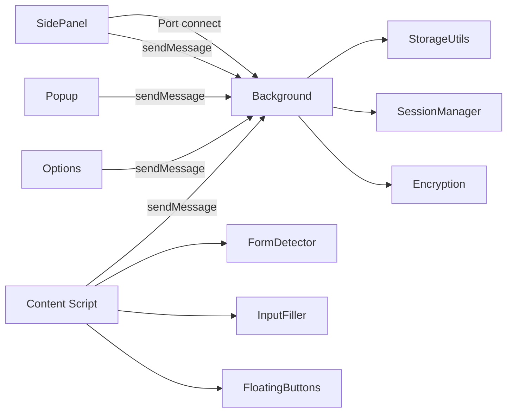
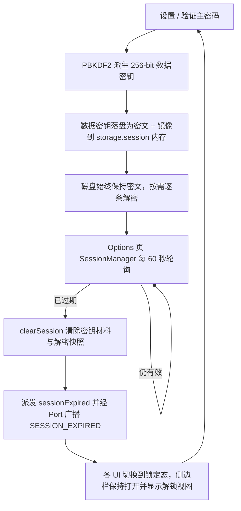

# 架构设计与实现详解

**中文** | [English](./ARCHITECTURE.en.md) · [返回 README](../README.md)

本文档面向开发者与贡献者，收录「账号密码管理助手」的架构设计、完整项目结构与各功能的实现细节。用户向的安装与使用说明请见 [README](../README.md)。

## 目录

- [架构设计](#架构设计)
  - [扩展入口点](#扩展入口点)
  - [消息与数据流](#消息与数据流)
  - [Content Script 运行时约束](#content-script-运行时约束)
  - [会话生命周期](#会话生命周期)
  - [加密机制](#加密机制)
- [项目结构](#项目结构)
- [功能实现详解](#功能实现详解)
- [开发补充](#开发补充)

## 架构设计

### 扩展入口点

| 入口点             | 职责                                                                                                                                                                                                                                     |
| ------------------ | ---------------------------------------------------------------------------------------------------------------------------------------------------------------------------------------------------------------------------------------- |
| **Background**     | Service Worker，消息路由（判别联合类型）、密码缓存（域名无关）、侧边栏状态（Port 连接追踪）、快捷键处理；后台子模块：消息路由/缓存管理/侧边栏管理/选项页管理/自动保存/一键填充/右键菜单/内联下拉/侧边栏快速添加/后台服务（SW 保活+闹钟） |
| **Content Script** | 注入所有页面，初始化表单检测与悬浮按钮                                                                                                                                                                                                   |
| **Popup**          | 扩展图标弹窗，提供「管理密码」和「快速填充」快捷入口                                                                                                                                                                                     |
| **Options**        | 密码管理主页面，完整 CRUD、导入导出、会话/有效期管理                                                                                                                                                                                     |
| **SidePanel**      | 侧边栏快速填充，支持拼音智能搜索与命中高亮、排序、域名匹配（本站 / 全站范围切换）、缓存加速、就地快速添加                                                                                                                                |

### 消息与数据流



- Background 作为消息路由中心，处理跨组件通信；消息类型为判别联合（`utils/types.ts` 的 `MessageType`）
- SidePanel 通过 `chrome.runtime.connect({ name: 'sidepanel' })` 建立 Port，用于打开/就绪握手、锁定广播与 25 秒心跳的存活追踪
- SidePanel 的请求/响应类操作（填充、缓存更新、快速添加、打开选项页）仍走 `chrome.runtime.sendMessage()`
- Content Script 与 Popup / Options 通过 `chrome.runtime.sendMessage()` 发送消息

### Content Script 运行时约束

- **注入范围**：[entrypoints/content.ts](../entrypoints/content.ts) 以 `matches: ['<all_urls>']` + `allFrames: true` 注入所有 frame。表单检测与自动保存监听在**所有 frame** 初始化（iframe 内的登录表单同样需要被检测和捕获），而悬浮按钮、保存弹窗、委托通知只在**顶层 frame** 渲染，避免每个 iframe 重复注入造成重叠与定位错乱。
- **样式隔离**：悬浮按钮、内联填充面板、密码可见性切换按钮均使用 **Closed Shadow DOM**，内部以 `all: initial` 重置并**内联写入** `--aph-*` 主题令牌（不依赖外部样式类），`z-index 2147483647` 置顶。不得把 Shadow DOM 引用暴露给宿主页面，也不得在内容脚本中依赖页面全局函数/变量。
- **跨 frame 明文边界**：iframe 内的凭证通过 `window.top.postMessage` 委托顶层 frame 渲染保存弹窗，回传结果时 `targetOrigin` 固定为来源 origin；保存类委托必须先经 `isSameMainDomain(event.origin, location.origin)` 校验，防止跨域 iframe 把明文密码泄露给第三方页面。通知委托因跨域场景也需要放行，但按不可信输入处理：严格校验类型与长度并限流（10 秒滑动窗口内最多 5 次）。反向同理，明文凭证只下发到顶层或同主域名 frame（`isFrameFillable`）。
- **监听器生命周期**：所有 DOM 监听统一经 WXT 的 `ctx.addEventListener` 注册（扩展上下文失效时自动移除），`ctx.onInvalidated` 与 `beforeunload` 触发集中 `cleanup()`，销毁 FormDetector / LoginAutoSave / 悬浮按钮管理器注册的监听器、MutationObserver 与注入 UI。这是消除重载后旧脚本残留调用 chrome API 抛 `Extension context invalidated` 的根因修复，新增监听时不得绕过。
- **检测节奏**：首次扫描在 `DOMContentLoaded` 后延时 3 秒（文档已就绪时 500 毫秒），MutationObserver 以 500 毫秒去抖触发重扫，观察范围为 `document.body` 的 `childList + subtree + attributes(class/style/placeholder)`；SPA 路由变化合并进同一观察器（不额外建 Observer），`popstate` 仅覆盖前进/后退。填充前若字段尚未命中，`waitForFieldsDetected()` 以 100ms 起始、1.5 倍退避、上限 2000ms 重试至多 10 次；`blur` 等易触发重渲染的时机改用事件驱动的 `waitForDomStable(quietMs=50, budgetMs=300)` 等待 DOM 静默，而非固定 sleep。
- **预唤醒**：表单输入框 `focusin`、顶层 frame `visibilitychange`、初始化后 100ms 三处调用 `preWarmServiceWorker()`，与用户操作并行拉起 SW，为后续 `sidePanel.open()` 消除冷启动等待（见「侧边栏秒开跨平台策略」）。

### 会话生命周期



- 会话检查器 `sessionManager.ts` 只在 Options 页通过 `initSessionManager()` 启动（`window.setInterval` 60 秒，仅在「有效 → 无效」的跳变时触发过期事件，避免无会话时打开页面就误报）；SidePanel 与 Popup 不等这个轮询，它们经 Port 的 `SESSION_EXPIRED` 广播、`chrome.storage.onChanged` 与 `visibilitychange` 即时感知锁定。
- `isSessionValid()` 的结果带 5 秒 TTL 缓存（`sessionManager-storage.ts`），锁定、改密、清除会话等状态变更点会主动失效该缓存，避免热路径上反复读盘。
- 会话有效期默认 24 小时，可选 1/2/4/8/12/24 小时与 3/5/7 天（见 [ValidityHoursSelect.vue](../components/options/ValidityHoursSelect.vue)）。
- 过期 / 锁定 / 手动锁定三条路径都只走 `clearSession()`：清除内存与 `storage.session` 中的密钥材料、解密快照与 CryptoKey 句柄缓存。磁盘中的条目本来就是密文，**不存在「批量解密为明文存储」或「过期时批量加密回密文」的落盘动作**。
- 闲置锁定（`chrome.idle`）与浏览器重启锁定是**两个默认关闭**的可选开关（`idleLockMinutes: 0`、`relockOnBrowserRestart: false`）。

### 加密机制

```
盐值：16 字节随机 → 32 位 hex，明文存于 master_password_config
主密码 + 盐值 → PBKDF2-SHA256 600,000 次 → 256-bit 数据密钥
明文 + 数据密钥 + 每次随机的 12 字节 IV → AES-256-GCM → Base64(IV[12B] ‖ 密文 ‖ 认证标签[16B])
```

- 敏感字段加密：`username`、`password`、`url`、`remark`、`totp`；`id`、`tag`、`createTime`、`updateTime`、`order`、`favorite`、`lastUsedAt` 等元数据保持明文，供排序与过滤使用。
- 空字段不参与加密（写空字符串）；Base64 解码失败安全降级返回原始数据，GCM 解密失败抛出错误由调用方按需处理——认证标签使篡改可检测，无静默回退。
- **主密码从不落盘**。磁盘上只有校验哈希：`deriveVerifierHash` 同样是 PBKDF2-SHA256 / 600,000 次，但对盐值做了域分离（前缀 `aph-verify|`），使校验值与解密密钥在密码学上互相独立，存储中的校验值无法反推为密钥；比对使用常量时间。旧版单轮 SHA-256 校验值在验证成功时透明升级。
- **会话密钥**：派生出的数据密钥由一枚新生成的随机包裹密钥（`session_wrap_key`）经同一套 AES-256-GCM 加密，写入 `session_wrapped_data_key`；两者必须在同一次 `chrome.storage.local.set()` 中原子落盘，避免多上下文并发写入时「A 的包裹密钥 + B 的密文」错配。明文数据密钥另存 `storage.session`（仅内存，浏览器关闭即清）。
- **HKDF 只存在于旧版迁移路径**：`deriveSessionKey(salt)`（HKDF-SHA256，salt `aph-session-salt`、info `session-encryption-v2`）仅用于解包历史遗留的 `session_master_password` blob。它的输入是明文可读的盐值，因此不提供任何抗磁盘访问的机密性，新版会话流程不使用它。
- `ensurePasswordsEncryptedAtRest` 在每个 SW 生命周期内幂等地维护「磁盘即密文」不变量，并由 storage 监听器兜底发现明文异常。

## 项目结构

```
├── entrypoints/                    # WXT 扩展入口点
│   ├── background.ts               # Background Service Worker 入口
│   ├── background/                 # Background 子模块
│   │   ├── backgroundServices.ts   # 核心后台服务（保活/闲置/更新/备份闹钟）
│   │   ├── messageRouter.ts        # 运行时消息路由（判别联合类型）
│   │   ├── sidePanelManager.ts     # 侧边栏生命周期管理（Port 连接追踪）
│   │   ├── passwordCache.ts        # 密码缓存（域名无关/SW 内存）
│   │   ├── optionsPageManager.ts   # 选项页管理（复用/创建/激活）
│   │   ├── quickFillHandler.ts     # 一键填充快捷键处理（域名匹配 + 多层反馈）
│   │   ├── contextMenuManager.ts   # 右键上下文菜单（注册/语言重建/填充动作分发）
│   │   ├── quickAddHandler.ts      # 侧边栏快速添加落库处理
│   │   ├── inlineDropdownHandler.ts # 内联填充下拉面板的展开与数据下发处理
│   │   └── autoSaveHandler.ts      # 自动保存凭证处理
│   ├── content.ts                  # Content Script 入口
│   ├── content/                    # Content Script 模块
│   │   ├── FormDetector.ts         # 表单检测编排器
│   │   ├── InputFiller.ts          # 多策略输入填充
│   │   ├── LoginFormAnalyzer.ts    # 登录表单启发式分析
│   │   ├── LoginAutoSave.ts        # 登录凭证自动保存管理器
│   │   ├── SavePasswordPrompt.ts   # Chrome 风格保存确认弹窗
│   │   ├── PasswordVisibilityToggle.ts # 密码显示/隐藏切换
│   │   ├── CheckboxHandler.ts      # 复选框自动勾选
│   │   ├── NativeNotification.ts   # 原生浏览器通知
│   │   ├── contextMenuTarget.ts    # 右键目标输入框记忆（供 Background 定向下发）
│   │   ├── formSelectors.ts        # 选择器与关键词常量
│   │   ├── domUtils.ts             # DOM 元素可见性检测工具
│   │   ├── types.ts                # Content Script 类型定义
│   │   ├── floatingButtons/        # 悬浮按钮系统（Closed Shadow DOM）
│   │   └── inlineDropdown/         # 内联填充系统（字段内钥匙图标 + 迷你面板）
│   │       └── InlineFillDropdown.ts # 内联填充管理器（Closed Shadow DOM）
│   ├── popup/                      # 扩展图标弹窗
│   ├── options/                    # 密码管理主页面
│   └── sidepanel/                  # 侧边栏快速填充
├── components/                     # Vue 组件
│   ├── BrandLogo.vue               # 钥匙主题品牌 Logo
│   ├── QuickFillIcon.vue           # 快速填充图标
│   ├── TotpCode.vue                # TOTP 动态码展示（环形倒计时）
│   ├── SiteFavicon.vue             # 网站图标组件（本地 _favicon 缓存，失败降级默认图标）
│   ├── ShortcutKeyCap.vue          # 快捷键键帽展示（主题令牌 + 未生效弱化态，不含 i18n）
│   ├── CapsLockHint.vue            # 大写锁定警示行（role=status，配合 useCapsLockDetection）
│   ├── options/                    # Options 页面组件
│   │   ├── AutoSaveSettingDialog.vue   # 自动保存设置对话框
│   │   ├── BackupImportDialog.vue      # 加密备份导入对话框
│   │   ├── ChangeMasterPasswordDialog.vue # 修改主密码对话框（原子换钥）
│   │   ├── ClipboardSettingDialog.vue  # 剪贴板设置对话框
│   │   ├── DisclaimerInfo.vue          # 免责声明
│   │   ├── EmailBackupDialog.vue       # 邮箱备份对话框
│   │   ├── EmptyGuide.vue              # 空数据引导卡片
│   │   ├── FavoriteLimitSetting.vue     # 收藏上限设置对话框
│   │   ├── HeaderBar.vue               # 顶部操作栏（含安全体检入口）
│   │   ├── IdleLockSetting.vue         # 自动闲置锁定设置
│   │   ├── ImportDialog.vue            # CSV/JSON 导入对话框
│   │   ├── MasterPasswordSetupView.vue # 主密码设置视图
│   │   ├── MasterPasswordVerifyDialog.vue # 主密码验证弹窗（会话解锁/导出前验证）
│   │   ├── PasswordDetailDrawer.vue    # 条目只读详情抽屉（备注全文/密码历史/限时复制清除）
│   │   ├── PasswordFormDialog.vue      # 密码表单对话框（含 TOTP 字段与密码修改历史）
│   │   ├── PasswordGeneratorPopover.vue # 密码生成器弹窗（随机密码/助记词组）
│   │   ├── PasswordHealthDialog.vue    # 安全体检仪表盘弹窗
│   │   ├── PasswordStrengthPopover.vue # 密码强度可视化弹窗
│   │   ├── PasswordTable.vue           # 密码列表表格
│   │   ├── PasswordVerifyView.vue      # 主密码验证视图
│   │   ├── SearchFilterBar.vue         # 搜索过滤栏
│   │   ├── ShortcutSettingDialog.vue   # 快捷键一览对话框（只读 + 未生效预警 + 跳转管理页）
│   │   ├── TrashDialog.vue             # 回收站对话框（恢复/彻底删除/清空）
│   │   ├── ValidityHoursSelect.vue     # 有效期选择器
│   │   └── ValiditySettingDialog.vue   # 有效期设置对话框
│   └── sidepanel/                  # SidePanel 侧边栏组件
│       ├── HelpDialog.vue          # 操作指引与常见问题
│       ├── PasswordListItem.vue    # 密码列表条目（含 TOTP 动态码与全站模式降级操作）
│       ├── QuickAddDialog.vue      # 侧边栏快速添加弹窗（预填当前域名）
│       ├── SidepanelAuthView.vue   # 侧边栏列表主体（搜索/范围切换/空态引导）
│       └── SidepanelHeader.vue     # 侧边栏头部
├── composables/                    # Vue 组合函数
│   ├── useAuthFlow.ts              # 认证流程
│   ├── useCapsLockDetection.ts     # 主密码输入框大写锁定检测（getModifierState）
│   ├── useChromeListeners.ts       # Chrome API 监听器自动清理
│   ├── usePasswordManagement.ts    # 密码 CRUD + 搜索排序 + 收藏
│   ├── usePasswordHistory.ts       # 密码修改历史加载与解密
│   ├── usePasswordStrength.ts      # 密码强度校验
│   ├── usePopupInit.ts             # Popup 初始化逻辑
│   ├── useRuntimeMessageHandler.ts # 运行时消息处理
│   ├── useSessionLock.ts           # 会话锁定
│   ├── useSessionTimer.ts          # 会话定时器
│   ├── useShortcuts.ts             # 快捷键管理（真实绑定状态 + 未生效判定）
│   ├── useSidepanelData.ts         # 侧边栏数据管理
│   ├── useSidepanelFill.ts         # 侧边栏填充逻辑（含 TOTP 填充）
│   ├── useSidepanelSettings.ts     # 侧边栏设置
│   ├── useStorageWatcher.ts        # Storage 监听
│   ├── useTagOverflow.ts           # 标签溢出检测
│   ├── useTotp.ts                  # TOTP 动态码生成与倒计时
│   └── useVersionUpdate.ts         # 版本更新检测
├── utils/                          # 核心工具库
│   ├── storage.ts                  # 存储门面（StorageFacade）
│   ├── storage/                    # 存储领域模块
│   │   ├── autoSaveManager.ts      # 自动保存配置管理
│   │   ├── changeMasterPassword.ts # 修改主密码（原子换钥编排）
│   │   ├── configManager.ts        # 用户配置管理
│   │   ├── facades.ts              # 存储门面聚合
│   │   ├── masterPassword.ts       # 主密码存储与验证
│   │   ├── passwordCrud.ts         # 密码 CRUD 操作
│   │   ├── passwordHistory.ts      # 密码修改历史（旧密文快照，默认每条 3 份，可配 1~10）
│   │   ├── reminderManager.ts      # 密码到期提醒存储与 CRUD
│   │   └── trashManager.ts         # 回收站（软删除/恢复/30 天自动清理）
│   ├── i18n/                       # Vue 侧国际化（响应式语言包）
│   │   ├── index.ts                # t() 翻译函数与语言切换
│   │   ├── bundles/                # 按上下文聚合的语言包（options / sidepanel / popup / help）
│   │   └── locales/                # 全量语言包（zh-CN / en，17 个 namespace）
│   ├── i18n-lite.ts                # content/background 轻量国际化（tl()）
│   ├── data/top1000.json           # 离线弱口令字典（近千条，懒加载）
│   ├── data/passphrase-words.json  # 助记词组词库（3080 个常见英文单词）
│   ├── weakPasswordDict.ts         # 弱口令字典懒加载与 O(1) 命中检测
│   ├── passwordStrengthCore.ts     # 密码强度规则核心（纯函数、零 i18n/零 Vue 依赖，三方共用判定源）
│   ├── encryption.ts               # PBKDF2 + AES-256-GCM
│   ├── crypto-light.ts             # 轻量加密工具
│   ├── sessionManager.ts           # 会话轮询单例（仅 Options 页启动，60 秒一次）
│   ├── sessionManager-storage.ts   # 会话密钥材料持久化（包裹数据密钥）与有效性判定
│   ├── backupExport.ts             # 加密备份导出/导入（AES-GCM）
│   ├── excel.ts                    # CSV/JSON 门面（保留 ExcelUtils 静态入口，转发到下列四个子模块）
│   ├── excelCsv.ts                 # CSV 上传解析（多格式列映射）
│   ├── excelJson.ts              # JSON 上传解析（数组或 { entries } 包裹）
│   ├── excelExport.ts              # CSV/JSON 导出与模板下载
│   ├── excelFormatMap.ts           # 导入格式与 CSV 列映射表（Chrome/LastPass/Bitwarden/1Password）
│   ├── emailBackup.ts              # 邮箱备份工具
│   ├── passwordHealth.ts           # 密码健康体检（评分/弱密码/复用/泄露/陈旧检测）
│   ├── tagUtils.ts                 # 标签颜色生成
│   ├── totp.ts                     # TOTP 动态码生成（RFC 6238，Web Crypto HMAC）
│   ├── favicon.ts                  # 网站图标 URL 构造（Chrome 本地 _favicon/ 端点，零网络）
│   ├── qrScanner.ts                # 二维码识别（截取标签页/图片 + jsQR 本地解码）
│   ├── updateChecker.ts            # 版本更新检测（GitHub Releases API + CWS 可达性探测）
│   ├── passwordGenerator.ts        # 随机密码生成器
│   ├── passphraseGenerator.ts      # 助记词组生成器（Diceware 思路，内置 3080 词库）
│   ├── passwordSort.ts             # 密码排序工具
│   ├── passwordFilter.ts           # 侧边栏列表过滤纯函数（本站/全站范围判定、能否填充单一事实来源）
│   ├── searchMatch.ts              # 智能搜索匹配纯函数（子串 + 拼音/首字母缩写 + 命中区间）
│   ├── clipboard.ts                # 剪贴板复制与限时自动清除（UI 无关，options/sidepanel 共用）
│   ├── logger.ts                   # 环境感知日志
│   ├── env.ts                      # isDev / isFirefox 常量
│   ├── platform.ts                 # 操作系统平台检测（Windows 判定，跨上下文复用）
│   ├── perfMetrics.ts              # 侧边栏打开性能埋点（生产可用，落 storage.session）
│   ├── a11y.ts                     # 无障碍键盘工具（role=button 的 Enter/Space 激活）
│   ├── formValidators.ts           # 表单校验器工厂（长度/复杂度/URL/标签规则复用）
│   ├── masterPasswordVerify.ts     # 主密码验证工具
│   ├── masterPasswordVerifyController.ts # 主密码验证弹窗单例控制器（命令式调用）
│   ├── createVueApp.ts             # Vue 应用工厂
│   ├── dateFormat.ts               # 日期格式化工具
│   ├── domain.ts                   # 域名工具（getMainDomain / isExactHostMatch 精确主机匹配 / toNavigableUrl 安全导航）
│   ├── formatShortcut.ts           # 快捷键格式化工具
│   ├── shortcutCommands.ts         # 快捷键命令清单（与 manifest.commands 对齐）与打开管理页动作
│   ├── generateId.ts               # ID 生成工具（crypto 随机，独立模块避免页面 chunk 拉入 PBKDF2）
│   ├── lazyImport.ts               # 泛型懒加载工具（并发去重的动态 import 封装）
│   ├── contentScriptReadiness.ts   # Content Script 就绪探测（ping + 必要时重注入）
│   ├── frameFill.ts                # 跨 frame 填充共享工具（sidepanel 与 quickFill 复用）
│   ├── browserStartupRelock.ts     # 浏览器启动重锁屏障与等待状态机
│   ├── preWarmSw.ts                # Service Worker 预热工具
│   ├── warmSidePanelResources.ts   # 侧边栏渲染资源预热（SW 侧，抗 Windows 白屏）
│   ├── theme.ts                    # 主题工具（主题名类型、令牌映射、应用/同步）
│   ├── storageKeys.ts              # Storage Key 常量
│   ├── constants.ts                # 历史常量入口（URL 已迁至 urls.ts，仅保留迁移说明）
│   ├── urls.ts                     # URL 常量
│   └── types.ts                    # 公共类型定义
├── assets/icons/                   # 源 SVG 图标
│   ├── icon.svg                    # 当前生效图标
│   └── variants/                   # 4 款钥匙主题候选图标
├── assets/theme/                   # 主题 CSS Design Tokens
│   └── tokens.css                  # 主题令牌定义（`--aph-*` 变量，6 套色彩方案）
├── public/icon/                    # 构建期 PNG 产物（WXT 自动注入 manifest）
├── scripts/generate-icons.mjs      # SVG → 多尺寸 PNG 生成脚本
├── types/global.d.ts               # 全局类型补充
├── .github/workflows/static.yml    # GitHub Pages 部署
├── wxt.config.ts                   # WXT 配置
└── package.json
```

## 功能实现详解

### 1. 安全保护

- 主密码至少 8 位，必须包含字母、数字和特殊字符。
- 会话解锁后条目按需解密到内存（SW 密码缓存 / `storage.session` 加密快照），`storage.local` 全程保持密文；会话失效只清除密钥材料与解密快照，不做批量重加密。
- 会话恢复后自动检测并修复加密状态不一致的数据。
- SessionManager 每分钟检查会话有效性，页面可见性变化时也会触发检查。
- **大写锁定实时提示**：主密码相关输入框（首次设置、解锁验证视图、验证弹窗、修改主密码、加密备份导入）通过 `KeyboardEvent.getModifierState('CapsLock')` 在 keydown/keyup 实时判定大写锁定状态（见 [useCapsLockDetection.ts](../composables/useCapsLockDetection.ts)），开启时在输入框下方展示琥珀色警示行（见 [CapsLockHint.vue](../components/CapsLockHint.vue)），避免大小写误输入被当成「密码错误」；提示行用 `role="status"` 让屏幕阅读器非打断播报，失焦即复位，不留残留提示。

### 2. 表单识别与填充

- 识别用户名、密码、手机号、验证码字段；填充后自动勾选**得分最高的那一个**复选框——`calculateCheckboxScore` 按与密码输入框的距离、关键词命中、DOM 位置、是否同表单、层级深度为每个候选打分后取最优，而非单纯取最近的复选框；按 `CHECKBOX_POSITIVE_KEYWORDS`（记住我 / 自动登录 / 同意 / 服务条款 / remember / agree / terms…）判定可勾，命中 `CHECKBOX_NEGATIVE_KEYWORDS`（订阅 / 通知 / 营销 / subscribe / newsletter / ads…）则跳过，避免误勾营销类选项（见 [CheckboxHandler.ts](../entrypoints/content/CheckboxHandler.ts) / [formSelectors.ts](../entrypoints/content/formSelectors.ts)）。
- WeakMap / WeakSet 缓存字段判断结果，避免内存泄漏。
- 填充策略自动降级：**Native Setter → execCommand → 模拟键盘事件**，每级约 50ms 后回读校验实际值。
- 链条末端的「点击登录」由偏好设置中的**「自动触发登录」开关**决定（默认关闭），开启后按「点击登录按钮 → `form.requestSubmit()`」两级策略提交（见 [SettingsPanel.ts](../entrypoints/content/floatingButtons/SettingsPanel.ts) / [FormDetector.ts](../entrypoints/content/FormDetector.ts)）。不想常开时，侧边栏每条账号另有显式的「填充并登录」按钮，只对本次生效。

### 3. 数据管理

- CSV 导入导出（.csv），提供标准模板下载；导出带 BOM + CRLF，Excel 可直接打开。
- JSON 导入导出：支持密码数据的 JSON 格式导出（需验证主密码），导出文件名格式为 `passwords_YYYYMMDD_HHmmss.json`；也支持从 JSON 文件导入。
- 导入仅接受 `.csv` 与 `.json` 两类文件（无 xlsx 解析器）：Excel 表格请先「另存为 CSV」再导入（见 [ImportDialog.vue](../components/options/ImportDialog.vue)）。
- 标签下拉多选 + 自定义新增（每条最多 3 个，单个最长 30 字符）；相同标签颜色稳定一致（见 [utils/tagUtils.ts](../utils/tagUtils.ts)）。
- 密码列表默认按更新时间倒序；侧边栏默认按最近使用倒序。支持按用户名、URL、标签、备注、创建/更新时间切换排序。
- 支持用户名、标签、备注、URL 的多字段智能搜索：大小写不敏感子串优先，未命中降级拼音匹配（全拼 / 首字母缩写 / 中英混合，pinyin-match 经动态 import 拆分为独立 chunk 不占首屏，首帧后空闲预热），命中区间经 SearchHighlight 组件高亮（见 [utils/searchMatch.ts](../utils/searchMatch.ts)）。
- 批量选择后可批量编辑标签（追加 / 剔除）、批量导出选中项、批量删除；删除的条目进入回收站保留 30 天，可随时恢复。
- 收藏标记：点击星标收藏常用条目，支持「只看收藏」过滤；收藏上限默认 **10** 条（可配 1~50），超限时 LRU 自动淘汰最早使用的收藏条目；侧边栏填充时自动更新收藏使用时间戳确保 LRU 准确。
- 一键去重：智能检测重复条目（相同用户名 + 相同 URL）并提供一键清理。
- 只读查看详情：列表每行的「查看详情」以抽屉形式展示该条目的全部字段（含备注全文与密码历史），无需进入编辑态（见第 23 节）。
- 多格式 CSV 导入：自动识别 Chrome、LastPass、Bitwarden、1Password 的导出格式（见 [utils/excel.ts](../utils/excel.ts)）。

### 4. 自动保存登录凭证

- 启用后，网站登录时自动捕获账号密码并弹窗确认是否保存（见 [LoginAutoSave.ts](../entrypoints/content/LoginAutoSave.ts)）。
- 三种凭证捕获场景：表单提交（capture 阶段）、登录按钮点击、密码框回车提交。
- 域名匹配规则支持精确域名和正则表达式两种模式，规则为空时匹配所有域名；含端口的规则（如 `localhost:3000`）仅精确匹配对应 host + port 组合（见 [AutoSaveSettingDialog.vue](../components/options/AutoSaveSettingDialog.vue)）。
- sessionStorage 暂存凭证，支持传统表单提交导致的跨页面导航场景。
- 保存成功后发送桌面通知，并使密码缓存失效以确保下次加载获取最新数据。
- **三选项交互**：保存确认弹窗提供「保存」、「暂不保存」和「不再提示」三个操作选项。
- **可编辑字段**：弹窗中除显示账号和密码外，还提供可编辑的**标签**（默认取页面标题）和**备注**（默认为"自动保存"）输入框，用户可在保存前自定义。
- **智能更新策略**：同账号 + 同域名且密码有变化时，以「更新」弹窗确认后更新已有条目的密码，保留存量标签和备注（除非用户在弹窗中主动修改）；账号密码完全相同则不打扰；不同账号则新增条目。
- **黑名单屏蔽**：保存弹窗中点击「不再提示」可将当前域名加入屏蔽列表（见 [SavePasswordPrompt.ts](../entrypoints/content/SavePasswordPrompt.ts)）；无端口条目屏蔽该 hostname 及子域名所有端口的登录弹窗，含端口条目（如 `localhost:3000`）仅屏蔽对应端口的弹窗。可在设置对话框的「已屏蔽的域名」中删除以恢复提示。
- **智能防重复**：弹窗前先向后台查询该域名 + 账号在密码库中的状态（见 [autoSaveManager.ts](../utils/storage/autoSaveManager.ts) 的 `checkCredentialStatus`），据此分流：账号密码完全相同则完全静默不弹窗（跨登录持久生效，从根本上避免同账号反复登录反复弹窗）；密码发生变化则弹出「更新」确认弹窗；新账号弹出「保存」弹窗。同时保留基于凭证指纹（用户名 + 密码长度）的同页防抖（见 [LoginAutoSave.ts](../entrypoints/content/LoginAutoSave.ts)），吸收表单提交 / 按钮点击 / 回车三连触发。
- **保存前风险内联预警（非阻断）**：`checkCredentialStatus` 在**已解密的全量条目**上就地计算风险提示并随凭证状态一并返回（`risk` 字段），因此不产生额外的存储读取或解密开销；仅在实际会弹窗的 `new` / `password_changed` 两个分支携带，`locked`、`identical` 与异常兜底分支不携带。弹窗在密码行下方以琥珀色警示条展示两类风险：弱密码（与表单校验、安全体检同口径，复用 [passwordStrengthCore.ts](../utils/passwordStrengthCore.ts) 的 `isWeakPassword`）与密码复用（该密码被其它 N 个账号共用）。警示条**只提醒不拦截**：不加二次确认、不改变保存按钮流程与任何回调签名，与 Chrome 原生保存弹窗的克制风格一致。
- **风险数据的信任边界**：`risk` 属派生结论，**不写入 pending 也不进 sessionStorage**，避免用户改密码后留下陈旧计数；跳页恢复路径会重新进入预检查拿新鲜值。iframe 委托场景下该数据经 `postMessage` 跨帧传入，属不可信输入，接收方（[SavePasswordPrompt.ts](../entrypoints/content/SavePasswordPrompt.ts) 的 `sanitizeRiskHint`）逐字段收窄：`weak` 仅接受严格布尔 `true`，`reusedCount` 须为 `1..9999` 的整数，非法值一律丢弃。密码字段一旦偏离后台评估时的值，本地可重算的弱密码标志就地重算，依赖全量库的复用计数则直接撤下。

### 5. 邮箱备份

- 导出密码列表为数据文件并唤起邮件客户端（见 [utils/emailBackup.ts](../utils/emailBackup.ts)）。
- 支持选择备份方式：「不加密备份」导出标准数据文件；「加密备份」导出 .aph 加密文件（只能通过本插件的「加密备份导入」功能 + 原主密码解密查看）。
- 支持配置自动备份提醒，通过 chrome.alarms 定时发送桌面通知（不解密、不自动下载文件）。
- 备份间隔可选：每天 / 每3天 / 每周 / 每两周 / 每月。

### 6. 加密备份导入导出

- 导出：使用主密码通过 AES-GCM 加密全部密码数据，下载为 `.aph` 文件（见 [utils/backupExport.ts](../utils/backupExport.ts)），文件名格式为 `backup_YYYYMMDD_HHmmss.aph`。
- 导入：上传 `.aph` 文件后输入导出时使用的主密码进行解密，解密后可预览数据（前 5 条）再确认导入（见 [BackupImportDialog.vue](../components/options/BackupImportDialog.vue)）。
- 加密方案：PBKDF2（600000 次迭代）+ AES-256-GCM + 随机 Salt + 随机 IV，安全性高于常规存储。

### 7. 密码可见性切换

- 自动为页面中的密码输入框注入显示/隐藏切换按钮（见 [PasswordVisibilityToggle.ts](../entrypoints/content/PasswordVisibilityToggle.ts)），默认关闭，需在偏好设置面板中手动开启。
- 对所有密码输入框统一注入切换按钮，颜色取 `--aph-primary` 系列主题令牌（跟随 6 款主题换肤），输入有值时按钮自动可见；开启时面板会提示该按钮可能与站点自带的显隐眼睛重叠。
- MutationObserver 监听动态新增的密码输入框，自动注入。

### 8. 自动闲置锁定与浏览器重启锁定

- 在密码管理页「自动锁定设置」中配置闲置时间（不锁定 / 5 / 10 / 30 / 60 分钟），连续闲置超过设定时间后自动清除主密码会话并锁定密码管理；系统锁屏或屏保激活时也会立即锁定（见 [IdleLockSetting.vue](../components/options/IdleLockSetting.vue)）。闲置判定基于 chrome.idle API，计时从最后一次系统级用户输入起算。**默认为「不锁定」（`idleLockMinutes: 0`）**，需用户主动开启。
- 锁定后需重新验证主密码才能恢复访问，与手动锁定和会话过期行为一致。
- **浏览器重启锁定**：在「自动锁定设置」中可开启「浏览器重启锁定」开关。**该开关默认关闭**：关闭状态下，完全关闭并重新打开浏览器后在有效期内自动保持登录，无需重复输入；开启后重启浏览器需重新输入主密码（更安全），且该屏障为 fail-closed——恢复状态无法判定时按锁定处理（见 [utils/browserStartupRelock.ts](../utils/browserStartupRelock.ts)）。
- Popup 弹窗也提供一键「锁定」按钮，可快速清除当前会话。

### 9. 密码强度可视化

- 在主密码设置和密码表单中，密码输入时通过气泡弹窗实时展示强度等级（空 / 弱 / 中 / 强四级）和进度条（见 [PasswordStrengthPopover.vue](../components/options/PasswordStrengthPopover.vue)）。
- 逐条校验密码规则：清单实际渲染 5 行——至少 8 字符、包含字母、包含数字、包含特殊字符四条字符规则，外加一条异步的「不在常见泄露密码字典中」校验，通过/未通过状态一目了然；等级映射只由前四条决定（四条全过为「强」，通过 ≥2 条为「中」，其余为「弱」，空输入为「无」），字典命中再单独把等级改写为「弱」。
- 命中近千条离线弱口令字典（见 [utils/weakPasswordDict.ts](../utils/weakPasswordDict.ts)）时强制降级为「弱」并把进度压到 25% 以下，避免「满足四条规则却极易被撞库」的常见密码被显示成强。
- 基于 [usePasswordStrength](../composables/usePasswordStrength.ts) Composable 实现，可在多处复用。
- **判定核心的分层下沉**：规则正则、长度阈值、等级映射与色值契约住在无 i18n、无 Vue 依赖的 [passwordStrengthCore.ts](../utils/passwordStrengthCore.ts)；composable 退化为在其上贴附 Vue i18n 文案的薄层。这一分层使 background Service Worker 与 content script 能复用**完全同一套字符规则口径**（保存前风险预警、安全体检的「弱密码」项、表单实时校验三方一致），而不会把 Vue i18n 拖进 SW 与内容脚本包（已构建验证：`background.js` 不包含任何 `strength.*` 语言包条目）。字典命中不进该核心（懒加载会给热路径引入延迟），而是作为独立的异步维度叠加：表单侧把它并进等级展示，安全体检把它单列为与「弱密码」并列的计分项。

### 10. 安全体检仪表盘

- 在密码管理页顶部操作栏点击「安全体检」按钮（带健康信号灯圆点），打开安全体检仪表盘弹窗（见 [PasswordHealthDialog.vue](../components/options/PasswordHealthDialog.vue)）。
- 综合安全评分（0~100 分）+ 等级（≥90 优秀 / 70 至 89 良好 / 40 至 69 一般 / 低于 40 较差），环形进度动画直观展示（见 [utils/passwordHealth.ts](../utils/passwordHealth.ts)）。
- 健康指标共五项，其中**四项计分**：密码复用（权重 35%）、弱密码（25%）、命中近千条离线弱口令字典（20%，见 [utils/weakPasswordDict.ts](../utils/weakPasswordDict.ts)）、长时间未更新（20%），按受影响条目占比线性扣分，即 `100 - 35×复用占比 - 25×弱口令占比 - 20×泄露占比 - 20×陈旧占比`；「未开启两步验证」只做信息展示，**不进评分**。
- 「长时间未更新」按 90/180/365 天三级预警表示陈旧程度，不代表密码过期。
- 支持为「长时间未更新」条目设置密码到期提醒（7/30/90 天等 N 天后提醒），到期由后台闹钟检查并发送桌面通知，点击通知直达管理页（见 [utils/storage/reminderManager.ts](../utils/storage/reminderManager.ts)）。
- 明细区支持展开/折叠，每条问题提供「去处理」按钮，点击直接跳转到对应条目的编辑流程。
- 全程本地计算（弱口令字典内置离线加载），不做在线泄露检测（HIBP 等需联网的能力被刻意排除），不返回任何明文密码，体检过程不发起任何网络请求。
- 入口按钮旁的信号灯圆点颜色随健康等级变化（绿/蓝/橙/红），一眼可见密码库健康状态。

### 11. 快速填充

- 侧边栏自动将与当前域名匹配的密码排在前面。
- **精确域名匹配**：仅展示与当前页面 host 完全一致的条目（不做子域名/主域名模糊匹配），方便区分多测试环境账号（如 `fat.example.com` 与 `uat.example.com` 互不干扰）；未填写域名的条目始终展示。
- **本地开发友好**：当域名为 `localhost` 或 `127.0.0.1` 时，默认匹配所有密码（见 [sidepanel/App.vue](../entrypoints/sidepanel/App.vue)）。
- **网站图标展示**：密码列表与侧边栏条目展示对应网站的图标，经 Chrome 本地 `_favicon/` 端点读取浏览器图标缓存，零外部网络请求（见 [SiteFavicon.vue](../components/SiteFavicon.vue)）；无缓存图标或不支持的环境自动降级为默认图标，布局零偏移。
- **侧边栏快速添加**：顶栏「+」就地打开快速添加弹窗（见 [QuickAddDialog.vue](../components/sidepanel/QuickAddDialog.vue)），网址自动预填当前域名；本站无账号或搜索无结果时，空态同样提供「添加本站账号」入口。弹窗只收账号 / 密码 / 网址 / 标签 / 备注五个高频字段，TOTP 等完整字段经「到密码管理中完整添加」跳到选项页录入。
- **搜索范围切换（本站 / 全站）**：搜索框右侧图标在 `site`（默认，仅当前域名匹配 + 空 URL 通用条目）与 `all`（全库条目）之间切换，判定与过滤集中在无 Vue 依赖的纯函数 [passwordFilter.ts](../utils/passwordFilter.ts)（`matchesSiteScope` / `filterEntriesByScope`），与「能否填充当前页」共用同一判据，避免两处语义分叉；域名或端口变化时自动回到 `site`（切到同域名的其它标签页仍保留全站态）。全站模式下命中的外站条目 `canFill` 为假，整行降级为「在新标签页打开该站点」（经 [domain.ts](../utils/domain.ts) 的 `toNavigableUrl` 补默认协议并拒绝 `javascript:` 等非导航协议），但复制账号 / 密码 / 验证码、收藏、编辑仍然可用；本站无命中而全库有命中时，空态给出「在全部条目中查找（N 条）」一键切换。
- **搜索占位与空态文案**：占位符为「账号/标签/备注/网址」，搜索区 `aria-label` 与 `title` 标注支持拼音搜索；空态按是否已输入关键词给不同文案，未输入时提示添加引导，已输入无结果时附拼音首字母搜索技巧说明（如 `zf` 匹配「支付」）。
- **面板内键盘操作**：`↑` / `↓` 在结果列表间移动，`Enter` 填充高亮条目（全站模式下的外站条目改为打开其站点），`Esc` 关闭侧边栏，`Ctrl+C` 复制高亮条目的用户名；焦点在搜索框等可编辑元素内时让路给浏览器原生复制，避免吃掉用户选中的文本。`Ctrl+Shift+C` 刻意留空（源码注释标注「复制密码 暂不需要」），不与开发者工具抢键（见 [sidepanel/App.vue](../entrypoints/sidepanel/App.vue)）。
- **分片渲染**：首帧只渲染前 30 条以压缩大库用户的渲染耗时，其余在后续动画帧里每帧放开 60 条直至覆盖全量（见 [SidepanelAuthView.vue](../components/sidepanel/SidepanelAuthView.vue) 的 `INITIAL_RENDER_COUNT` / `RENDER_BATCH_SIZE`）；列表被过滤到上限以内时直接复用原数组引用，零拷贝。
- 搜索范围（本站 / 全站）只活在当前侧边栏会话内，**不写入存储**：重新打开面板回到默认的「本站」。
- 点击条目一键填充并自动关闭侧边栏；若无登录表单，给出「当前页面未检测到登录表单」提示。
- 侧边栏条目支持右键或操作按钮跳转到密码管理页，直接编辑该条目或添加新条目。
- 快捷键：
  - `Ctrl+Shift+P` / `Cmd+Shift+P`：打开密码管理页面
  - `Ctrl+Shift+L` / `Cmd+Shift+L`：显示/隐藏侧边栏
  - `Ctrl+Shift+F` / `Cmd+Shift+F`：一键填充当前页面账号密码（无需打开侧边栏，直接填充与侧边栏列表首条一致的条目；多条匹配时通知告知填充了哪条，填充结果通过桌面通知 + 工具栏角标双通道反馈，见 [quickFillHandler.ts](../entrypoints/background/quickFillHandler.ts)）
  - `Ctrl+Shift+K` / `Cmd+Shift+K`：在当前页面的密码输入框内展开内联填充下拉面板（等价于点击输入框内的钥匙图标，见第 17 节）
  - 快捷键**不可在扩展内改键**（Chrome 无 `commands.update()`），需到 `chrome://extensions/shortcuts` 修改，详见 [README - 常见问题](../README.md#常见问题)
  - **统一一览与未生效预警**：Chrome `commands` API 仅提供 `getAll()` / `onCommand`，扩展无法自行改键（`commands.update()` 属 Firefox）。因此 Popup、密码管理页「安全设置 → 快捷键」（见 [ShortcutSettingDialog.vue](../components/options/ShortcutSettingDialog.vue)）与侧边栏帮助弹窗（见 [HelpDialog.vue](../components/sidepanel/HelpDialog.vue)）三处均展示只读一览，并对 `getAll()` 返回空 `shortcut` 的命令明确标注「未生效」（多因被系统或其他扩展占用，或更新后新增命令未自动绑定），解决「按了没反应」无从排查的痛点；命令清单单一事实来源为 [shortcutCommands.ts](../utils/shortcutCommands.ts)，与 manifest 的一致性由 [shortcutCommands.test.ts](../tests/utils/shortcutCommands.test.ts) 静态校验
- Background 维护密码缓存，侧边栏优先读取缓存，后台异步验证。
- **收藏/最近使用的元数据回写走委托 + 合并**：侧边栏点击收藏或填充后只在内存标记该条目（`favorite` / `favoriteUsedAt` / `lastUsedAt`）并立即更新 UI，再委托 Background 经 `UPDATE_PASSWORD_METADATA` 落盘；后台按 1500ms 去抖合并批量写入，避免连续操作打满磁盘 IO。落盘产生的 `storage.onChanged` 回声由 `storage.session` 中的 `metadata_flush_at` 标记（TTL 3000ms）识别并跳过缓存失效，防止「自己的写入把自己的缓存打掉」的抖动（见 [utils/storage/passwordCrud.ts](../utils/storage/passwordCrud.ts) 与 [passwordCache.ts](../entrypoints/background/passwordCache.ts)）。

### 12. 版本更新检测

- 检测由后台闹钟驱动，每 6 小时（360 分钟）执行一次（见 [utils/updateChecker.ts](../utils/updateChecker.ts)）。
- **第一步：商店可达性探测**。向 chromewebstore.google.com 发起 `mode: 'no-cors'` 的轻量 HEAD 请求（结果缓存 24 小时）。可达时用户本就能在商店里一键更新，因此清掉旧的更新提示并**直接跳过** GitHub 请求。
- **第二步（仅商店不可达时）：GitHub Releases**。拉取最新 Release 版本号，与 `chrome.runtime.getManifest().version` 比较；有新版本则写入缓存并在 Popup 展示版本号和更新说明，点击直达 Releases 页面下载。
- 检测结果缓存 24 小时，避免频繁请求；缓存过期后自动重新检测。
- 这两次请求均不携带账号数据或可识别信息，是本扩展**唯一**的出站行为；除此之外运行期不发生任何网络请求，密码数据全程不出本机。

### 13. 密码生成器（随机密码 / 助记词组）

- 在添加/编辑密码表单中，密码输入框旁有一个魔棒按钮（`MagicStick` 图标），点击弹出密码生成器，顶部可在「随机密码」与「助记词组」两种模式间切换。
- **随机密码模式**：默认长度 16（可调 6~50）、字符集开关（大写字母 / 小写字母 / 数字 / 特殊字符，默认四类全开），可排除易混淆字符（`1 l I 0 O`，默认关闭），符号集为 `!@#$%^&*()_+-=[]{}|;:,.<>?`。先保证每个启用的字符类各出一个，再做 Fisher-Yates 洗牌；四类全关时直接抛错，随机源为 `crypto.getRandomValues`。
- **助记词组模式**：沿用 Diceware 思路，从内置 3080 个常见英文单词的词库（见 [utils/data/passphrase-words.json](../utils/data/passphrase-words.json)）中等概率抽取 3 至 8 个单词组合（UI 默认 4 词，如 `Apple-River-Cloud-Tiger42`），支持 5 种分隔符（`-` / `_` / `.` / 空格 / 无，默认 `-`）、首字母大写开关（默认开）、末尾追加 1 至 4 位随机数字（默认开、2 位）。词库为 3080 词，故 4 词组合约 4 × log2(3080) ≈ 46 bits 熵，兼顾安全与易记（见 [utils/passphraseGenerator.ts](../utils/passphraseGenerator.ts)）。
- 生成后实时显示密码强度进度条，点击「使用此密码」即可填入表单。
- 基于 Web Crypto API（`crypto.getRandomValues`）保证密码学安全随机性（见 [utils/passwordGenerator.ts](../utils/passwordGenerator.ts)）。

### 14. 剪贴板自动清除

- 机制层住在与 UI 无关的 [utils/clipboard.ts](../utils/clipboard.ts)：`copySecretToClipboard()` 写入明文敏感值后按配置排程清除，侧边栏与密码管理页详情抽屉复用同一实现，各自注入自己的提示文案。
- **默认开启**（`autoClear: true`、`clearAfterSeconds: 30`），延时可选 10 / 15 / 30 / 60 / 120 秒（见 [ClipboardSettingDialog.vue](../components/options/ClipboardSettingDialog.vue)），入口位于密码管理页「安全设置」下拉菜单 →「剪贴板设置」。
- 清除前验证剪贴板内容仍为当初复制的值（优先用 Async Clipboard API 读取比对）；内容已被用户替换则跳过清除。文档失焦无法读取时降级为「尽力清除」，此时 `navigator.clipboard.writeText('')` 仍会失败，改用隐藏 `textarea` + `document.execCommand('copy')` 写入零宽空格覆写（空选择集是 no-op，必须写入非空内容才真正生效）。
- **作用范围只有密码类复制**：复制密码、复制历史密码走限时清除；复制用户名 / 网址调用 `copyTextToClipboard()`，会顺带取消待执行的清除定时器，避免误清刚复制的普通文本。两步验证码不经该定时器——它由 `copyTotp` 直接写入剪贴板（Async Clipboard 失败时同样降级 `execCommand`），动态码本身 30 秒滚动失效。

### 15. 两步验证（TOTP）

- 在添加/编辑密码表单的「两步验证」字段中，粘贴 `otpauth://` 链接或 Base32 密钥即可为账号启用 TOTP 两步验证（见 [PasswordFormDialog.vue](../components/options/PasswordFormDialog.vue)）。
- **扫码添加**：密钥输入框下提供「扫描网页二维码」与「上传二维码图片」两个入口（见 [utils/qrScanner.ts](../utils/qrScanner.ts)）：前者自动定位用户最近浏览的网页标签页，短暂切换过去 `captureVisibleTab` 截屏后立即切回；后者读取用户上传的二维码截图。两者均由 jsQR 在本地解码（按需动态导入，不进首屏 chunk），不产生任何网络请求；识别结果经 `isValidTotpInput` 校验后才填入密钥字段。
- 动态码基于 [Web Crypto API](https://developer.mozilla.org/en-US/docs/Web/API/Web_Crypto_API) 的 HMAC 在本地按 RFC 6238 计算，**不需要任何网络请求**，与插件「密码数据不出本机」的定位一致（见 [utils/totp.ts](../utils/totp.ts)）。
- 密码列表与侧边栏对已配置条目实时展示动态码与环形倒计时（末 5 秒变色提示即将刷新，见 [TotpCode.vue](../components/TotpCode.vue)）。
- 侧边栏条目提供「填充验证码」与「复制验证码」：填充会写入页面检测到的验证码输入框（复用 `autocomplete="one-time-code"` 等选择器），仅在显式点击时触发，不影响账号密码自动填充流程。
- TOTP 密钥作为敏感字段随主密码体系 AES-256-GCM 加密存储，并随 CSV / JSON / 加密备份（.aph）一同导入导出；从 LastPass 等导出的 `totp` 列可直接迁移。
- 支持自定义算法（SHA1/256/512）、位数（6~8）与周期（默认 30 秒），参数从 `otpauth://` URI 解析，裸密钥回退默认参数。

#### 验证失败排查

- **一个服务只保存一把密钥**：如 GitHub，每个账号只绑定一把 TOTP 密钥。用哪个验证器完成「验证」，就绑定哪把密钥，其他验证器里的旧密钥随即失效。
- **多个验证器同时可用**：在同一次设置中，把设置页显示的同一把密钥分别录入所有验证器（本插件、Google Authenticator 等）后再点验证；期间不要刷新设置页——刷新会重新生成新密钥，导致各处密钥不一致。
- **时钟必须准确**：动态码按 UTC 绝对时间计算，本机时钟与服务器相差超过约 30 秒即会失败，请开启系统自动校时。
- **参数需匹配**：本插件默认 SHA-1 / 6 位 / 30 秒（与主流服务一致）；若粘贴的 `otpauth://` 链接带非默认参数（如 SHA-256、8 位），会按链接参数计算，需与服务端一致（可在添加/编辑表单的预览处查看解析出的参数）。

### 16. 主题换肤

- 提供 6 款色彩主题：晴空蓝（默认）、青竹绿、桃花粉、樱粉紫、落霞橙、雾墨灰（见 [utils/theme.ts](../utils/theme.ts)）。
- 主题配置保存在悬浮按钮偏好中，有三种方式进入设置：①密码管理页「偏好设置」按钮；②悬浮按钮齿轮图标；③侧边栏右上角齿轮图标。
- 扩展页面（密码管理页、侧边栏、Popup）通过 `data-theme` 属性 + CSS Design Tokens（[tokens.css](../assets/theme/tokens.css)）实现一致性换肤。
- 内容脚本的 Shadow DOM 组件（悬浮按钮、内联填充面板、密码可见性切换按钮）以内联方式写入主题令牌，与扩展页面同步生效。
- 切换主题即时生效，无需刷新页面。

### 17. 内联填充

- 侧边栏之外的另一种填充方式（见 [InlineFillDropdown.ts](../entrypoints/content/inlineDropdown/InlineFillDropdown.ts)），无需打开侧边栏，直接在页面内完成填充。
- 当填充模式为「内联」时，登录输入框获焦后右侧内缘自动显示一个钥匙图标（若密码框已有显隐眼睛图标，钥匙图标会自动避让）。
- 点击钥匙图标后，登录框主动失焦（关闭 Chrome 原生密码下拉），展开一个迷你面板：顶部搜索栏 + 可滚动账号列表 + 底部「密码管理」入口。
- 支持键盘导航：`↑` / `↓` 浏览列表、`Enter` 填充高亮项、`Esc` 关闭面板。
- 面板内容仅展示账号元数据（用户名、标签、备注、网址），密码仅在用户显式选择时经 Background 瞬时下发，安全模型与侧边栏一致。
- 条目前的钥匙图标优先展示对应网站图标：由 Background 经本地 `_favicon/` 端点读取并转为 dataURL 随元数据下发（内存缓存 + 失败降级钥匙图标，见 [utils/favicon.ts](../utils/favicon.ts) 的 `fetchFaviconDataUrl`）；不将 `_favicon/*` 暴露为 web_accessible_resources，避免网页借端点探测浏览历史的隐私风险，全程零外部网络请求。
- 会话锁定态下，面板显示「解锁后填充」引导，点击跳转密码管理页验证主密码。
- 使用 Closed Shadow DOM（`all: initial`）完全隔离页面样式，主题令牌内联写入宿主元素，跟随整体主题换肤。
- **视口自适应定位**：面板先置可见再定位（不可见时 `offsetHeight` 恒为 0，首开上下空间判断会失效），随后默认锚定输入框下方，仅当下方放不下且上方更宽时才上翻；所选一侧空间不足时压缩面板高度（列表内部滚动，压缩下限 120px 保证搜索行 + 至少一条可用），视口过小时降级为视口内贴合，水平方向保留 8px 视口边距——嵌套 iframe 登录框等窄视口下面板不再被裁切（见 `InlineFillDropdown.positionPanel()`）。定位与置可见在同一同步任务内完成，不闪现错误位置；若定位过程中面板已被关闭，则中止后续交互绑定与聚焦。

### 18. 回收站

- 删除密码（单条删除 / 批量删除）不再直接抹除，而是移入回收站软删除，保留 **30 天**（见 [utils/storage/trashManager.ts](../utils/storage/trashManager.ts)）。
- 入口：密码管理页「数据管理」下拉菜单 →「回收站」，打开回收站弹窗（见 [TrashDialog.vue](../components/options/TrashDialog.vue)）。
- 每条支持「恢复」（回到密码列表）与「彻底删除」，底部提供「清空回收站」；彻底删除时同步清理该条目的密码修改历史与到期提醒，防止残留。
- 超过 30 天的条目由后台闹钟自动清理；回收站条目始终保持密文存储，会话有效期内才解密展示用户名/网址，锁定态下显示占位符。

### 19. 密码修改历史

- 编辑密码时若密码字段发生变化，自动将旧密码密文快照入历史（见 [utils/storage/passwordHistory.ts](../utils/storage/passwordHistory.ts)），每条默认保留最近 **3** 条（可在「密码历史设置」配 1~10 条），超出自动淘汰最旧记录。
- 在编辑弹窗底部展示「密码修改历史」区块（仅编辑模式且有历史时显示），每条显示修改时间与掩码，提供「复制」与「恢复」按钮，恢复即将旧密码回填到表单密码框；只读详情抽屉则提供同一份历史的「只读 + 复制」视图（见第 23 节）。
- 历史以加密态存储，不落明文；查看/恢复需会话有效；条目被彻底删除时历史一并清理，修改主密码时历史随全库重新加密。

### 20. 修改主密码

- 入口：密码管理页「安全设置」下拉菜单 →「修改主密码」（见 [ChangeMasterPasswordDialog.vue](../components/options/ChangeMasterPasswordDialog.vue)）。
- 流程：验证当前主密码 → 旧密钥解密全部数据（密码列表 + 回收站 + 修改历史）→ 新密钥重新加密 → 单次 `chrome.storage.local.set()` **原子写入**新密文、新校验哈希与新会话密钥材料（见 [utils/storage/changeMasterPassword.ts](../utils/storage/changeMasterPassword.ts)）。
- **盐值与迭代次数刻意原样保留**：数据密钥由 `deriveEncryptionKey` 从「主密码 + storage 中的 salt」派生，换盐会派生出另一把密钥、使存量密文永久无法解密；而改密本身已提供足够强度，salt 的防彩虹表作用无需刷新。因此只有密码明文、派生数据密钥、校验哈希与一次性包裹密钥发生变化，PBKDF2 迭代次数固定为 600,000。
- 安全保证：重新加密与派生期间任意步骤失败直接中断，磁盘数据保持旧密文无损；不存在「新密文 + 旧会话密钥」的中间态。若最后那次原子写入本身失败，则主动 `clearSession()` 清除已更新的新密钥材料（fail-closed），避免「新密钥 + 旧密文」不一致，用户需重新解锁。
- 会话自愈：其他已打开的扩展页面（侧边栏/Popup 等）监听到密钥更换后自动采纳新会话密钥，无需重新登录，列表不会被清空（见 [utils/sessionManager-storage.ts](../utils/sessionManager-storage.ts) 的 `adoptRekeyedSession`）。
- 加密备份文件（.aph）不受影响：导入时使用导出时的密码解密，与当前主密码无关。

### 21. 一键填充快捷键

- 按下 `Ctrl+Shift+F` / `Cmd+Shift+F`，无需打开侧边栏直接填充当前页面的账号密码（见 [quickFillHandler.ts](../entrypoints/background/quickFillHandler.ts)）。
- 填充目标与侧边栏列表首条一致（域名匹配优先 + 收藏置顶 + 排序配置）；多条匹配时通知中明确告知填充了哪条、共几条匹配，可打开侧边栏切换。
- 未验证主密码 → 优先就地展开内联下拉锁定卡片（自带「解锁后填充」引导，点击才直达主密码验证页）；页面不可达 / 无登录字段时回退为可点击的「需解锁」通知；当前域名无匹配 → 通知无匹配账号；页面未就绪（扩展更新后的旧标签页）→ 引导刷新。
- 双通道反馈：桌面通知 + 工具栏图标角标（成功绿色对勾 / 失败红色感叹号，3 秒后自动清除），规避系统通知被关闭时无感知；「需解锁」通知使用专用 ID（`unlock-required`），点击直达主密码验证页（见 [backgroundServices.ts](../entrypoints/background/backgroundServices.ts) 的 `notifications.onClicked`）。
- 填充成功后静默更新条目最近使用时间，保持侧边栏「最近使用」排序准确。

### 22. 右键上下文菜单填充

- 菜单采用**显式单父项**结构（见 [contextMenuManager.ts](../entrypoints/background/contextMenuManager.ts)）：输入框上右键 → 父项「填充账号密码」→ 填充用户名 / 填充密码 / 填充两步验证码 / 生成并填充强密码；页面空白处右键 → 父项「账号密码管理助手」→ 打开侧边栏 / 打开密码管理页。
  自建父项的原因：同一上下文只有一个可见顶级项时 Chrome 不再按扩展全名折叠，否则父级标题会带上商店副标题（「… - 本地加密密码管理器」）而过长、把二级菜单挤到屏幕外；层级深度与折叠方案一致（仍是二级）。
- 菜单项由 Background 经 `chrome.contextMenus` 注册（需 `contextMenus` 权限），标题按用户语言渲染，语言切换时整体重建（父项先于子项创建，Chrome 要求 `parentId` 指向的项已存在）。菜单项注册由浏览器持久化（代码每次 SW 启动仍防御性重建以同步语言）；`onClicked` 点击监听器不持久化，按 MV3 事件注册要求随每次 SW 启动在入口同步重注册。无 `sidePanel` API 的环境（如 Firefox）不展示「打开侧边栏」子项。
- 目标元素记忆：`contextMenus.onClicked` 只能拿到 `frameId` 而无法拿到被点击元素，因此 Content Script 在 `contextmenu` 事件捕获阶段记录右键发生的输入框（见 [contextMenuTarget.ts](../entrypoints/content/contextMenuTarget.ts)），Background 再经 `CONTEXT_MENU_FILL` 消息定向下发到该 frame；同一份记忆还被 `resolveContextMenuInputTarget()` 复用于会话失效时的解锁面板锚定。
- 条目选择语义与侧边栏一致：按当前标签页域名经 `sortMatchesForDomain` 排序后取首条；TOTP 动作取首条配置了两步验证的条目并在 SW 内计算动态码（不下发密钥）。
- 安全门控与一键填充共用同一道防线：启动重锁屏障、会话校验、`isFrameFillable` 跨域 frame 拒绝（明文只发给顶层或同主域名帧）。**例外**：「生成并填充强密码」豁免会话门控——它只用 Web Crypto 现场生成随机密码，不读取任何密文/明文条目，而注册新账号（最高频的生成场景）往往正是会话已锁状态；`isFrameFillable` 与定向下发门控照常保留。
- 会话失效时与一键填充同一策略：就地展开内联下拉锁定卡片，并优先锚定被右键的那个输入框（`OPEN_INLINE_DROPDOWN` 的 `useContextMenuTarget` 轮次，仅限 `getFillableFrameIds` 集合内的 frame）；面板展开不了才回退反馈通道。
- 反馈策略：填充成功仅显示工具栏角标（填充结果在输入框内可见，避免通知打扰）；失败走**三层反馈**——页面内提示条（`SHOW_PAGE_NOTICE` 定向顶层 frame，不依赖操作系统通知权限）+ 桌面通知 + 失败角标，会话失效类通知使用可点击的 `unlock-required` ID；「打开侧边栏」失败同样不静默吞掉。

### 23. 条目只读详情抽屉

- 密码列表每行的「查看详情」以只读抽屉展示单条账号的完整信息（见 [PasswordDetailDrawer.vue](../components/options/PasswordDetailDrawer.vue)）：站点图标、用户名、网址、密码、两步验证活码、标签、备注全文、密码修改历史、创建/更新/最后使用时间——列表中被截断的备注与看不到的历史在这里完整可读，不必进入编辑态。
- **纯展示组件**：不写存储、不碰加密与会话；「编辑」仅向上抛出条目，由父级关闭抽屉并复用既有编辑弹窗流程，写入路径保持单一事实来源。
- 密码默认掩码，点击眼睛才切换为明文；可见性是本地态，抽屉关闭动画结束即复位并清空历史列表，不留残余明文引用。网址经 `toNavigableUrl` 归一化后才作为链接使用。
- 复制用户名 / 网址走 [clipboard.ts](../utils/clipboard.ts) 的 `copyTextToClipboard`，复制密码与历史密码走 `copySecretToClipboard`——按「剪贴板设置」的延时自动清除，清除成功/失败经回调提示（与侧边栏复制共用同一套机制，文案由调用方注入）。
- 密码历史仅在「密码历史设置」启用时才动态导入配置并按需加载，避免打开抽屉即触发无谓解密。

### 24. 两步验证码接力

- 场景：GitHub 式两阶段登录的账密页与验证码页不是同一个页面。账密填充成功后，插件在同域名的验证码输入框右内缘挂一枚「活码胶囊」，用户不必回到侧边栏手动取码（见 [TotpHandoffCapsule.ts](../entrypoints/content/inlineDropdown/TotpHandoffCapsule.ts)）。
- **接力标记只记意图**：侧边栏填充、内联面板选择、一键填充三条路径在填充成功后上报 `SET_PENDING_TOTP`，Background 以 `tabId` 为键写入 `chrome.storage.session` 的 `pending_totp_tabs`，值仅 `{ entryId, hostname, ts }`——不含密钥、不含动态码、也不含条目内容。存 `storage.session` 而非模块内存，是为了 SW 重启后仍可恢复；单槽位语义，同标签页新的填充覆盖旧标记。
- **校验与过期**：`consumePendingTotp` 要求 TTL **3 分钟**内、hostname **精确相等**（`pending.hostname !== hostname` 即丢弃，不做主域名放宽）、且会话仍有效，任一不满足即返回 null 并顺手清掉该标记。读改写全部经 `withPendingLock` 串行队列，避免多标签页并发填充互相覆盖。清除会话、闲置锁定、启动重锁等安全边界路径都会 `clearAllPendingTotp()` 一次性收口（普通数据变更导致的缓存失效**不**清除接力标记）。
- **呈现条件**：内容脚本只在视口内存在可见验证码输入框、且视口内**没有**可见的账号/密码/手机号字段时才查询接力标记——避免与既有内联面板重复打扰，同时用「视口内可见」过滤掉隐藏的自动填充蜜罐输入框。
- **取码路径**：胶囊本身不持有密钥，每次经 `GET_INLINE_TOTP` 向 Background 现算并取回一次性动态码（密钥始终驻留 SW），码值直接显示在胶囊上并以 1 秒节拍刷新；点击胶囊复制、点击「填入」经 `FILL_TOTP_BY_ID` 委托 background 现算后回填发起填充的那个 frame、点击关闭则本次不再对该条目提示（`dismissedIds` 按条目 ID 记忆）。取码失败（如会话已锁定）时直接收起胶囊，不留展示中的过期码。
- 样式与内联面板的活码胶囊共用同一套语言：Closed Shadow DOM + `:host { all: initial }` + 内联 `--aph-*` 令牌，`z-index 2147483647`。

### 25. 快速填充方式与偏好设置

- 偏好设置面板是注入式 UI 的唯一配置入口，三处可达：①悬浮按钮齿轮；②密码管理页「个性化」；③侧边栏右上角齿轮（见 [settingsPanelView.ts](../entrypoints/content/floatingButtons/settingsPanelView.ts)）。面板内含主题（6 款）、界面语言、按钮可见性、快速填充方式、自动触发登录、密码可见性切换与不透明度。
- **快速填充方式为三选一分段控件**：侧边栏（聚焦登录框自动弹出）/ 页面内联（输入框内钥匙图标）/ 仅手动（不自动弹出，点悬浮按钮或工具栏图标再开）。存储层实际是 `fillMode` + `autoShowSidepanel` 两个字段，UI 每次选择都同时写两者，保证存储始终是规范态、不残留「内联开启 + 侧边栏自动」这类自相矛盾组合；派生规则为 `fillMode === 'inline'` 优先判为内联（此时 `autoShowSidepanel` 不生效）。
- **新老用户默认值不同**：新装默认内联且不自动弹出（`fillMode: 'inline'` + `autoShowSidepanel: false`）；历史版本没有这两个字段，若直接套用新默认值会静默改变存量用户的行为，因此 [configManager.ts](../utils/storage/configManager.ts) 的 `freezeLegacyFillDefaults()` 在检测到字段缺失时把老用户钉在 `sidepanel` + `true`（即其既有行为）。
- 选中态用 `✓` 前缀作为第二信号，不只靠颜色区分（浅色主题下同样可辨识）。

### 26. 双语界面与两套 i18n

- 只支持简体中文与 English 两种语言（`Locale = 'zh-CN' | 'en'`），语言切换入口在偏好设置面板，即时生效、无需刷新，并在扩展页面与注入式 UI 间同步。
- **Vue 侧**（[utils/i18n/](../utils/i18n)）：响应式 `t()`，语言包按 17 个命名空间拆分在 `locales/{locale}/{namespace}.json`，各入口经 `bundles/` 静态注册自身所需子集（options 全量，sidepanel/popup/help 各自裁剪），避免「全量语言包打进每个入口」的首屏死重；`t()` 对未注册 key 返回 key 本身，支持渐进覆盖。
- **Content / Background 侧**（[utils/i18n-lite.ts](../utils/i18n-lite.ts)）：无 Vue 依赖的内联双语消息表（`cs.*` 内容脚本、`bg.*` / `cm.*` 后台），提供 `tl()`，避免把 Vue 运行时与全量语言包拖进内容脚本与 SW 包体。
- **语言解析优先级**：Vue 侧为 `localStorage` 同步镜像 > `storage.local` 持久化 > `chrome.i18n.getUILanguage()`；轻量侧为 storage > `getUILanguage()`，读取失败一律回退 `zh-CN`。`localStorage` 镜像的作用是让 `initI18n` 命中时同步返回，消除 Vue 挂载前唯一的串行 storage IPC（Windows 冷环境约 40-80ms）。
- **实时切换链路**：两套体系都监听 `storage.onChanged` 的 `app_locale` 变更并通知订阅者；右键菜单标题按用户语言渲染，语言切换时整体重建。
- **一致性守卫**：`tests/utils/i18nBundles.test.ts` 校验中英文 key 集一致与 bundle 注册，`tests/utils/i18nLiteParity.test.ts` 校验轻量 i18n 中英对齐；新增/删除/重命名 key 必须两套语言同步，否则测试失败。manifest 文案另走 `public/_locales/{zh_CN,en}/messages.json`。

## 开发补充

### 图标工作流

1. 编辑或替换 [assets/icons/icon.svg](../assets/icons/icon.svg)（可从 [variants](../assets/icons/variants) 挑选一款覆盖）
2. 运行 `pnpm icons:build` 生成 `public/icon/{16,32,48,96,128}.png`
3. WXT 会自动识别为 `manifest.icons` 和 `action.default_icon`，无需在 [wxt.config.ts](../wxt.config.ts) 显式声明

### 测试页面

项目包含 [test-page.html](../test-page.html) 用于表单检测与自动填充的回归验证。

### 性能设计

- Service Worker 保活采用「心跳 + 复活闹钟」双层架构：20s 心跳调用轻量扩展 API 重置 30s 空闲计时器保证连续保活，0.5 分钟复活闹钟在 SW 被强杀后唤醒重建（见 [backgroundServices.ts](../entrypoints/background/backgroundServices.ts)）。
- 保活的业务价值：会话有效期内保持密码缓存（内存）常驻，侧边栏打开时走缓存竞速快速通道（约 20-50ms 获得数据），避免冷启动延迟；会话失效后保持热 SW 与预热 tick，避免「SW 死亡 → 预热停止 → 文件被 OS 磁盘缓存逐出 → 下次打开冷读白屏」的退化链路。
- Service Worker 启动后延迟 500ms 预热密码缓存，进一步提升首次打开侧边栏的响应速度。
- 保活策略为所有平台统一常驻（含会话失效期，不区分平台与会话状态）：会话失效后停活曾是 Mac「间隔一段时间后打开侧边栏 4 秒白屏」的直接根因（历史有条件保活/宽限期保活策略均因该场景复发而收敛为统一常驻）。详见下方「侧边栏秒开跨平台策略」。
- 统一常驻的代价：SW 约每 30 秒被唤醒一次（20s 心跳 + 0.5min 复活闹钟），带来轻量但持续的后台唤醒开销；这是消除冷启动白屏的主动设计取舍，已在 README、CWS 发布说明与隐私政策中向用户披露。

### 侧边栏秒开跨平台策略

性能目标：侧边栏在 Windows 与 Mac 平台的**所有场景**（会话有效 / 会话失效 / 浏览器冷启动 / 快速重启）均需秒开（<1s、无白屏卡顿）。打开路径本身跨平台完全一致，平台差异仅存在于 SW 后台韧性层，属针对不同平台物理特性的刻意设计。

**打开路径（跨平台一致）**

| 入口                                  | 路径                                                                                                    |
| ------------------------------------- | ------------------------------------------------------------------------------------------------------- |
| 悬浮按钮点击                          | `TOGGLE_SIDEPANEL` 消息 → `openSidePanelAndRespond`                                                     |
| Content 消息                          | `SHOW_SIDEPANEL` 消息 → 同上（透传点击时刻 clickTs）                                                    |
| Popup 按钮                            | 用户手势内直接 `chrome.sidePanel.open`，失败回退 `SHOW_SIDEPANEL` 消息（携带 clickTs 保证埋点起点一致） |
| 快捷键 `Ctrl+Shift+L` / `Cmd+Shift+L` | `toggle_sidepanel` 命令 → 已打开则关闭，否则直接打开                                                    |

共同约束：

- `sidePanel.open()` 之前禁止 `await`（保持用户手势链完整），tabId 经 `getTabIdSync` 同步获取（见 [messageRouter.ts](../entrypoints/background/messageRouter.ts)）。
- 打开前同步触发性能埋点 `markSidepanelOpenRequested`（见 [perfMetrics.ts](../utils/perfMetrics.ts)），用于度量「点击 → 渲染进程创建」段耗时。
- `preWarmServiceWorker`（8s 节流）在表单聚焦 / 页面可见性恢复 / 页面加载 / Popup 打开 / 悬浮按钮点击等时机预唤醒 SW，消除后续 open 的冷启动等待（见 [preWarmSw.ts](../utils/preWarmSw.ts)）。
- Side Panel 通过 `SIDEPANEL_READY(windowId, tabId)` 握手注册；Background 按窗口维护 Port 集合，刷新时允许新旧 Port 短暂重叠，旧 Port 断开不会误清理新实例。关闭采用三层兜底：`chrome.sidePanel.close` API → `setOptions` 禁用后恢复 → 仅向目标窗口 Port 通知 `window.close()`（见 [sidePanelManager.ts](../entrypoints/background/sidePanelManager.ts)）。
- 初始数据同时启动 `storage.session` 加密快照、Background `GET_INITIAL_DATA` 与 Side Panel 本地 storage 三路竞速；任一路失败不终止其他路径，所有异步提交均受会话代际/最新请求序号保护，避免锁定或 rekey 后旧结果重新写回 UI（见 [useSidepanelData.ts](../composables/useSidepanelData.ts)）。
- 浏览器启动重锁使用 `pending/complete/failed` 状态与独立认证 recovery 标记：`pending` 优先级不可被安装、配置变更或认证事件覆盖；Side Panel、快捷填充、内联账号/密码/TOTP、自动保存等所有凭据入口共用同一 fail-closed 屏障。成功重新认证仅恢复同一次 `failed`，不会释放仍在执行的启动清理（见 [browserStartupRelock.ts](../utils/browserStartupRelock.ts)）。
- 首次填充不再固定等待 800ms：先 PING，缺失时只向顶层/同主域安全 frame 并行注入，再以有界短退避确认就绪；单个 iframe 导航消失不会阻断其他有效 frame（见 [contentScriptReadiness.ts](../utils/contentScriptReadiness.ts)）。

**平台行为矩阵（SW 后台韧性层）**

| 机制                                          | Windows                                                                                                                                                                                          | Mac/Linux                                                                                                                | 跨平台例外                                                        |
| --------------------------------------------- | ------------------------------------------------------------------------------------------------------------------------------------------------------------------------------------------------ | ------------------------------------------------------------------------------------------------------------------------ | ----------------------------------------------------------------- |
| SW 保活（`syncSwKeepaliveAlarm`）             | 统一常驻保活：20s 心跳 + 0.5min 复活闹钟，**会话失效后也不停**                                                                                                                                   | 同左：统一常驻保活，不再区分会话状态（历史有条件保活/宽限期保活策略因 Mac 间隔闲置后 4 秒白屏复发而收敛为常驻）          | —                                                                 |
| 渲染资源预热（`maybeWarmSidePanelResources`） | 全量四层预热（HTML → 静态资源 → 动态 chunk → 二级依赖，约 25 文件）/ 5min 节流                                                                                                                   | 轻量预热（HTML + module/modulepreload/CSS + 白名单认证视图与本地数据直读关键 chunk 及其二级依赖，约 15 文件）/ 5min 节流 | 浏览器首启与扩展安装/更新时经 `ignorePlatformGate` 跨平台全量预热 |
| 预热触发时机                                  | 窗口聚焦 / Tab 激活 / 保活闹钟 tick / 侧边栏打开后延时 2s，共用 5min 持久化节流 + in-flight 互斥                                                                                                 | 同左                                                                                                                     | —                                                                 |
| 会话到期一次性上锁                            | 保活闹钟 tick 检测到 `PASSWORD_EXPIRY` 已过时，在 SW 内一次完成「`markSessionInvalid()` + `clearSession()` + 清密码缓存与两步接力标记」，用户之后打开侧边栏直接走「无会话键 → 立即 false」快路径 | 行为一致（磁盘条目本就是密文，上锁只移除密钥材料与解密快照，**不存在全量重加密**；收益主要体现在 Windows）               | —                                                                 |

**差异化设计依据**

- 保活策略全平台统一为常驻（不区分会话状态）：Windows 痛点是杀软扫描 + 冷盘导致 SW 冷启动与 chunk 冷读可达数秒（会话失效态白屏主因）；Mac 虽 SSD 快、无杀软扫描放大，但历史条件保活/宽限期保活策略下，会话失效后停活 → SW 死亡 → 预热 tick 停止 → 文件被 macOS UBC 逐出（长时间闲置/系统休眠后尤甚）→ 下次打开撞「SW 冷启 + 渲染进程冷创建 + 文件冷读 + 快照失效」四冷叠加白屏，且条件保活/宽限期保活均无法覆盖「宽限期结束后的任意间隔」，故统一为常驻保活；
- 预热范围按平台差异化：Windows 全量四层预热（~25 文件），Mac 轻量预热按白名单保留认证视图 chunk（含 Element Plus CSS 运行时，认证态最大冷读单体）与本地数据直读 chunk（sessionManager-storage / passwordCrud / encryption，浏览器重启快照失效后数据竞速回退本地路径的冷读单体），根治 macOS 磁盘缓存逐出后的冷读白屏；
- 平台判定经 [platform.ts](../utils/platform.ts) 三态检测（true/false/null）+ storage.local 持久化兜底 + 失败不缓存：预热等轻微影响场景经两态包装（isWindowsPlatform）简化调用。
- 同一文件另有**同步**嗅探 API `isMacPlatform()`（优先读 `navigator.userAgentData.platform`，回退已废弃的 `navigator.platform`），专供无法 await 的路径（模块级常量、composable 同步初始化）使用；目前唯一调用方是快捷键未绑定时的兜底按键——按平台取 manifest `suggested_key` 的 `default` / `mac` 分支（见 [shortcutCommands.ts](../utils/shortcutCommands.ts)）。它**不参与**保活/预热决策：判错只影响修饰键展示风格（⌘ vs Ctrl），而保活/预热判错代价重大，必须继续使用感知三态的异步判定。

相关代码：[backgroundServices.ts](../entrypoints/background/backgroundServices.ts)（保活与过期上锁）、[warmSidePanelResources.ts](../utils/warmSidePanelResources.ts)（资源预热）、[platform.ts](../utils/platform.ts)（平台判定）、[sidePanelManager.ts](../entrypoints/background/sidePanelManager.ts)（打开/关闭与 Port 追踪）。
