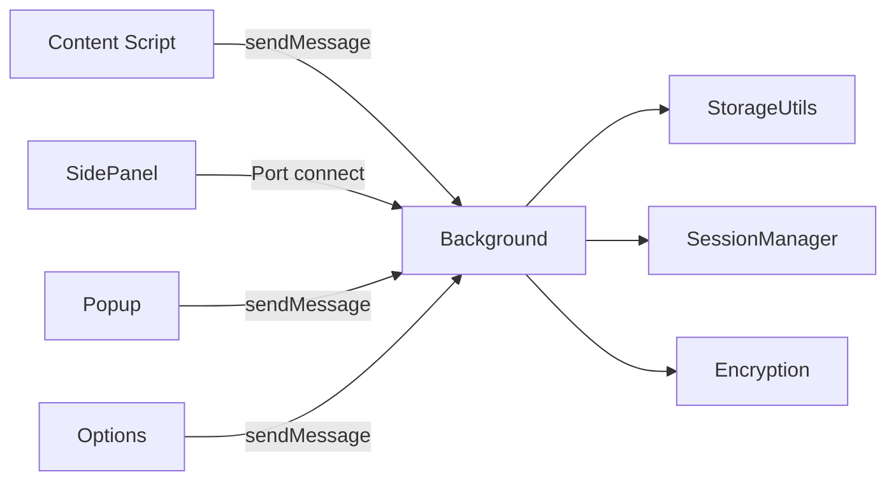

# Account Password Helper — 贡献指南

**中文** | [English](#account-password-helper--contributing-guide)

你好！感谢你对 **Account Password Helper** 感兴趣。在提交贡献之前，请先阅读以下指南，以确保你的贡献能够被顺利接受。

## 项目简介

Account Password Helper 是一款基于 Chrome 扩展的本地加密账号密码管理工具，面向开发者与测试人员：精确域名匹配区分多环境账号、快捷键一键登录（自动填充 + 自动勾选协议 + 自动点击登录）、内置 TOTP 两步验证与安全体检。采用 PBKDF2 + AES-256-GCM 加密体系，数据绝不出浏览器，无需注册账号。项目基于 [GPL-3.0-only](../LICENSE) 开源协议。

> 📖 面向用户的安装与使用说明请见 [README](../README.md)。

## 技术栈

| 类别      | 技术                                                                              | 版本 / 说明                                 |
| --------- | --------------------------------------------------------------------------------- | ------------------------------------------- |
| 扩展框架  | [WXT](https://wxt.dev/)                                                           | v0.20.27，基于 Manifest V3                  |
| 前端框架  | [Vue 3](https://vuejs.org/) + TypeScript                                          | v3.5.41，Composition API + `<script setup>` |
| UI 组件库 | [Element Plus](https://element-plus.org/)                                         | v2.14.4，按需引入（unplugin-auto-import）   |
| 加密      | [Web Crypto API](https://developer.mozilla.org/en-US/docs/Web/API/Web_Crypto_API) | PBKDF2 + AES-256-GCM + SHA-256，浏览器原生  |
| 拼音搜索  | [pinyin-match](https://github.com/WangRichard/pinyin-match)                       | v1.2.10，拼音首字母模糊匹配                 |
| 构建工具  | Vite                                                                              | WXT 内置，HMR 热更新                        |
| 测试框架  | [Vitest](https://vitest.dev/)                                                     | v4.1.11，Node 环境 + Web Crypto 原生支持    |
| 代码规范  | ESLint + Prettier + Stylelint                                                     | TS v6，完整质量工具链                       |

## 架构概览

### 扩展入口点

| 入口点             | 职责                                                                 |
| ------------------ | -------------------------------------------------------------------- |
| **Background**     | Service Worker：消息路由、密码缓存、侧边栏状态追踪、快捷键处理       |
| **Content Script** | 注入所有页面，初始化表单检测与悬浮按钮                               |
| **Popup**          | 扩展图标弹窗，提供「管理密码」和「快速填充」快捷入口                 |
| **Options**        | 密码管理主页面，完整 CRUD、导入导出、会话/有效期管理                 |
| **SidePanel**      | 侧边栏快速填充，支持拼音智能搜索与命中高亮、排序、域名匹配、缓存加速 |

### 消息与数据流



- Background 作为消息路由中心，处理跨组件通信
- SidePanel 通过 `chrome.runtime.connect()` 建立 Port，用于可靠状态追踪
- Content Script 通过 `chrome.runtime.sendMessage()` 发送消息

### 加密机制核心

```
主密码 + 盐值 → PBKDF2 (600,000次迭代) → 256-bit 密钥
明文 + 密钥 + 随机IV → AES-256-GCM → Base64(IV + 密文)
```

> 📖 完整架构设计（会话生命周期、加密细节、消息流说明）与逐文件注释的项目结构树见 [docs/ARCHITECTURE.md](./ARCHITECTURE.md)。

## 项目结构

```
.
├── entrypoints/        # WXT 扩展入口点
│   ├── background/     # Service Worker 子模块（消息路由/缓存/侧边栏管理/自动保存/后台服务）
│   ├── content/        # Content Script（表单检测/悬浮按钮/内联填充）
│   ├── popup/          # Popup 弹窗页
│   ├── options/        # 设置页（密码管理主界面）
│   └── sidepanel/      # 侧边栏快速填充
├── components/         # Vue 组件
│   ├── options/        # Options 页面组件（表格/弹窗/设置对话框等）
│   └── sidepanel/      # SidePanel 侧边栏组件
├── composables/        # Vue 组合函数（认证、会话、侧边栏、TOTP、快捷键等）
├── utils/              # 核心工具库
│   ├── storage/        # 存储访问子模块
│   ├── i18n/           # 完整 i18n（Vue UI：Options/SidePanel/Popup）
│   ├── i18n-lite.ts    # 轻量 i18n（Content/Background，tl() 函数）
│   ├── encryption.ts   # 加密核心（PBKDF2 + AES-256-GCM）
│   ├── sessionManager.ts # 会话管理
│   └── ...             # 其他工具（备份、安全体检、域名匹配、密码生成等）
├── assets/             # 源 SVG 图标与主题 CSS Design Tokens
├── public/icon/        # 构建期 PNG 产物（WXT 自动注入 manifest）
├── types/              # 全局 TypeScript 类型声明
├── scripts/            # 图标生成与仓库自动化脚本
├── tests/              # 测试用例
└── wxt.config.ts       # WXT 配置（路径别名、Element Plus 按需引入、非阻塞 CSS）
```

> 📖 完整的逐文件注释结构树见 [docs/ARCHITECTURE.md — 项目结构](./ARCHITECTURE.md#项目结构)。

## 环境要求

- Node.js >= 22（rolldown 依赖 `node:util.styleText`）
- Chrome >= 114（支持 SidePanel API，>= 129 支持 `sidePanel.close`）

## 仓库搭建

1. Fork 本仓库并 clone 到本地。

2. 安装依赖：

   ```sh
   pnpm install
   ```

3. 启动开发模式（Chrome）：

   ```sh
   pnpm dev
   ```

4. 在 Chrome 中加载 `.output/chrome-mv3/` 目录生成的扩展。

### Windows 用户提示

如果在 Windows 上遇到符号链接相关问题，建议[启用开发者模式](https://docs.microsoft.com/en-us/windows/apps/get-started/enable-your-device-for-development)。

## 常用命令

| 命令                                      | 说明                                                     |
| ----------------------------------------- | -------------------------------------------------------- |
| `pnpm dev`                                | 开发模式（HMR 热更新，端口 8899）                        |
| `pnpm build` / `pnpm postbuild`           | 生产构建 / 构建后产出 zip 包                             |
| `pnpm build:firefox`                      | Firefox 生产构建                                         |
| `pnpm dev:firefox`                        | Firefox 开发模式                                         |
| `pnpm icons:build`                        | SVG 图标渲染为多尺寸 PNG                                 |
| `pnpm analyze`                            | 构建并可视化分析打包体积（输出 `dist/stats.html`）       |
| `pnpm typecheck`                          | TypeScript 类型检查                                      |
| `pnpm lint` / `pnpm lint:fix`             | ESLint 检查 / 自动修复                                   |
| `pnpm lint:style` / `pnpm lint:style:fix` | Stylelint 样式检查 / 自动修复                            |
| `pnpm format:check` / `pnpm format`       | Prettier 格式检查 / 格式化                               |
| `pnpm lint:all` / `pnpm fix:all`          | 运行所有检查（lint + stylelint + format） / 全部自动修复 |
| `pnpm test` / `pnpm test:run`             | 运行测试（watch 模式） / 单次运行全部测试                |
| `pnpm test:run -- <file>`                 | 运行单个测试文件                                         |
| `pnpm coverage`                           | 运行测试并生成覆盖率报告                                 |

> 📖 图标工作流、测试页面、性能设计等开发细节见 [docs/ARCHITECTURE.md — 开发补充](./ARCHITECTURE.md#开发补充)。

## Chrome 权限说明

| 权限             | 用途                                           |
| ---------------- | ---------------------------------------------- |
| `storage`        | 本地存储密码数据和配置                         |
| `activeTab`      | 获取当前标签页信息用于域名匹配                 |
| `scripting`      | 动态注入 Content Script                        |
| `sidePanel`      | 侧边栏快速填充功能                             |
| `alarms`         | 定时自动备份提醒和 Service Worker 保活         |
| `notifications`  | 桌面通知（自动保存/备份提醒/版本更新）         |
| `idle`           | 自动闲置锁定检测                               |
| `clipboardWrite` | 写入剪贴板（复制密码）                         |
| `clipboardRead`  | 读取剪贴板（验证清除前内容）                   |
| `webNavigation`  | 跨 iframe 表单检测与填充                       |
| `favicon`        | 读取 Chrome 本地缓存的网站图标，零外部网络请求 |
| `<all_urls>`     | Content Script 匹配所有页面（host_permission） |

## CSV / JSON 字段格式

| 中文列名            | 英文列名                | 必填 | 说明                             |
| ------------------- | ----------------------- | ---- | -------------------------------- |
| 用户名 / 账号       | username / Username     | 是   | 账号/邮箱/手机号                 |
| 密码                | password / Password     | 否   | 登录密码                         |
| URL / 网址 / 链接   | url                     | 否   | 网站地址                         |
| 标签 / 分类         | tag / Tag               | 否   | 分类标签                         |
| 备注 / 说明         | remark / Remark         | 否   | 说明信息                         |
| 两步验证            | TOTP                    | 否   | TOTP 密钥（otpauth:// URI 格式） |
| 创建时间            | createTime / CreateTime | 否   | 自动填充                         |
| 更新时间 / 修改时间 | updateTime / modifyTime | 否   | 自动填充                         |

> 「下载模板」会生成标准 CSV 文件（BOM UTF-8，Excel / Numbers 可直接打开），表头跟随界面语言，中英文表头均可被导入自动识别。JSON 导出为 `{ version, exportedAt, count, entries }` 包裹结构，导入时同时兼容扁平数组格式；导入导出文件名格式为 `passwords_YYYYMMDD_HHmmss.csv/.json`。

## 开发规范

### 代码风格

- 使用 ESLint 进行静态代码分析，使用 Prettier 进行代码格式化。
- CSS/样式代码使用 Stylelint 检查，并遵循属性排序规范（recess-order）。
- 新增代码必须通过以下命令检查：

  ```sh
  pnpm lint:all
  ```

### 日志规范

- **禁止**直接使用 `console.log` / `console.warn` / `console.error`。
- 必须使用 `utils/logger.ts` 封装的日志方法，例如：

  ```ts
  import { logger } from '@/utils/logger';

  logger.info('这条消息会打印');
  logger.warn('这条警告会打印');
  logger.error('这条错误会打印');
  ```

### 路径别名

- 同级目录文件使用 `./` 相对路径引入。
- 其他目录的文件统一使用 `@/` 路径别名引入：

  ```ts
  import { StorageUtils } from '@/utils/storage';
  ```

### 组件规范

- Vue 组件使用 Composition API（`<script setup lang="ts">`）。
- Element Plus 组件按需引入，新增组件请确认已在自动导入配置中。
- 所有公共组件放在 `components/` 目录下。

### 国际化

- 所有新增或修改的用户可见文案同时提供简体中文和英文。
- Vue UI 文案更新 `utils/i18n/locales/zh-CN/` 与 `en/` 的对应 namespace。
- Content Script 和 Background 文案更新 `utils/i18n-lite.ts` 对应条目。
- 新增、删除或重命名 i18n key 时保持中英文 key 集一致。

### Git Hooks

项目已配置 `husky` + `lint-staged`，每次 `git commit` 前会自动对变更文件执行：

- `eslint --fix` + `prettier --write`（TypeScript / Vue / JS 文件）
- `stylelint --fix`（CSS / SCSS / Vue 样式文件）
- `prettier --write`（JSON / Markdown 文件）

请确保提交前所有检查通过。

### 测试规范

- 使用 Vitest 进行单元测试，测试文件放在 `tests/` 目录下，与源码目录结构对应。
- 修复 Bug 时优先添加回归测试（修复前失败、修复后通过）。
- 新增逻辑需覆盖成功、失败和关键边界条件。
- 修改代码前先检查现有测试，确保不破坏已有测试。
- 提交前根据改动范围运行相关测试：

  ```sh
  pnpm test:run                       # 运行全部测试
  pnpm test:run -- tests/utils/xxx.ts # 运行单个测试文件
  ```

- 不得为通过测试而弱化断言、删除测试或跳过测试。

### 快捷键

扩展注册了以下快捷键（可在 `chrome://extensions/shortcuts` 中自定义）：

| 快捷键（Windows/Linux） | 快捷键（Mac）     | 功能             |
| ----------------------- | ----------------- | ---------------- |
| `Ctrl+Shift+P`          | `Command+Shift+P` | 打开选项页       |
| `Ctrl+Shift+L`          | `Command+Shift+L` | 切换侧边栏       |
| `Ctrl+Shift+F`          | `Command+Shift+F` | 一键填充         |
| `Ctrl+Shift+K`          | `Command+Shift+K` | 打开内联下拉面板 |

### 安全与隐私

本项目是密码管理器，安全是最高优先级。贡献代码时请务必遵守以下原则：

- **禁止**在源码、测试、日志、文档或提交记录中包含真实密码、密钥、令牌等敏感数据。
- **禁止**使用 `v-html`、`innerHTML`、`eval` 或内联脚本处理不可信内容。
- 运行时代码统一使用 `utils/logger.ts`，日志参数不得包含敏感数据。
- 不得扩大明文敏感数据的存活时间、存储位置或可访问上下文。
- 不得自创加密算法或修改现有加密参数（PBKDF2 迭代次数、AES 模式、IV 生成等）。
- 新增网络请求、遥测或远程资源加载前必须获得用户明确确认，默认保持本地优先、离线可用。
- Chrome 权限遵循最小权限原则，新增权限需说明必要性。

## Pull Request 指南

> 你不需要事先征求许可就可以开始处理一个公开的 Issue。如果有人先提交了修复，你仍然可以通过代码 Review 或验证来参与。

- 从 `main` 分支切出一个 topic branch 进行开发，完成后合并回 `main`。

- **新增功能：**
  - 附带适当的测试或用例说明。
  - 提供清晰的功能描述和使用场景。建议先开一个 Issue 进行讨论，获得认可后再开发。

- **修复 Bug：**
  - 在 PR 标题中标注对应的 Issue 编号，例如：`fix: 修复侧边栏关闭失败 (fix #123)`。
  - 在 PR 描述中详细说明问题原因和复现步骤。
  - 提供修复的测试覆盖，如不适用请在描述中说明原因。

- **代码重构 / 文案修改：**
  - 多处拼写或注释修正请合并到同一个 PR。
  - 不鼓励纯粹为了代码风格的重构提交。代码重构需有明确的性能改善或可维护性提升理由。

- PR 中可以包含多个小提交，GitHub 会在合并时自动 squash。

- PR 标题需遵循 [约定式提交（Conventional Commits）](https://www.conventionalcommits.org/) 规范：

  ```
  feat: 新增自动登录开关功能
  fix: 修复密码导出文件名缺少日期后缀
  refactor: 重构表单检测逻辑
  docs: 更新 README 使用说明
  chore: 升级 WXT 版本
  ```

- **提交前检查清单：**

  ```sh
  pnpm typecheck          # TypeScript 类型检查
  pnpm lint               # ESLint 检查
  pnpm lint:style         # Stylelint 样式检查
  pnpm format:check       # Prettier 格式检查
  pnpm test:run           # 运行全部测试（或按需运行相关测试文件）
  pnpm build              # 生产构建验证
  ```

## Issue 指南

- 提交 Issue 前请先搜索是否已有相同问题的讨论。
- Bug 报告请提供：
  - Chrome 版本和操作系统版本。
  - 插件版本号。
  - 复现步骤（越详细越好）。
  - 期望行为与实际行为的对比。
  - 截图或录屏（如适用）。
- 功能建议请说明：
  - 使用场景和背景。
  - 期望的交互方式。
  - 是否有类似功能的参考实现。

## 行为准则

- 保持友善、尊重和包容的沟通氛围。
- 专注于技术讨论，避免无关的争论。
- 欢迎各种水平的贡献者参与。

感谢你的贡献！

---

# Account Password Helper — Contributing Guide

**[中文](#account-password-helper--贡献指南)** | English

Hello! Thank you for your interest in **Account Password Helper**. Please read the following guidelines before contributing to ensure your contribution can be accepted smoothly.

## About the Project

Account Password Helper is a local-first Chrome extension for managing account credentials, built for developers and QA engineers: exact-domain matching for multi-environment accounts, one-keystroke login (autofill + auto-tick consent + auto-click login), built-in TOTP 2FA and security audit. PBKDF2 + AES-256-GCM encryption with zero network transfer — no account needed. Licensed under [GPL-3.0-only](../LICENSE).

> 📖 For user-facing installation and usage instructions, see [README](../README.en.md).

## Tech Stack

| Category      | Technology                                                                        | Version / Notes                             |
| ------------- | --------------------------------------------------------------------------------- | ------------------------------------------- |
| Framework     | [WXT](https://wxt.dev/)                                                           | v0.20.27, Manifest V3                       |
| Frontend      | [Vue 3](https://vuejs.org/) + TypeScript                                          | v3.5.41, Composition API + `<script setup>` |
| UI library    | [Element Plus](https://element-plus.org/)                                         | v2.14.4, on-demand (unplugin-auto-import)   |
| Encryption    | [Web Crypto API](https://developer.mozilla.org/en-US/docs/Web/API/Web_Crypto_API) | PBKDF2 + AES-256-GCM + SHA-256, native      |
| Pinyin search | [pinyin-match](https://github.com/WangRichard/pinyin-match)                       | v1.2.10, pinyin initial fuzzy matching      |
| Build         | Vite                                                                              | Bundled with WXT, HMR                       |
| Testing       | [Vitest](https://vitest.dev/)                                                     | v4.1.11, Node env + Web Crypto native       |
| Code quality  | ESLint + Prettier + Stylelint                                                     | TS v6, full quality toolchain               |

## Architecture Overview

### Entrypoints

| Entrypoint         | Responsibility                                                                                                 |
| ------------------ | -------------------------------------------------------------------------------------------------------------- |
| **Background**     | Service worker: message routing, password cache, side panel state, shortcuts                                   |
| **Content Script** | Injected into all pages; initializes form detection and the floating button                                    |
| **Popup**          | Extension icon popup with "Manage Passwords" and "Quick Fill" entries                                          |
| **Options**        | Main manager page: full CRUD, import/export, session/validity management                                       |
| **SidePanel**      | Quick fill panel with pinyin smart search and match highlighting, sorting, domain matching, cache acceleration |

### Message & Data Flow


- Background acts as the message routing center for cross-component communication
- SidePanel establishes a Port via `chrome.runtime.connect()` for reliable state tracking
- Content Script sends messages via `chrome.runtime.sendMessage()`

### Encryption Core

```
Master password + salt → PBKDF2 (600,000 iterations) → 256-bit key
Plaintext + key + random IV → AES-256-GCM → Base64(IV + ciphertext)
```

> 📖 Full architecture design (session lifecycle, encryption details, messaging notes) and the fully annotated project structure tree live in [docs/ARCHITECTURE.en.md](./ARCHITECTURE.en.md).

## Project Structure

```
.
├── entrypoints/        # WXT extension entrypoints
│   ├── background/     # Service Worker sub-modules (routing/cache/sidebar/autosave/services)
│   ├── content/        # Content Script (form detection/floating buttons/inline fill)
│   ├── popup/          # Popup page
│   ├── options/        # Options page (password manager main UI)
│   └── sidepanel/      # Side panel quick fill
├── components/         # Vue components
│   ├── options/        # Options page components (tables/dialogs/settings)
│   └── sidepanel/      # SidePanel components
├── composables/        # Vue composables (auth, session, side panel, TOTP, shortcuts...)
├── utils/              # Core library
│   ├── storage/        # Storage access sub-modules
│   ├── i18n/           # Full i18n (Vue UI: Options/SidePanel/Popup)
│   ├── i18n-lite.ts    # Lightweight i18n (Content/Background, tl() function)
│   ├── encryption.ts   # Encryption core (PBKDF2 + AES-256-GCM)
│   ├── sessionManager.ts # Session management
│   └── ...             # Other utilities (backup, health check, domain, password gen...)
├── assets/             # Source SVG icons and CSS design tokens
├── public/icon/        # Build-time PNG icons (auto-injected into the manifest by WXT)
├── types/              # Global TypeScript type declarations
├── scripts/            # Icon generation and repo automation scripts
├── tests/              # Test cases
└── wxt.config.ts       # WXT configuration (aliases, Element Plus on-demand, non-blocking CSS)
```

> 📖 See [docs/ARCHITECTURE.en.md — Project Structure](./ARCHITECTURE.en.md#project-structure) for the fully annotated tree.

## Requirements

- Node.js >= 22 (rolldown depends on `node:util.styleText`)
- Chrome >= 114 (SidePanel API; >= 129 for `sidePanel.close`)

## Getting Started

1. Fork this repository and clone it locally.

2. Install dependencies:

   ```sh
   pnpm install
   ```

3. Start dev mode (Chrome):

   ```sh
   pnpm dev
   ```

4. Load the `.output/chrome-mv3/` directory as an unpacked extension in Chrome.

### Windows Tips

If you encounter symlink issues on Windows, consider [enabling Developer Mode](https://docs.microsoft.com/en-us/windows/apps/get-started/enable-your-device-for-development).

## Common Commands

| Command                                   | Description                                                 |
| ----------------------------------------- | ----------------------------------------------------------- |
| `pnpm dev`                                | Dev mode (HMR, port 8899)                                   |
| `pnpm build` / `pnpm postbuild`           | Production build / package the build as a zip               |
| `pnpm build:firefox`                      | Firefox production build                                    |
| `pnpm dev:firefox`                        | Firefox dev mode                                            |
| `pnpm icons:build`                        | Render the SVG icon to multi-size PNGs                      |
| `pnpm analyze`                            | Build with bundle size visualization (`dist/stats.html`)    |
| `pnpm typecheck`                          | TypeScript type checking                                    |
| `pnpm lint` / `pnpm lint:fix`             | ESLint check / auto-fix                                     |
| `pnpm lint:style` / `pnpm lint:style:fix` | Stylelint check / auto-fix                                  |
| `pnpm format:check` / `pnpm format`       | Prettier format check / format                              |
| `pnpm lint:all` / `pnpm fix:all`          | Run all checks (lint + stylelint + format) / all auto-fixes |
| `pnpm test` / `pnpm test:run`             | Run tests (watch mode) / single run all tests               |
| `pnpm test:run -- <file>`                 | Run a single test file                                      |
| `pnpm coverage`                           | Run tests with coverage report                              |

> 📖 Icon workflow, test page, and performance design details live in [docs/ARCHITECTURE.en.md — Development Extras](./ARCHITECTURE.en.md#development-extras).

## Chrome Permissions

| Permission       | Purpose                                                               |
| ---------------- | --------------------------------------------------------------------- |
| `storage`        | Local storage of password data and settings                           |
| `activeTab`      | Current tab info for domain matching                                  |
| `scripting`      | Dynamic content script injection                                      |
| `sidePanel`      | Side panel quick fill                                                 |
| `alarms`         | Scheduled backup reminders and service worker keep-alive              |
| `notifications`  | Desktop notifications (auto-save / backup / updates)                  |
| `idle`           | Auto idle lock detection                                              |
| `clipboardWrite` | Writing to the clipboard (copy password)                              |
| `clipboardRead`  | Reading the clipboard (verify before clearing)                        |
| `webNavigation`  | Cross-iframe form detection and filling                               |
| `favicon`        | Read Chrome's locally cached website favicons, zero external requests |
| `<all_urls>`     | Content script matches all pages (host_permission)                    |

## CSV / JSON Field Formats

| Chinese column      | English column          | Required | Notes                               |
| ------------------- | ----------------------- | -------- | ----------------------------------- |
| 用户名 / 账号       | username / Username     | Yes      | Account/email/phone                 |
| 密码                | password / Password     | No       | Login password                      |
| URL / 网址 / 链接   | url                     | No       | Site address                        |
| 标签 / 分类         | tag / Tag               | No       | Category tag                        |
| 备注 / 说明         | remark / Remark         | No       | Notes                               |
| 两步验证            | TOTP                    | No       | TOTP secret (otpauth:// URI format) |
| 创建时间            | createTime / CreateTime | No       | Auto-filled                         |
| 更新时间 / 修改时间 | updateTime / modifyTime | No       | Auto-filled                         |

> "Download Template" produces a standard CSV (BOM UTF-8, opens directly in Excel / Numbers); headers follow the interface language and both header languages are auto-detected on import. JSON exports use the `{ version, exportedAt, count, entries }` wrapper; imports also accept a flat array. Export filenames follow `passwords_YYYYMMDD_HHmmss.csv/.json`.

## Development Standards

### Code Style

- Use ESLint for static analysis and Prettier for formatting.
- CSS/style code uses Stylelint with recess-order property sorting.
- New code must pass:

  ```sh
  pnpm lint:all
  ```

### Logging

- **Never** use `console.log` / `console.warn` / `console.error` directly.
- Always use the logger from `utils/logger.ts`:

  ```ts
  import { logger } from '@/utils/logger';

  logger.info('This message will be logged');
  logger.warn('This warning will be logged');
  logger.error('This error will be logged');
  ```

### Path Aliases

- Use `./` for files in the same directory.
- Use `@/` for all other local imports:

  ```ts
  import { StorageUtils } from '@/utils/storage';
  ```

### Component Standards

- Vue components use the Composition API (`<script setup lang="ts">`).
- Element Plus components are imported on demand; verify new components are registered in the auto-import config.
- All shared components go in the `components/` directory.

### Internationalization

- All new or modified user-visible strings must be provided in both Simplified Chinese and English.
- Vue UI strings: update the corresponding namespace in `utils/i18n/locales/zh-CN/` and `en/`.
- Content Script and Background strings: update the corresponding entries in `utils/i18n-lite.ts`.
- When adding, deleting, or renaming i18n keys, keep the Chinese and English key sets in sync.

### Git Hooks

The project is configured with `husky` + `lint-staged`. On every `git commit`, the following checks run automatically on changed files:

- `eslint --fix` + `prettier --write` (TypeScript / Vue / JS files)
- `stylelint --fix` (CSS / SCSS / Vue style files)
- `prettier --write` (JSON / Markdown files)

Please ensure all checks pass before committing.

### Testing

- Use Vitest for unit tests. Test files go in the `tests/` directory, mirroring the source structure.
- When fixing a bug, prefer adding a regression test (fails before the fix, passes after).
- New logic should cover success, failure, and key boundary conditions.
- Check existing tests before modifying code to ensure nothing breaks.
- Run relevant tests before submitting based on the scope of changes:

  ```sh
  pnpm test:run                       # Run all tests
  pnpm test:run -- tests/utils/xxx.ts # Run a single test file
  ```

- Never weaken assertions, delete tests, or skip tests to make them pass.

### Keyboard Shortcuts

The extension registers the following shortcuts (customizable in `chrome://extensions/shortcuts`):

| Shortcut (Windows/Linux) | Shortcut (Mac)    | Function             |
| ------------------------ | ----------------- | -------------------- |
| `Ctrl+Shift+P`           | `Command+Shift+P` | Open options page    |
| `Ctrl+Shift+L`           | `Command+Shift+L` | Toggle side panel    |
| `Ctrl+Shift+F`           | `Command+Shift+F` | Quick fill           |
| `Ctrl+Shift+K`           | `Command+Shift+K` | Open inline dropdown |

### Security & Privacy

This is a password manager — security is the top priority. Please follow these principles when contributing:

- **Never** include real passwords, keys, tokens, or other sensitive data in source code, tests, logs, docs, or commit messages.
- **Never** use `v-html`, `innerHTML`, `eval`, or inline scripts to process untrusted content.
- Runtime code must use `utils/logger.ts` exclusively; log parameters must not contain sensitive data.
- Do not expand the lifetime, storage location, or accessible context of plaintext sensitive data.
- Do not invent new encryption algorithms or modify existing encryption parameters (PBKDF2 iterations, AES mode, IV generation, etc.).
- New network requests, telemetry, or remote resource loading must require explicit user confirmation; default to local-first, offline-capable.
- Chrome permissions follow the principle of least privilege; new permissions must be justified.

## Pull Request Guidelines

> You don't need to ask permission before starting work on an open Issue. If someone else submits a fix first, you can still contribute through code Review or verification.

- Create a topic branch from `main` for development, then merge back to `main`.

- **New features:**
  - Include appropriate tests or use-case documentation.
  - Provide a clear feature description and use cases. Consider opening an Issue first for discussion.

- **Bug fixes:**
  - Reference the corresponding Issue number in the PR title, e.g., `fix: resolve sidebar close failure (fix #123)`.
  - Include detailed problem description and reproduction steps.
  - Provide test coverage for the fix; explain if not applicable.

- **Code refactoring / typo fixes:**
  - Batch multiple spelling or comment corrections into a single PR.
  - Pure style refactoring is discouraged unless it clearly improves performance or maintainability.

- PRs may contain multiple small commits; GitHub will squash them on merge.

- PR titles should follow the [Conventional Commits](https://www.conventionalcommits.org/) specification:

  ```
  feat: add auto-login toggle
  fix: resolve missing date suffix in export filename
  refactor: rework form detection logic
  docs: update README usage instructions
  chore: upgrade WXT version
  ```

- **Pre-submission checklist:**

  ```sh
  pnpm typecheck          # TypeScript type checking
  pnpm lint               # ESLint check
  pnpm lint:style         # Stylelint check
  pnpm format:check       # Prettier format check
  pnpm test:run           # Run all tests (or relevant test files)
  pnpm build              # Production build verification
  ```

## Issue Guidelines

- Search for existing discussions before opening a new Issue.
- Bug reports should include:
  - Chrome version and OS version.
  - Extension version.
  - Reproduction steps (as detailed as possible).
  - Expected vs. actual behavior.
  - Screenshots or screen recordings (if applicable).
- Feature requests should include:
  - Use case and context.
  - Desired interaction.
  - Reference implementations of similar features, if any.

## Code of Conduct

- Maintain a friendly, respectful, and inclusive communication atmosphere.
- Focus on technical discussions; avoid unrelated arguments.
- Contributors of all skill levels are welcome.

Thank you for contributing!
